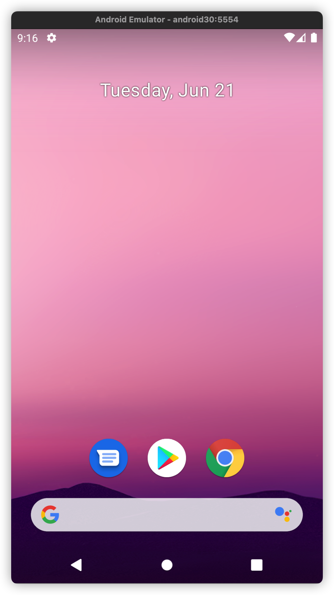

Android Studio is a big Application. If you are not an Android programmer, you don't need it. But sometimes you need an Android Emulator running on your Apple M1 machines. So this document is for you.

It works well on my Macbook.



### 1. Install android command line tools

```sh
$ brew install android-commandlinetools
```

You will get **sdkmanager** and **avdmanager** available, but they need Java.

### 2. Install java if you haven't it

```sh
$ brew install --cask temurin
```

### 3. You can verify that sdkmanager works:

```sh
$ sdkmanager --version
```

### 4. Set PATH environment variable in file `~/.zshrc` or `~/.bashrc`

```sh
$ mkdir -p $HOME/Library/Android/sdk
```

```sh
export ANDROID_SDK_ROOT=$HOME/Library/Android/sdk
if [ -d $ANDROID_SDK_ROOT ]
then
  PATH="$ANDROID_SDK_ROOT/emulator:$ANDROID_SDK_ROOT/platform-tools:$PATH"
fi
```

```sh
$ source ~/.zshrc
```

### 5. Download Android components:

```sh
$ sdkmanager --install --sdk_root=$ANDROID_SDK_ROOT \
"platform-tools" "emulator" \
"platforms;android-30" \
"system-images;android-30;google_apis_playstore;arm64-v8a"
```

Maybe you need run this command if you encounter a MacOS system permission problem: 

```sh
$ xattr -dr com.apple.quarantine emulator/
```

### 6. Create a virtual Android devcie to run in the emulator.

Note: --package `params`, the **params** value is the name you downloaded via sdkmanager in the previous step.

```sh
$ avdmanager create avd \
--name "android30" --device "pixel" \
--package "system-images;android-30;google_apis_playstore;arm64-v8a"
```

You can create as many virtual devices as you like. Just repeat the step above with different parameters.

### 7. Normally, you need enable hardware keyboard

By default, your computer keyboard is not available in the emulator you just created. You can enable it in this file:  `~/.android/avd/android30.avd/config.ini` (replace `android30` with the name of your device).

```diff
- hw.keyboard = no
- hw.keyboard.lid = yes
+ hw.keyboard = yes
+ hw.keyboard.lid = no
hw.keyboard.charmap = qwerty2
```

### 8. Now, It's time to start your emulator.

```sh
$ emulator -avd android30
```

### 9. You can install you app via `adb`

```sh
$ adb install my-app.apk
```

### APPENDIX: Reference link of this document.

1. https://bajtos.net/posts/2021-12-17-apple-m1-android-emulator/
2. https://stackoverflow.com/a/34799349