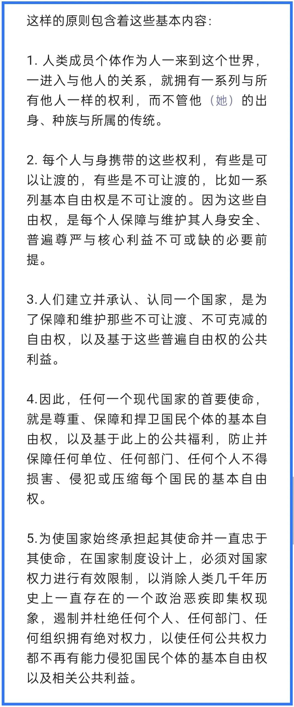

本文是阅读清华大学哲学系教授**黄裕生**老师的一篇文章的读后感，建议先阅读原文（*点击可读*👉 《[黄裕生 ：何谓古今之变？](https://mp.weixin.qq.com/s/QZ8jm-de2DAUeZKeunhJ5w)》。

特别喜欢黄裕生老师对于“古今之变”的定义：

> 近三百年的历史，是人类从强权走向民主，从近乎丛林法则的等级社会走向法治的平权社会。这就是古今之变。

也非常认同黄老师对此所做的进一步诠释：

> 更具体地说，这个古今之变的根本节点就在：是否认识到权力与权利的关系，也即是否认识并确立了处理权力与权利的关系的原则，并遵循与实践这样的原则。

由“古今之变”，我很容易想到的一句“时令语”：“百年未有之大变局”。如果说这大变局是指中国所面临的外部国际环境的变化，那么，这古今之变则是针对国内的。

提出一个好概念就如提出了一个好问题，是一种洞见，这也是我特别喜欢“古今之变”的原因。窃以为，当下中国问题的关键不在于“百年未有之大变局”，而是这“古今之变”未完成。

何谓古今之变？

### 首先，它意味着“古”与“今”存在差异，即“古今之**别**”。

是变化的发生，催生古今的差异？*（这时，古今之别是结果）*

还是说，古今的差异是明确的，我们需要从“古”的状态，进入“今”的状态？*（这时，古今之别是前提）*

我认为是后者，因为现代文明的潮流是明确的，我们需要从“古”入“今”。

而要明确差异，却又要对“古”与“今”进行界定 —— 何为古？何为今？

黄老师没有按通常的套路从**时间上**进行界定，而是从**认识论**上来区分：人们有没有认识到权力与权利的关系，有没有确立处理这些关系的原则，并遵循与实践这些原则？

从认识论上来界定“古今之别”，可以说是另辟蹊径，也让我耳目一新。这意味着古今之别在于**观念之别**：我们对于权力与权利的观念如何，足以将一个个人区分开来 —— 哪些是古人，哪些是今人；哪些是落后的，哪些是现代的；哪些是野蛮的，哪些是文明的。

### 其次，古今之变意味着变化，是观念的**变化**。

“变化”是中性词，这意味着可以变好，也可以变坏。比如，中国历史上有一段时期，妇女是裹足的。打一开始，肯定是不裹足的，到了北宋年间，裹足成了风气，并被大力提倡和推行，之后一直延续到民国才被废除摒弃，这两次变化都是观念之变，不可能都对，然而，两次变化都有人论证其正确性和必要性。

凭什么说“古今之变”是良性的变化？这是必须要阐述的问题。

黄老师在开篇提及到“这样的原则包含着这些基本内容”：

我的理解如下：

1. **平权**：不论出身、种族、肤色、文化传统，人人享有平等的权利。
2. **权利是否可让渡**：基于社会共同体的利益，公民将部分权利让渡给政府，许可其对全体成员行使管理权，但“基本自由权是不可让渡的”，“因为这些自由权，是每个人保障与维护其人身安全、普遍尊严与核心利益不可或缺的必要前提”。
3. **国家因何而成立**：“是为了保障和维护那些不可让渡、不可克减的自由权，以及基于这些普遍自由权的公共利益”。显然，不是有国才有家，而是国为了家而存在的，这也是国之存在的根本目的。
4. **国家和政府的使命**：国家**通过政府**来完成其使命，即“尊重、保障和捍卫国民个体的基本自由权”以及国民的公共福祉。某一个政权是否具备执政合法性，也是以此来判断的，即，它是否以完成这一使命为目的。这就带来一个问题：公民将部分权利让渡给政府，许其行使管理权，这本是为了保障和捍卫公民的基本权利和社会福祉的，但权力这东西很容易被滥用，政府反而可能因此成为庞然大物，去侵犯它本应保护的对象，怎么办？
5. **从制度设计上来遏制公权力**：这就是黄老师第五点所提及的，要在制度上进行设计，对权力进行有效限制，“遏制并杜绝任何个人、任何部门、任何组织拥有绝对权力”，要特别防止“集权现象”的出现。

所以，以上五点从人人享有平等的权利出发，到哪些权利不可让渡，再到如何解决矛盾，是有严谨的逻辑链条的。如果你认同人人平权，那么，你就应该认识到遏制公权力的必要性和迫切性。我们也不难因此得出结论：黄老师所说的“古今之变”是良性变化，是现代文明所追求的变化。

### 再次，古今之变的最终标志是“一切皆在法下”。

当我们说从一个状态进入了另一个状态，定然会有一个鲜明的标志，喻示这变化已经完成。我认为这个终极标志便是“一切皆在法下”，这也意味着进入了法治社会。

黄老师是这样论述的：

> 唯有完成古今之变，才能真正建立起法治国家。法治国家建成的一个根本标志，就是一切皆在法下，无人再能置身法外而得以以自己的意志为法，以自己的意志制法。换个角度说，就是无人再能集一切权力于一身而拥有绝对权力。

黄老师所说的“唯有完成古今之变，才能真正建立起法治国家”，我理解他所阐述的是，唯有观念的改变，才能催生法治国家的建立。而我想说的却是，只有“一切皆在法下”，法治国家已然建立时，古今之变才算完成。

其实，一切皆在法下，恰恰是之前论述观念转变的逻辑起点 —— “人人平权” —— 我们都受到同等的约束，人人在“法”面前一“律”平等，法治的追求正是一次平权的回归。也唯有如此，才可以做到没有组织与个人能超脱于法律而享有特权。

那有没有一个标志可以表明“古今之变”的变化开始发生呢？毕竟，观念的变化是在人的脑海里，我们看不见，有什么明显的外显行为让我们知晓这种改变正在发生呢？

就像我们将这“古”、“今”状态的变化比作从A点出发到达B点，那有什么鲜明标志说明我们已经离开A点，在向B点行进呢？

我认为这鲜明标志是**公民具备真正的选举权**。这恰恰又是“人人平权”在社会公共事务上的体现。也只有人人都有选举权，都可以对社会事务发表意见，选举心仪的管理者，公权力才真正来自于人民，也唯有如此才可以对公权力进行有效的遏制。

—— 而公民具备选举权不正是一个国家实行民主的标志么？

综上所述，**「古今之变」即「观念之变」**，这一变化**始于民主，终于法治**。要想催生这种观念之变，我们必须深刻理解到民主与法治背后的观念，只有充分认识到这二者的必要性，才可能让古今之变发生，从而建立法治国家，最终步入现代文明。

