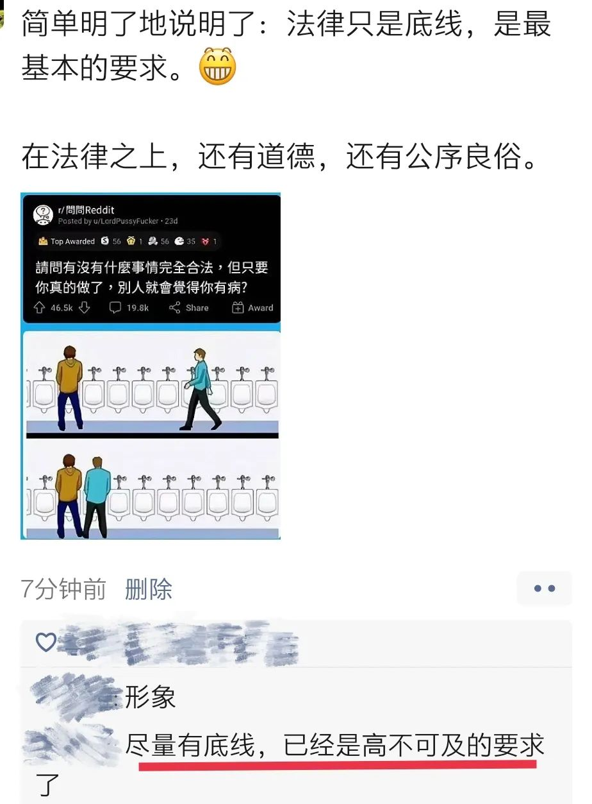
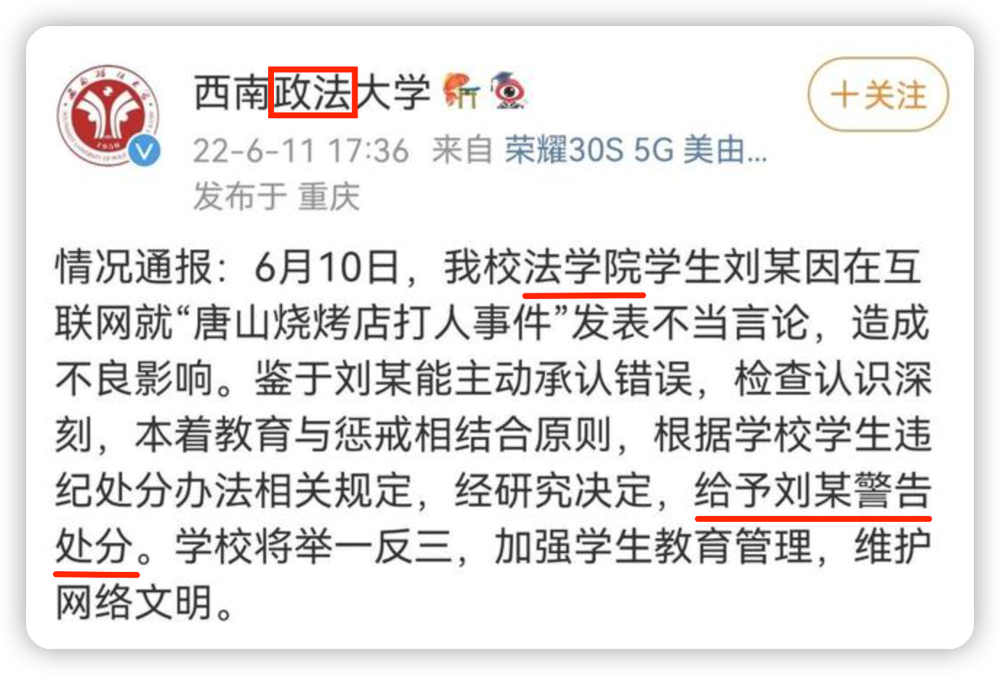
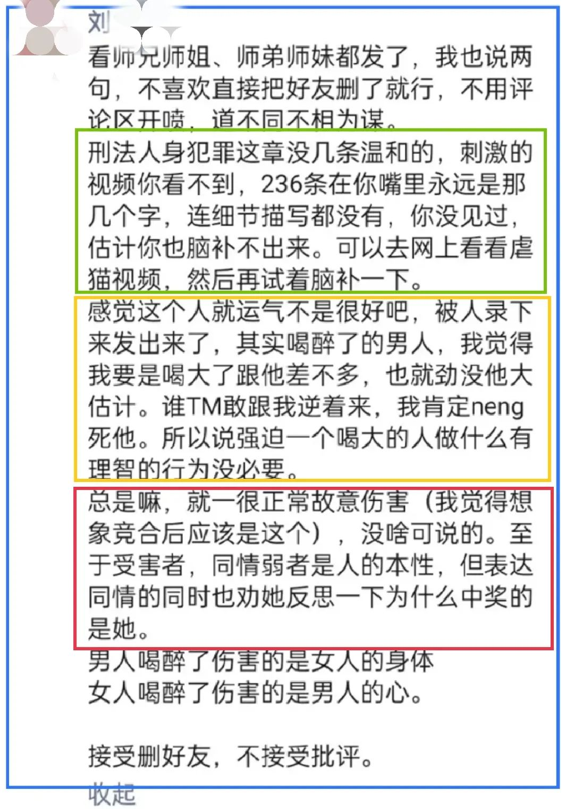

标题是一朋友在我发的朋友圈下面的留言。

本来，我是觉得这图有趣才发圈的，也顺便从另一个角度来解读一下。哪知他这么一留言，硬是觉得哪里被戳中了，生痛。

是啊，法律仅仅是一个文明社会运行的最基本的要求，为何在这锅却那么高不可及？

有不少执法者根本就不懂法，不懂得何为程序正当，然而，他们却手握公权力，恣意妄为；就更别说普通人了，法盲者众，他们不知道他人权益为何物，甚至连自身的权益都不知道，只知道服从于权力。在这次抗疫期间，各路神仙手持着“防疫抗疫”的大旗，视法如无物，肆意践踏，相信大家都屡见不鲜，就不举例了。

有时，我很是感叹，为何在这片土地上，法治文明如此荒芜。

我更感叹于那些群氓，他们连基本的法治修养都不具备，却又越过法律这一底线，在道德上对他人进行谴责、侵害，极其可笑、荒诞。

法律本是底线，只有在确保这一及格线后，才可以进入更高层次去讨论道德这些。

一个人说了点什么，或者做了点什么，并没有违反法律，甚至在道德领域批判都很牵强，然而，他却遭受权力与群氓的合谋，被非法侵害，这是非常可怕的。比如，某明星去国外某地方拍了几张照片发了个微博，结果被群氓群起而攻，继而被全网封杀，所有账号都被封禁，连道歉都没用了。法律就这样被所谓的“道德”无情地践踏。

有些事件是标志性的，对事件的认识可以用来评判一个人的法治修养。

这刘同学说了什么呢？

我们来做做阅读理解。

第一段（浅绿色线框内）说的是，有比这更糟糕的案例，只是不为公众所知。这也是实际情况，我相信没有人会反对。

第二段说的是他对这一事情的看法，并将自己代入，作情景分析与推演。

就Tang事件，我曾写了一篇发不出的文章，请见《百思不得姐》。可以说那篇是将自己代入到女子的角色，然后探究有没有更好的应对措施。我不是女人，怎可代入？我代入的是弱者，面对一个具备碾压式武力的强者，我该如何做？代入是为了体验那种困境，然后找到一条出路。

不同的是，刘同学代入的是事件中男性角色，他作为男性，这种代入不是很正常的事情么？

刘同学说：“其实喝醉了的男人，我觉得我要是喝大了跟他差不多，也就劲没他大估计。谁TM敢跟我逆着来，我肯定neng死他”。

我认为他**并没有将暴行合理化**的意思，而是说在喝醉了、喝多了的情形下行为会失控，这时不论是什么天皇老子，那都不在话下，都要拿下。

你见过这种人么？如果你生活中没见过，相信在一些影视剧中也见过。确实存在这种人，这你得承认吧。所以，刘同学接着说：“所以说强迫一个喝大的人做什么理智的行为没必要”。确实，指望一个失去理智的人控制他的行为是不现实的。

我希望**读者**一定要明白，刘同学是在分析这起事件中暴徒的行为逻辑，他用自身的反应模式来推演 —— 他说了这种行为是对的么？没有；他有将暴行合理化么？也没有。他说的是什么样的情景会催生什么样的行为模式，**什么样的前因会导致什么样的结果**，一个喝多了的男人面对违逆他意志的人会有什么样的反应。

他说的是对这起事件的**看法**，但并没有赞成暴徒的行为。

你可以说他的看法错了，比如，那些男的根本就没有喝醉，喝得也不大；还可以说，不是所有的男人都像你们那样，喝了点就没了人性……这都行。但是，他没有说过的，或者没有那意思，你不能往他身上扣。那叫扣帽子，是曲解，在逻辑谬误上叫“攻击稻草人”。

估计最有争议的是第三段，里面有两处，应该是整起事件的导火索。

> 就一正常的故意伤害（我觉得想象竞合后应该是这个），没啥可说的。

痛斥他的人肯定要说：这TMD还正常？怎么就正常了？你居然认为这正常！@#@！¥！@#@¥%&@¥##！！

但请别忘记他第一段所说的，有很多案例比这惨多了，只是公众看不见罢了，所以，不能脱离他的语境（上下文）来理解这个“正常”，否则就有**断章取义**之嫌。他所说的“正常”到底是何意？我这里提供两种解释：

1. 结合第一段：在所有恶性伤害事件中，这起事件很**普通**，因而很“正常”。
2. 结合第二段：面对一个喝大了男性，你做出了违逆他意志的反应，得到这样的结果，很“正常”。

我不知道刘所说的正常到底是何意，至少，存在这两种理解的可能性。（顺嘴提一句，从整段文字来看，刘同学的表达能力很一般，与我想象中的法学院学生的水平有差距。若是这样表达，“就一**普通**的故意伤害”，会不会好一些？）

如果“正常”的字眼不是被遭发难的原因，那就肯定是第二处了：

> ……但表达同情的同时**也劝她反思一下为什么中奖的是她**。

前些年，有些（自）媒体喜欢玩“完美受害人”那套，他们罔顾行凶者的行为，反而将焦点转移到受害者身上，比如，你为什么穿着这么暴露，为什么深夜出现在那里……被人识破，继而被声讨。这也是好事，民智渐开总是好的。

刘同学所说的“为什么中奖的是她”，也可以有3种理解：

1. 她为什么凌晨会出现在烧烤店？
2. 她为什么会被骚扰？
3. 她为什么会被打成那样？

若是前两种理解，可以非常肯定这是追求“完美受害者”。在什么时间去什么地方，这都是个人的自由；至于被无端骚扰，就更怨不得被骚扰者。

第三种理解就要结合刘同学前两段的意思：女子之所以被暴击，是因为她的反应模式不对。（是不是有更好的应对模式？比如，在第一次被骚扰时就大声呼叫，寻求帮助：“救命！老板，有流mang骚扰我，救命！”）

我个人也倾向于刘同学是前两种理解的意思，但也不应完全排除第三种的可能，上面也说过，他的表达能力一般。

但是，即便刘同学是在追求“完美受害者”，难道就够学校来处罚他一番么？在我看来，刘的行为依然在“言论自由”的范畴以内 —— 言论自由也包括**说错话的自由**。

公众可以在道德域内对其谴责，但校方却使用公权力介入，对其进行“警告处分”，是不是过了？

要知道，“西南政法大学”可不是什么野鸡学校，那也是赫赫有名的，却用一句“根据学校学生违纪处分办法相关规定”就把事情给办了 —— 违什么纪了？什么相关规定？

连专门搞政法的大学都是如此对待一个法学院的学生，所以，不得不说，我那朋友一语切中要害：「尽量有底线，已经是高不可及的要求了！」

也愿一些读者和相关部门能“尽量有底线”地对待此文。

