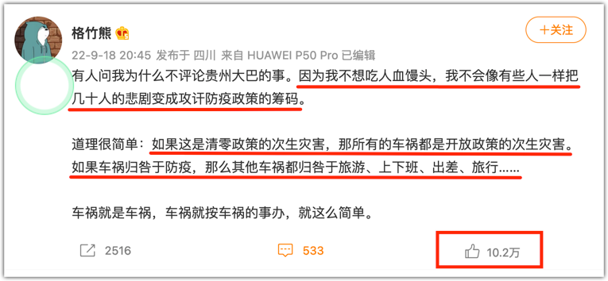
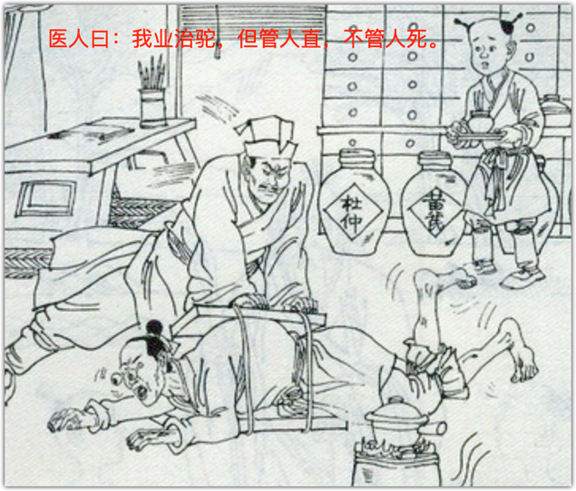

昨天的文章提出了一个问题，本文是续篇，详细分析一下。

关于**格竹熊**的错误，其实已经有人分析过，分析者将之分为深浅两层次来说明的：浅层次是从“自愿”的角度入手，也就是乘车人是否自愿上车；深层次不便在这里讲。

既然我来专门分析，自是不想炒他人的现饭。我想仅仅从**逻辑思维**来入手，就事论事，直接奔格竹熊所言“道理很简单”的那个“道理”而去，我只讨论中间的那一小节，打蛇打七寸。

格竹熊的“道理”中出现了一个关键词：“次生灾害”。我们不妨先来探究一下 —— 什么是次生灾害？

“次生灾害”这个词我们经常在地震灾害后听到。其时，媒体不但会提醒当地居民要防余震，还要防地震的次生灾害。比如，地震使得某些山体松动了，即便地震已经停歇，但由于山体的稳定性被破坏，就容易出现滑坡的地质灾害。这种山体滑坡虽不是地震直接震垮塌的，但是由地震引起的，这便是地震的次生灾害。

假若地震是某个神仙发脾气所致，那么，这神仙除了应该对地震灾害负责，还应该对次生灾害负责。这应该不难理解。这时，如果有人说，没地震也会有滑坡呀？山体滑坡就应该归山体滑坡，不能怪在地震头上，你肯定会觉得是滑天下之大稽。

防疫的次生灾害是什么呢？这就很多了。

比如，有的人被封控在家，因物资缺乏而挨饿，还有的人则是被封控在高速公路进退维谷；再比如，因为防疫措施而导致病人无法及时就医而死亡，产妇不能去产检或去医院生产，等等，这些都是次生灾害，而且也都屡见不鲜。总之，防疫的次生灾害是**因为防疫措施而导致的**、危及人民的生命安全和生计的一种现实结果。

不论你是支持还是反对格竹熊的观点，正反双方都可以在这一点上达成共识：我们所采取的任何防疫措施，都必须最大限度地保障人民的生命安全，决计不能出现**防疫的次生灾害**比**疫情本身的灾害**还要严重的情况。也可以说，这是评判一项防疫政策好坏的基本准则。

假设有两座人口相当的城市，城市A采用某项防控政策，而城市B是完全放开，与常态无异，那么，城市B肯定会有人死于新冠，假设这人数为b。城市A由于有防控措施，因新冠而死的人数远小于b，但由于次生灾害而导致的死亡人数很多，死亡人数总和计为a。如若a大于b，那显然不是我们期望的，这也说明了城市A的防疫政策是糟糕的，不可取的。这应该是任何城市管理者或国家做出防疫决策时所应遵循的常识。

格竹熊的意思是，不论“清零政策”还是“开放政策”都是**防疫策略**，如果你认为这车祸是“清零政策的次生灾害”，那么，放开以后还是会有车祸的（因车祸而导致死亡总人数绝不会少于27人，这也有据可查），届时的车祸岂不成了“开放政策的次生灾害”？而且，那灾害更大。

—— 上面铺垫了那么多，如果你到这里还没有想出问题所在，那真该补补逻辑思维课了。

不要因为他用了一个“开放政策”的表达便被他装进去了。不错，“开放政策”是一项策略，但绝不是**防疫**策略 —— **防**疫**防**疫，那可是要**防**的。对于某个病毒，如果一个社会不做干预，那感染者像感冒了便去就医一样，你难道认为这是在防疫？

就像一个国家被入侵了，全民不做抵抗，然后有人跳出来说这就是他们的“抵抗政策”，你会不会觉得很搞笑呢？

然而，就是如此搞笑的言论，居然有10几万的人为之点赞。

再者，这10几万的人是有多么分不清**常态**与**非常态**？

没有疫情那才是社会的常态，人们上下班、出差、旅行，那都是常态社会的日常行为，常态之下的普通车祸才归于车祸。

疫情之下的防控，那是社会的非常态，怎么就能和常态来**对等**比较而做出推论？疫情之下的非常态，你连上个班、上个学、甚至上个厕所都要查个绿码，却被格竹熊们认为是和常态社会相对等的：因为A推出了a，所以B就应该推出b？

当然，这格竹熊也不是全然皆错，“道理很简单”这句他还是说对了。这道理确实很简单，都不用考虑事故车辆是否凌晨行车而违犯了交通规则，更不需要讨论司机身穿防护服、戴口罩面罩等问题，只需要问一句：那辆大巴车是不是**应当地防疫政策的要求**而开出的？若是，那便是因防疫而导致的次生灾害。

既然神仙一怒地震山摇，后续所引起的山体滑坡神仙也不能免责，凭什么这里的车祸就要归于车祸，而与防疫政策无关？！

若没有这一防疫转运要求，那辆车便不会开出，这是非常明了且不容置辩的。倘若真有一辆车**不是因防疫要求**而违规行车，也不幸导致了车祸，那样的车祸才归于车祸。

上帝的归上帝，撒旦的归撒旦。

