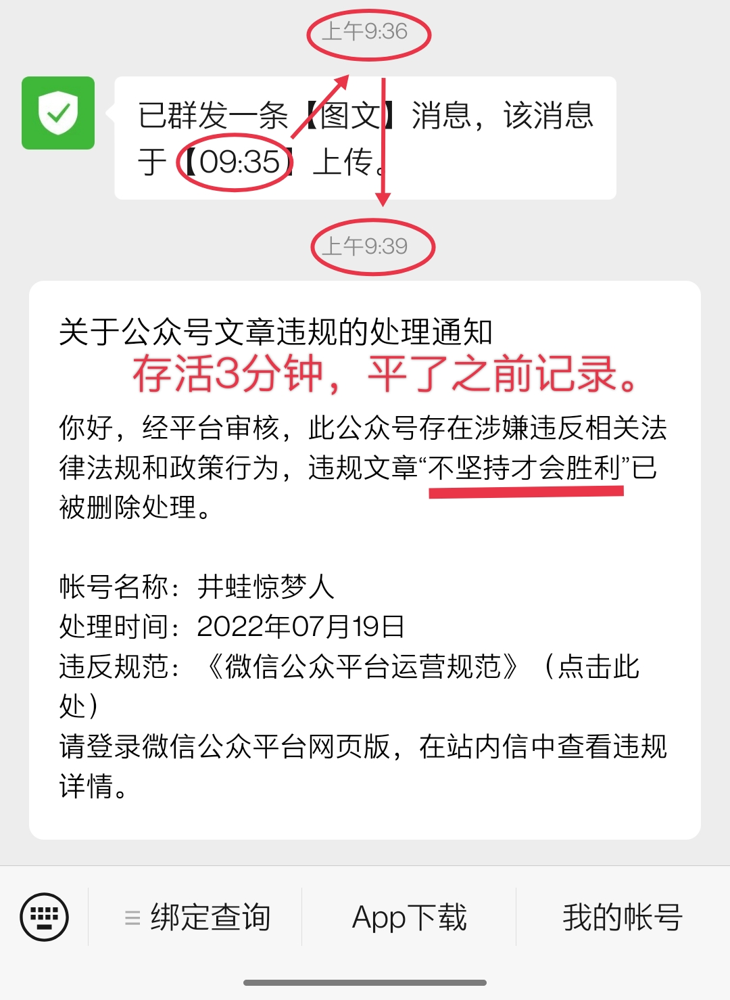

“坚持就是胜利”，这口号我们从小喝到大。

说错了。不是喝到大，而是听到大。半杯椰汁让我喝个宿醉，还没醒。

坚持一定就能胜利吗？

肯定不是。

你坚持发明个永动机试试？即便你子子孙孙无穷匮矣都没用。这样的坚持注定失败，不坚持才会胜利。

因为它违悖了基本的物理学定律。用博大精深的中国文化用语翻译一下，便是它违悖了“道”。这时候，天道不酬勤 —— 你都和我对着干，逆天而行，我还酬你？

老天说：你居然敢顶我？我顶你个肺！

所以，不是人定就能胜天。违悖基本规律的事不能干。不论是这坚持是发自肺腑的，还是狼心狗肺的，那肺铁定都要被老天给顶废了，想抗新冠肺炎可就难了。

逆天而行是逆天者亡他爹，他们只共戴天。

为什么有些人喜欢“坚持就是胜利”，动不动就喊一嗓子呢？

他们试图将一个本该属于科学领域的事情，转化成个人品质的表现 —— 坚持是坚毅性格的表现。

你看，我多么有本事，这么困难的事我都在坚持，这坚毅够感天动地吧？

天空一片晴朗，不掉一丢眼泪；大地被烈日焦烤，不留半珠露滴。

这样的坚持比愚公还愚。

移山虽蠢，但那还是物理学范畴之内的事，山挖一勺，便少了一坨耳屎，它不会像病毒那样繁衍。真的坚持至今了，他的子孙还可以用上手扶拖拉机，也可以去蓝翔技校做个插班生，那山终究是能移的，还移得越来越快。然而，就算人类已将飞行器送入了浩瀚的宇宙，他们的子子孙孙都没有消灭流感 —— 消灭不了吗。

这样的坚持也是懦弱的表现。

因为，他们不敢正视自己的错误。

在一条错误的道路上要走到黑 —— 还不打盹 —— 哪怕是千夫所指，也要铁了心地向前……

他们就是不敢换一条路。因为他们担心一旦换了，那是一条康庄大道怎么办？那不就证明了以前的坚持就是瞎胡闹么！

所以，他们不敢。不敢正视错误 —— 这不就是懦弱么？

我们终究会走上正确的路，对此我毫不怀疑。因为天道如此，科学规律如此。面对这些，人定不会胜天。

我担心的是所付出的代价，因为我们就是那不惜的一切代价。

只有越来越多的人意识到，逆科学规律的事情，坚持不会胜利，我们才能尽早掉头，付出的代价才可能越小。

对于错误的决策：越坚持越糟糕，不坚持才会胜利！

我总算是醒过来了。

—— 你，醒了吗？

### PS: 在公众号上，本文于9:35上传，9:36发出，9:39被和谐。存活3分钟，平了之前记录。

