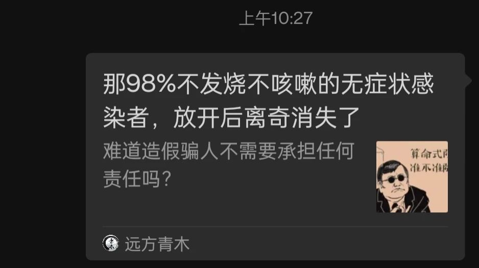
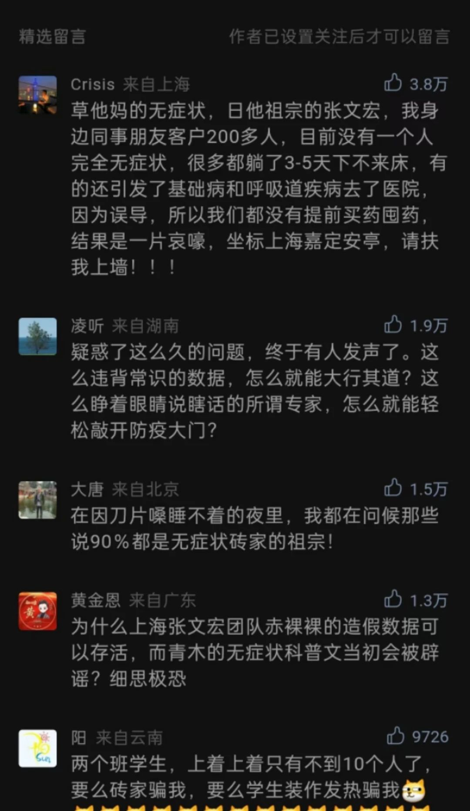
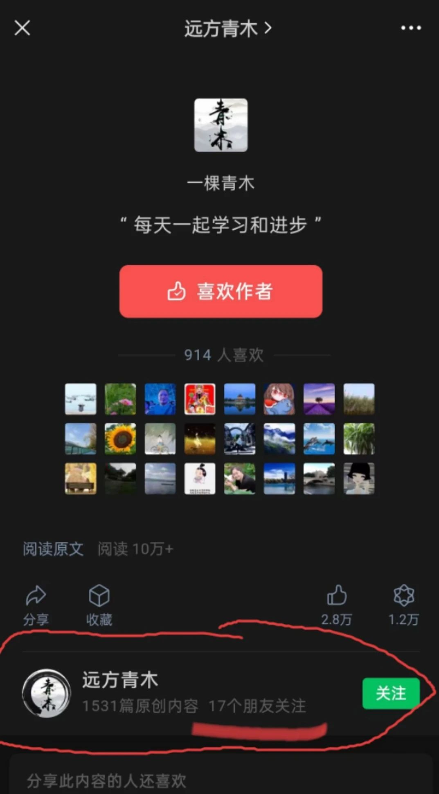

早上，在微信群看见一篇文章，那感觉就像吃了苍蝇 —— 不，是吃屎了。

对，我刚吃屎了。

独吃屎不如众吃屎。于是，我将文章转到了一个我最经常出没的微信群里，顺便说了几句泄愤的话。

我没有转发到朋友圈，而是将顶部留言的部分截了图 —— 截图时发现，由于刚刚的转发，微信将一些信息显示出来，我赫然发现：我的朋友圈竟然有17人关注这种烂号！

我真的很惭愧！

有朋友调侃：是惭愧自己交友不慎吧？

这个问题有些难以回答，因为我都不知道那些人是谁。他们可能是我的朋友，也可能是公众号的一些订阅者。既然不知是谁，就难以判定是否是我想交的朋友，也就谈不上“慎”与“不慎”了。

我不由得想起前不久一个朋友说的话：“不因为别人的错而惩罚自己。”

这句话很有道理。在当前的情景下依然适用 —— 实在犯不着因为17个微信朋友关注了一个垃圾号而感到生气、感到惭愧。

然而，我就是很生气、很惭愧：为那留言中的群氓遍地而生气失望，也为自己连这么17个人都影响不了而惭愧。这只能说我的修行还不够。

我也有理由生气。正因为这些基本盘的存在，这个国家才成为了这种样子。他们没有一点思考能力，一篇漏洞百出的文章就能忽悠他们。他们配得上他们遭遇 —— 哪怕更恶劣的遭遇。

我不想反驳这种垃圾文章。因为我辛辛苦苦写出来的，不但是一些基本的思维方法，还不一定发得出；即便发得出，也很可能留不住。

有人说，比起新冠病毒更厉害的是另一种病毒，因为新冠所攻击的是肺或者心，但那种病毒却是攻击脑。我深以为然。在可以预见的将来，我们将与之共存很久，很久。

既然我不反驳，那这篇文章又有什么意义呢？

我想用我的惭愧表达对这17人的鄙视。是的，我鄙视你们，你们连这种垃圾号都分辨不出，还好意思与我为伍？！

前两天，看见另一篇文章，我觉得是**批判性思维训练**的好素材，这里给出链接（点击可读👉[英语思维与汉语思维之区别](https://mp.weixin.qq.com/s/E9bEZo75RLxFxaEkt8IxlQ)），供爱好者练习（欢迎留言，我会在以后的文章中给出分析）。

—— 特别提醒那17个“朋友”，如果你觉得我说那文章很垃圾你很不服气，那么，请看看我给出的练习素材，我猜你肯定发现不了其中的问题。因为找出练习素材问题的难度要远高于你所订阅的这种垃圾文章。

当然，取关或拉黑我是最快捷的方式：咱们一别两宽，但愿从此不再相见。

