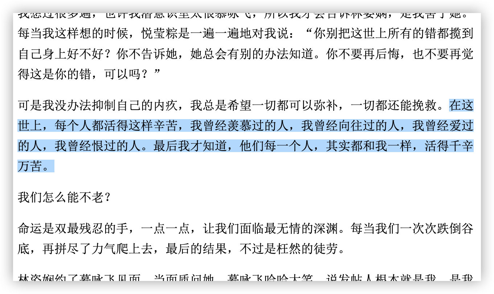

昨天上午，多次看见这样的信息：

后来，出现了进化版：

主要修正了两点：

1. 关于时间的表述（“凌晨12点”这种表述不当）
2. 强调了自杀，而不仅仅是切腹。

一些人看见便不由自主地震惊，继而感叹，还有的半信半疑。

我没有去查证，或者说不屑于去浪费时间，因为我基本判定为假：

我的判断被证明是是对的（这是显然的，如果我判断错误，那很可能您就见不到这篇文章）。

为什么有人要造这种谣？我也提供了一种解释，然而，与造谣者的动机相比，**更值得反省的是，为何我们会信**？

> 可能编的人怀有这样的期望，而又符合一些人的预期，于是得到了传播。
>
> 之所以出现这样的期待与预期，大概是因为对日本现状了解很少。就像一些欧美人还以为中国人还留着长辫子一样，他们自然会推测出中国人洗头很费事。同样，如果我们还认为他们风行武士道精神，那么，切腹自尽就是理所当然的。

**人们总是会相信愿意相信的东西，并且努力为之提供合理的解释**。

要想自己不被欺骗，或者减小被欺骗的概率，那么，批判性思维的训练便是必修课。

比如，当前我便是通过“消息传播的形式”和“消息无信源”来组合判断的。如果消息为真，自然会有媒体报道，那么，传播者转发一下新闻链接和截个图是更容易的事，而不会搞出这么一段纯文字的“快讯”。

另一则谣言是一段被冠以“安倍晋三”说过的话：

在这辟谣贴没有出现之前，我们是难以判断某人是否说过某段话。所以，一开始我是半信半疑。

为什么会怀疑呢？如果你见多了被冠以“鲁迅说过”的图文后，对于这种图文就会有**条件反射**式的怀疑。

不过，对于这样的“谣言”，信与不信不是很重要，**重要的是内容**。如果文字内容确实说得在理，有哲理，能引起共鸣，那谁说的就无甚关系。谣言编造者之所以这么干，一来利用人们崇拜权威的弱点，二来是借助热点事件来传播。不得不说，这一条能够得到广泛地传播，也侧面反映了当下被防疫抗疫所折腾的国人过得很辛苦，因而引起了共鸣。

辟谣贴给出了明确的信源，所以，查证就容易了（这也说明了信源的重要性）。原来这所谓的“安倍说过”，来自《千山暮雪》小说的“章二十四”：

