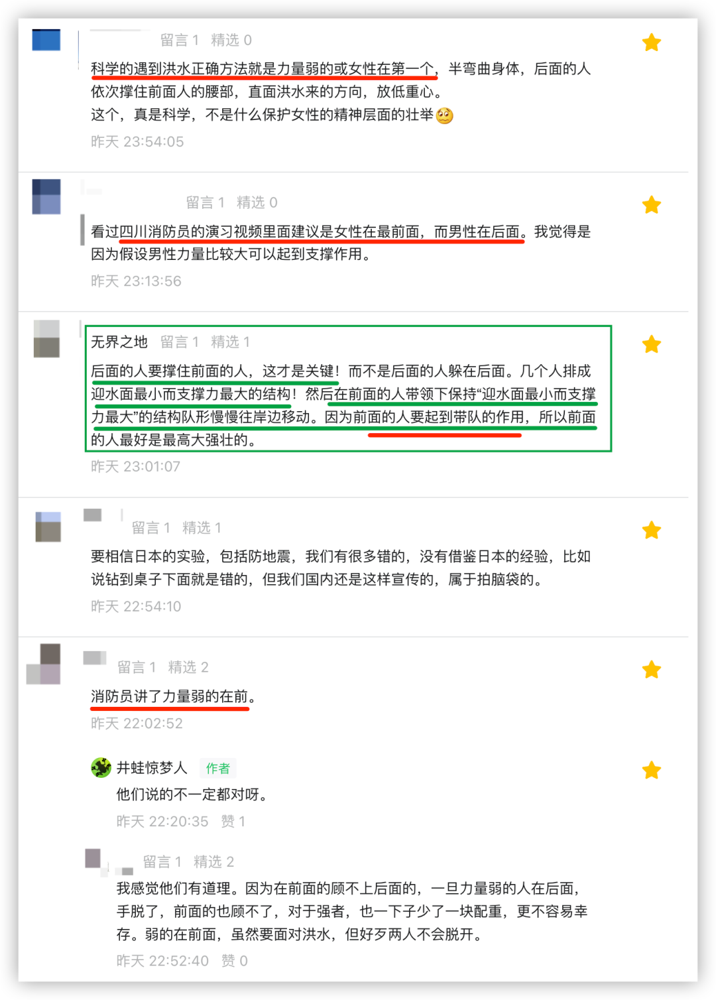
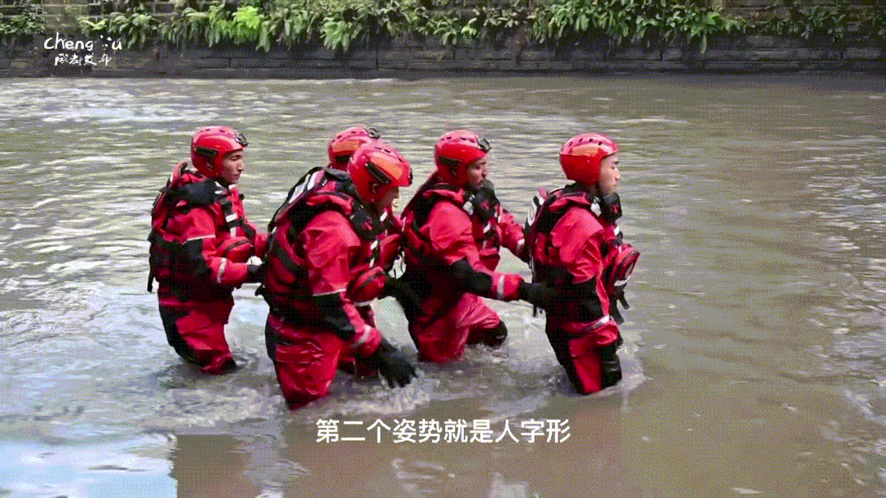
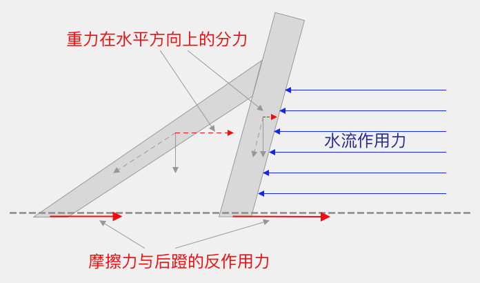

昨天的文章有一些人留言，讨论洪水中男女（强弱）的站位问题。不少人说“消防员说了，女的要放前面……”

但凡看过昨天文中【**日本**筑波**大学的科学实验**】的视频，都会想一想“**成都发布**”公众号里消防员所说的是否错了 —— 将女的（弱的）放在前面是否合理？

很可能真实的情况是，一些人根本就不看这视频，然后就噼里啪啦地发表意见，要么是说“消防员说了”，要么是他认为怎样怎样……

不是说不能发表自己的观点，但也好歹先听听别人说了什么。只听一方的观点，然后坚定地认为是真理，就很不好了。咱们的老祖宗早就说过的：“兼听则明，偏信则暗”。

视频我在文章中本就给出的，一些留言我也回了，本不想就此再说半个字的，但到今天中午了，还有人在留言：

这读者**语焉不详**，比如“已经被证实” —— 被**谁**证实？我不得而知，但他说得很客气，“建议本文修改” —— 我猜**他的初衷和我一样，是想对大家有益，担心我的文章误导了大众**，所以，我还是专门写一篇吧。

在所有的留言中，我觉得“**无界之地**”网友说得最好，他抓住了问题的根本：“迎水面最小而支撑力最大”。应该以此为目的来决定如何做。最为难得的是，他提到了**如何脱困**。

那些喜欢将“消防员说了”挂在嘴边的人可要注意了，他让大家等候救援，**并不是说**你任何时候**都要傻乎乎地等**，也是要看情况的。你若是一直等救援，等到水淹没你了还不动……然后将责任归咎于“消防员说了”，他们可是不（必）负责的。
是不是消防单位在水中这样拍了段视频，就是那网友所说的“已经被证实”了？

倘若真是如此，那咱们的**认知**区别还是很大的。这只是**演示**，而**不是**证实。

我将日本**筑波大学**所做的实验再剪辑了一下，只取了关键的部分，下面是关键部分的动态图片。

在实验室里，他们拿真人用洪水开练，这才叫“证实”：

相信你已经看见了，被洪水冲击之后，最后面的那个女生**几乎是站立在那里。**也就是说，她根本就没用什么力 —— 你说，这女（弱）的是放在前面还是后面呢？

仅仅在实验室里证实，这些日本人还嫌不够，非得在真实的河流里**证实**了一番。

现在，你觉得谁在前面合适？

—— 顺便说一句，这样的人就别来留言了。真的，很、难、看。

是不是一定要将女（弱）的放后面呢？**我看也未必**。比如人很少，只有两个呢？**或许**，这时也**可以**将女的放前面试试。按初中物理知识，我简单地做了个受力分析图，如下所示，就毋需多言了吧。

**还记得“无界之地**”网友的留言么 —— “迎水面最小而支撑力最大”。还有，在确保整体稳定的情况下，向岸边缓缓移动。

PS：附上文末有意义的一则留言。

