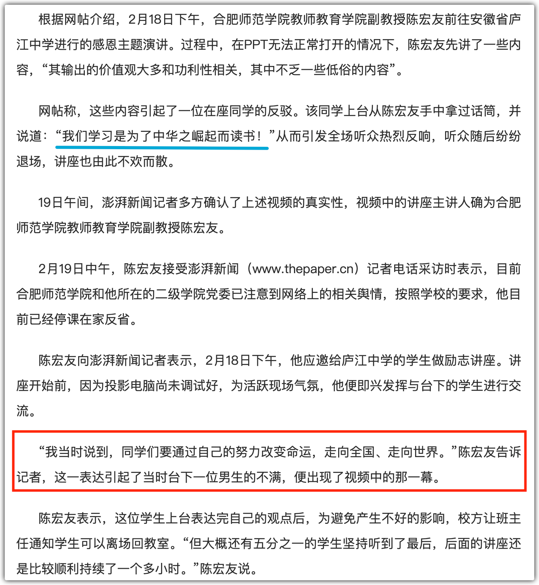

关于合肥市庐江中学的事，相信很多人都听说了，就不再赘述。

我不想评论那老师与学生，而是说点与思辨相关的感想。

其一，我们可以从一个人对这起事件的反应看出他的思维能力。

凡是不能问出“**那老师到底说了什么？**”的人是缺乏好奇心的，特别是，这样的人的思维能力很弱。

网上所流传的视频片段，都是那个学生在台上的发言，至于那老师在此之前说了什么，却是没有见到相关视频的。是那老师真的如此？还是那学生曲解或误会了老师的意思？不在现场的人是难以知晓的，至少，我们不应该否定存在其他的可能性。

仅凭学生的发言就论断那老师如何如何的人，尤其是根据那种经过剪辑的视频给出论断的人，是缺乏思维能力的（学生的发言本就很短，即便如此，有的视频都不给全乎的，而是剪辑了几句）。这样的人群极易被投喂的信息所操纵，并且体现在他们的情绪上。

其二，我们可以据此鉴别一些评论者的素质。

有个评论者，他明显提到了澎湃新闻对那陈老师的采访，他的评论视频中都给出了澎湃新闻的截图，然而，他故意忽视其中对老师有利的部分（下图中红线框出的部分），而是选择性地采用对老师不利的。

我未必认为这老师对记者所说的就是实情（澎湃新闻的采访似乎不够严谨，上图中蓝线标出的似乎与学生实际所说的有出入）。然而，作为一个信息调查者，是不应该忽略反面的信息；而作为一个评论者，哪怕你再不喜欢这种反面信息，也是应该提及的 —— 即便是提及时加上一句“我不认为这老师说了真话” —— 这都要好上千百倍，因为这会明确表示那老师给出了另一种“证词”。

这种故意忽略另一种证据或信息的人，绝对称得上是“坏人”。他为了论证自身的观点，而故意隐瞒他已经知道的对立面的信息，这就是摆明了要忽悠你。

其三，比起那老师与学生的是是非非，我似乎更关心话筒被夺的事 —— 倘若你是那陈老师，话筒被夺了，你会给出怎样的临场反应？

我能想到的比较好的处理方式是，不要试着去抢回话筒，而是让工作人员再拿一支话筒来，并且，要耐心地等学生将话说完，然后请他留下来，两人来一次**探讨式**的交流。

这是基于两点考虑：

1. 倘若试着抢回话筒的话，就会形成你追我赶的场面，很是难看，不是笑话也成了笑话；
2. 话筒在你手上，你本应该是控场者。不能让人上台抢夺了话语权，扇了你几记耳光，然后就这么轻松地走了。既然对方抢夺了话筒，出于对等，他也应该在你回应之后有所表态方可离场。

当然，最好的方式还是预防：握紧话筒，别让人抢了。

