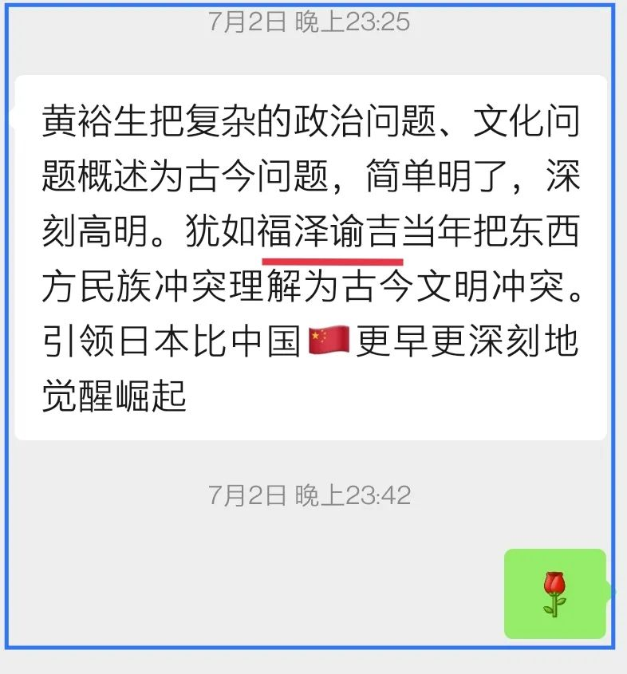
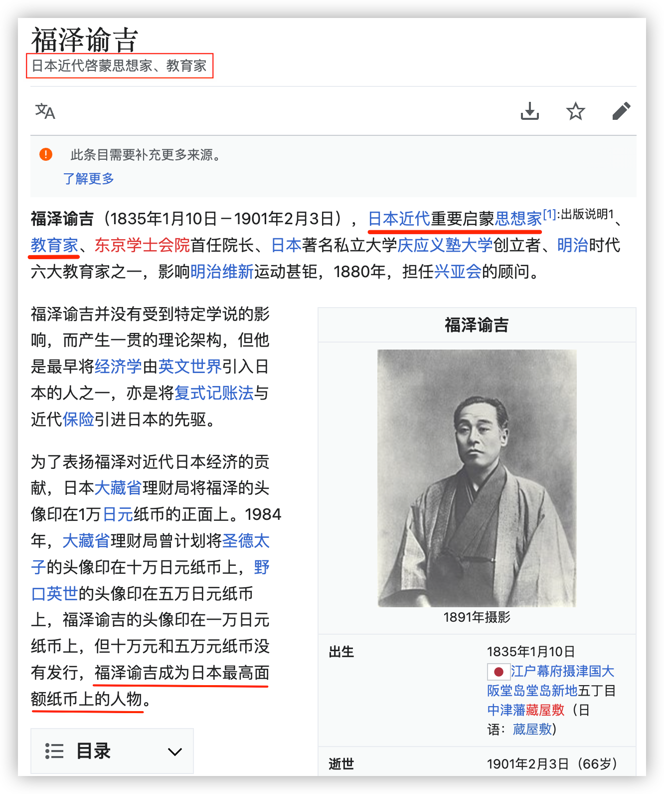
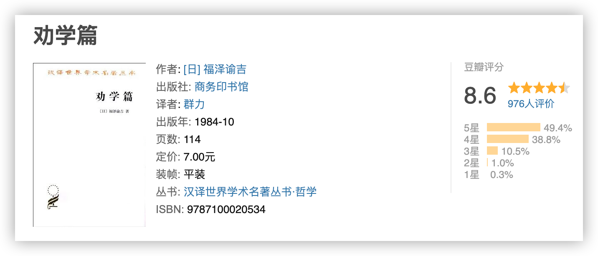
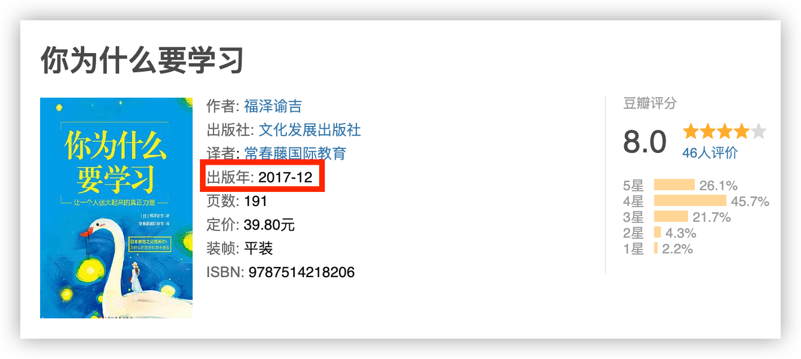
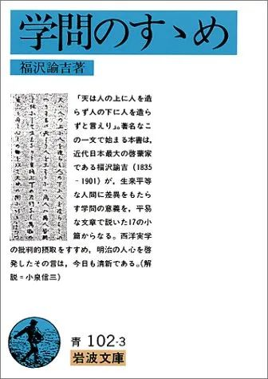
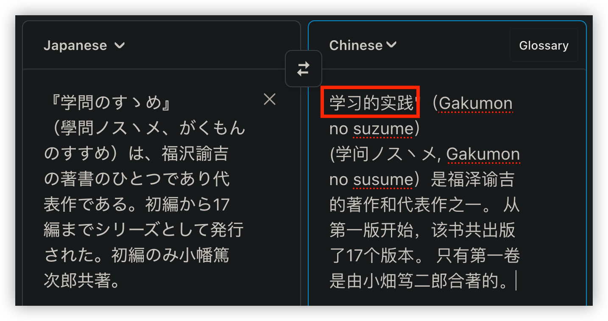
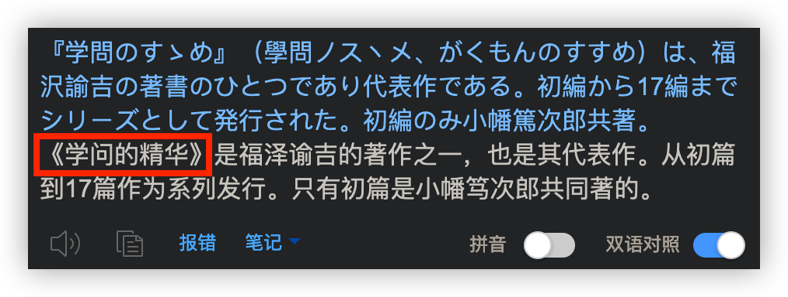
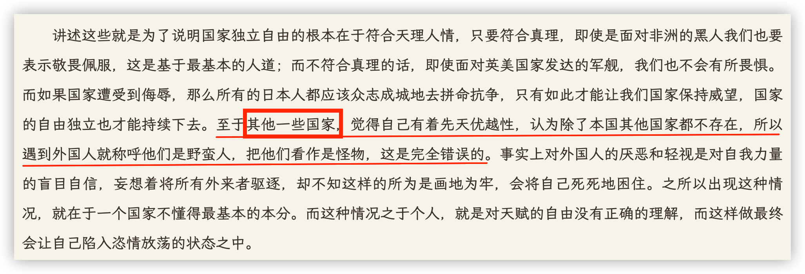
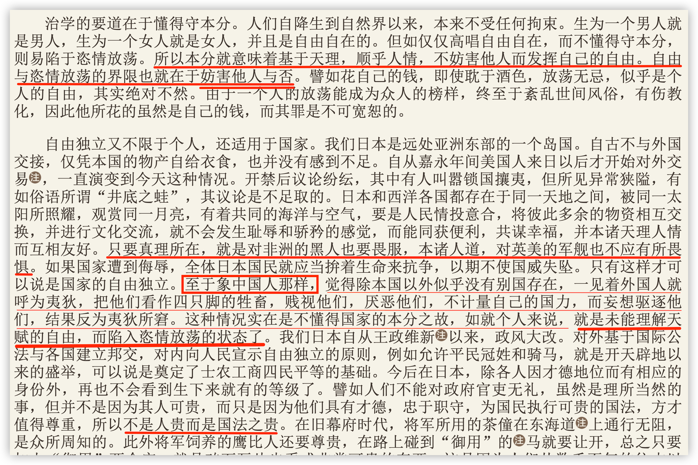

我所敬重的一位老师对**黄裕生**教授一文的评价甚高(*点击可读：👉*《[黄裕生：何谓古今之变？](https://mp.weixin.qq.com/s/QZ8jm-de2DAUeZKeunhJ5w)》）：

我不由得对**福泽谕吉**产生了浓厚的兴趣。

于是就想找他的书看。由于我特别关注**教育学习类**书籍，因而这本就先入了眼：

荀子有个名篇《劝学》，经过九年制义务教育的无人不知，基本都能背上几句。那么，福泽谕吉说了什么，与荀子又有什么不同呢？看见这书名，我满腹疑问。

而这本“商务印刷馆”的书有年头了，我就想找找新版本。于是发现2017年出版的这本：

它们是同一本日文书的不同译本么？两本中文书名是不同的，但似乎又有关系：《劝学》是写书人对读书人说的话，那个潜在的主语是站在作者的立场；《你为什么要学习》则是站在第三方的立场，指着“你”说学习的必要性。

当然，我后来确认了这两译本都翻译自福泽谕吉的同一本书《学問のすゝめ》。

由于我不懂日语，就借用翻译工具一探究竟 —— 哪知所译结果也不相同：

但我们不难得出结论：不论是《劝学篇》还是《你为什么要学习》都是意译。

中国近代启蒙思想家、翻译家**严复**曾提出翻译理论：**信**、**达**、**雅**。这几乎是翻译界公认的翻译原则与要求，也是难点，又称“三难原则”：

-  “信”（faithfulness）：**指意义不悖原文，即是译文要准确，不偏离，不遗漏，也不要随意增减意思**；
-   “达”（expressiveness）：指不拘泥于原文形式，译文通顺明白；
-   “雅”（elegance）：则指译文时选用的词语要得体，追求文章本身的古雅，简明优雅。

显然，这两本书书名的翻译，是在“达”与“雅”的层次，但也不算违悖于“信”。我认为“劝学篇”更雅，“你为什么要学习”则更通俗，就像“撸起袖子加油干”一样，适合现代的风气。

但书中的内容却有很大的区别，这已经不属于翻译风格的差别了，因为，新版在“信”上出了大问题，已经违悖了翻译最基本的原则与要求。

先来看2017年出版的《你为什么要学习》：

“其他一些国家”都是哪些国家？

嘿嘿，这可以在1984年出版的《劝学篇》中能找到答案：

把我搞得都有点恍惚了，到底哪本书是**1984**出版的……

所以呀，购买人文类译文书籍，我劝你还是淘老版本的吧，否则，你很可能银子花了，买的却是个西贝货！

多老的版本才算老？老夫掐指一算，至少往前10年吧。

