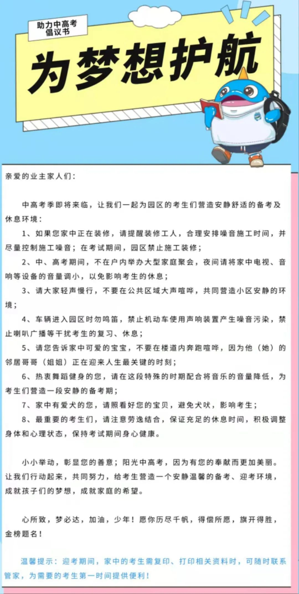

这不是马上就要高考了吗，昨天，物业的工作人员在小区群内发了个“倡议书”。其时就有些感慨，写了段话，本想发到群内，但看见几个邻居纷纷点赞，就算了，免得扫了他们的兴致 —— 要整就整个大的。

这是我当时写的那段话：

> 除了最后一条（第8条），是对考生说的，其他任何一条，难道不是本应如此吗？
>
> 邻居朋友们不妨将其中的“考生”换成“邻居”或“其他业主”，看看是否有违和感？
>
> 另外，第一条“在考试期间，园区禁止施工装修”，这又是为什么呢？
>
> 中高考本是安排在工作日，而按日常装修管理，工作日中午12:00～14:00以及下班后的休息时间，本也是禁止装修的。也就是说，当学生回家休息时，装修已然停止，并不会影响考生。
>
> 那么，当学生远在考场考试，而小区却要以此为由来禁止他人装修，有必要吗？合理吗？（特别声明，我家早就装修完毕，没有装修诉求）

除了以上，这份“倡议书”还是有嚼头的。

其一，关于倡议书的书写。“倡议”是“首先提出建议；发起做某事”的意思，所以，“倡议书”是发起者说某东西好，因此建议和鼓励大家都那样，并以书面的形式广而告之。显然，建议是不具备约束力的，特别是，**不应具备强制性**，因此，“倡议”与“禁止”这样的表达是无缘的，它俩这辈子就不该见面。我数了下，这份“倡议书”中“禁止”出现了三次：

1. 在考试期间，园区**禁止**施工装修
2. 车辆进入园区时勿鸣笛，**禁止**机动车使用声响装置产生噪音污染，**禁止**喇叭广播等干扰考生的复习、休息

其二，这份倡议书的底层逻辑很是耐人寻味。上文说过，将倡议书中的“考生”换成“邻居”一样适用，小区的常态本应该如此。也就是说，不论是从物业的管理，还是从业主的文明程度来看，这些都应该是日常的及格线，然而，现在成了需要“倡议”的东西，而且是借“特殊时期”提出来的。

所以，当我看见这份倡议书的时候，立马想起了一句在婚恋界流行的感慨：“我奋斗了三十年，才可以和你坐在一起喝咖啡”。文明也是如此。一些人眼中难以企及的高度，在另一些人看来，只是日常行为举止的基本要求，是文明的及格线，甚至是底线。

还有一个耐人寻味的是这份倡议的发起者，也就是物业。业主的文明程度达不到要求，物业肯定要从日常的管理上下功夫，比如业主乱鸣喇叭，乱扔垃圾，车辆乱停乱放，等等。这些管理工作是他们的职责所在。但现在呢，却是一种倡议的形式提出来，而且夹杂着道德绑架的味道：考生的考试很重要呀，他们“正在迎来人生最关键的时刻”，宝宝们你们要安静点，狗狗你们就别吠了……也正是因为倡议者站在了道德高地，方才以“倡议”的形式将“禁止”说得那么顺溜，即便考试当中考生不在小区，也可以此为由来禁止他人正常的装修。

为什么物业可以凭借考试来占领道德高地？因为有土壤吗。这就要谈到国人的考试观。

在这个国家，正是考试，特别是高考，有着非同寻常的地位。这其实是特权思维的在局部的映射：**一切都要为之让路**。因此，让你停几天装修算什么？性生活都可以停上几天。

这种考试观念的建立，往远了就要追溯到科举考试的时代。很不幸，那些在封建制度中培育出来的观念被我们一路承袭：倘若不能金榜题名，那洞房花烛就成了问题，到后来，不但他乡难遇故知，即便回到家乡，故知也会很忙的。总之，高考意味着功成名就，而人的一生就被这两三天决定了，大抵是成王败寇 —— 你说，能不重要吗？

但只要稍具批判性思维，哪怕只是具备现实感的家长，都会意识到这种考试观是荒谬的。

学生考了59分和60分，即便仅从试题所反应的能力上看，有什么大的区别吗？这一分之差又能具备多少现实意义？然而，学生却被因为这一分之差而分了两个层次：及格与不及格。我相信那些“唯分数论”的人会大谈特谈这1分的意义所在，多考1分意味着领先多少个人，就会在竞争中胜出，又或者，他们会反问我，为什么59分的就不能多考1分，这不就是能力的体现吗？正所谓一文钱难倒英雄汉，而一分之差就能决定一个人的命运……是的，这就是残酷的现实，然而，这也正是我想指出来的，存在的未必就是正确的，就是理所当然的，否则，我们应该停留在原始社会，继续茹毛饮血，因为那是当时的存在，而耕种小麦，飞机地铁，当时并不存在。

倘若我们依然将封建时代的考试观念奉为圭臬，那套在孩子身上的枷锁将会向下一代蔓延；倘若我们不改变考试的观念，那社会的人才选拔就会依然处于恶序的竞争状态。

这种恶序竞争的出现 —— 千军万马过独木桥 —— 其**根本原因**在于人们认为**功成名就只此一条路，别无他途**。殊不知，一切早已时过境迁，社会已经多元化，分工更细，社会的协作更为密切……伴随着这些变化的是：“自古华山一条路”已然作古，到达华山之巅还可以有索道，直升机，甚至是从更高的地方跳伞。所以，我认为，**意识不到“早已时过境迁”**，是持有陈旧考试观的家长不具备现实感的表现之一。

那些家长们缺乏现实感的另一种表现是**无视当今的就业情况**。倘若大学四年后依然是工地搬砖，又或者是送快递，你这挤破头考大学又为的是什么？我不是说读大学不好，更不是说学知识不重要，而是想说，既然现实已经证明挤那独木桥并不能让孩子功成名就，那就说明了总有地方不对劲，我们该回望与反思了，好好想想挤独木桥的是否那么重要。

以个人的浅见，我们需要重新看待考试，重建对考试的观念，不要让考试决定命运，甚至是分数决定命运的事情继续上演。特别是，**比起一两次的考试，持续的学习与努力更重要**。

如何才是正确的考试观？

我屡屡和孩子这样讲，考试是一种检测，是检验当前阶段你的学习效果好不好，并不是对你是否聪明的评判。成绩不好，分数不高，只是说明你这个阶段学得不好。至于为什么学得不好，那是要找原因的，是你不够认真，上课不够专注？还是你练习做得太少，训练得不够？你需要自己不停地总结原因。总之，考试是**为了给你反馈的**，它和你做练习一样，都是对你的学习进行检查与反馈的。在考试的时候，它会迫使你回想所学内容，这对你大脑的刺激是最大的，所以，多多考试测验，这会是很有效的学习方式。

因此，我希望孩子建立的考试观念有二：

1. 考试是为了帮助你更好地学习的，你应该时不时地自测，这样才能高效学习；
2. 考试是检测你当前阶段的学习效果的，它不能直接反应一个人的能力。重要的是，你是否基于考试的反馈（成绩）而有所调整，另外，你是否持续努力，并终身学习，这个更为重要。

我相信，倘若秉持这种考试观，孩子定然不会闻考色变，因为考试的意义已经随着观念的变化而发生了根本的改变。届时，即便是高考又能怎样，不过是人生所经历众多考试中的一场，只是稍微有些特别。

当然，也得承认这种考试观有不好的地方。比如，既然高考成了没啥大不了的考试，人们就不能因此而享有特权，更不能挟高考以令他人，实施道德绑架了。

