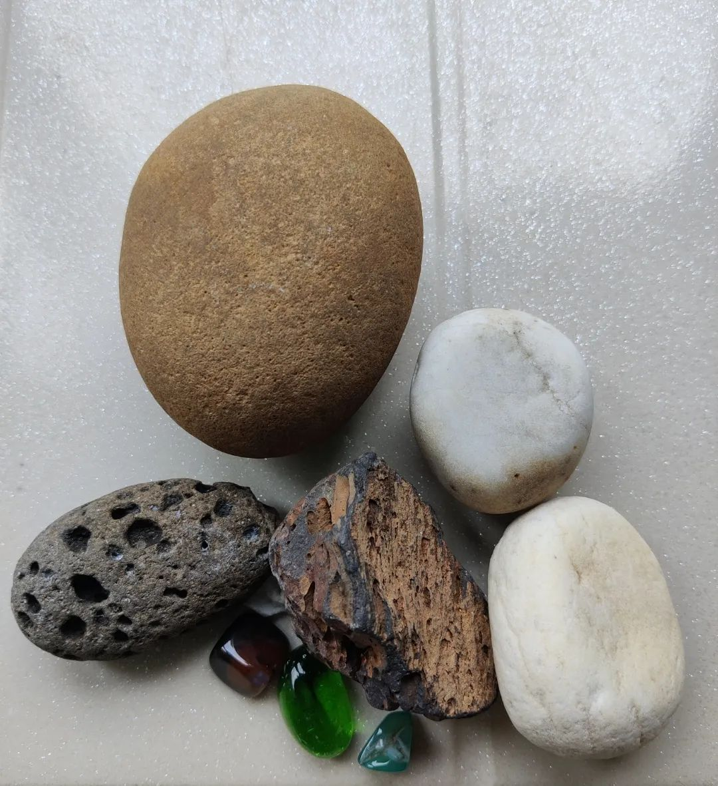
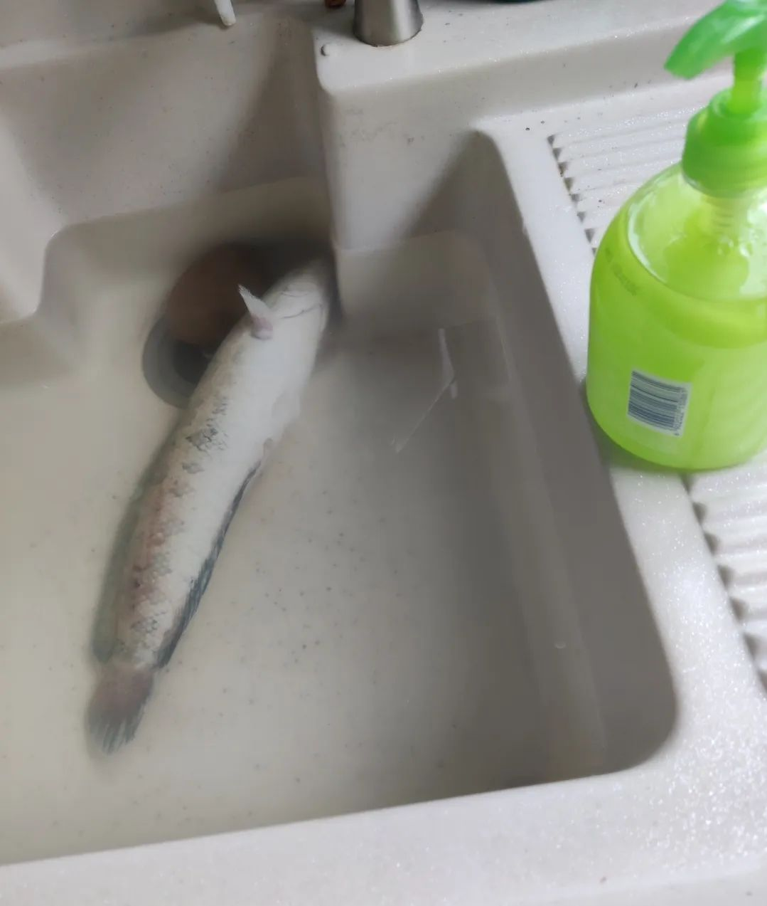
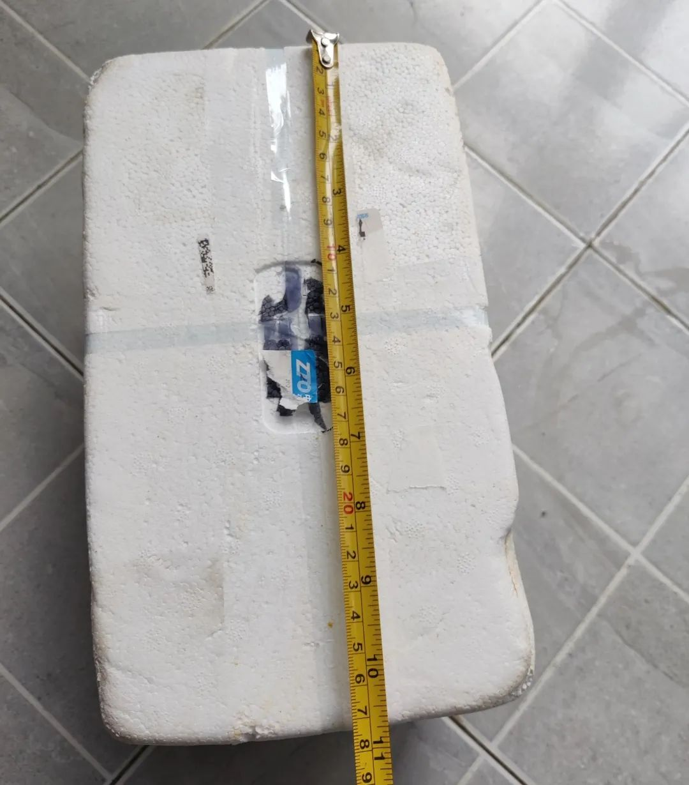
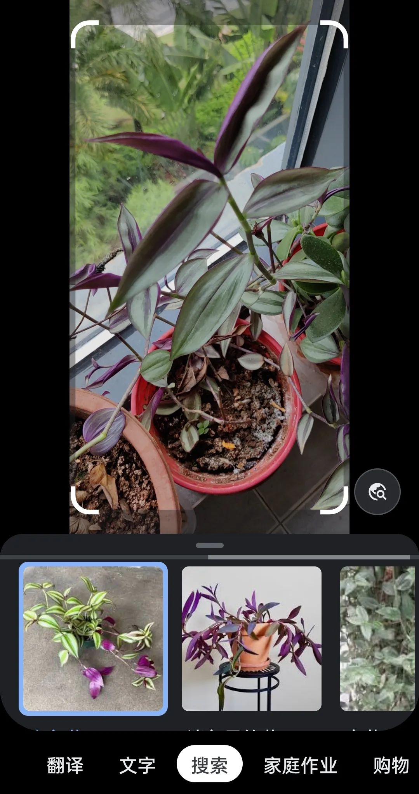
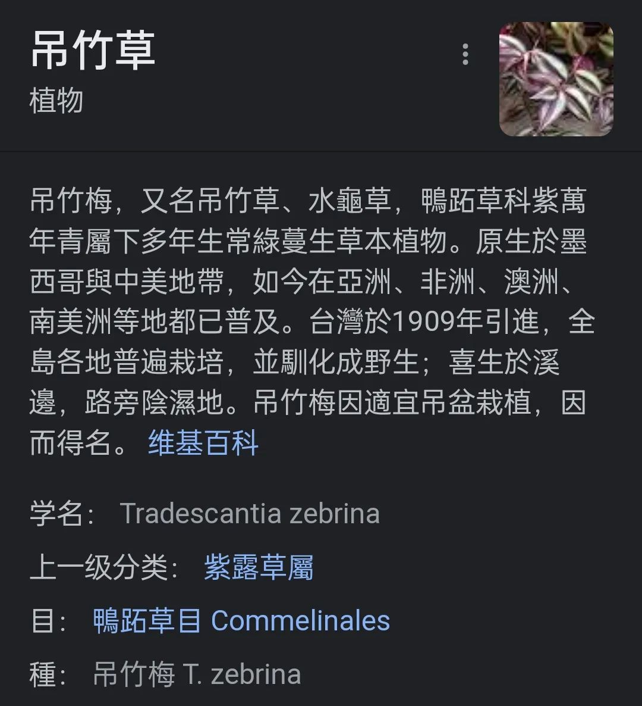
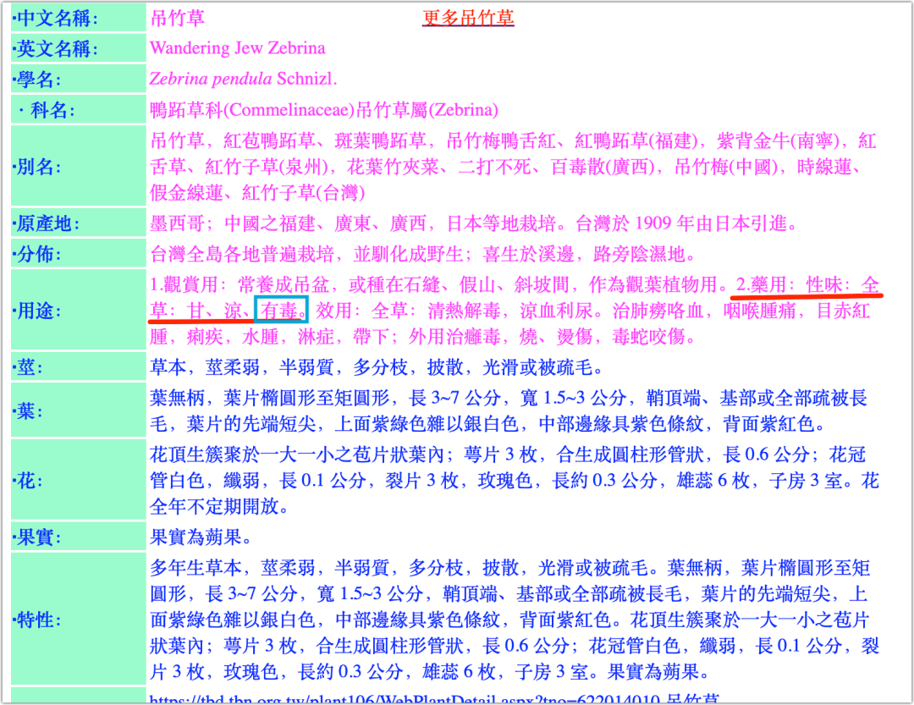

儿子参加了一个捕鱼的活动，他抓到了三条鱼，都是两斤多重的样子。

第一条鱼抓回来没多久就死了，没能挨过夜；第二、三条撑过了当晚，但有一条在第二天下午死了；剩下最后一条，生命力比较顽强。

前鱼之鉴，奶奶想趁鱼还活着时就宰杀了，免得死鱼不好吃，但儿子不肯，说要养着。其实，家里没有合适的地方养这么大的鱼，那鱼装在一个塑料圆桶里，身体都不能打直，但儿子想养，就由着他。

我找来个横截面大一些的塑料盆，椭圆形的，倘若鱼顺着长直径方向浮着，就只有尾巴梢有点弯，应该舒服一些。给鱼换盆的时候，抓鱼，换水，都是儿子的分内之事。

得知那是条黑鱼后，儿子便给鱼起了个名字：小黑。

儿子和我们说：“他现在有名字了，你们不能吃他了。”

奶奶听了好笑，自然是答应的。我先是吃惊，没想到他能说出这么有哲理的话，但也禁不住想笑。

小时候，我家养了只母猫，下了一窝仔，小花猫居多，但有一只小黑猫。小黑猫除了几只脚是白色的，其余部分全黑，我也给他起了个名字叫“小黑”。我和儿子说起了我的小黑，然后说，我的小黑能秒杀他的小黑，是他的小黑的克星。儿子哈哈大笑。

我不知儿子这想法从何而来 —— 给鱼命名后便不能吃他 —— 但的确如是。一旦我们给某物命了名，便不自觉地倾注了感情。我不记得《小王子》这本书里是否有提及，但在电影《恐龙当家》（The Good Dinosaur）里，是有类似的情节的。这也是我们通常给所做的项目命名的原因。一旦我们给某项目取了个代号，而这个代号又具有生命属性，比如是动植物，我们就对项目有了情感。这种情感往往是潜意识的，难以察觉的，但我们会为之倾注心血，努力地维护他成长壮大，不让他夭折。

那条鱼因为儿子的命名，即刻间拥有了家庭地位，成了家庭的一员，自是不能刀砧相向。

第二天夜里，儿子还给小黑投食了数粒米饭，但小黑不感兴趣，似乎没有吃。好在当晚顺利度过，浑了一盆水。鱼身的黑色似乎淡了一些。

第三天早上，儿子给鱼换了水再去上学的。放学一到家，儿子就会去看看他的小黑，喜欢用手去拨弄，还忍不住抓他起来看看。

晚上，他又给鱼换了水，还在盆里放了几块鹅卵石作为点缀，并让我去欣赏他的杰作。确实，水中有了石块，多了一份生气，于是我大加赞赏。我就给儿子出主意，要是再加点水草就更妙了，而旁边正好有爷爷养的一盆酷似竹叶草的植物，我就让儿子拔了一株下来，放在盆中。那株草实在太长了，遂让儿子一分为二。原本孤零零的鱼，现在有了石块和水草的相伴，盆里一下子丰富起来，小生态已然在望。我们又欣赏了一会儿，各自带着满足离开了。

当晚睡觉前，我听见小黑在那里扑腾，动静挺大。心想，这水草一加，鱼也闹得欢了，果然是鱼儿离不开草，但也担心鱼从盆中跳出来了，就去看阳台了下。还好，小黑还在盆里，倒是阳台上有了好多水，我又担心鱼将水扑腾到旁边挂的大毛巾上，遂将盆移远了些，然后回房间了。

再过了会儿，就听见儿子去阳台的动静，那鱼还是扑腾，他也听见了。顷刻，就听见儿子喊我：“爸爸快来，爸爸快来，小黑不行了！小黑翻白了！”

我连忙赶去，发现那鱼肚白朝天了！

我的第一反应是那“水草”有毒，好在鱼还能扑腾，就连忙换水，将石头和草一股脑地掏出。盆中换过全新的水后，小黑还是肚白朝天。这时也顾不得会将洗衣池弄腥，连忙放了半池水，让儿子将鱼从盆捞到池子里，以便小黑待得舒服一点，也希望更多的清水能有所帮助。这时的小黑，虽然顺直了身体，但翻了几翻，没了生气。

儿子很沮丧，说希望小黑没事，也很是困惑：换水的时候不是好好的吗？

我说可能是那草有毒。儿子恍然大悟，说：“都怪爸爸，要搞什么水草，结果把小黑毒死了！”

我说：“我也不知道那有毒呀。再说，只是可能，现在也不确定是水草毒死的，也许他本来就挺不住了，你看他身体不是还有伤吗？你们抓鱼的时候已经弄伤他了呀。小黑已经算活得长的啦，另外两条不是早死了吗。”

儿子勉强接受了解释。我们便将希望寄托于小黑的生命力，希望他能挺过当晚。

后来，听奶奶说儿子回房后还在念叨：“阿弥陀佛，希望小黑没事，阿弥陀佛……”这个从不念经的主儿居然拜起佛来，着实让人哭笑不得。

第四天一早，奇迹没有发生，小黑没能挺过去。

儿子很不开心地上学。出门前，我问他小黑怎么处理，他说：“让小黑死得尊严些。”

刚好有个快递盒子。不算特尊严，斜着能将小黑放下：

中午，儿子放学回家，他对包装还算满意。然后就商量怎么处置。

儿子说要海葬，让小黑归于大海，但被我否定了。一，若连盒子一起扔的话，白色垃圾会污染大海；二，小黑是淡水鱼，也不应该扔到海里。儿子表示认可。最终，还是决定扔到小区的垃圾箱，但儿子不想去。 这一次，我没有将他的“不想去”理解为“懒”，毕竟，到垃圾箱那里还要分离，盒子归可回收垃圾箱，而小黑要进入厨余垃圾箱，估计儿子不想看见这样。所以，这事还得我去办。

送走了小黑，但他的死因未解。我便带着儿子确认这草到底为何物。

谷歌镜头直接识别这株植物为“吊竹草”：

在百度百科等词条下，基本都是给出可入药的说明：

> 吊竹梅有清热利湿、凉血解毒的作用，可用于治疗泌尿系统感染、治慢性病疾、治白带、治目赤肿痛等。

但在另一个网站上，却赫然写着【全草：甘、凉、**有毒**】的说明。

虽然我没有查到吊竹草能毒死鱼的明确说明，但结合小黑当时的状况，尤其是死前激烈地扑腾了很久，这说明他的身体状况是很好的，而不像另两条鱼那么死得悄无声息。因此，小黑极大概率是被吊竹草毒死的 —— 我就是那元凶了。

面对这样的结论，儿子免不了再埋怨我一番；还在和他妈妈视频时告了我的状，说是我毒死了小黑。

奶奶为了安慰他，也是给我开脱，说我本也是好心，也不知道那草有毒……

借着奶奶的话茬，我问了儿子两个问题：如果我出于好心，毒打你一顿，你接受吗？再者，如果有人出于“美好的”愿望，将中国人弄死几千万，你能接受吗？

显然，儿子的回答都是否定的。相反，我们都要提防有人以好心之名干坏事。

我们还要提防不经意地犯错。因为有些错误一旦犯下，就意味着不可挽回 —— 比如小黑之死 —— 所以，我们能做的是尽量预防，尽可能地多想一点，周全一点。

倘若我在放入“水草”之前，先查一下这是什么草，如果那时就知道它有毒的话，大抵就不会毒死小黑了。

另外，在我们不了解某些事物的时候，是很容易误判的。比如我将小黑的垂死挣扎理解成了他是“鱼（草）之乐”，也可以说，正是这**自以为是的判断**导致了小黑的死，我们错过了拯救他的黄金时间，倘若我第一次去阳台时就换水，是否可挽救也未可知。

因此，小黑极大概率死于有毒的吊竹草，而这草应该先行查验是否安全，恶果本可避免的；小黑还死于人类的自以为是，这种颠倒黑白的判断让他死得很冤。

但依然愿小黑能安息 ——

愿我们都谨记这用生命换来之教训。

