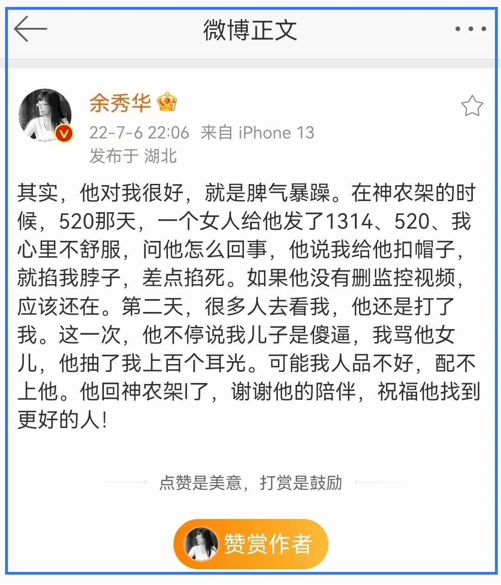
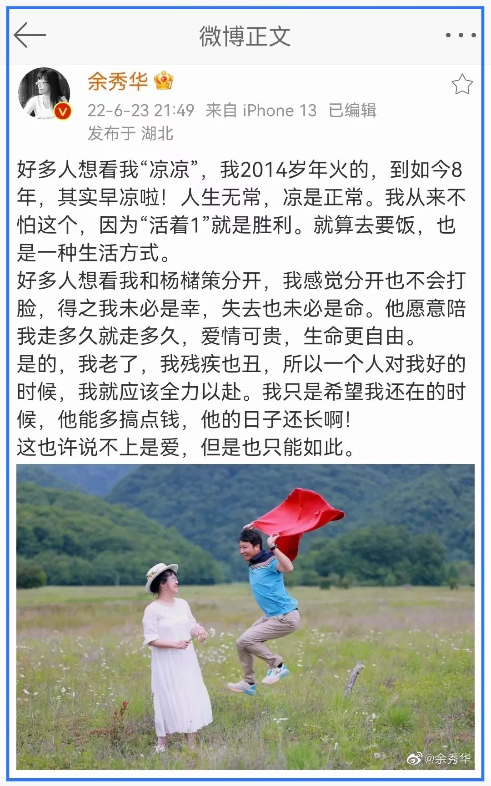

标题中的“她”是余秀华。

估计很多人都知道了，她的婚姻出现了变故。

这估计是很多人翘首以待（或盼）的结果 —— 他们，不，应该只是她，余秀华，“凉凉”了。

我蛮欣赏余秀华的。她比很多人活得真实、痛快，而且，她的诗很好。

其实，我对余秀华了解不多，就如读她的诗不多一样。我甚至都没有关注她的公众号，只是在一些流传很广的诗文中一窥究竟。

她就像矗立在灌木丛中的一株山茶，骄傲地绽放。只要你朝那一方放眼，就能望见她。她的美是笃定的，这点毫无疑问。我时不时地看上几眼，也就如此。

对于余杨的联姻，我也是如此观望，不甚了解。譬如，他们怎么走到一起的，我毫不知情，也没有兴趣了解。听说之时替余秀华高兴，也在内心为之祝福。

这是他们的婚姻。是他们两人之间的事，最多涉及到双方的家庭，而我纯粹是一个路人，与之毫不相干的陌生人。不论是现实中，还是虚拟网络中，我与之都没有交集。他们爱谁谁，并不妨碍我。同样的逻辑也适用于那些对余秀华婚姻说三道四的人。

对于他人婚姻的看法，我在杨振宁和翁帆结婚时有了大的转变。那可以算一个标志性的事件，用以判断一个人有没有**边界感** —— 在他与周边人互动时。

在翁杨结婚之前，我就不喜欢杨振宁，也是因为他们结婚，我才第一次知道了翁帆。以一些人的眼光来看，这么个让人讨厌的老头子娶了个可以叫他杨爷爷的年轻貌美的女人，那还不要站出来吐几口唾沫呀。我没有那么做，只是略有调侃。就是那时候，我认识到了自由的意义。

自由是有边界的，那就是不能妨碍他人。他们结婚是你情我愿的，没有妇女需要解救，更没有妨碍我，那就是他们的自由。他们没妨碍我，我自然不能去妨碍他们。只不过，由于我不喜欢杨振宁，自然就不会像对余秀华的婚姻那样为之高兴与祝福了，但我也不期望他们早日凉凉，而是告诉自己“洗洗睡吧”，那不关我的事。

随着我对自由与尊重、婚姻与家庭的了解和体会越深，我对这种“面上不协调”的婚姻就越持**局外人**的态度。对于他人的婚姻，我们都是局外人，这二者之间是有着明确边界的，这本是一个显而易见的事实，然而，很多人偏偏熟视无睹，试图指手画脚，井水要犯河水。

殊不知，人们觉得他们“不般配”，那是世俗的眼光，也是要不得的眼光。在封建时代，闲话能杀人，唾沫星子会淹死人，还有的人觉得不过瘾，硬是横加干涉，用猪笼杀人。现在应该是好了一些，毕竟有婚姻自由的法律条文在那里挡道，就是想干涉也力有未逮，只好改用键盘砸了。只要当事人内心坚强，基本都能有一条活路。

那些人之所以在网络上对余秀华实施攻击，除了是因为他们对自由边界的无知以外，还有**奴性**的因素在起作用。他们在现实中大多是条卢蛇（loser），经常被人踩到脚下碾压，但又慑于强权的淫威，不敢有半点不满，那因与地面摩擦而起的火哪里去撒呢？

有家庭的，可以烧向更弱的妻，更幼的子；没家庭的，自然只能在社会上寻找目标，而网络世界中的余秀华，真是个天然的好靶子！

她残疾，她话都说不利索，她弱，这火可以冲她撒了；她还有钱，这简直太让人生气了；有钱还能忍忍，毕竟比她有钱的人大有人在，我多搬几块砖就是了 —— 她居然还有才！靠写几句话用一种叫“诗”的形式发表就可以赚那么多！——怎么办？搬砖只能练肌肉，前提还得营养要跟上，但不论怎么搬都练不了脑，练不了才！怎么办？！叔不可忍，婶更不能忍呐，抡起键盘砸她！

不信？要是你身边有那种骂余秀华，盼她婚姻“凉凉”的人，你去看看他们的日常，可曾为社会与身边的不公发出过一点声音，哪怕是一言半句。

他们大都是一群不知权利为何物，只知道屈从于权力与淫威的人！

就让余秀华享有她婚姻自由的权利吧，这也包含对她如今遭遇保持距离，除了对于家暴的谴责以外，我们毋庸置喙。因为，我们在享受自由选择的同时，也要承受因此而来的结果，这和旁人无涉。

倘若余秀华的这次婚姻真的走到了尽头，对于这可能的结局，我相信她早就料到。诗人，尤其是一个好诗人，定然具备对人性的洞察力。只不过，她对爱情的美好期望得高了一些，这大概就是“只缘身在此山中”。

对于她的婚姻变故，我最想表达的反而是一声叹息。就像我们枕着清风入眠，哪知却做了个噩梦。而现在，便是梦醒时分。

我希望余秀华不要因此而对人性彻底失望。罗曼·罗兰说：「世界上只有一种真正的英雄主义，就是认清了生活的真相后还依然热爱它」。在我眼中，余秀华便是这样的英雄。

我也希望那些嘲笑余秀华、说风凉话的人能收收声。我知道，与你们讲善良与自由的边界是无意义的，只想说，余秀华有着健全的心智，在这一点上你们望尘莫及，恐怕今生已然无望 —— 就为来世积点德吧。

最后，愿那株生于灌木丛的山茶花依旧崛立，美丽。

