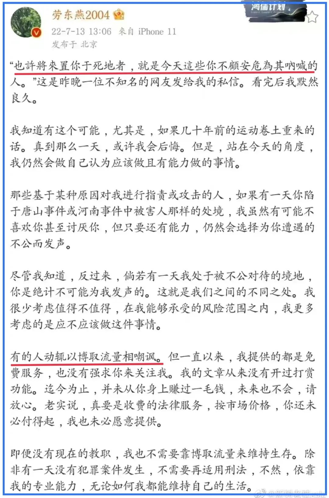
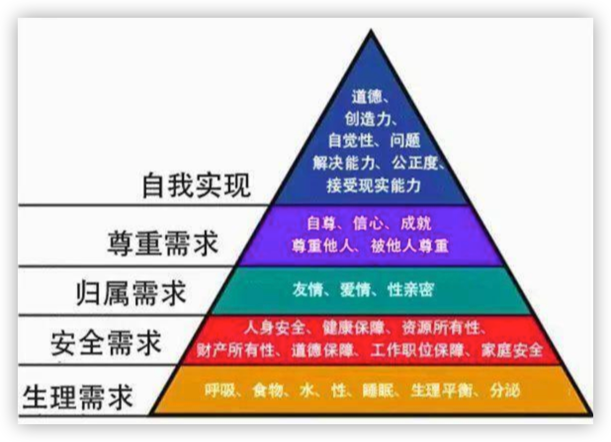

昨晚，看见**劳东燕**的一段微博文被频繁转发。

要是搁以前，看见第一句话：“也许将来置你于死地者，就是今天这些你不顾安危为其呐喊的人”。我大抵是心有戚戚焉。

这种事情，文革那十年屡见不鲜；就是在这两年，也是不乏其人，比如“敲锣女”、“过桥女”，无一不是自己的事情解决后，反咬一口当初帮自己发声呐喊之人。怎么能不让人寒心呢？

但我已经迈过这一人性幽暗的区域，能够坦然面对这样的群体。

这在之前的文章中已有提及。当有人感谢我为之发声时，我是拒绝的，我心中非常明了：**我只是为了我自己**。我并不曾有恩于你 —— 即使有些事情与我无关，我选择发声那也只是因为我看不过眼，我不期望、不允许我生活的社会环境被恶化与毒化，因为我和家人还生活在这里。他人所遭受的不公与痛苦迟早会蔓延在我们身上，所以，对我最有利、代价最小的方式便是防患于未然。就更别说那些直接困扰我的事了。我，只是为了自己。

“忘恩负义”者之所以会让人寒心，它的前提便是有“施恩”的存在。我迈过这人性的幽暗便是直接干掉前提条件，我根本就不曾有恩于你，所以，不论你将来如何对我，我都不会觉得你在“负义”，只剩下对我的好坏。而一个陌生人为了其目的对我展现出恶意，那是我能够面对的，至少，我不会因为他“忘恩负义”而伤心不忿。

该不该批判那些将**为其发声者**置于死地的人？太该了。鲁迅就曾狠狠地批判过，他们用馒头去蘸呐喊者的鲜血下咽。鲁迅的批判依然适用。在此，我说的是“劳东燕们”如何消解这种伤害。

在这片土地上，只要人们的**公民意识**还没有建立，还没有懂得他人所遭受的不公便是自己即将面对的不公，我们便不得不面对这人性的幽暗，逃脱不了的话，只能是迈过去。

我想狠狠批判的是另一句：“有的人动辄以博取流量相嘲讽”。这正是我几天前遭遇过的。

其时，我用罗永浩的话回应过，但为了照顾他们的尊严，还改了个文明的版本。

> 在那些只能看见黑袈裟的人眼中，当有人说唐僧穿的是红袈裟，他们会据理力争，将对方揍一顿是他们理解能力的上限。

这次既然以批判抨击为目的，我就再改一个猛的：

> 在婊子的眼中，这个世界上没有女人是不卖的，她们对于听到一个女人不卖的传闻，能理解的上限就是，是不是价格谈不拢？这是她们对“不卖”能理解的上限。

没错，我只是将罗版中的“妓女”换成了“婊子”。这也是老罗辞不达意的地方：妓女只是一种职业，其中不乏被迫者，也不乏人知晓良家妇女的存在。而婊子则不同，在她们眼中一切，一切女人皆婊。不卖者要么是装，要么是价钱谈不拢，而价钱谈不拢是她们理解能力的上限。

在**马斯洛**的需求层次结构理论中，他将人类需求分为五个层级：生理（食物和衣服），安全（工作保障），社交需要（友谊），尊重和自我实现。

婊子用身体去换生活的基本需求，追求生存的安全感，甚至是享受，但她们只能在最低两个层级上打滚。她们没有爱情，不会得到他人的尊重，自然也就不会尊重他人，就更别说自我实现了，那是遥不可及的事。

一个追求低级欲望的人是无法理解他人高层级的精神追求的。

在他们眼中，只有一个问题：那东西能当饭吃？

在得出了“不能”的结论以后，他们就会想，那一定还是为了吃饭 —— 通过博流量来混口饭。

请吧！我不需要你们的流量，你们的流量都是脏水。

