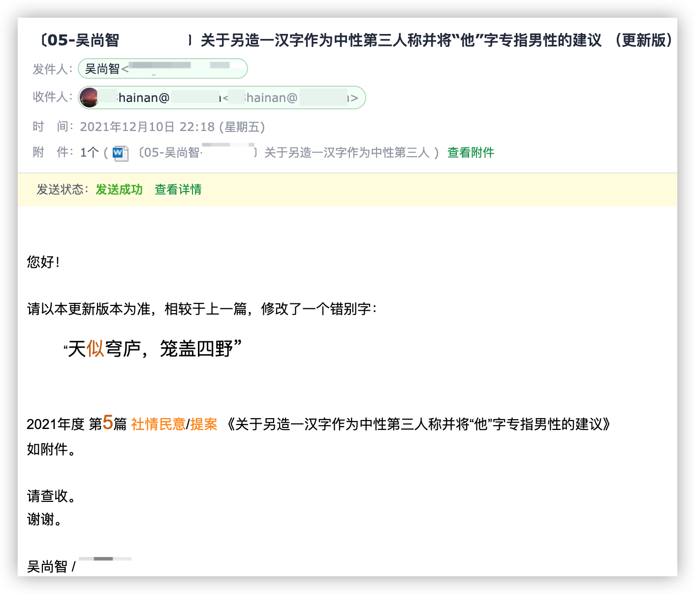
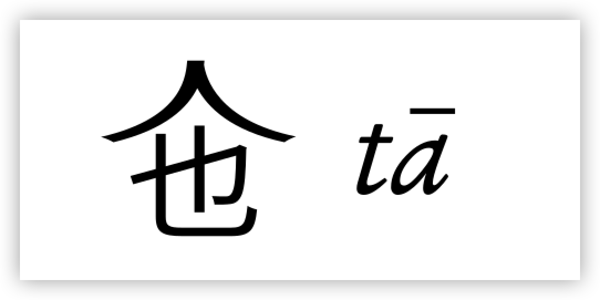
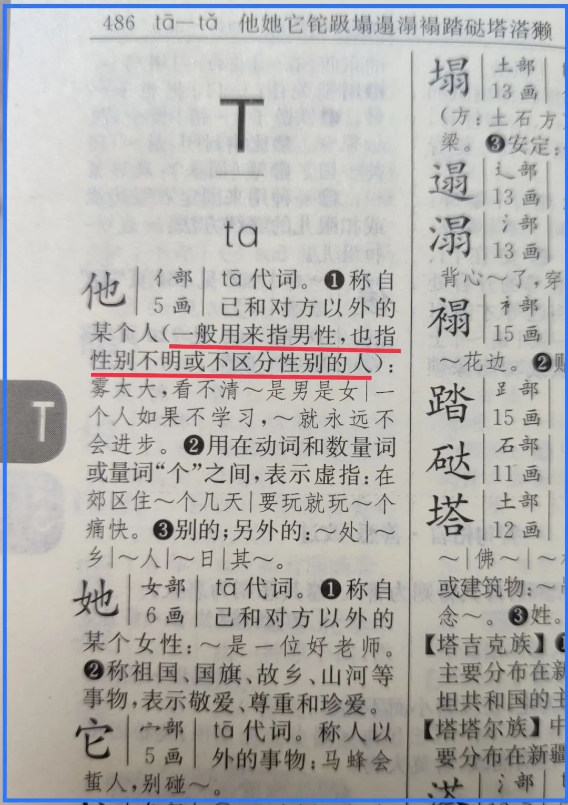
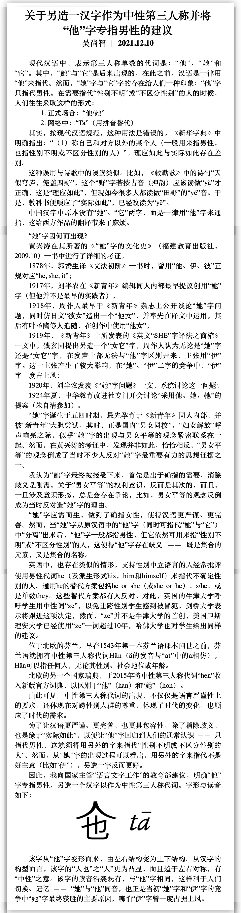

是的，你没有看错。我造了一个字。

—— 是不是**狂妄**得让人不可思议？

估计您这反应和我家人乍听之时差不多：你造了一个字？？？有什么用？别人又不用！

确实如此。

现在是印刷年代，字库（字体）里面没有，别人就是想用也打不出来。不像以前的手写年代，有影响力的人或机构“发明”某个汉字后，一经传播便能为大众接受。

当然，手写年代也需要官方的认证才能“大行其道”。体制不但是凌驾于社会的大框架，也能通过文化渗透于社会的毛细血管之中。

生字的入库，便像一头被屠宰的生猪，只有在那被刨光了毛的肉体上敲上了蓝色印章，才可上市。所以，我造的这个生字缺了一枚印章。我便于去年（2021年12月10日）以社情民意的方式，通过有关渠道向**国家主管“语言文字工作”** 的**教育部**提交。

这个字是中性的，用来指代不分性别的第三人称。长这个样子：

之所以萌生出这念头，是因为我看见一些朋友（甚至有些是老师），他们为了表示“不论男女身份”时，采用诸如此类的表示方法：“他/她（们）”、“Ta（们）”……

若按照汉语的既有规定，单人旁的“他”本身就包含通指。【新华字典】是这么解释的：

所以，“他/她（们）”、“Ta（们）”这样的表达形式是不必要的。

为什么还是有人如这般“画蛇添足”呢？一是表达者担心有**歧义**，二是有**确指**的需要。

的确如此。由于“她”字被用来特指女性，那么，“他”字便被人们理解成男性的特指，这是自然而然的事。这造成了一个实际结果：有相当数量的一部分人不知道“他”可以通指。即使知道了还是担心，因为在没有语境（上下文）时，依旧难以区分确切所指。

因此，**这是汉语的缺陷**。在需要精确指代的时候，我们少了一个字，于是，我便造了一个。

我自然不是凭空捏造。

我首先想到的是，这个“她”字定是后来才出现的，于是，我就查证“她”字的来源，哪知一下子就找到了**黄兴涛**所著的《“她”字的文化史》（福建教育出版社，2009.10）。一读之下，豁然开朗，就写了这么一篇社情民意。

如同我大多数的社情民意，提交之日，便是石沉之时。已经大半年过去了，它是不是早已在辗转途中淹没于众多的文件之中？我不得而知。

今天以这种方式公之于世，有两点原因：

一是想在此做个记录，表示这个上下结构的“人也”曾经出现过。也许是我狂妄，也许汉语的确需要这么一个字，恐怕多年以后才见分晓。

另一个原因是因这两天接触到的一些人和事。我本以为14日删掉的那篇文章，早已经成了国内互联网的灰烬，哪知尘埃仍未落定。不由得有所感叹：我曾落花有意，试图为中国之教育增一字，而那教育，却似无情流水，已经沦为体制的工具。

唯有但愿 —— 但愿我多年以后，依然有为这世界增造一个字的勇气与豪气。

