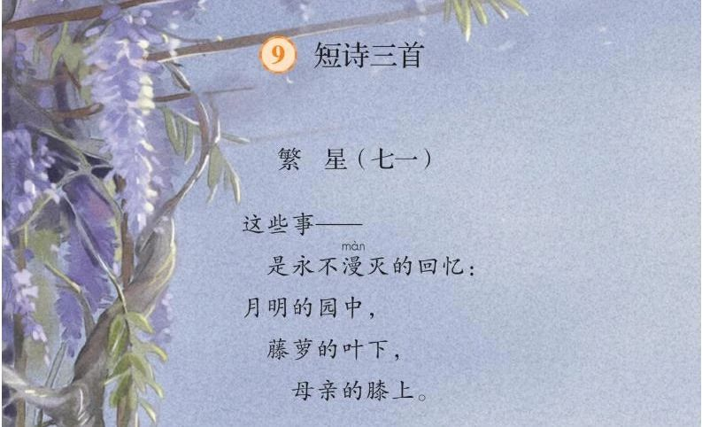
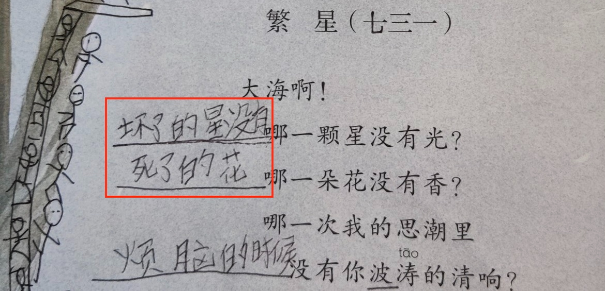
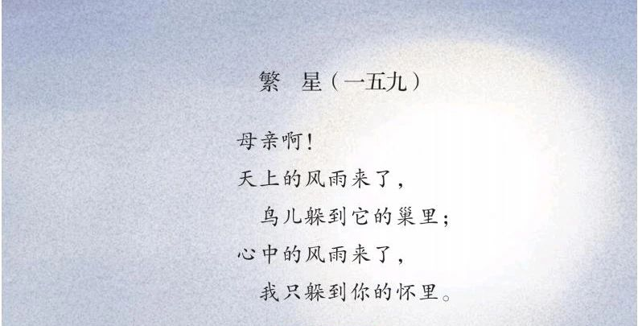

### 儿子的两个问题

几天前吃饭的时候，我又被儿子考了：“爸爸，我考考你：什么样的花不香？”

我们经常在餐桌上闲聊，有时会讨论问题。对于这样的问题，我都是将球回踢给他：“你觉得呢？”他的这个问题像脑筋急转弯，我知道他已经有了答案。

“死了的花不香。”他的脸上笑容绽放，有些得意。

“你摘过花朵的呀 —— 那些刚摘下来的花朵不是很香吗？但那花已经摘下来，不是已经「死了」吗？”

儿子一时语塞，随即进行了修正：“嗯……那是枯萎了的花不香。”

我马上伸出大拇指给他点赞。我们的点赞程序是，一方伸出大拇指，另一方也心领神会地伸出，然后，发起者的拇指肚在另一方的拇指肚上按一下，盖章确认。这点赞方式是我根据人们相互碰拳和击掌改进的，点赞通常由我发起，他也会偶尔为之，让我再接再厉。

儿子没有因为我的肯定而忘乎所以，继续追问：“你觉得什么样的花不香？”

“塑料花不香。”

儿子一怔，觉得很有道理。

我给出的是标准的脑筋急转弯式的答案，立马将他唬住了。与此同时，我也将他带入了一个哲学陷阱：塑料花还是「花」吗？

这和公孙龙的“白马非马”的诡辩不同，白马除了颜色之外，马的其他属性全部具备，但塑料花则不同。塑料花是「假」花，只有形状和颜色具备花的特征。

—— 那什么才是花的特征？有香味？

倘若如此简单，那我们就可以给塑料花喷上香水，这也是儿子可以反驳“塑料花不香”的漏洞所在……所以，这个话题有很大的讨论空间 —— 花之所以为花，有哪些本质特征？

与此类比，还可以讨论“人何以为人”：塑料花对应于人的塑像；更进一步，还可以讨论机器人与人的区别，特别是在人工智能突飞猛进的今天。

但儿子的下一个问题冒了出来：“那什么样的星星不发光？”

我决定跟着他的思路走，就继续反问：“你觉得呢？”

“坏了的星星。”

我一下子没能get到什么样的星星算“坏了”，就追问了一句。

“不发光的星星呀，就像灯坏了一样。”

他的前半句是在循环论证：什么样的星星不发光？坏了的星星；什么是坏了的星星？不发光的星星。

他的后半句却是很好的类比，是对前半句的解释，在一定程度上修正了逻辑谬误 —— 虽然不知道什么原因导致了星星“坏了”，但就像灯坏了一样，它不再发光了。

我表示了理解。也给出了我的答案：月亮附近的星星没有光。

这依然是脑筋急转弯式的，也是有逻辑谬误的。因为“一个东西发不发光”与“其他人能不能看见他的光”是两回事，但显然，儿子还不具备这样的批判性思维，察觉不到已经在陷阱之中。

再者，从自然科学的角度来探讨的话，恒星是自主发光的，比如太阳；行星和卫星都是反射恒星的光，比如金星（又叫启明星）和月亮。所以，原来问题中“不发光”的概念是需要进一步澄清的：是指自主发光，还是反射光也可以算？从儿子前后两个问题所构造的语境来看，自然科学或不在讨论之列，但从批判性思维（思考的完备性）和问题的本身出发，给出这方面的回应也是应当的。

而我的回应虽有逻辑谬误，但却是具备现实意义的，也将是他未来需要面对的问题：你是要成为月亮，还是星星？如果你只能是星星，而又想你的光芒被人看见，你需要怎么做？即便你被月亮的光芒所掩盖，但作为星星，你是否依然要倔强地发光？

……

直到今天早上，我才知道了他这两个问题来自何处。但这又得从昨晚睡前的闲聊讲起。

### 访写诗歌

【我】：我见你们好像在搞诗歌的仿写，怎么没有见你提交呢？（我从班级微信群得知）

由于以前我检查他的作业的**方式不当**，儿子依然拒绝我看他的作业。

【我】：仿写诗歌你不是很擅长吗？要仿写什么呢？

我曾经带他仿写过《静夜思》，他从中体会到了快乐，讨论这个话题他不会抵触。

〔儿子〕：是仿写《繁星》。繁星，七十一……

我一头雾水。儿子就一边背诵诗歌，一边和我逐句逐字解释。当他讲完第一首，准备继续往下背时，被我制止了。

【我】：咱们先只讨论这一首 —— 就这么几句？

〔儿子〕：对。只有这几句。

【我】：那你准备怎样仿写？

〔儿子〕：很多同学写“沙场”，我也想那么写。

我又是一头雾水，不知这“沙场”是什么东西。儿子稍微解释了几句，我还是不明所以，就不再纠结。

【我】：和别人写一样的没意思呀！你得写你自己的，有你的特色。

〔儿子〕：那我写什么好呢？

【我】：咱们先来分析一下这首诗，看看它讲了什么，然后你就有方向了 —— 这首诗讲了什么呢？咱们一句一句来。

〔儿子〕：第一句是讲这些事都是回忆，而且是永远都不会忘记的回忆。

【我】：很好。这是一句抽象的总结，表达的是情感、情绪。那接下来呢？

〔儿子〕：接下来写的是“这些事”，作者举了三个例子：

1. 月明的园中
2. 藤萝的叶下
3. 母亲的膝上

〔儿子〕：这三件事都是他永远不能忘记的。

【我】：很好。这三句写的是具象，三个具体的东西。你读完有什么感觉？

〔儿子〕：……

【我】：你有没有觉得作者构造了一个画面？而这画面是由空间构成的。

【我】：首先是大的空间。那是从天空的月亮开始的，这是大背景；再到园中，那是明月下的园子，由远到近，将视线从天空收缩到了一个园子里面；紧接着，你看见了园中的藤萝，但这还不够具体，进而你看见了藤萝的叶子，空间也进一步收缩到叶子的下面；最后一句“母亲的膝上”就将空间锁定了 —— 那是一块位于“藤萝的叶下”与“母亲的膝上”的空间。（我做了一个手势，两只手一上一下，示意那是夹着二者之间的空间）

【我】：为什么我说这是关于『空间』的诗？从它的表达上看也非常明显。这首诗后三句的**句式**是一模一样的。比如第一句，“月明的园中”，“月明的”是定语，修饰“园中”；而“园”又是修饰“中”的，表明是“园子”的“中间”，在园子的内部。所以，第一句的核心词就是最后的那个“中”字。你说另两句是不是也这样？

〔儿子〕：是的。藤萝的叶下，叶下，下；母亲的膝上，膝上，上。

对于这个发现，儿子似乎有些兴奋。我便趁热打铁。

【我】：我们总结一下这三句，作者是不是只写了三个空间：中，下，上？

〔儿子〕：是的。

【我】：表面上确实只有这三个字，但我认为是有四个，分别是：上，中，下，上。为什么开始多了一个“上”？

〔儿子〕：天上的月亮？

【我】：对的！你要抬头才能看见天上的明月。这是一个没有明确说明，但隐藏在句子中的方位。

【我】：你想象一下那画面：你先是看到了天空的明月，接着，你看见了月亮下的园（院）子，院子里面有一株藤萝，而在藤萝的叶子下面，作者的母亲**坐**在那里 —— 他母亲肯定是“坐”在那里的，因为只有这样才可能是“膝上”，如果她是站着的或者躺着的，我们通常是不会用“膝上”这样的表达的 —— 所以，作者的母亲是坐着的。

〔儿子〕：是的。

【我】：那作者为什么要写这块“叶下”与“膝上”的空间呢？他想表达什么呢？

〔儿子〕：……

【我】：作者回忆起永生难忘的画面，那他在哪里？

〔儿子〕：他在母亲的膝上！

【我】：对的！他就躺在母亲的膝上。也正因为他是躺在母亲的膝上，所以，他一眼就看见了天空的明月，又看见了头顶的藤萝以及叶子！

【我】：刚才，我让你想象的那个画面，是以旁观者的视角来下描绘的，但其实，那是作者躺在母亲膝上，以自己的视角来描写的 —— 为什么要写膝上？因为他就在那里。儿时的他就是在那块空间里感受到母爱的温暖，那块空间就是母亲的怀抱呀！

儿子被我的讲解感染了，也有些兴奋了。

【我】：你看，这几句诗没有一句是写自己的，但又将自己写在了其中，这就是 —— 留白 ——是高妙之处。你需要感受画面，构造空间，既而推理，才能理解到其中的妙处。

我和儿子讲过留白。国画通常采用这种技法，纸上没着笔墨的空白给人以想象空间。儿子喜形于色，显然是感受到了这种美妙，我猜，那是一种猜透了谜题的喜悦。

〔儿子〕：可是，我该怎样仿写呢？

【我】：你想表达什么呢？你看这首诗的思路，它是先表达某种情感或情绪，而且，这种表达是抽象的，总结性的，然后，再用自己的视角来构造空间，解释那情绪的由来，这个解释的过程需要用具象来表达。

儿子又犯难了。

【我】：我觉得你今天就有现成的东西可写 —— 你放学后回来不是很开心吗，你为什么那么开心？

他一下子就想起了放学路上的甜品店。那家店所售卖的甜品是将水果和冰激凌混在一起，他和同学一起去吃的。傍晚一见到我就说那非常美味，还不由自主地边说边咂吧嘴，表示以后还要吃。

【我】：你就写那个空间！

有了目标，也就容易开始了。

〔儿子〕：那就是 —— 无比美味的甜品店？

【我】：句式上满足了要求。但你写得太具体了，“甜品店”是具体的实物，但“回忆”则不是。你得脱离甜品店，往上提升一层，抽象一下。（我做了一个手往上抬的手势）

他依然不得要领，而我也不想他睡得太晚，就给出了例句。

【我】：比如，“那就是 —— 我流连忘返的乐园”。乐园就是对甜品店的抽象层次的表达。现在，你得构造画面，通过具体的东西来解释那里为什么是乐园了。注意，你前两句要写物，而最后一句得写人。

有了具体的参照与要求，儿子一气呵成：

> 那就是 ——
>    我还想再去的地方：
>
> 拉丝的酸奶，
> 脆皮的水果，
> 给我热情打包的店员。

虽然这首短诗缺少了与原诗类似的空间构造，没有“上、中、下、上”之类的表达，但在句式与情绪表达上都能满足要求，已经超出了我的期望。

### 解读另一首诗

今天一起床，我便去翻看儿子的语文课本，迫切地想知道另两首短诗是什么，却发现了他那天的两个问题正是来自第二首，而他的答案早就涂鸦在旁：

当然，也看见了第三首：

于是，在送他去学校的路上，我继续了昨晚的话题，问他打算如何仿写另外两首诗。

〔儿子〕：这三首诗，第一首写童真，第二首写自然，第三首写母爱。我的第二首准备写自然。

【我】：哦？你觉得第二首是写自然的？第一首说是写童真倒是可以，但我觉得也是写母爱呢。那是作者回忆躺在母亲怀抱里的画面，有童年的美好，更有母爱的温暖，不是吗？

儿子表示了同意。

【我】：如果第二首只是从自然的视角来理解，我觉得很是可惜呢。

儿子有些不解，我便让他将第二首背诵了一遍：

> 大海啊！
> 哪一颗星没有光？
> 哪一朵花没有香？
> 哪一次我的思潮里
> 没有你波涛的清响？

【我】：你看啊，这首诗后面的三个问题，都是问大海的，对不对？

【我】：第三个问题与大海是密切相关的，因为我们思绪激烈的时候被称之为思潮，而大海是有海潮的，海潮大的时候波涛汹涌，是有很大声响的，因此，这第三问是非常合理的；第一问里的星星与海也是有关系的，因为大海浩瀚，繁星满天，有很多星星与大海面对面，星星映在大海里；但不知你有没有想过这第二个问题，**这个问题很奇怪啊** —— 这花和大海有什么关系呢？要知道，海上是没有花的，而海边的花也很少见的 —— 那作者为什么要向大海发问：哪一朵花没有香？我觉得他向花园发问还差不多。

儿子被我问住了。显然，他没有想过这个问题。

【我】：如果将这里的“花”理解成浪花，那就更不行了。因为浪花本就不香的。而作者第二句的反问却是想表达“**所有的花都有香**”，所以，这里的“花”是不能理解成“浪花”的。

【我】：所以，如果仅仅从自然层面来理解，这第二句是不和谐的。诗歌虽然形式松散，思维跳跃，但也不能胡乱堆砌，而是有作者想表达的主题。那么，作者想表达什么？

儿子的注意力被这两个问题抓取了。

【我】：你想想，一个人心中有疑问，却不去问人，而是去问大海，这说明了什么？

〔儿子〕：这我见过的，电影、电视剧里面有这样的情节。有不少人干过这种事。

我不禁莞尔。

【我】：你在电视中所听见的大多是画外音吧。通常，人们有疑问是放在心里的，并不会真的去问大海 —— 大海也回答不了啊。但当人们心中有疑问，感到苦闷，而又无处诉说的时候，就会诉诸某个东西，比如大海。

【我】：你可能也曾经历过那种情形，当被其他人彻底否定的时候，比如来自我们大人的强烈批评，让你觉得一无是处，那时，你是不是会伤心？愤懑？与此同时，你是不是也有强烈的抗议与呐喊 —— 难道我真的就那么没用吗？哪一颗星没有光？！哪一朵花没有香？！

【我】：你看，我们现在再来看这首诗，是不是顺畅多了？这首诗就是“天生我材必有用”的呐喊之声啊！

【我】：我们可以想象这样的情境：那诗人苦闷而又无人诉说，这时，他面对波涛汹涌的大海，思绪如潮 —— 他不服！他决不向那些贬低他的人低头，而是发出了强烈的控诉：我一定会有所作为，有所成就的！

—— 因为，**哪朵花儿没有香？哪颗星星没有光？**

*相关阅读*👉🏻：

[让娃站在大师的肩膀上](https://mp.weixin.qq.com/s/DSwcqUBYjumF0dXgKpQ8Hw)
[解读了一首诗](https://mp.weixin.qq.com/s/qP_HkzSBvySsCCtMUIJrRQ)

