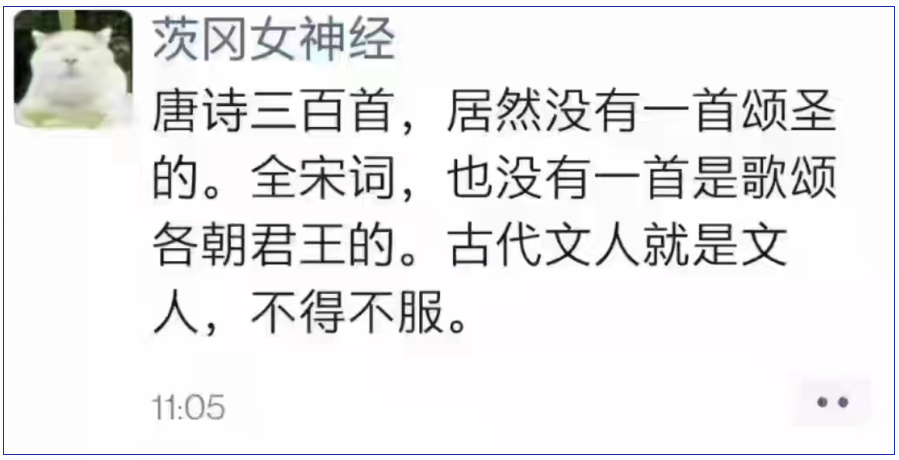
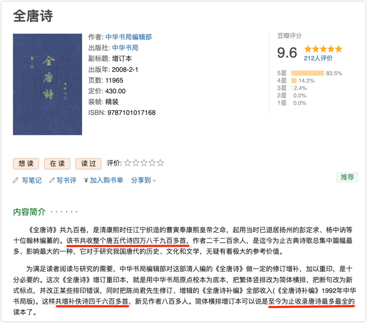
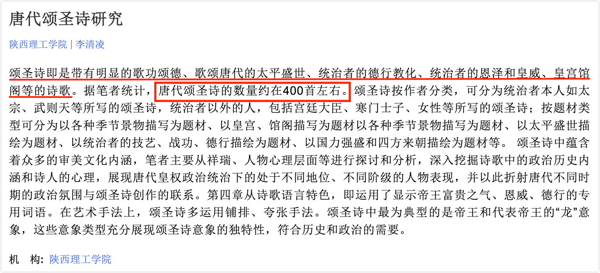
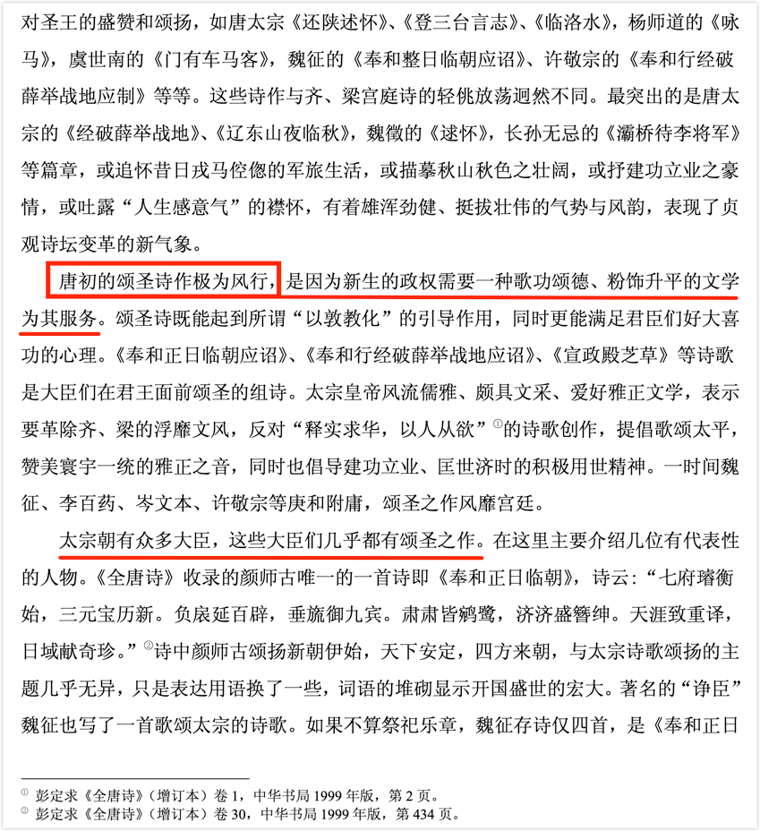
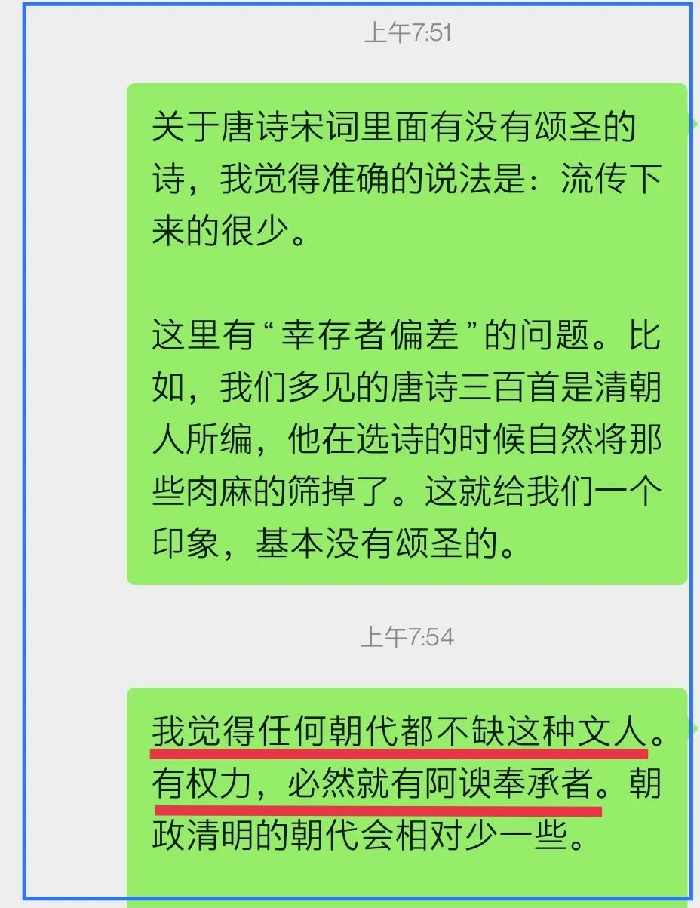

有朋友因一张图片而产生了疑问：唐宋到底有没有颂圣诗？

乍一看，还真是这样，我们读过的那些唐诗宋词几乎都是如此。

就拿唐诗来说（本文主要以唐诗为对象），白居易的《卖炭翁》，杜甫的《石壕吏》，李白的「安能摧眉折腰事权贵，使我不得开心颜！」（《梦游天姥吟留别》）……要么是揭露民间疾苦的，要么是痛斥官吏的，要么是直抒胸臆的，这和颂圣压根儿不沾边。

但我想告诉你，这是假象。

## 幸存者偏差

首先，以《唐诗三百首》来判断存在“幸存者偏差”的谬误。

何谓“幸存者偏误”？以前有文章专门讨论过。这里简述一下：二战时盟军为了减少飞行员的损伤，决定对战机进行加固。显然不能整体都加固，那会增加飞机的重量。好钢用在刀刃上，好甲用在保命处。专家们就对飞机的薄弱环节进行研究，收集了那些作战飞机的弹孔位置数据。有人认为需要对弹孔密集度大的地方进行加固，但另有意见指出，弹孔密集度大的地方恰恰是不需要加固的，而是要重点研究没有弹孔的地方，因为那些地方一旦被击中飞机就会坠毁而不能返航，也就无法看见那些弹孔。显然，后者才是真正的专家，也被证明是对的。因此，“幸存者偏误”有个通俗的叫法：死人不会说话。

我们所常见的《唐诗三百首》是清代乾隆年间的孙洙（**蘅塘退士**）选编的，显然，这三百首是精心挑选的，是经典。那些颂圣拍马屁的诗自然是鲜有选中的。所以，这300是过滤后的数据，不具备样本价值。

## 有价值的样本

有样本价值的是《全唐诗》。《全唐诗》有多少首呢？

> 《全唐诗》，是清康熙四十四年（1705年），康熙皇帝主导下，搜罗唐诗的合集。「得诗**四万八千九百余首**，凡二千二百余人」，共计900卷，目录12卷。
>
> 数据来源：维基百科

然而，康熙年间统计的48900+数据不准。中华书局在其编撰的《全唐诗》中进行了更正：

> 玄烨为《全唐诗》所作序中，谓全书共“得诗四万八千九百余首，凡二千二百余人”，后人多从其说。其实，玄烨所举数并不精确，近年日本学者平冈武夫编《唐代的诗人》、《唐代的诗篇》，将《全唐诗》所收作家、作品逐一编号作了统计，结论是：该书共收诗**四万九千四百零三首**，句一千五百五十五条，作者共二千八百七十三人。这个数字是相当可靠的。
>
> 来源：中华书局《全唐诗》

1. 诗：49403首
2. 句：1555条
3. 作者：2873人

但这“全唐诗”依然不全，中华书局还搞了个《全唐诗外编》：

> 1960年，中华书局据扬州诗局本断句排印，并改正了一些明显的错误。辑补《全唐诗》的著作，**以日本上毛河世宁（即市河宽斋）《全唐诗逸》三卷为最早**，成书时间约相当我国乾隆时期，凡补诗七十二首，句二百七十九条。中华书局本《全唐诗》附于全书之末，今人王重民辑《补全唐诗》、《敦煌唐人诗集残卷》二种，据敦煌遗书补一百七十六首，孙望《全唐诗补逸》二十卷，补诗七百四十首又八十七句，童养年《全唐诗续补遗》二十一卷，补诗一千一百五十八首又二百四十三句。以上四种，由中华书局合编成《全唐诗外编》出版。**另外，近年尚陆续有一些唐诗补遗之作发表。**

2008年，中华书局又出了简体横排版，在简介中，依然引用了康熙年间的数据，又称“共增补佚诗四千六百多首”，“简体横排增订本可以说是至今为止收录唐诗最多最全的读本了”。

初略统计，48900 + 4600 = 53500余首。

虽然这五万三千多首也只能说是“至今为止”最全的，但已经具备样本意义了 —— 哪怕没有后来增补的4600多首，也是大样本数据，同样具备样本意义。而《唐诗三百首》相对于这《全唐诗》，只占了千分之五（300/53500=0.0056），又是经过精心筛选的，自是不能作为有无颂圣的依据来评判古代文人。

## 说有易，说无难

有人可能会说，你这只针对唐诗，可人家还说了“全宋词，也没有一首诗歌颂各朝君王的”，这可是明确针对《全宋词》，不正是你说的有价值的样本吗？

当我们看见了1只白天鹅，便可以说有白天鹅，但是，当我们看见53500只天鹅都是白色的，我们能说这世界没有黑天鹅吗？不能。除非你将这世界上所有的天鹅都看了一遍，才能确认是否有黑天鹅。这便是“说有易，说无难”。

唐诗三百首，大多数人都还能看得过来，但53500首唐诗，是否看得过来？同样，《全宋词》共有词作21116首，又有多少人能看完？

> 《全宋词》，唐圭璋编著，孔凡礼补辑，共收录宋代词人1330家，**词作21116首**。
>
> 数据来源：维基百科

我找到了一篇题为「基于《全宋词》字频统计的宋词用字特点试析」的文章，作者给出了这样的数据：

> 《全唐诗》汉字总数2469471个，字种数（即单字数）7427个。**《全宋词》汉字总数1382445个**，字种数5864个。《全元散曲》汉字总数347322个，字种数4753个。
>
> 来源：https://m.fx361.com/news/2020/0910/9509805.html

一个普通人的阅读速度是多少呢？

在2002 年颁布的「全日制普通高级中学语文教学大纲」规定，中国高中生阅读一般现代文的速度不少于 600 字/分钟。注意，这是一般现代文的阅读速度。

显然，阅读宋词这样的作品，还要理解它，肯定没有那么快，理解所花的时间至少是阅读时间的两三倍，比如这时阅读速度降至 200 字/分钟。普通人没有谁去读《全宋词》（读个《宋词三百首》已经不错了），我们不妨假定读《全宋词》的是诗词爱好者，是有文化底蕴的人，会读得快一些，就按300字/分钟计好了，若他每天读8小时，读完《全宋词》需要10来天的样子（1382445/300/60/8 = 9.6 天）。

—— 不是搞专门研究或真正热爱的，很少有人这么去读了，时间会更长。

这两万多首宋词，真的没有一首颂圣的？我没有去读，但我相信是有的。

我没有找到关于宋词“颂圣”的专门研究，但找到了唐诗的。《唐代颂圣诗研究》是**李清凌**的硕士学位论文：

注：姑且认为作者看完了《全唐诗》，且400首颂圣诗统计准确。（2469471/300/60/8 = 17.15 天，即，一个有文化底蕴的诗词爱好者，每天看8小时，至少要看17天才能看完《全唐诗》。当然，如果只以“找颂圣诗”为目的来读，会快很多）

—— 唐朝如此，凭什么宋朝会是例外？

## 太阳底下没有新鲜事

当我看见那朋友提出的问题时，便说了点个人看法：

其时，我给出了判断：朝政清明的朝代颂圣会少一些。这个判断与那篇硕士学位论文《唐代颂圣诗研究》的观点似乎有冲突，李清凌在论文中是这样说的：

> **唐初的颂圣诗作极为风行**，是因为新生的政权需要一种歌功颂德、粉饰升平的文学 为其服务。颂圣诗既能起到所谓“以敦教化”的引导作用，同时更能满足君臣们好大喜功的心理。

我基本同意作者关于政治意图的分析，这种目的是存在的，但也需要注意，这里还有另一个逻辑，是值得玩味的地方。

唐初，李世民开言纳谏，是政治清明时期。一方面，政治清明，百业在兴，一片欣欣向荣的景象，这着实让一些人会赞美，不乏诚心赞美者；另一方面，正是由于政治清明，不会因言获罪，直言纳谏反而会得到肯定，这便能有效遏制浮夸的阿谀奉承，说真话直话便能得到奖赏，何必曲意逢迎呢？正因为如此，“颂圣诗”即使在颂，也就不会太肉麻，这也使得那些“颂圣诗”得以流传下来，因为它不算太夸张。夸张肉麻的根本就活不到第二集，人们不会传颂的。所以，这也会造成一种假象，唐初颂圣诗盛行。

我认为昏庸时代的颂圣诗更盛行。这几乎都不用论证 ——  当批评的言论不许说时，便只剩下歌颂的，接下来便是内卷，比谁颂得肉麻了，而肉麻跪舔的东西，多数会被众人的唾沫星子所淹没，就不为后人所见，即使有流传后世的，那也是遗臭万年的反面教材，是“精品”，那自然是少之又少的。

最后，再回到开篇的那段文字谈点感想。

作者说“古代文人就是文人，不得不服”，我理解是讽刺“今不如古”，是怒其不争的意思。但我想说的是，这是误会，在人性上，我们与古人并没有太大差异或进步，太阳底下没有新鲜事。我们只有直面人性的真相，才能更好地面对现实，面对自己。

看看那些流传下来的诗词绝唱吧，那些揭露民间疾苦的，那些痛斥官吏的，还有那些直抒的胸臆才是人民的心声。白居易、杜甫、李白，他们便是那亮了千年的明灯，从未熄灭，也永不会熄灭。我们也要像他们一样，做一盏灯或一支烛，即使不能照亮别人与后人，也要照亮自己，不要在这人世间迷了路。

