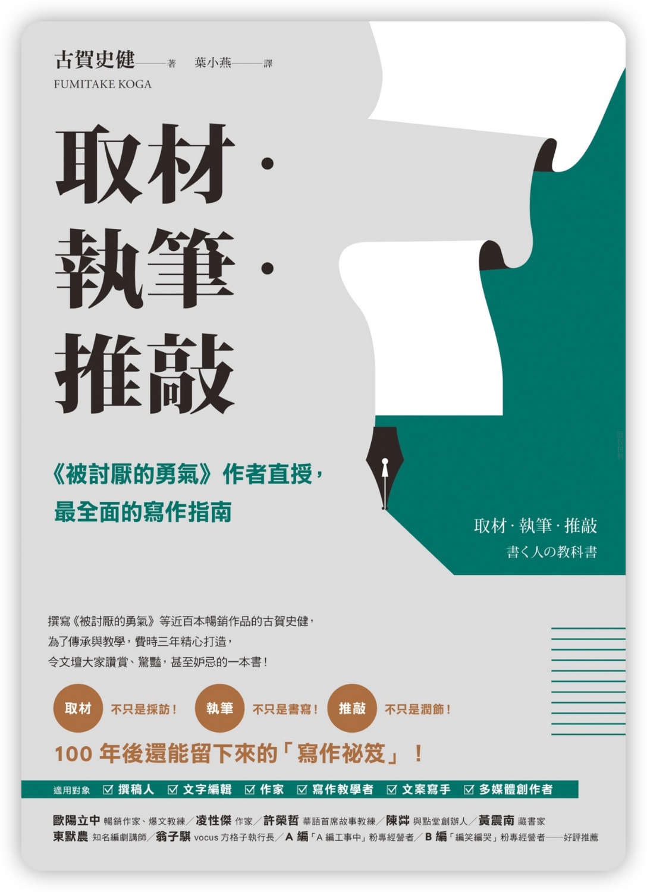

在撸一本新书，估计还没有简体中文版：



在「如访谈般阅读」章节里面，有这么一段：

```
國中時期，我開始用自己的零用錢買唱片──當時還沒有ＣＤ。對於兄姊口中那些對貝斯手或鼓手的評論，我一直都聽不太懂。像是披頭四，就算聽了他們的歌，也只會跟著主唱和旋律跑；吉他的聲音勉強還聽得出來，但要我分辨貝斯還是鼓聲什麼的「美妙」之處，實在難如登天。

以小說或電影來比喻，就是只知道追著主角（主唱）和梗概（旋律）跑，完全看不到其他細節的狀態。

於是有一次我做了個實驗，將同一首曲子連續聽了五遍。

先是以人聲為主，就像平常那樣聽。接著專心去聽吉他的聲音，第三遍只聽貝斯的聲音，第四遍只聽鼓聲。我集中注意力，分別聽那些聲音從喇叭的哪些地方怎樣被彈奏出來。當然，其他樂器的聲音就當成噪音無視。

像這樣，了解各項樂器的聲音後，再全部放在一起聽一次。不論是人聲、吉他、貝斯或鼓聲，都敞開耳朵去聽。

以這種主動分析的方式連續聽了幾次後，即使是頭一次聽到的曲子，鼓聲和貝斯的聲音也能和歌聲一樣，同時進入耳裡，聽見的當下就發現到「這個樂團的鼓手很棒」「低音實在太酷了！」等等。

不論小說、電影、漫畫或運動，應該都可以套用這種方法。
```

这段对我很有启发，特地与诸位分享。不妨称之为“多角色体验阅读方法”吧。

我们常说“温故而知新”，看之前看过的电影、书籍，为什么往往能有新收获呢？

一方面，是缘于自身的阅历见长，以往被自动忽略的东西突然抓取了注意力，抑或是过去难以理解的东西突然懂了；另一方面，是我们会注意到其他的角度，以其他角色来重新看待“故”事，于是，我们对同样的事有了不一样的体验，这种不一样也“新”的。

那有没有方法，在第一次阅读时就能尽量多地获取这种体验呢？毕竟，不停地温故，还是很花费时间的。

**古贺史健**在这里便提供了一种方法。在一开始，你需要**刻意训练**。就像他听音乐那样，每次只听一种乐器的声音，去用心感受，当你逐一听完，你自然不会忽略每一种乐器音，到最后，你合而为一，定然是“声声入耳”。

显然，看电影、看小说都可如是。对于那些配角，他们在故事中做了什么，有什么台词与心理活动，我们在第一次阅读时，往往是不大注意的，因为主角的光环太耀眼了。他们会自动遮蔽一些东西，我们会有很多盲区。

一开始，我们将注意力只放在某一个角色身上，快速浏览那些电影、书籍，看看他们说了什么、做了什么，（书中）角色有什么心理活动……最后，整体再看一遍，届时，我们的体验肯定是多方位、立体而丰富的。

通过这种训练，我们再来看社会热点事件，那会是什么样子？


