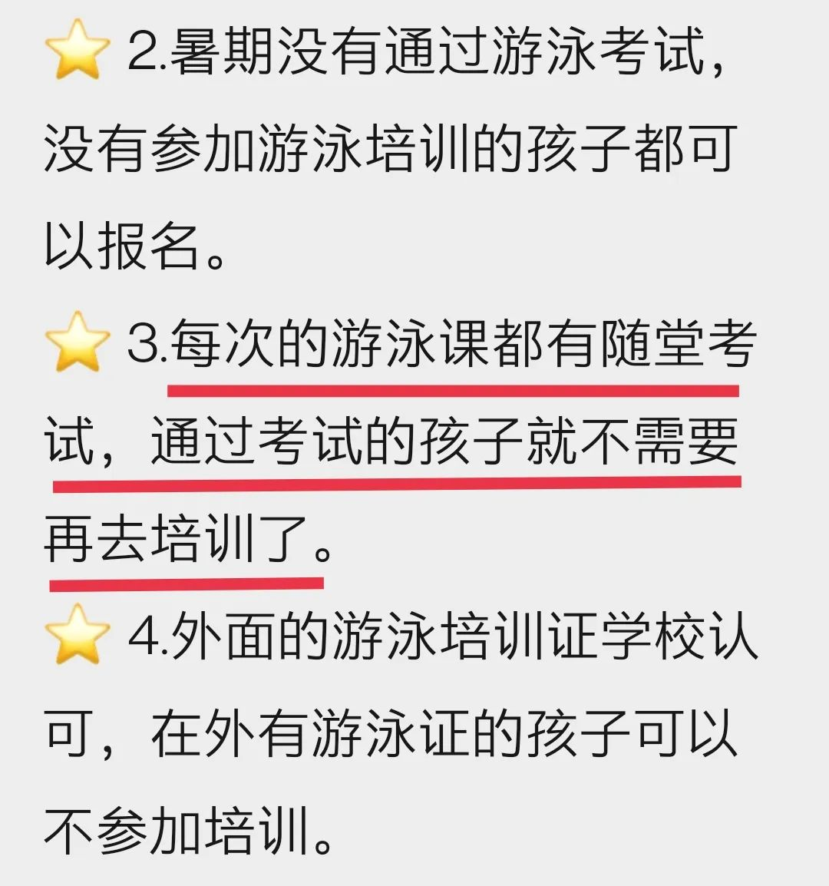

有朋友问，怎么很久不写了？

答：我已经到了无话可说的程度。

上周六上午的遇见，让我动了写点什么的念头，踌躇几日，终还是想记录一下。

29日上午，我带着儿子去上游泳课，因为早上的一些事，有所耽误，出门时急乎乎的，而那游泳馆在20公里之外。您可能很奇怪，这都入冬了，还去那么远的地方上啥劳什子的游泳课？这事我和您一样，也很纳闷。

游泳课是现在义务教育阶段的必修课。儿子的游泳课本安排在暑期，我们也按照要求报名了，而且报的是第一期，以便孩子后面有一个较长时间的假期，不至于被游泳课弄得支离破碎。哪知这课都没来得及上，海口的疫情又起，于是上课就延缓了。这也将我们后续的安排打乱。当那次疫情消停，游泳课重启时，我们的出行安排与游泳课出现了冲突。我就与班主任老师商量，看能否调整到第三期，并询问可否直接参加考试。儿子早就学会了蛙泳，通过考试完全没有问题。班主任老师非常给力，帮我们与负责游泳课的老师沟通，得到的答复是：调班没有问题，**但游泳课必须上**，不能只参加考试。

这让我有些意外。

游泳课不就是让孩子学会游泳么，而我有把握儿子达标，为何不能直接参加考试呢？再说，不是所有的孩子都已经学会，而集体课上老师的精力有限，他们本可以将时间资源更多地分配给那些初学者。所以，实在没有必要强制已经学会的孩子一起上课。但转念一想，反正是与同学一起玩，所指定的游泳馆也在家附近，就接送麻烦点，那就按照学校的要求来呗。

所以，我们就按照调整后的日期回到海口，还提前了几天到的。哪知，又赶上了海口在暑期的第二次疫情，还一天不落。那游泳课自然又黄了。国庆前夕，学校再次重启游泳课，利用国庆假期和后续的双休日，但上课地点却在20公里左右的某校游泳馆，理由是那里有“恒温泳池”。学校应该是注意到了路途遥远，非常贴心地进行了变通：

然而，看到第二条我就有些来气了 —— 不是每堂课都必须上吗？不是不能直接参加考试吗？怎么现在就可以了呢！

肯定会有人用疫情说事，说是根据实际情况的调整……但是，拜托，疫情都三年了好吧！但凡有一点点前瞻性都不会以此为由，更何况暑期一开始就因疫情而推迟过一次 —— 如果早让那些已经会游泳的孩子直接考试，需要参加游泳课的孩子是不是少了一批？我们更不用舍近求远了！

看见一些家长报名，忙不迭地自组织拼车接送孩子，我只能是一声叹息，默默地观望 —— 我可不想奉陪了，爱咋咋地。所以，我们一直没有给孩子报名。直到上上周，班主任统计没有报名的学生，我如实接龙登记。再后来，班主任说要家长写个书面材料，说明没有报名的原因。收到通知时，我在外面，纸笔不方便，于是说晚上回去再写。这一拖我晚上就泄气了，我和班主任说，我们还是报个名跑一趟去考个试算了，写了真话学校又该不高兴了。

于是，上周六我便不得不去了那游泳馆。正是在那里，我遇见了那个女孩，还有她的母亲。

我们是第一次去那里，急乎乎地出门是想早点到，11点的课，我们到达时10:53。家长等候厅有点嘈杂，上一堂课的孩子陆续出来，儿子碰见了三个同学，我也和那些家长朋友了解了一些情况。

那个女孩应该是儿子同年级的，她穿着泳衣，大概是刚下课，泳衣还滴着水，在泳池通道口听她妈妈说话，她妈妈的声音有点大。随着第二堂课的开始，等候厅的嘈杂声便消停了，那妈妈的声音便显得大了。

“你一定要坚持……你可以的……妈妈相信你……”，诸如此类。我突然发现，挂在那女孩脸上的，不是泳帽上流下来的水，而是泪水。我不由得更关注她们的对话。她们是想今天通过考试，但依然没有达标，可能有不想再学的念头，于是妈妈就给她鼓劲打气，然而，从她的话语中，我只听见打鸡血之类的“正能量”，没有涉及方法之类的话语，不由得暗暗叹息。

那是一个有些干瘦的女孩，中上等的身高。由于瘦削，她的脸面不像同龄人那样肉乎乎的，给人一种营养不良的感观。不知是否因为脸上挂着泪，我觉得她少了一些十来岁女孩子应有的生气，神采不好，并没有给人一种我见犹怜的感觉。应该是我听不惯“正能量”的鸡血与鸡汤，觉得她很可怜，便萌生出要帮帮她的冲动。

等那女孩平复后，那妈妈便要求她再去泳池里练练，这次下定决心，一定要游完25米，力争周日过来考试通过。她们得到了老师的同意，在一个空出来的泳道上游了起来。我也正想看看儿子的情况，便也进去了，结果因为穿着鞋子，被老师数落，瞅了两眼便赶紧退出来了。

那女孩划手和蹬腿的动作还行，问题出在衔接上，她蹬两次腿，再划一次手。蹬两次腿自然是个大问题，但既然是想明天通过考试，短时间改过来不现实，问题出在蹬完腿后，她没有让身体向前漂浮，而是马上进入划手环节，这就使得蹬腿的动能没有释放，便立即进入了划手阶段，而人在向前伸手时会有水的阻力，蹬腿的力量被抵消了一部分，就没有前进的速度（这也是促使她蹬两次腿的原因），特别是，**由于她划手太早，身体并没有上浮到接近水面的位置**，这就使得她的划手更加吃力，换气困难。最终，我在等候厅的电视监视器上看见，她的这次尝试依然以失败而告终，她游了20米的样子，那池边的终线近在咫尺。

她妈妈鼓励她的声音从通道口传出来，大意是：你很棒，这次比上次更远，明天一定可以的……等她们出来时，她妈妈没有数落她，而是鼓励，女孩子的心情似乎好多了。我也替她高兴，心想，也许我不应该多事。

不过，在她的问题没有解决之前，我很怀疑她明天能够通过。这不是能否坚持的缘故，因为，那20米就是她当下坚持之后的极限。

在大学时，我学了很久的游泳都没有学会，我甚至以为，这辈子大概是学不会了，那离对岸的咫尺之间，便是我的天涯难及。直到三年前我下定决心要学会时，等到我领悟那一刹那，我才明白那天涯就在咫尺，突破就在一瞬之间，而关键之处就在于，**你是否明白问题所在**，更尤为重要的是，**你是否掌握了解决之道**。

对于技巧性的运动或技能，在你没有掌握方法之前，所有的练习只是不得法的苦练与蛮干，它们**收效甚微**，或**根本就没有什么效用**，甚至会适得其反，**打击你的自信心**。

我母亲快70岁了，三年前她和我一起学的游泳。我是自学，那时刚刚突破，没有把握把她教会，正好小区有阿姨也想学游泳，就给她一起报了游泳班，教练说包教会。结果学了个半会不会，教练说她毕业了，能游25米了，哪知第二天再去游，游不了几米不说，老人家都差点呛水了。曾经和那教练聊过，问他我母亲的问题在哪里，哪知他说要多练，熟能生巧。我很想啐他一口，如果一句“熟能生巧”就解决了，那还要教练干嘛？我知道碰上了劣质教练，最终就要来了一周的游泳票，自己来教。很幸运的是，小区里几位邻居给予了母亲很大的帮助，带着她游，帮她克服了问题。

对于一个怕水的孩子，你拼命让他勇敢是没有用的。好的教练不但能发现问题，还能迂回，从B面入手，解决他A处的问题。

那女孩的妈妈陪着女孩进了更衣室，但她们比其他人耗费了更长的时间。等她俩出来时，母女的神情与进去之前已经有了云泥之别。那妈妈黑着脸，很不高兴，而那女孩泪流满面。她俩一前一后，在众人面前走过。

我没有迟疑，站起身来，跟着她们出了大厅。

到了外面，我叫住了那妈妈：“这位家长，我能和你的孩子说几句话吗？我刚才看了她的游泳，她有两个问题需要解决。”

她妈妈同意后，我便和女孩说：“小妹妹，你的划手与蹬腿都还不错，但存在两个问题，叔叔有办法解决，只要解决了这两个问题，你明天的考试一定能通过的。”

小女孩停止了抽噎，很用心地听我讲。于是，我将我看见的问题说了一遍，然后说解决方案：“当你蹬完腿以后，你一定要在心里默数2个数，然后再开始划手，你划手的衔接动作太快了。”并且，我用一秒读一个数的节奏数着“1、“2”来给她示范，并且说：“由于你现在蹬两次腿，改成蹬一下可能有点难，特别是你想明天通过考试，这个你可以先不改，但由于你蹬两次，你心中默数的时间就要更长，比如数三个数。”

她妈妈误会了我的意思，在旁边说：“叔叔的意思是说，让你心中默默数数1、2、3，就好鼓足了劲地划下一次……”

我连忙纠正。就跟女孩解释我的意思：“蹲完腿之后，水会将你往前推，让你前进，同时，水还会将你往上浮，但你得等待。我让你在心中数数，就是让你等待几秒钟，你会感觉身体上浮，等到头接近水面的时候再划手换气，这样你划手就会更轻松，人也能往前游得动了。”

女孩听得很用心，不停地点头。我觉得她是听进去了。

她妈妈随后和我解释，之所以数落女儿，是因为见孩子遇到困难就想放弃，以后的人生怎么办？总不能遇到困难就放弃吧，所以想让她坚持，树立克服困难的决心与勇气。

对此，我是不以为然的。因为游泳和很多事情不同，一旦你换不到气，你的身体肯定不允许你憋死，定然会迫使你站起来换气，所以，**这与放弃无关，而是人类保护生命的本能在起作用**，硬是蛮干的话，反而容易呛水出事。我否定了她关于孩子想放弃的判断，也解释了几句，可能是我否定她太直接，女孩的妈妈无心交流，也就草草收尾。临走前，我再次叮嘱了女孩一定要记得我的话，数上两秒钟之后再划手。为了增强她们对我的信心，我还特地说一句：“我儿子便是我教会的，所以，你的问题我看一眼便知道。”

这件事让我深深体会到，在家庭层面，倘若家长只知道喂鸡汤、打鸡血和鼓励“正能量”，而不能帮助孩子解决问题，拿不出具体的指导与方法，那么，孩子的成长过程会很辛苦。

在社会层面，何尝不是如是呢？仅仅人定胜天是没有意义的。若不讲科学与方法，一味蛮干，那只能是愚公移山，祸及子孙。

就拿一个小小的游泳课安排来说，因为方法不当，家长们便要长距离奔波，牺牲大把的时间。

**任何错误都是有后果的**。只不过，这次后果被家长承包了。仅仅是家长牺牲节假日的时间，耗费了汽油吗？不是的，这种后果还会转嫁给孩子，让孩子哭泣。

为什么那位妈妈急于让孩子通过考试？因为20公里的路程，会大幅增加接送孩子的成本，这种压力会在无形中传导给孩子，使得他们没有在家门口练习得那么从容。

儿子终如所愿，在当次课的测试中一次通过，达标。

我们是不用再去那么远上游泳课了，而同班还有几个孩子依然在练习，由于动作不熟练，他们连测试都没能参加。估计那几位家长还要辛苦跑几次了。还有一个男孩子，他上的是第一节，我们到后，他就不停地给他妈妈打电话，约一个小时之后，他妈妈才来接他。估计那男孩也是遇到困难，不想学了，他妈妈倒是没有逼他，而教练在旁边说，你不通过就没有证书了，那孩子就犹豫起来……

我不由得想起那个女孩子，不知她周日的考试达标了么？

倘若我没能帮到她，也希望她感受到了一个陌生人的善意。或许，这才是此行的最大意义，因为，儿子通过测试，本是意料之中的。

