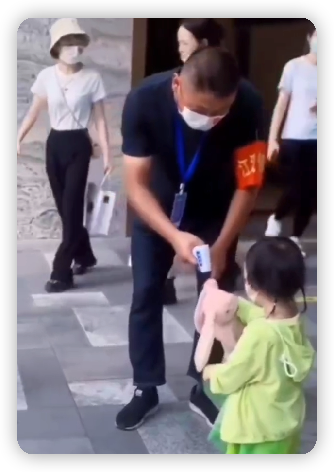
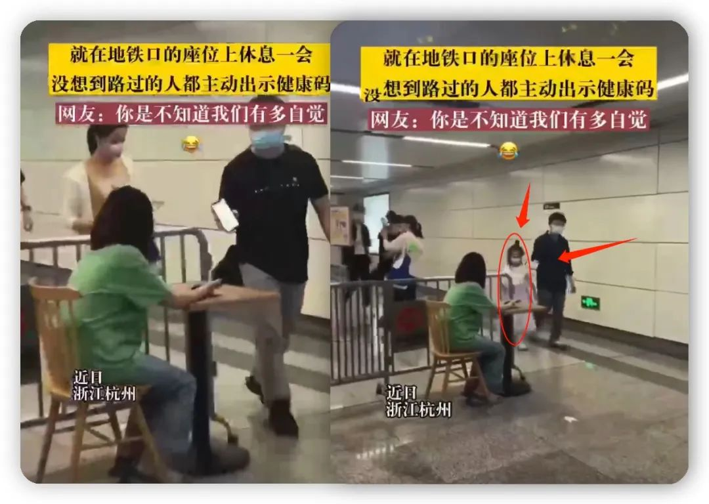

有朋友转发了一个视频：一个小女孩凑到拿着手温枪的物业工作人员面前，主动让他给自己测手温。工作人员很好，不但给她一一测过，连小女孩举起来的毛绒兔也给测了。

估计会有不少人认为场面很温馨，大叔很nice，小女孩很可爱。是的，这些我都承认。但我看着很不好受。她的童年里面本该没有这些。

我还看过一些视频，孩子玩过家家，让家长和玩具一起排队，到他那里做核酸检测。那队伍老长了，转着圈地从客厅排到了家门口。视频拍得挺欢乐的，然而，与小女孩测手温的视频一样，不能细思。

估计很多人都不曾料到，他们将幼小的生命带到这人间，却给了孩子一个如此的世界。

与此相应的，还有一个视频：

人们已经不再在乎那个坐在那里的人是谁了，都迫不及待地“自证清白”。

这个视频中，最让我扎心的还是这一幕：大人主动出示手机，**在小女孩的面前伸过**，给坐在那里的人看。正是这身体力行的身教，大人已经将一颗种子埋进了孩子的心里。

我不得不承认，这国的防疫真的很成功。

有朋友说这是“巴普洛夫的狗，最生动的例子”，我赞同。但是，这不仅仅是条件反射，更是驯服的例子。

不论什么样的人坐在那把椅子上，他就是权力的象征，我们就要向他自证清白。

那个抱着毛绒兔，主动凑到工作人员面前的小女孩，她不但要自证清白，还要为她的兔宝宝证明。

