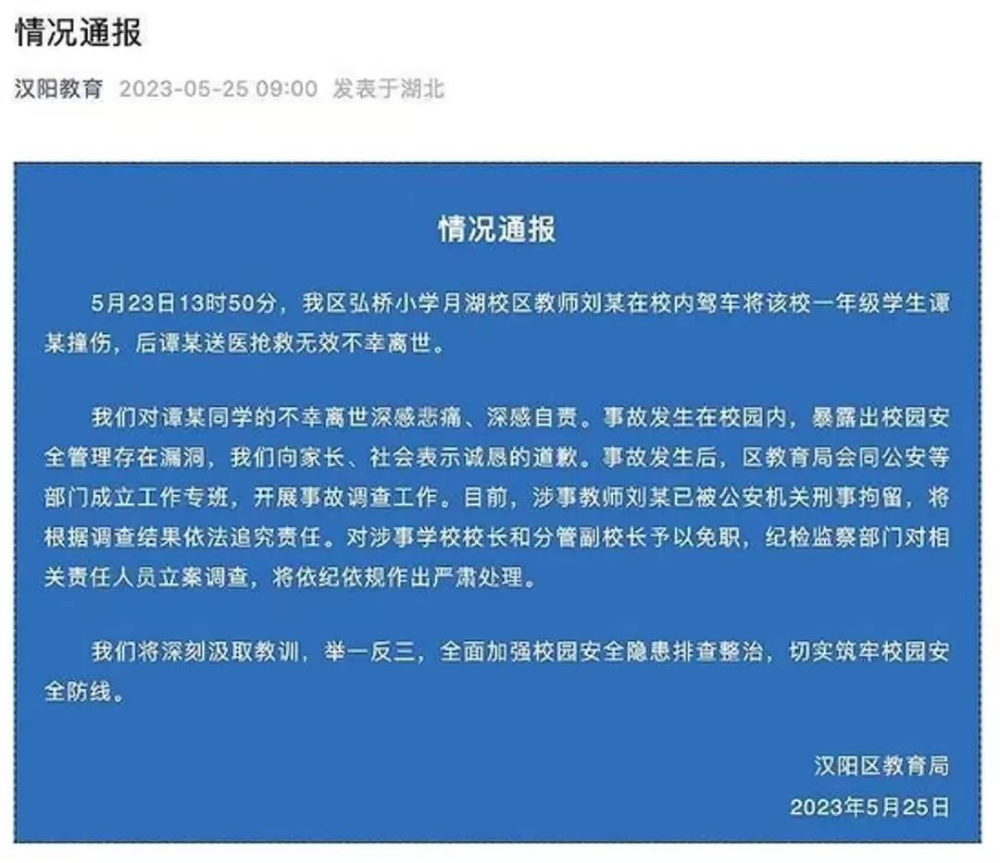
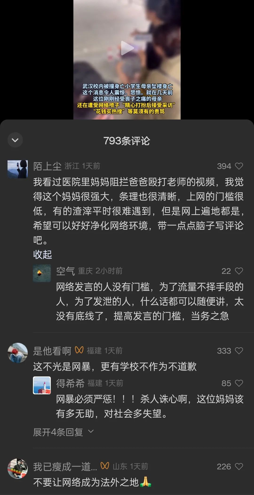

武汉的一个孩子在学校被老师的车撞身亡，后来，那孩子的母亲跳楼身亡。据说，那妈妈自杀是因为网暴。

在新京报的这则视频下，也有这样的留言：

那孩子的妈妈是否死于网暴，网暴是否是主因，我是存疑的。

首先，我认为孩子的死对她的刺激很大。我见过她之前的视频，她机械地向旁人挨个重复“从孩子的头上轧过去”，那是极度无助时的下意识的求助式诉说。这妈妈所受的刺激太大。或许那时已经有心理创伤了。

其次，我还看到几篇讲校方处理这件事的文章，由于不是官方报道，我也没能查证，就不在这里说了。

再者，从新京报所给出的那些截图来看，那些对不怀好意的评论的点赞总数有百来个，与通常的成千上万的那种网暴情形差得太远。我觉得这种级量的流言未必能进入了那妈妈的视野。为之哀痛的人占绝大多数。

总之，我觉得网暴很可能不是她跳楼的原因，至少，可能不是主因。

我肯定不是要为网暴者洗地，这篇文章谈的依然是网暴。

首先，我们要有心理准备，我们每一个人都可能成为网暴的受害者。那么，对于我们想保护的孩子也存在这种可能，**我们能做的是降低概率**。

即便是在文明程度高的地方，依然会有这种坏人，但比率会低，而在文明程度很低的地方，那些怀有恶意的人所占的比率就会大很多。

“沉默的螺旋法则”在这种情形也是适用的：怀有恶意的人越少，他们的言论就越会被压制，从而使得那些怀有恶意的人越不敢发声；相反，当恶意的人很多，他们因网络的聚集而爆棚，会觉得自己是正义的一方，这种浩大的声势也会使得原本处于中间的无脑人加入他们，此时，那螺旋就会越旋越大，而代表文明的声音就会逐渐势弱，走向沉默。

所以，这也是我们一定要发声，谴责网暴的原因，不能让怀有恶意的人得势。

你会发现，网暴者是发声，而谴责网暴者也是发声，其本质是两种声音的博弈，而双方都认为自己代表了正义。这就带来了一个问题 —— 到底谁才是正义的呢？

很多事情并不像对武汉那妈妈的恶意评论、俄罗斯侵略乌克兰那样，谁该被谴责、谁代表了正义一目了然 —— 好吧，俄乌双方谁该被谴责在中国也是个难题。

为了避免本来是谴责网暴的人，反而遭受了网暴，我们须得具备鉴别的能力，而不是谁声势大就加入谁。只有当我们的下一代具备了这种能力，中国才能走向文明，越来越文明。否则，我们的下一代、下下一代依然在为俄乌战争谁该被谴责而争吵撕裂。

首先，我们需要培养孩子确立边界的能力，要能够区分【私人领域】和【公共领域】。在教育的过程中，我们需要**帮助孩子建立边界感**。

简而言之，**对个体，少评头论足；对公共事务，要勇于发声**。

比如，他人如何穿着打扮，这是别人的私域的事。不论是她烫了个头，还是穿了个低胸装，这都并不关你的事，既然没有妨碍你，那么，你再不喜欢也得把嘴闭上，因为这是他人的私事。但对于公共事务，特别是公权力的作为，再小的事都应该发声，因为这属于公共领域的，直接关系到我们每一个人。

这种边界感的建立也很容易理解：公权力来自我们的授权，我们本就有监督的权利，而公权力的不恰当作为会直接侵害我们每一个体；而作为私域的个体，只要他没有对别人进行了侵犯，又或者妨碍他人，那他做什么就是个体的自由，他人或者公权力就无权干涉。

有时候，私域会向公域转化，个体的事会变成公共的事。

比如，武汉那位妈妈的穿着打扮，这本是私域的事，别人无权干涉。现在有个三季人，他无法理解四季的事，站出来对那妈妈评头论足，这时候，因为三季人干涉了他人，这就成了公域的事。

因为此时事关两个社会人，除非另有公众认可的其他规定仍然确定是他俩的事，是私域的事，否则，这就成为了公共领域的事。道理也很简单，当 A 对 B 横加干涉，那么作为 C 也就存在被 A 干涉的可能，C 就可以在未被侵犯之前而站出来声援 B。从另一面更好理解，A、B、C 作为平等且独立的个体，本不应该互相干涉，既然你 A 要干涉 B，那作为 C 自然也可以干涉 A。

所以，我们从小就要教育孩子，**对于私域的事不要干涉，哪怕是评头论足都要避免，那是个体的自由；而对公共事务，要勇于发声，这本应是社会监督的一部分，孩子应该有所担当。**

其实，**确立边界感的底层逻辑是法治精神**：对于个体，**法无禁止即可为**；对于公权力，法无授权即禁止。这里不再展开讨论。

你也许会发现，那些网暴者，他们喜欢对他人评头论足，恣意地侵犯个体，但他们却极少对公权力的胡作非为发声。在本质上，**他们与农村的泼妇并无区别**，只是将骂街的行为搬到了互联网上，但在骨子里，**是个欺软怕硬的怂蛋**。我们定然不期望 ​ 孩子成为这样的货色。

综上所述，只有当我们的孩子有了边界意识，会区分私域和公域，他才能知道哪些事情不该参与，而哪些事情应该参与。社会才会走向文明，而他们，也 ​ 能避免成为熊孩子，避免成为互联网上的泼妇。

最后，我还想提醒一下，如果那妈妈跳楼的主因不是网暴，我们此时却将注意力转向了网暴，那么，真正的原因就会得不到关注 —— 倘若那妈妈也不是因为伤心过度而自杀，我想她会难以瞑目吧。

当然，这也只是我个人的猜测与提醒，读者朋友们定然要以官方的通报为准。

