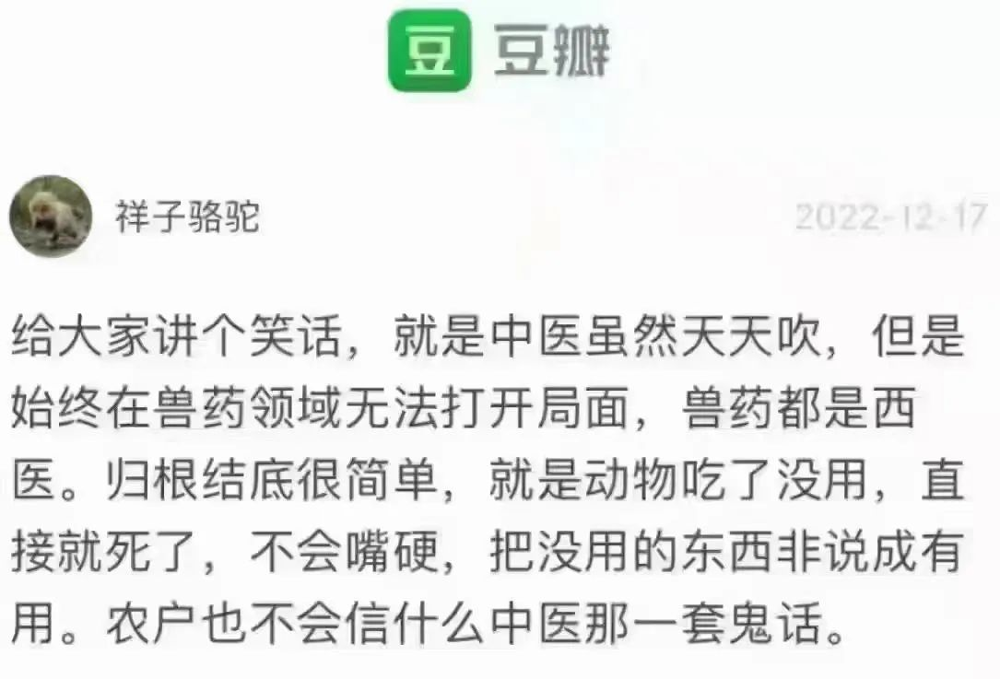

在中文互联网上，能引起网友吵架的话题，如果说“中医”只能排第二，那排第一的恐怕是“爱国”了。疫情之前的几年，由于“传统武术”被打假，已经难以插队加塞了。

中医好不好，有没有用，一直是很多人心中的一个结。在一些国人心中，这是一个不容挑战的话题。倘若有人胆敢冒犯，那便如挖了他们的祖坟一般，定是不能容忍的。因此，我将原拟标题中的“还”字去掉了，以减轻刺激程度。

—— 我想谈谈中医所揭示的最闪光的一点，应该没问题吧。

前段时间和人讨论中医话题，那自然是说不到一块儿去，最后，她善意地提醒我，对于不懂的东西要有敬畏之心。

我遂问她，可曾了解“双盲实验”？她说她“属于西医盲，目前也不想了解更多”。

话到这里，对方的逻辑差不多就清楚了：我的东西你不了解，所以，你要有敬畏之心，但是，我不想了解你的东西。

于是，我说了这么一句：“自从我了解了「双盲实验」，从此就不大信中医，也就失去了敬畏”。也就言尽于此。

我想说的是，不是我不懂敬畏，恰恰是我懂了双盲实验，因此就有了底气去怀疑中医。

很多东西都是这样：在一开始，我们会因为无知而有了敬畏之心，但一旦生出了怀疑之心，那令人敬畏的光芒自然会消退。**这怀疑之心就像一个完美的花瓶所出现的裂痕，它会让花瓶瞬间掉价**。

当我提及双盲实验可以克服这“敬畏之心”，对方却没有兴趣了解一下，由此可知，她并不想打破她的敬畏 —— 很可能是太“敬”了，而“畏”于失去了那颗心。我理解这是一种自我封闭，毕竟，谁都不想自己供在龛格的花瓶出现裂痕。而最简单的“自我保护”的方式便是将花瓶置之高阁，**只要不去查看，那花瓶便永远是完美的**。

与“双盲实验”密切相关的是“安慰剂效应”，它们都是与现代医药实验相关的概念，而在这两个概念的背后，却揭示了人体的自我修复功能。

西方研究者发现，对于某些病，哪怕是药丸是面粉做的，但只要是通过医生发给病人，并告诉病人这“药”能治好他的病，病人吃了药以后，真的就痊愈了。显然，这种面粉药丸是不能治病的，而是人体自愈功能在起作用，但如果告诉病人他服用的是面粉，却是对治愈有很大影响的 —— 至少，会影响心情（这里是开个玩笑。试想一下，你家人给你服用面粉来治病，而你又知道那是面粉……）。

>  维基百科：
>
> 安慰剂效应（英语：placebo effect，来自拉丁文“placebo”解“我将安慰”），又名伪药效应、假药效应、代设剂效应；指病人虽然获得无效的治疗，但却“预料”或“相信”治疗有效，而让病患症状得到舒缓的现象。例如：给患者假药(只有糖的药丸)或是假手术(只切开皮肤，没有深入治疗)
>
> 安慰剂效应于1955年由毕阙博士（Henry K. Beecher）提出，亦理解为“非特定效应”（non-specific effects）或受试者期望效应（subject-expectancy effect）。

医生知道药丸是面粉或者糖丸，而患者不知道，还以为是良药，这种情况被称之为“一盲”。

后来，在研究安慰剂效应时，研究者发现这效应时灵时不灵，而原因在于发药的人。道理也很简单，当一个人在明知那药是糖丸，但他却将之发给病人治病，那脸上的表情是可想而知，而这种表情一旦被病人捕捉，他便有所怀疑，于是，那花瓶就开裂了 —— 病人便担心药是否能治自己的病。所以，不能让发药的人知道药丸的真假，这便是“双盲”：不论是发药的人，还是吃药的人，都不知道那只是安慰剂。

西药在上市之前，是必须做双盲实验来验证有效性的。通常是将同症状的病人分为两组，一组服用的是所实验的新药，另一组则服用的是安慰剂。当然，这两种药的外观是一模一样的。只有当服用真药的那组病人的治愈情况明显好于服用安慰剂的那组，才能证明新药是有效的。

所以，中医所面对的一个问题是，他所配的药方是安慰剂，还是真的有效？

我心中的那个花瓶也因这个疑问而开裂了。

与“安慰剂效应”相对的是“反安慰剂效应”：

>  维基百科：
>
> 一个性质完全相反的效应亦同时存在——反安慰剂效应(nocebo effect)：病人不相信治疗有效，可能会令病情恶化。反安慰剂效应可以使用检测安慰剂效应相同的方法检测出来。例如一组服用无效药物的对照群组（control group），会出现病情恶化的现象。这个现象相信是由于接受药物的人士对于药物的效力抱有负面的态度，因而抵销了安慰剂效应，出现了反安慰剂效应。这个效应并不是由所服用的药物引起，而是基于病人心理上对康复的期望。

显然，反安慰剂效应是有害的，它不利于治病。这恰好说明了人的心态很重要，如果病人相信治疗会有效，是积极心态，那是能调动自身机能来对抗疾病的，有利于康复。

我无意冒犯中医粉，但前两天在朋友圈看见一段图文，我觉得还是有说服力的：

我并不是以此来否定中医，**于我而言这已经毫无意义**。我是想以此说明人类有区别于牲畜的一种特性，那也是一种能力。**那便是我们的心态**，而这是动物所不具备的。

正因为动物不懂得我们喂给它们的或注射的是药物，是帮助它们治病的，而被一律认为是食物或者惩罚（注射时会刺痛它们），特别是它们无法产生“这种治疗（会）是有效的”的感觉，也就不能产生安慰剂效应。于是，在动物世界里，安慰剂是无效的，**治病真的只能看疗效**，骗子是没市场的。

既然安慰剂效应对人有效，在布洛芬等有效退烧药缺乏的当下，我们何不利用这一点？

所以，意识到这个后，当一些人传播煮干黄豆水喝能退烧之类的视频或文章，我是不反驳的。还有一次，有群友说什么油茶怎么好，好像是能提高身体免疫力之类的，我开始是反驳的，但后来一想，反正没啥害处，就当喝安慰剂不也挺好的么？遂做了更正。

当然，这样利用安慰剂效应得有两个前提：

1. 是在缺药或难以就医的情况下；
2. 不论是某个方子或者偏方，首先要确定那些药材或食材对人体没什么害处，我们才可以给人用。比如，大蒜、生姜、白萝卜、梨子，等等。

在满足这两个前提的条件下，我们不妨夸大它们的功效，尽量将那花瓶描述得更完美，从而让安慰剂效应发挥最大的作用。我想，这应该是中医给我带来的启示中最闪光的一点。

对于本文的读者，如果我砸碎了你心中的花瓶，那很抱歉，这可能是一件令人沮丧的事。然而，你既然能读到我的文章，那定然是某种机缘在起作用，我认为你**定然是具备勇气的**，我想将**罗曼・罗兰**的一句话送给你：

> 世界上只有一种真正的英雄主义，那就是在认清生活的真相后依然热爱生活。

倘若我们处于缺药或难以就医的境况下，请充分利用食物补充蛋白质、维生素、电解质和水，然后，坚信我们的身体一定能扛过去！

