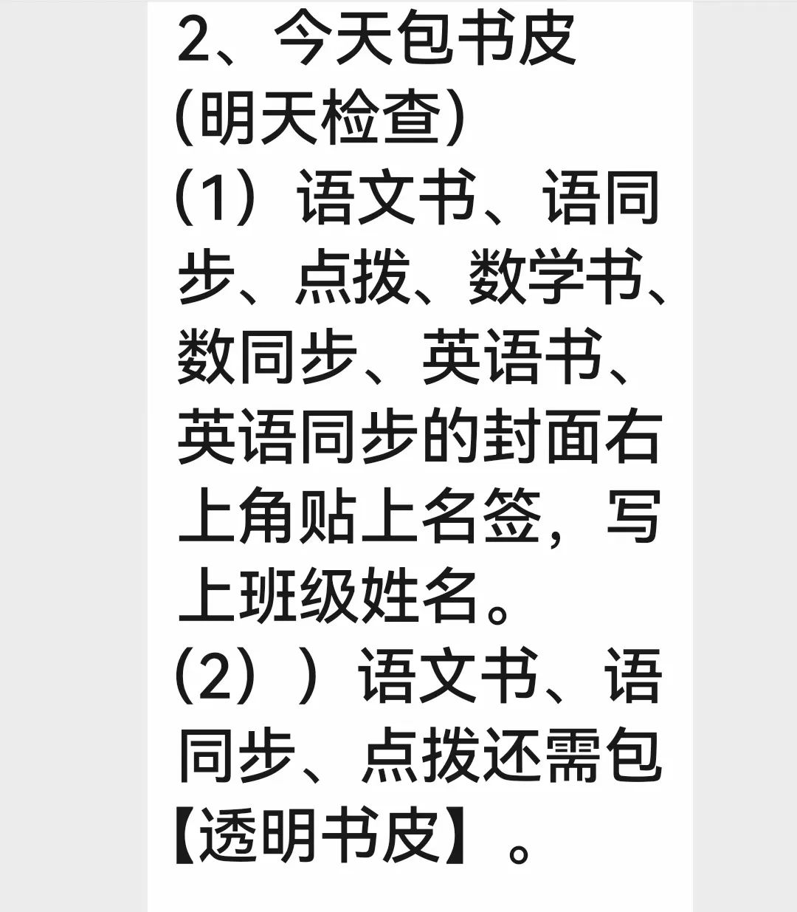
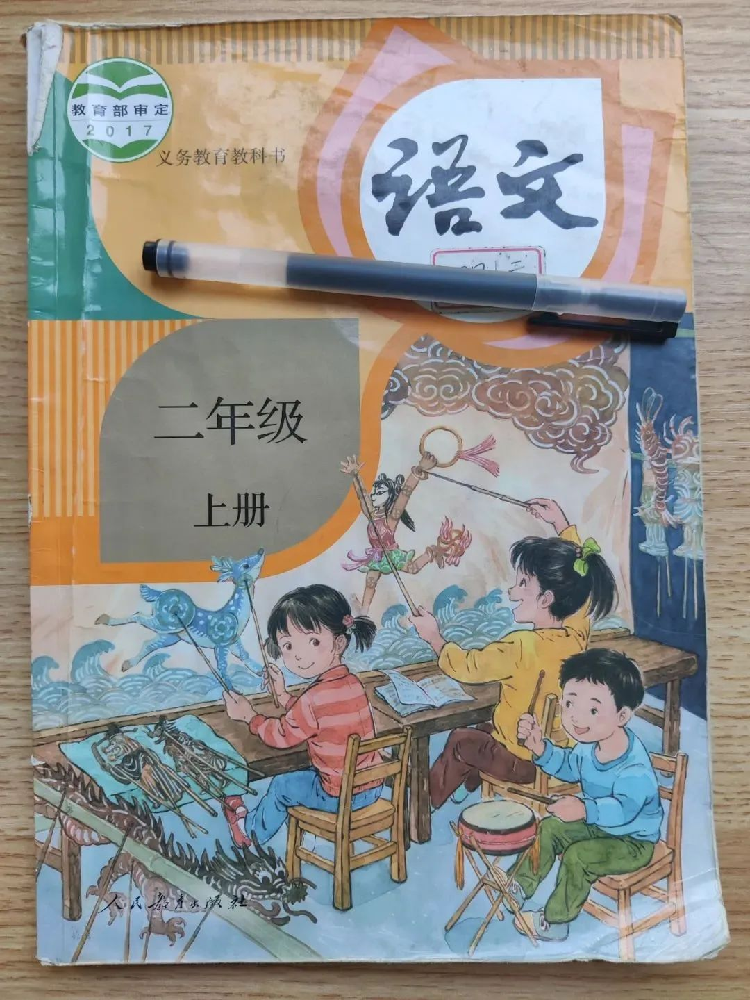
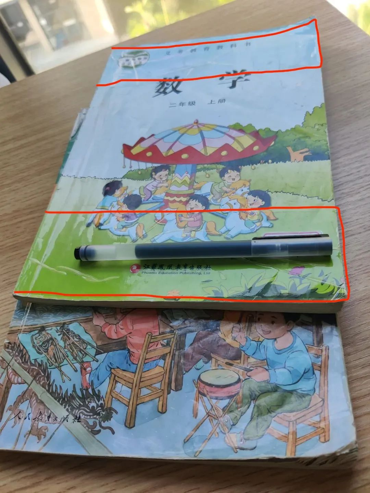
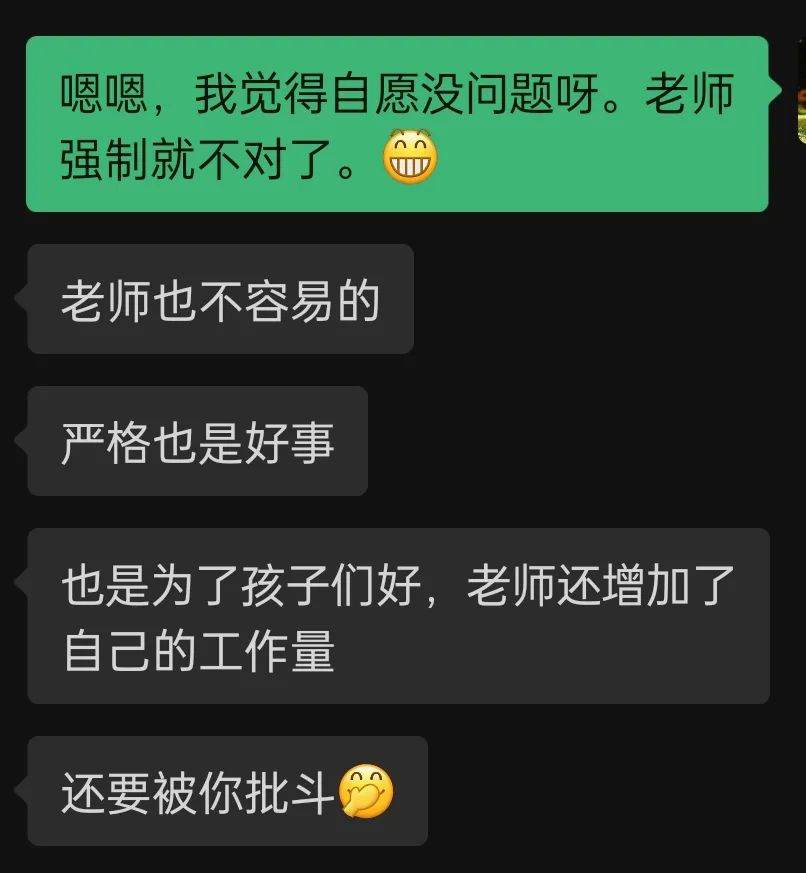

又是开学季，又见包书皮。朋友圈的家长有点忙。

有的家长觉得没什么，习以为常，自己的童年就是这么过来的；有的乐在其中，不但觉得是很好的亲子活动，包完了还能体会到成就感；更有家长包出了仪式感；也不乏家长心生不满，甚至一肚子的抱怨。显然，最后一种是针对于那种强制学生包书皮的老师。

有家长说她加班到凌晨，接着还要给孩子包书皮：

那位家长只是说累，言语中倒没有抱怨的情绪。她后来还特别强调：即便学校不做要求，她也会给娃包的；她认为包书皮很有必要，否则用不了一个学期；她认为老师的要求没有问题。

但我的观后感只有庆幸。好在我家娃的老师没有提这种要求。

我们很少包书皮，也没有向孩子强调要怎么爱惜书本，还往往持相反的态度，希望他将书本当工具。一年级第一学期也是有包过书皮的，但看孩子对书本护理得不错，后来就很少包，或者是看需要。这里找到了二年级第一学期的课本，那都是没有包书皮。一学期下来，语文书有不少页的书角有些褶皱，但我觉得已然不错了；数学书大约是期中时孩子不小心将封面撕坏了，里面的书页还是维护得很好的，我就拿透明胶带在上下两端给他粘贴了一下，哪怕是一年级买的书皮还有存货，也懒得包。是否能将课本维护的好，不同的孩子不一样。我小时候整本书的书角都翘起来，蓬松得很，但儿子做得比我好太多了。我觉得这事应该因人而异，应秉持的**基本原则是自愿，不能带有强制性**。

据我所知，那家长的孩子已经是读小学高年级了。我难以想象那会是什么样的老师 —— 对十多岁的孩子，还要将包书皮这种事列得这么细，甚至都指定某几本书需要包“【透明书皮】”！

但我猜，那老师定然能列举出的若干理由，也定然有其良苦的用心。

有代表性的理由大抵会是这两种吧：其一，包书皮是为了让孩子爱惜书本，重视知识；其二，为了培养孩子的动手能力。

第二条显然没有达到目的，因为这还取决于家长，我相信有不少家长会代劳。因此，本文重点探讨第一条。

第一条看似冠冕堂皇，却是最禁不起推敲的。这其中夹杂着诸多逻辑谬误，比如，混淆概念，滑坡谬误，道德绑架，等等。

先说“混淆概念”： **【书本】并不等于【知识】**。我相信，即便是最糟糕的老师也应该能接受这二者并不相等。书本只是知识的载体，它是教学过程中所使用的**工具**。作为教师，应该充分利用这一工具传授知识，位于另一端的学生，则是充分利用书本获取知识。

何谓“充分利用”？简而言之，为学知识，读书可以“破”万卷。

我个人推崇的是，为了**方便**获取知识，哪怕学生将书本弄破也无所谓。我个人的态度以及详细的说明可以参阅旧文，这里不再赘述。（点击可读 👉：）

**获取知识才是读书之目的**，保护图书是图书管理员该做的事。学生不一定要先成为图书管理员，才能获取知识。

肯定有老师不服气，说有的学生不能善待书本，半学期不到，书本就破烂不堪 —— 工具都没法用了，还怎么学？

这说的肯定是实情。但我想说的是，你为什么要操这**闲心**呢？学生自己，以及学生的家长，他们难道不能解决这个问题吗？更何况，因为一部分孩子可能会弄坏学习工具，便强制所有的学生都来加上额外的保护，岂不是给另外的一部分孩子增添了额外的负担呢？

—— 倘若那些老师感受过现实中“一刀切”式的懒政，那么，他们应该为这种想法和做法而感到羞愧。老师所不欲，不应施于学生。

其实，增添额外负担还是次要的。这种想法糟糕的地方在于其底层逻辑，这些老师认为学生【没有能力】保护好自己的工具，因此，需要老师来操心。但这是**妈宝式**的操心，**每多一举，必增一害**。

一旦老师混淆了书本与知识的概念，他们会陷入“滑坡谬误”：你不包书皮，就是不爱护书本，而不爱护书本，就是不重视知识 —— 一个学生不重视知识，这还得了！这种苗头得赶紧纠正，要管起来。

在这一情境中，“混淆概念”就像一位母亲，那“滑坡谬误”不是她唯一的孩子，他还有个孪生兄弟叫“道德绑架”。因为，一个不重视知识的学生，学习态度是不端正的，思想是不端正的，而“思想不端”与“道德败坏”仅隔着一丘河。所以，在他们看来，不包书皮是非常严重的事。

姑且认为“包书皮能让孩子重视知识”，那么，不包书皮能说明什么呢？这里可能又出现一个逻辑谬误：否定前件。

“否定前件”是逻辑学的术语，简言之，是认为“若原命题成立，那么，其否命题也必然成立”（若 P => Q，那么，-P => -Q）。显然，这是不对的。比如，基于“小明在跑，所以，他在移动”，我们不能说“小明不在跑，所以，他没有移动”，因为，小明虽然不在跑，但他除了静止之外，还可以走、可以爬，而这些都可以让小明仍处于移动状态。

所以，即便“包书皮能让孩子重视知识”，我们也不能推出“不包书皮的孩子就一定是不重视知识”。

但对于不包书皮的孩子，那些老师会怎么认为呢？估计我们都心知肚明。除了可能会掉入以上种种的逻辑谬误之陷阱，恐怕他们还会觉得自己的权威被冒犯 —— 我明明提了要求的，还列得那么细，你（们）却不做，这不是公然造反，对着干吗！

但我想指出的是，这恐怕不是学生的问题。一旦你操了不该操的心，你没有控制好权力与管理的边界，这种“冒犯”就是迟早的事。基于老师将活管得这么细，我也斗胆一猜，这样的老师恐怕有很强的控制欲，但不幸的是，这种控制欲还经常被解读成“责任心”。

如果真心想孩子重视知识，那就**应该回到知识的本身**，更不能干【买椟还珠】之类的事情，以为包书皮是了不得的事。真正重视知识很可能相反 —— 重视知识，就更不应该盲目信奉教材。说到底，那些教材也是人编的，也不见得就是真理，需要孩子们另加书皮来保护，甚至是供起来。

且不说教材被有识之士屡屡指出虚假与错误，这里只说件不远的事。2022 年 5 月底，人教版的教材因为插画被公众质疑，被广大网友誉为“毒教材”。事情发酵，教育部门不得不应对，于同年 8 月 22 日发布了对该问题的调查处理通报，人教社、教育部教材局有高达 27 人被免职或处分，新版教材中重绘了插图。但搞笑的是，这套毒教材涵盖 1-6 年级，于 2012 年审定（一说 2013 年，未细考），已经用了十年之久 —— 显然，这样的教材也被包了十年的书皮！

那就不禁要问，那些要求学生给这毒教材包书皮的老师们，你们这也算重视知识吗？这十余年来，你们就没发现问题吗？

所以，我想再次强调：重视知识，就应该重视知识本身，要带着孩子求真，而不是书本讲什么就灌输什么。**不必太在乎知识的皮囊，而是要重视其内在的真知**。比如，你所教授的书本知识，禁得住质疑吗？

那家长朋友大约是担心我要“批斗”他们的老师，又再次和我说这事：

老师对学生要求严格，**首先应该体现在对自己所传授知识的严格上**，倘若老师不便质疑现有的某些书本知识，那么，怀有质疑之心是最起码的要求；其次，要能**鉴别权力与管理上的边界，并守好边界**，不该管的就不要管，若在不该管的事情上要求严格，越严格越糟糕；再次，家长所言的“老师还增加了自己的工作量”，但在我看来，这是老师自找苦吃，教学大纲上应该没有要求学生包书皮吧，这能怨别人吗？所以，**放过学生，也是放过你自己**。

再者，老师您应该知道那书皮，尤其是那“透明书皮”，是需要购买的吧？也许在您看来，这也不值个仨瓜俩枣的，但是，何必让家长去花这不必要的钱呢？用这钱买半个瓜或几颗枣给孩子吃，不更好吗？

本文有没有上纲上线，能否算“批斗”，就留给大家评判了。倘若那老师能见此文，我倒是想真诚地说一句 ——

十多岁的孩子都趁夏天割包皮，您这要求包书皮的习惯，何妨趁热也一起割了。

