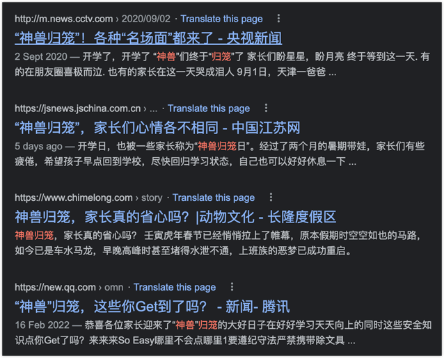

海南中小学今天开学，坊间美其名曰“神兽归笼”。

我挺不喜欢这美名的。在这始作俑者的潜意识中，他将学校视为牢笼，是用来困锁“神兽”的，而孩子再怎么“神”乎，依然是一“兽”。简而言之，没有将孩子当人。

肯定会有人说我过分解读了，“神兽”就是一昵称，是爱孩子呢。如果真的可以将孩子动物化，我宁愿他是普通的牛羊，而学校是开心牧场。他们是去那里吃草成长、撒欢儿跑的，而不是被囚禁。

—— 真有那样的父母吗，他们以将孩子送进囚笼而开心？

现实的情况却是，有很多家长对“美名”无所谓，乐呵呵地谈笑，如释重负一般。

很多词汇“润物无声”，它们有的美妙，有的丑恶，却都能在人们不知不觉中入了人心。在“神兽归笼”的语境中，丑恶还不在于“兽”，而是那“笼”，却用“神”来美饰。

不信？

你将“神”字去掉，是不是“兽归笼”就没那么好听了？

又或者，你将“笼”字换掉，换成一个你能想象到的，但不带囚困束缚之意的字或词，比如，神兽归野，兽归山林，是不是另一种景象？

所以，放过孩子吧，至少，让他们在你的心里实现自由。

