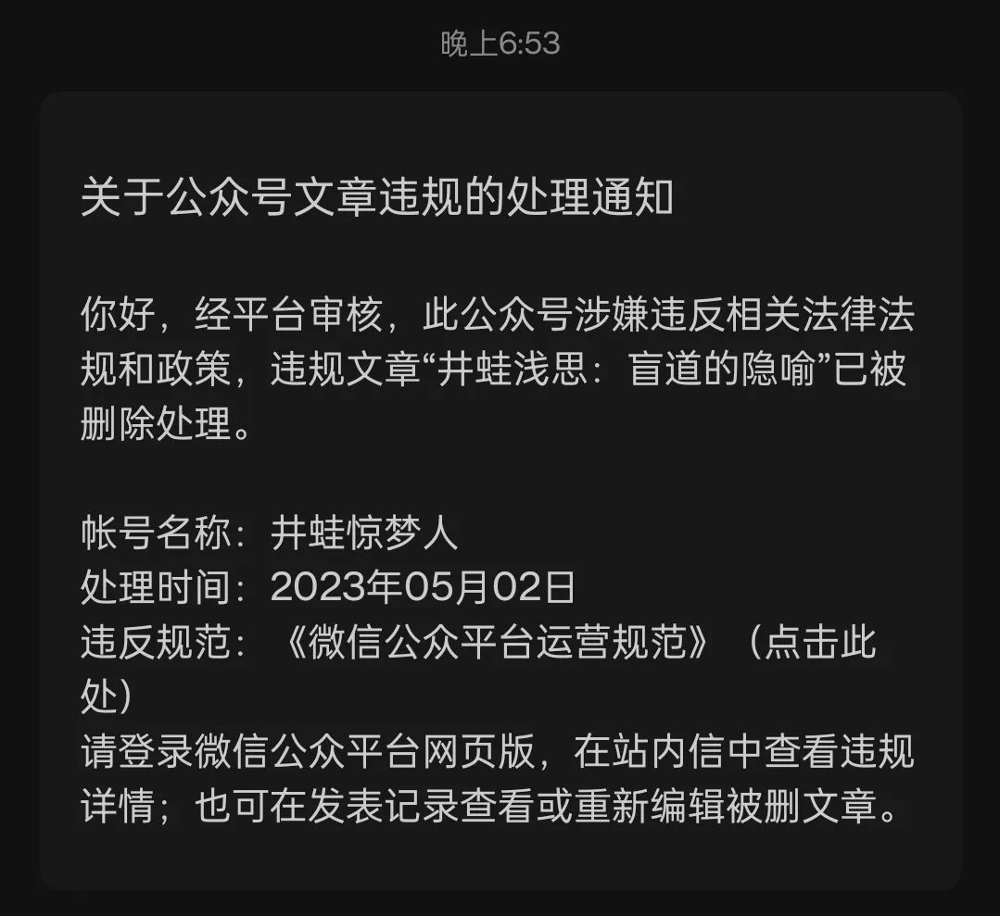
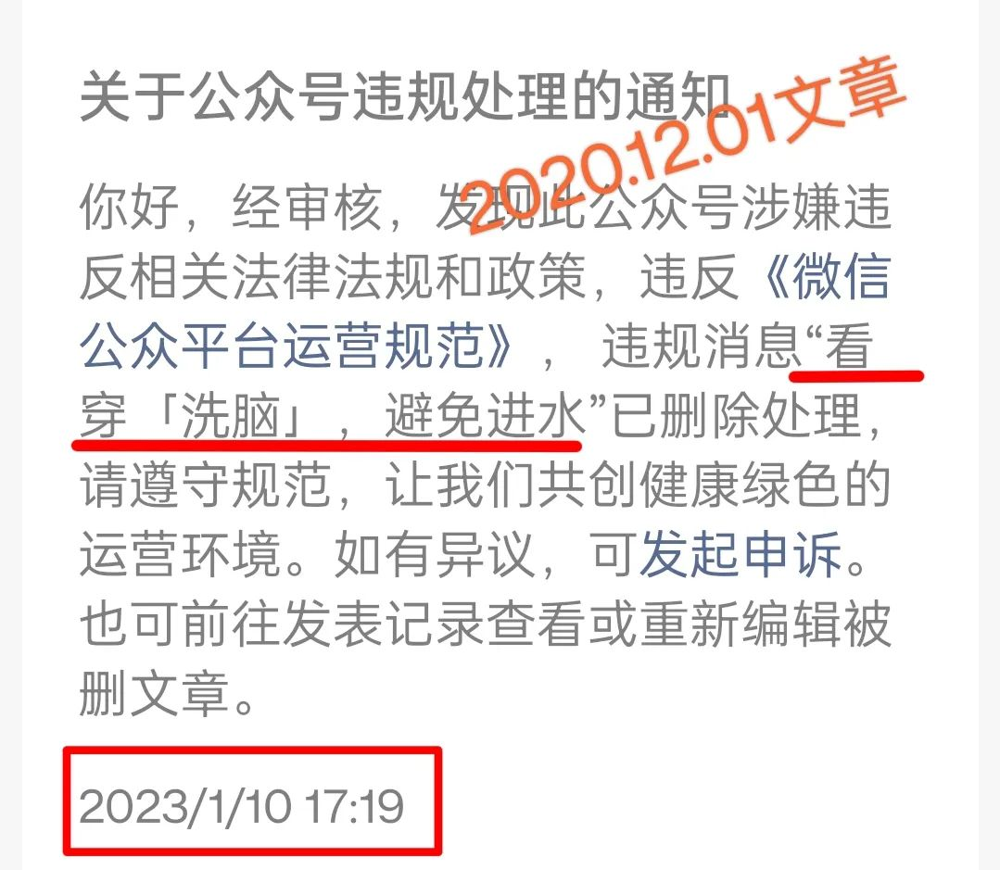
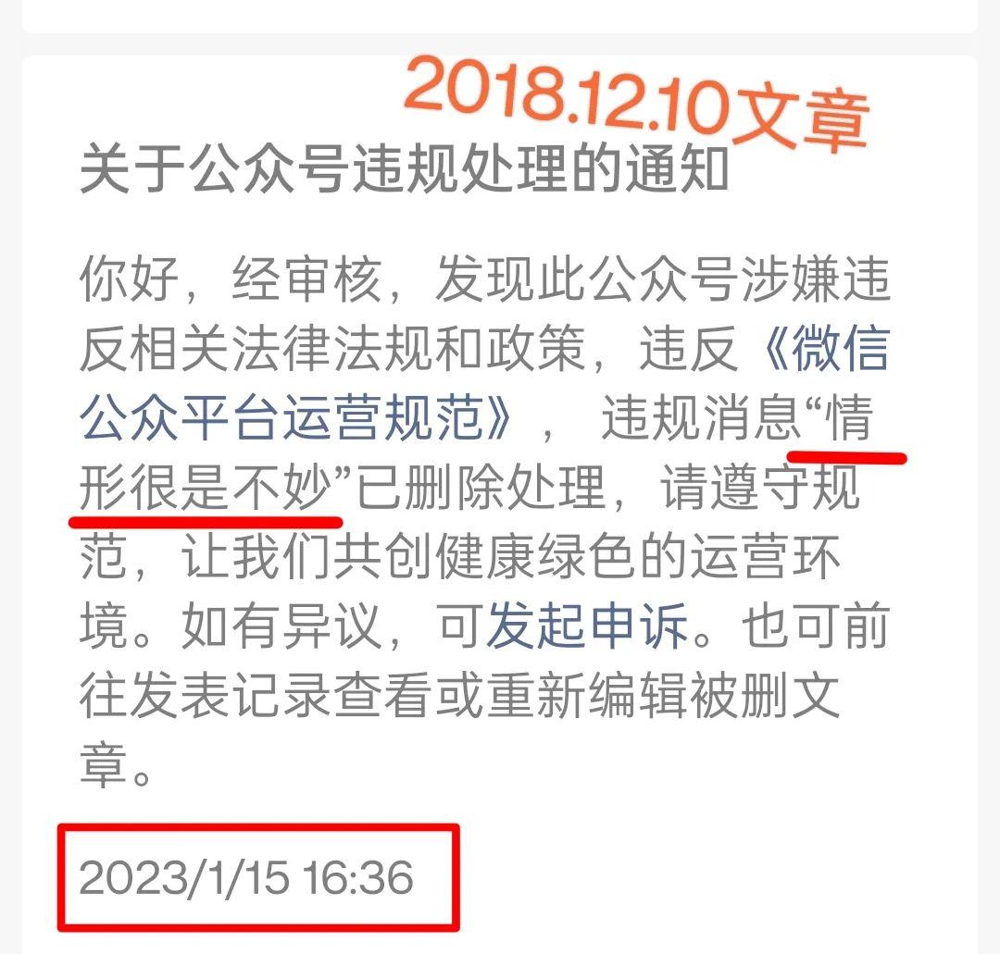
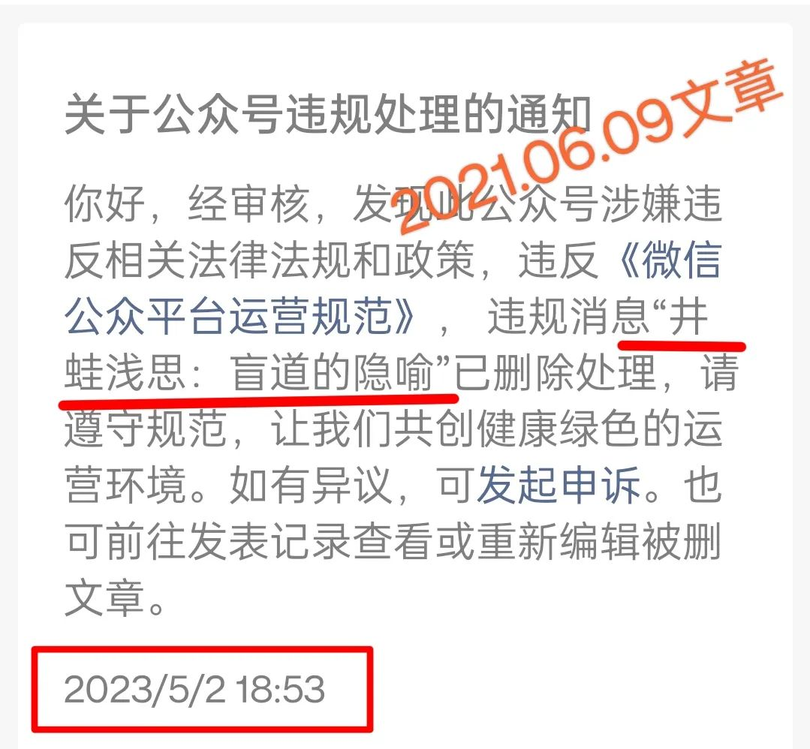

傍晚7点时许，看见了公众号推送的消息，是一篇旧文被删了：

假装震惊须臾，我故作淡定下来。也努力回想这篇文章到底写了啥。

我经常是过了一段时间就忘记曾经写了什么。即便是我重读之前的一些文章，有的居然有陌生感，甚至会滋生疑问：“这是我写的么？”只有当看见了原创标签，我才有了些笃定的底气。毕竟，我虽抄过不少作业，但还是以抄袭文章为耻的。

对于这篇《盲道的隐喻》，我还是想起了一些内容的。大抵是，那些二三线城市往下的街上的盲道只是个摆设：盲人若真按照盲道走，不是会碰见电线杆，就是会撞墙，诸如此类吧。没想到，这样的文章我也没有写好。对于写字的人而言，文章没写好那自然是比违法违规更严重的事，删文章就是提醒我，帮助我反省，必须得感谢他们。

另外，我也挺感动的。今天5月2日，依旧是五一劳动节的假期，这些工作人员不辞辛苦地加班，将一篇**2021年6月9日**的旧文章翻出来给卡擦了 —— 这种敬业精神值得我学习 —— 不写点东西也着实不像话。

近半年以来，我写文已经是越来越少了。都是一阵阵的，时而连续几天都写，时而隔上几天或一周。像这次间断这么长时间一篇不写，还是比较少见的。总体来说，意兴阑珊吧。

—— 希望不会因为我写得少了，影响了删文者的KPI。

时而见到一些老掉牙的文章被翻出来给卡擦掉，我还是为写文少而感到抱歉的，但也有少许欣慰，好在以前笔耕不辍，有点东西垫底，能为他们删文的KPI略尽绵薄之力，也算是为社会主义事业做了贡献吧。

在这里，很有必要为自己曾经的鲁莽与浅薄检讨一番：

第一，**情形一直很好**。这已经被证明了。

第二，盲道哪有什么隐喻，**那都是瞎扯淡**。

第三，全国人民一直都是眼明心亮，我们的道路一片光明。

