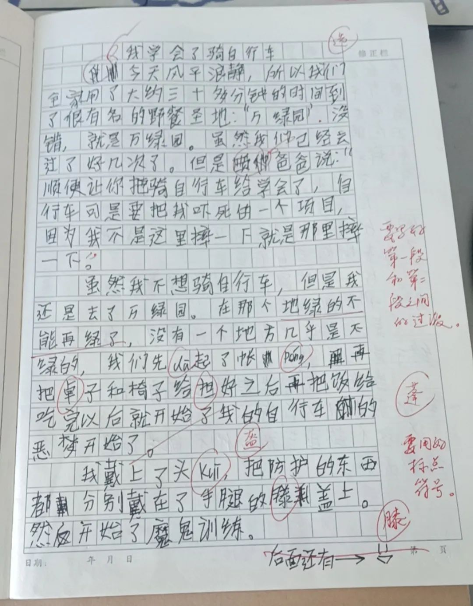
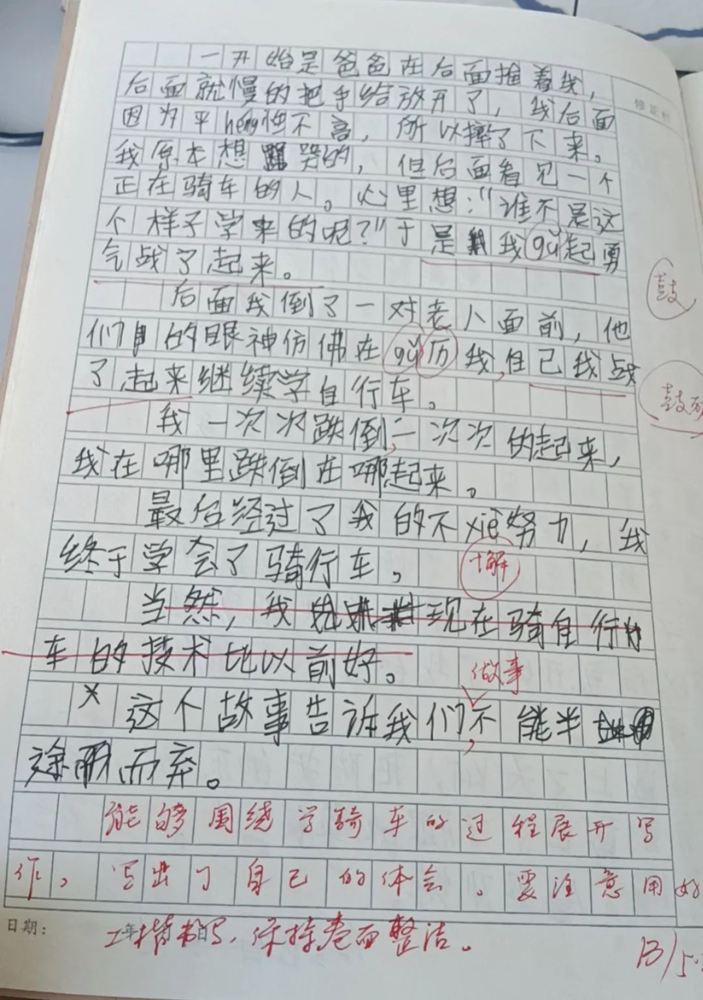

按：本文适合辅导孩子作文的家长参考，也与关注写作和语文教育的朋友交流，欢迎留言。

几天前，我帮孩子改了篇作文。

儿子的作文，我看过的屈指可数 —— 很可能只用屈一只手的指。不是我不想看，而是他不让看，我也就没有勉强，更没有偷看。但这一篇作文例外，他没得选，即便不想让我看，我还是看到了。

他们班级搞了个“优文共读”的作文报：语文老师先将作文选好，文章被选中的同学提供Word文档并发到班级微信群，有专门的同学负责收集，然后，编辑，排版，打印成彩色报纸（有可能家长会参与）。老师每次都将成品拍照发群。报纸做得像模像样的，挺好。

作文报是这学期才开办的，之前出过三期，但儿子没有和我说过这事，也没见他拿报纸回家，我就以为只打印了几份，在班上采取传阅的方式，就没有过问。毕竟，我不大关心他的同学的作文，即便偶尔想了解一下他同龄人的水平，直接看群内的电子档就行了。直到后来找家长收班费，我看了开支，才知道原来每次都打印了50份（每次打印费200元），他们班47人，应该是人手一张。也就是说，儿子曾拿到过三张班级作文报，但一次都没有和我们说及。我猜可能是他觉得作文没有选上的缘故吧，所以，我依然没有过问。

端午节放假的时候，我收到了语文老师拍的作文图片，说儿子的作文选上了，让制作电子稿，然后发到班级群内。就这样，我看到了这学期儿子写的作文，也应该是唯一的一篇吧。

这Word文档自然要儿子来打，我可不想代劳。这就需要用到我的电脑，而他打字还不熟练 —— 指法基本能凑合，主要是拼音不好：有的字不知如何拼；有的拼音则是不会，比如“绿”，“lü”需要打“lv”，他不知道。这都需要我的帮忙，但在他打字的过程中，我只提供了技术指导，对于写作的事，只字未提。

在打字的期间，他发现了一个老师没有察觉的错误：两个“开始了”重复了。

估计老师的关注点在错别字上 ，而儿子这里又是一个长句，后面忘记前面说过的，就成了“开始了……的恶梦开始了”。老师没有察觉也很正常，毕竟，那么多孩子的作文，细看下来着实不易。

通常，喜欢使用长句的人，有表达严谨的趋向，对于训练严谨的思维是有益的，但在孩子作文练习之初，**要避免用长句**，这点需要注意。

与避免长句相对应的则是标点符号的运用。也就是说，**一个擅用标点的写作者，是极少使用长句的**。比如孙犁，就特别喜欢用逗号，而逗号用得好，写出的文章就有节奏，读起来有韵味。所以，我赞同语文老师在一旁的批语：“要用好标点符号”。

只不过，这样的批语作为对学生的反馈，**其作用是有限的**。这就像看见孩子的行为不妥时，我们说了句“你要做个好人”，但“什么是好人”，“如何才能做好人”，却都没有涉及一样。

所以，**最有效的反馈就是给出示例**，标点符号要如何加，老师直接点几下就行了。倘若能指出没有标点的长句会导致什么问题，那就是再好不过的事了。特别是，儿子的这句话有语病，是重复使用“开始了”所致，而一旦使用标点符号断句，就能有效避免这种问题。这应该是很好的反面案例，适合作为典型在班级讲解。

倒不是责怪语文老师，作文本上的批语本就受限于空间，老师只能是“指指点点”，这也是客观条件所限 —— 能指出“要做个好人”已经不错了。

但这样的反馈模式也足以说明一个问题，倘若老师没有发现问题，没有将你孩子的作文（作为示例）来特别讲解，那么，你孩子的习作就必然得不到有效反馈。简单来说，我儿子肯定也知道“要用好标点符号”的，但他不知道如何用 —— 知道了不就用了吗？因此，要想孩子的作文得以提高，家长需要将这一环补上，**给予孩子有效的反馈**。本文也因此而来。

客观地说，儿子的这篇习作问题是不少的，语文老师所指出的问题都是存在的，他很可能是为了照顾孩子的情绪，在本学期最后一期作文报中网开一面，让他也露个脸。我这里得特别感谢语文老师，正是他选择，才让我能一睹儿子的作文。

我定然不会放弃这种机会的。当儿子收工大吉，准备带着他打字的成就感开溜时，我把他叫住了：你准备将这样的东西登在你们的作文报上？

儿子自然听出了“这样的东西”不是好话。为了缓和气氛，我不得不调整表达：你这篇作文，总体上我能给个“B+”，比你们老师的评价稍微好一点 —— 你想知道好在哪里吗？

不等他做出反应，我连忙往下讲 —— 只有先将高帽子戴上，套牢，然后才好往下讲：你这篇作文的问题不少，老师的评价是很中肯的，但我也发现了一个优点，那就是整体表达的感觉很好，比如文章的分段。分段的节奏很好，这让我很是意外，在你这个年纪我就做不到。另外，尤其让我惊喜的地方是这一段的表达，它在整篇文章中特别出彩，而且，这两句话与文章特别融洽，表达流畅自然，因此，我给你“B+”。

> 我一次次跌倒，一次次地起来。我在哪里跌倒，在哪里站起来。

我将这一小段读了一遍，并略作调整。我说：“你写文章的感觉很好，要是好好写的话，以后肯定比我厉害”。然后，我话锋一转：“除了你们老师说的问题以外，我觉得还有一个大问题，那才是限制你作文能力的关键。

“你刚才打字的时候，用了两个‘开始了’的那句话，你不是觉得有问题吗？老师没有发现这个我觉得是正常的，那么多作文要改，他不一定细看的 —— 就是漏看也很正常；还有，他在批注中将‘帐peng’的‘篷’误写成了‘蓬’字，也很正常。我打字也经常打错字，何况手写？忘记某个字如何写，这些都是人之常情。这说明任何人都会犯错，也可能没有发现明显的错误，你们老师如此，我也是如此。但我想说还不是这个 ——

“我想说的是，有一句话他一定会看，决不会漏看的，那就是你作文的第一句话。”

我停了下来，盯着儿子说：

“任何人看一篇文章，都不会不看第一句话，然而，你这句话很有问题，但你们老师似乎没有发现，又或许，他不觉得有问题，但是，我却认为这一句话所反映的问题至关重要，它直接关系到你以后的作文能力。也只有你解决了这其中的问题，你的作文，你的表达能力，才可能有实质性的提高。”

这时，儿子的注意力已经被我完全抓取了，聚精会神地听我往下讲。

我接过了键盘，将他的文章复制了一份，就着文稿边讲边改。

> 今天风平浪静，所以我们全家用了大约三十多分钟的时间到了很有名的野餐圣地：万绿园，没错，就是万绿园。

【我】：先说时间，「今天」，你是写作文的那天去万绿园的吗？肯定不是；是我们读文章的这天吗？更不是。因此，这里必然不是「今天」。

〔儿子〕：但我不记得是哪天呀。

【我】：不论是哪天都不是「今天」。

我先否定了他，再接着往下讲。

【我】：我问你，这时间别人会关心吗？其实，读者是不关心的。但你为什么要写？因为你觉得有交代的必要 —— 这难道不奇怪吗？你为什么一开始就要交代一个别人不关心的东西呢？难道是因为别人都这么写，你就要这么写吗？显然不是的。

【我】：为什么需要交代时间？因为一件事情的发生，时间是要素之一，更何况是那么开心的一天 ——那天你学会了骑自行车呀！因此，到底是哪天？这时间是应该提及的。这是其一。

【我】：其二，交代时间是铺垫。你想要说的是“事”，而时间是“事”的要素，你**一开始交代**时间是为了**引出后面**要说的事，这是为下文做铺垫的。

【我】：我们现在确定了两点，第一，交代时间是必要的；第二，交代时间是为了下文做铺垫的。那么，现在的问题是，如何来交代时间，以确保它真的**起到了铺垫的作用**，而不仅仅是列出了事件的要素？

儿子陷入了思考。我觉得这个问题有些超纲了，就继续往下讲。

【我】：铺垫自然是为了下文的。答案也就在下文之中 —— 你下文说了什么呢？请注意，你是【**全家**】去的，对吗？既然爸爸妈妈都能去，那说明了那天是什么日子？

儿子醒悟过来。

〔儿子〕：放假的日子！是个假日！

【我】：也可以是周末。

〔儿子〕：是的。周末和节假日都可以的。

【我】：那这个时间怎么表达才好呢？

〔儿子〕：一个周末或节假日？

【我】：你得选一个。除非你记得是节假日期间的事，否则咱们就选周末吧，更平常一些。另外，我们通常都是下午去野餐，那时间就可以更具体一点。这里就写“那个周末的下午”吧。关键在于“周末”，是不上班的，为“全家去万绿园”做铺垫。

【我】：再来看“风平浪静”，这个败笔与“今天”一样严重。要知道，你去的是公园，而不是海边，所以，用“风平浪静”是不合适的。当然，“风平浪静”也不是只能用于江河湖海，也可以取比喻义，比如我俩经常打架，今天不打了，那就可以说“我俩经常打架，但今天风平浪静”。这里你是去公园，显然，用“风平浪静”是不合适的。

【我】：我觉得，你想表达的不是“日子平常，没有波澜”，而是想表达天气的状况，是为了下文去野餐做铺垫的 —— 只有天气好你们才去户外的。那么，你需要将“风平浪静”换成一个用来形容天气好的词。

儿子尝试了几次，都不恰当（具体用词已经忘记了）。

【我】：“风和日丽”怎么样？

〔儿子〕：可以的。这个我知道，学过的，刚才没想起。

【我】：好。那我们就用“风和日丽”，但风和日丽也未必要去野餐呀。天气好你们也可以去商场，所以，这里最好还要突出一下室外的情况，我们不妨加上一句“室外非常舒适”，直接为去野餐创造条件。

【我】：现在，根据你本来的意图，我们将“风平浪静”修改为“风和日丽，室外非常舒适”，这样的表达更准确，也更好地为下文作铺垫。

【我】：再来看这个“所以”。“所以”是表达强因果关系的，用在这里也不合适。如果是“今天风平浪静，所以我们全家出海”就能讲通。由于涉及全家，一家老小的，自然会在乎安全，而“风平浪静”则意味着安全，因果关系也就成立了。但你是想说野餐。天气好，室外舒适，虽然是促使你们决定野餐的因素，但因果关系就弱了很多，因为基于这些前提你还有很多选择，逛街和打球都行的。所以，这里只需要“平铺直叙”，用前面的铺垫后面的即可。

我将第一句改成了这样：

> 那个周末的下午，风和日丽，室外非常舒适，我们全家决定去野餐。

儿子作文中接下来的这句话，我是读着就不由得想笑的，特别是后面补的这句“没错”：

> 我们全家用了大约三十多分钟的时间到了很有名的野餐圣地：万绿园，没错，就是万绿园。

他试图用一句话将事情说清楚，但为什么去万绿园？那里“很有名”、是“野餐圣地”（只是儿子的认为，没听他人这么评价），除此之外，他似乎觉得缺了什么，没说服力，便自说自话地“确证”：“没错，就是万绿园”。

我先是纠正了一个不准确的表达，不是“大约三十多分钟的时间”，而是“大约三十多分钟**车程**的时间”。然后就问为什么写“没错，就是万绿园”这句，他说是因为没话写，字数不够，就这样凑一下。搞得我啼笑皆非。

【我】：那我明白了。这很正常，我以前也是觉得作文没话写，字数难凑。一方面，是你的知识与阅历不够，没有写作的素材；另一方面，是你没有掌握方法。知识阅历只能交给时间，你要日积月累；但若只是想凑字数，那简直太容易了！只要你掌握了方法，那将字写多，一点都不难的。就比如现在，我说了很多话，但真正有意义的很少 —— 你以后会知道，难的是将字写少，将文章写得精炼那才是最难的。

〔儿子〕：你的意思是，用最少的字表达最多的想法？

对于儿子的回应，我表示了赞许，并稍微修正了一下：

【我】：是的。用**最少的字充分表达**自己的想法或观点。**精炼且准确**地表达，那才是最难的。今天先解决你的问题，怎样将字写多？

【我】：注意，我说的写多不是写废话。像你这里的“没错”这句，就很像废话。其实呢，我已经演示了如何将字写多，你可能没有注意到。

【我】：原来的“今天风平浪静”，已经改成了“那个周末的下午，风和日丽，室外非常舒适”。你看，字数变多了，但没有一句是多余的，因为它们都在给下文做铺垫。你要想字多，我们还可以再加，但要**合乎逻辑**地加。怎样才算合乎逻辑？简单来说，要根据**上、下文**。之前的改动是根据下文，也就是你表达的目的，要去万绿园，我加出来的是作为铺垫的。你还可以根据上文（前文），已有的信息，又或者是暗含的信息来加字数。

【我】：比如，我们在海口，万绿园也在海口，而海南通常是热的，这些都是文章暗含的信息。我们野餐通常不会是炎热的时候，这就涉及了季节。基于这些暗含的信息，我们可以这样加字：“那是个**海口刚进入初冬的**周末的下午”。

【我】：再来看如何根据已有的信息加字。比如，“风和**日**丽”，这里涉及了太阳，而海口通常是热的，哪怕是初冬的“日丽”，也可能有些热，不适合野餐。因此，我们可以这样表达：“风和日丽，室外**一点都不热**，非常舒适”。你看，咱们这样改一下以后，是不是字数增多了，但读起来不觉得是废话呢？

> 那个周末的下午，风和日丽，室外非常舒适，我们全家决定去野餐。
> ==>
> 那时的海口刚进入初冬，在一个周末的下午，风和日丽，室外一点都不热，非常舒适，我们全家决定去野餐。

儿子点头认同。

【我】：提到海口，是将隐藏的信息明面化；提到初冬，是根据隐藏信息推理后所做的说明；说到不热，是根据已经提到的太阳而来的。因此，这些加出来的都是合乎逻辑的，也就不是废话了。他们可要可不要 —— 如果你追求简练的文风，那就不要；如果你嫌字少，那自然是可以加出来的。

儿子喜笑颜开，似乎已有所获，但还是俏皮地来了一句：“但这加出来的字也不多呀。”

【我】：哈哈。你需要掌握的是方法。掌握了方法，凑字数简直不是事儿，太容易了。我们接着往下来。

【我】：不是全家要去野餐吗？“野餐”是已有的信息，根据这两个字，我就能写出好几句话来。

讲到这里，我不由得想起几年前和外甥女讲作文的事，那时她也是读小学，也是每逢作文就无话可说……

