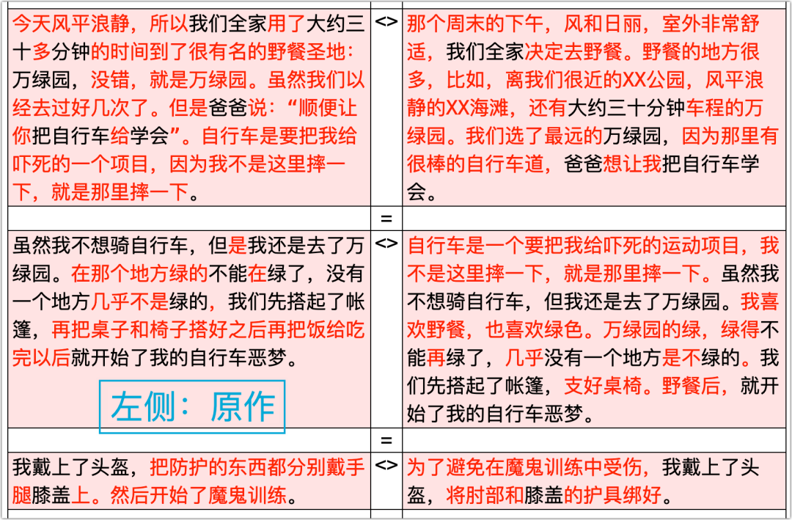
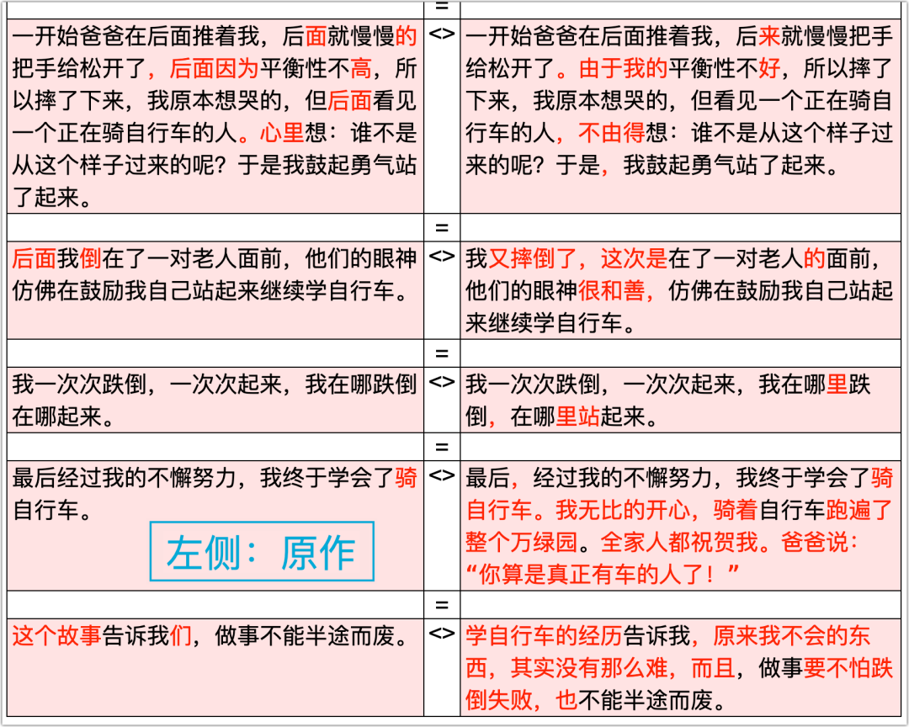

在“（之一）”的文章里，我带着儿子重写了作文〈我学会了骑自行车〉的第一句话：

> 那个周末的下午，风和日丽，室外非常舒适，我们全家决定去野餐。

根据作文题，我们的目标是“学骑自行车”，而不是去野餐。写野餐是铺垫，是为了写骑自行车的。这种铺垫是需要的，甚至是必要的，它能将读者带入特定的情境之中。另外，这种迂回铺垫也能解决儿子无话可说的苦恼。

为了再次演示如何将字数写多，我决定利用“野餐”二字。

【我】：你们全家不是要野餐吗？能野餐的地方有很多，不只是有万绿园。你们为什么要去万绿园呢？当然，在你的作文中，已经给出了理由：那里是“很有名的野餐圣地”，这是可以的。但为了将字数写多，你可以就“野餐地点”展开写，以表达有多个地点可选，但你们选择了万绿园。

【我】：你先举几个野餐的地点，不超过三个为宜，举太多了会让人觉得啰嗦，还喧宾夺主，让你的表达失去了重点。

〔儿子〕：有XX公园，还有XX海滩，还有……

【我】：可以啦，这里将万绿园算在内，一共三个就行了，因为你的目的不是野餐。一共三个可以了。

我接着往下写：

> ……我们全家决定去野餐。野餐的地方有很多。有XX公园，有XX海滩，还有万绿园。

【我】：只是列举这些地点会有不足。因为你是要做选择的，而有比较才有选择。​这些地点各具特色，你可以对比着陈述，在列举地点时加入特色的说明。你的作文中不是说了“风平浪静”、“三十分钟车程”吗？我们就可以这么来写：

> ……我们全家决定去野餐。野餐的地方有很多。有**离我家很近的**XX公园，有**风平浪静的**XX海滩，还有**三十分钟车程的**万绿园。

【我】：你看，这字就更多了。以前，我和你小雅姐姐也讲过如何将字写多的方法。我是根据一本童话书来讲的，里面有这么一句：“翠湖公园的一年四季都很美”，要把话写多，你接下来要怎么写呢？

儿子想了想说：春天鸟语花香，夏天烈日炎炎，秋天果实累累，冬天雪花纷飞。

虽然这“夏天烈日炎炎”不能算美景，但我觉得他还是领会到了方法，就对他的悟性表示了肯定。

【我】：这里简单提到了几个野餐地点的特色，尤其是XX公园和万绿园，是从路程远近上进行对比的，这就暗藏了一个疑问：你们为什么舍近而求远呢？不就是因为万绿园好骑自行车吗！这就引出你想要表达的目标。

> ……我们全家决定去野餐。野餐的地方有很多，比如，离我家很近的XX公园，风平浪静的XX海滩，还有大约三十分钟车程的万绿园。我们选了最远的万绿园，因为那里有很棒的自行车道，爸爸想让我把自行车学会。

【我】：到这里，第一段应该写完了。你原文的第一段中还有这么一句话：“自行车是一个要把我给吓死的运动项目，我不是这里摔一下，就是那里摔一下。”这句应该另起一段，或者放在下一段，那样会比较好。在讲为什么应该这样之前，我先讲讲文章的基本写法。

【我】：通常，写文章的方法概括起来就是四个字：“起、承、转、合” —— 你听说过吗？

〔儿子〕：没有。

【我】：没关系，我今天告诉你。“起、承、转、合”这四个字，不同人的理解可能有所不同。以我的理解，你写的文章也是与这四个字相符的，这也是我认为你有很好的行文感觉的原因。

【我】：“起”是“起始、开始”。你一开始从时间、天气着手，虽然在表达上有毛病，但行文逻辑上是没有问题的，它是符合“起”的。

【我】：从哪里入手着笔，人们往往靠感觉，但一个好的开始，是抓住了链条的一环，那一环找对了，就能将后面所有的链条串起来，顺理成章；感觉不对，你就难以找到切入点，就像你要雕刻一个石像，开始的那一下子凿下去，位置若选得不好，你就可能会将石头坯子凿坏，石像也就难以凿成你想要的样子了。

【我】：起始是重要的，它不但关乎你表达的感觉，还在于他人阅读的第一印象。不论是谁阅读一篇文章，都会看开头的，倘别开头不吸引人，或者很糟糕，人们便没兴趣往下读。这就像你吃馅饼，原本不知道馅的味道，但你咬了一口之后，尝到那味道很糟糕，你肯定就把饼扔了，不会再吃的。

【我】：还有，开始的几句话，若是写得好，可以为全文，甚至是整本书打下基调。几乎所有伟大的作品，都有精彩的开始。比如，狄更斯的《双城记》，一开始的几句话被奉为经典，时常被人引用：“那是最美好的时代，那是最糟糕的时代；……”

【我】：“承”是“承接，承上启下”，是过渡铺垫用的。你这里就做得很好：你要写骑自行车，但一开始没有写它，而是写全家野餐；野餐也不是目的，是为了写万绿园，但万绿园仍然不是目的，骑自行车才是。因此，野餐与万绿园都是“承上启下”的，都是链条中间的一环。

【我】：什么是“转”？“转”是转向 —— 转向目标与重点。比如，转向你想探讨的问题，转向你提出的观点，或者是你想着重讲述的东西。这是你文章的重点。开头、铺垫的功夫做足以后，自然要重点表达你最想说的东西，它应该是紧扣题目和主旨的。你可能已经发现了，开头和铺垫不宜太长。这还是像吃馅饼一样，倘若你半天都吃不到馅，啃的全是馒头，那别人就会觉得上当受骗，也会赶紧将饼扔了。我很高兴，你的作文在这一点上做得很好，不但有“起”与“承”，而且很快让人“吃到馅”了 —— 在第一段就提到了自行车。

【我】：最后就是“合”。以我的理解，“合”是“合拢，收拢，总结”的意思。比如，你作文的最后，“这个故事告诉我们，做事不能半途而废”，这句话就是“合”，你这是在结束文章，并为骑车这件事赋予更大的意义。有明确的收尾，这很好，但你这个结尾写得和开头的那两句一样，并不好，我在后面会讲到。

【我】：请注意，我说的“起、承、转、合”这四个字是通常的写作模式。“通常”的意思是往往如此，但不一定总是如此。有时候，“转、合”是合二为一的，他俩是一致的；有时候，还可能是四合一。

【我】：比如，我们这改完的第一段便是“起、承、转合”，这“转合”是一致的。写周末的时间与舒适的天气是“起”，中间的野餐与万绿园都是“承”，最后引出的骑自行车就是“转”，这是你想说的，但在“转”的同时，它又是“合”，是这一段的收尾与总结。怎么四合一呢？一句话一段就完了：“那个周末，我在万绿园学会了骑自行车”。这之后的段落，你只需要写如何学会的就行了，但显然，这字数就少了很多。

【我】：你不知道“起承转合”，但你的文风却与之相符，这说明你行文表达的感觉很好。有点出乎我的意料，但也不能算太意外，因为你学过的大部分课文都属于这种模式。你能将它运用到自己的文章里，像模像样，这说明你是有悟性的。

【我】：——为什么这句话不能放在第一段：“自行车是一个要把我给吓死的运动项目，我不是这里摔一下，就是那里摔一下。”因为你第一段引出了骑自行车，就已经到达了目的，这是文章的“起”。​前文引出了自行车，任务便已经完成，而你这句是想表达怕骑自行车，它是很好的承接，为后文做铺垫的。因此，适宜于另起一段。

【我】：这就像第一段抛出了个球，你这一句把球接住了，然后抛给后面一段。

​我们父子二人讨论之后，第二段改成了这样：

> 自行车是一个要把我给吓死的运动项目，我不是这里摔一下，就是那里摔一下。虽然我不想骑自行车，但我还是去了万绿园。我喜欢野餐，也喜欢绿色。万绿园的绿，绿得不能再绿了，几乎没有一个地方是不绿的。我们先搭起了帐篷，支好桌椅。野餐后，就开始了我的自行车恶梦。

怕摔、怕骑车，因此不想骑。那为什么还是去了呢？因为喜欢野餐、喜欢绿色。这也是对第一段之所以选择万绿园的补充。

儿子的原作中，有两处表达不好，我作了修改。

第一处是表达拗口，有语病。这里没有必要做语法分析，小朋友们多阅读就会有感觉。文章看多了，读多了，那语感就出来了。

> 没有一个地方几乎不是绿的
>
>  ==>
>
> 几乎没有一个地方**是不绿的**（或：几乎没有一个地方**不是绿的**​）

一篇文章写完之后，自己要多读几遍，这样能发现语句不通顺的问题。另一处的毛病虽表现为长句的问题，但其实，这也是儿子没有好好读自己的作文的缘故。哪怕只再读一遍，只要是认真地读了一遍，就能发现问题的。（他在打字时也没做更改）

> 我们先搭起了帐篷，再把桌子和椅子搭好之后再把饭给吃完以后就开始了我的自行车恶梦。
>
> ==>
>
> 我们先搭起了帐篷，支好桌椅。野餐后，就开始了我的自行车恶梦。

**作者要对自己的文字负责**。小朋友们应该确立这样的观念。不要写完作文就收工大吉，以完成任务为目的，而是要检查一下，多读几遍。（也适用于我自己）

这之后的段落，主要是对表达上的修改。**除去错别字和标点的问题以外，儿子的整体行文是超出我的期望的**，尤其是那单独成段的一句，让我喜出望外，可谓全文的精华：

> 我一次次跌倒，一次次起来，我在哪里跌倒，在哪里站起来。

他先是摔得想哭，写了那时的内心独白：“谁不是从这个样子过来的呢？”因而站了起来；后来又摔倒在一对老人面前，写了那对老人鼓励的眼神，又站了起来。这一内一外，既写了面对困难时自己是如何调整心态的，又写到了他人对自己的帮助，哪怕只是眼神的鼓励都很有用。然后，这一句就出现了，表达得非常流畅自然，说是全文的精华是不为过的。

值得提的缺点有二：一是结构上的失误；二是结尾不好。

所谓结构上的失误，是指该有的没有，就像一个人缺胳膊少腿，那是令人遗憾或痛苦的缺失。严重的时候，就像一栋楼缺了重要的支柱，那楼是要倒塌的。

我认为，儿子的这篇作文，漏写了学会骑车后的心情，这属于“结构性失误”。

一个怕摔的孩子，克服了心理障碍，通过不懈的努力，终于学会了骑自行车 —— 那么重要的时刻，他的心情自然无比欢畅的。漏写了这个时刻，文章是不完整的。更何况，儿子还为凑字数发愁，那就更不应该错失这样的“机会”（写那时的心情）。

作为旁观者，我认为儿子极大地夸张了他学骑车的难度以及他的惧怕程度。他那自行车的后轮原来是有辅助轮的，他已经骑得很顺溜了，再者，那车并不高，他两脚是能撑地的，这也大幅减小了他摔倒的恐惧。所以，那天我没有扶两下子，他就能骑了。他也确实因为转弯和骑得快而摔倒了几次，但似乎没有他作文中写的那么难。即便如此，但当一个孩子有了实质性的突破，学会了某项技能，那心情还是非比寻常，是值得记叙的，因此，不应该少了这部分。

所以，我指出了这一点，并要求他补充学会骑车后的心情的描写。

> 最后，经过我的不懈努力，我终于学会了骑自行车。我无比的开心，骑着自行车跑遍了整个万绿园。全家人都祝贺我。爸爸说：“你算是真正有车的人了！”

“无比的开心”是直接写心情；“骑着自行车跑遍了整个万绿园”是间接写；而“爸爸说”则是为文章增添了点幽默感，也有点意味深长 —— 真正拥有一件工具，不是拥有它的所有权，而是会用它，擅于使用它 —— “君子善假于物也”。

如果说儿子是因为学骑车的事过去太久，当时的欢喜早就烟消云散了，没写那时的心情，算不了“结构性失误”，我也能接受，但另一个缺点就不得不说了，因为这是不少国人的通病。我以前也有这毛病，但现在有所意识，因而希望下一代不要再犯。那就是：**你的感受就是你的，不要试图代表别人**。这也是我认为儿子作文的结尾不好的主要原因。

> 这个故事告诉**我们**，做事不能半途而废。
>
> ==>
>
> 学自行车的经历告诉**我**，原来我不会的东西，其实没有那么难，而且，做事要不怕跌倒失败，也不能半途而废。

你的故事只能是告诉你什么，你的感受也只能代表你。这国人可能是耳濡目染惯了，在他们不停地被别人代表的同时，也不自觉地想代表别人。这是需要纠正的习气。

再者，从前文来看，儿子并没有明确表达要放弃学骑车的意思，所以，“做事不能半途而废”的感悟就显得牵强，因此，我就带着他改了一下。所加入的“想学就不难”、“要不怕跌倒失败”，都能从文章总结到，是合乎逻辑的。在加入这些感悟之后，“不能半途而废”就被弱化了一些，不再显得生硬。

至此，儿子的文章改完了。（点击图片可看高清大图）

对于修改版，儿子是满意的，也觉得学习到了一些东西。

他能有所收获，我自然很是开心。也只有这样逐句、逐段地分析讲解，指出作文的问题，解决孩子的问题，给他以反馈，他才可能有实质性地提高。而这样的反馈，恐怕是老师难以做到的 —— 在不怀疑他们能力的前提下，**时间与精力也是不允许的，这是客观现实**。因此，这需要家长的介入，适时地提供帮助。本系列文章也是基于此，将我辅导儿子的过程写了出来，有所整理与补充，但受限于个人的能力，只能算是给其他家长和孩子的参考。若能起到一点正向作用，自然是很庆幸的。欢迎读者批评指正，留言交流。

