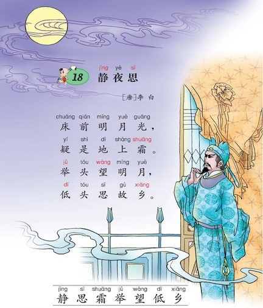

在我的脑海中，“乡愁”就是一个词，如同“月亮”一般的存在，我从来没想过要把这个词拆成两个字来理解。

小时候，家人指着天空的白玉盘教我们，那叫“月亮”。虽然古人所言之“月”便是月亮，但现代极少有人将“月亮”拆开了来理解，否则，就会有人指着躲进云层的月亮教小孩：这叫“月不亮”。在我的印象中，“乡愁”便如这“月亮”，在一开始接触的时候，它便是一个词，而不是两个字的组合。

就像那朦胧之月，“乡愁”这个词是一团意象，是余光中给我带来的。在乡愁进入我的思绪之初，便与“邮票”、“母亲”、“船票”、“新娘”等物象千丝万缕地纠缠着，这随之而来的意象与淡淡的哀愁剪不断理还乱，我就索性不想，让“乡愁”这个词一股脑地把他们都收了。

和很多人一样，我是在初中教材里面读到余光中的《乡愁》。那时，我还是个从未久居他乡的少年，正是为赋新词强说愁的年纪。我不得不感叹义务教育的强大，它趁虚而入，在我不懂乡愁的时节，将之塞进我的脑子，让我从此添了一样愁思，如那天空之月，伴我走天涯，阴晴圆缺。

严格来说，乡愁的思绪不全是余光中注入的，还可以往前追溯到李白，他那首千古传颂的《静夜思》写的正是离人的乡思。

李白只是“思故乡”么？他有没有愁，是不是愁思？他没有写，我不得而知，只能是揣测。而余光中在思乡的故事里加入了更多的元素，不但明确了是愁思，还来了个一锤定音 —— 这就叫是“乡愁”。自此，乡愁的概念便入了人心，时不时地勾起游子的心绪。

我从读高中起便离家较远，以后不论是求学还是工作，都可谓背井离乡，是有资格说乡愁的。但说来也怪，我似乎并不怎么想家，大概是随遇而安的心性吧。比如学校放假，我并不是多么急切地想回家，之所以回家，更多的是缘于无处可去。然而，这并不表示我对家乡淡漠，相反，我对那里有着很深的情感，我曾有多次深切的感知与体会。那时每次回家，上了一个坡，转了一个弯，整个村子便尽纳眼底，那无比熟悉的景象让我心旷神怡，整个人一下子就放松了，那景色是鲜明的，空气是香甜的。即便是此刻想起，依然能感觉到舌尖上留存的一丝甜意。

工作后，回家就更少了，那时尚未成家置业，心中虽然还是将那山村当家，但渐渐地，那种感觉起了变化。这首先体现在语言上，比如年末回家，我会说“回老家过年”。在“回家”向“回老家”的转变过程中，“家乡”也在向“故乡”转变，这似乎不是一蹴而就的，而是有个温水煮青蛙的过程。在不知不觉中，我与家乡渐行渐远，家乡终成故乡。

那天，同样是上了一个坡，转了一个弯，整个村子尽在眼底，我却陡然生出“老家已经老了”的感触。那河水依旧流淌，山上的丛林灌木更加茂盛，村里盖起了很多楼房，交通更是便利，鸡犬声依然相闻，然而，却给我一种衰老、衰败的景象。这种现实与感觉的错位极不和谐，都让我怀疑不是老家老了，而是我老了。

村子里的长辈越来越老，也越来越少，除非是年末，同龄的伙伴是难得一见的，看见更多的是一些小孩子，我大都是凭他们的相貌猜测是谁家的孩子。这正是应了贺知章的那句诗：“儿童相见不相识，笑问客从何处来”。

在我意识到“老家老了”的时候，我突然懂了一点乡愁。我所感慨的，正是我一直担心的：老家老了，父母老了。然而，父母终归是要老的，但我却不想老家也这样老去，那是我曾经的精神家园。老家老去，我怎么办？特别是，我无法接受老家的衰败。

曾经，我们村子是有着宗族观念的同姓家族，一家有事，乡邻帮忙，特别是同宗的人有着强烈互助的责任感。慢慢地，宗族观念在瓦解，市侩入了人心，现在基本是干活便谈钱。即便是谁家有红白喜事，大伙儿依然前来帮忙，但有的人若对伙食不满意，那活干得就糙了。不幸的是，即便我回家甚少，偏偏就目睹了几次。失望之后，便是疏离。疏离是一种变相的自我保护，它让我远离更多的丑恶，眼不见为净。然而，那种衰败感却是不由自主地滋生，暗中将我侵蚀。我不得不面对我的乡愁：我不再有安放心灵的精神之地。

这些年，我就像将家背在身上的蜗牛，人在哪里，房子就在哪里。我从一个地方搬到另一个地方，接着，又换一个地方……原来一直想买个房子安个家，择一城而终老，现在发现房子有了，而那个精神家园却没了着落，那老无所依的惶惶不安就像一股暗流，在日常的情绪中推波助澜，鬼鬼祟祟。我不由得想，我寻找的是什么，想安放的是什么，而我的乡愁到底是什么？

那天，我和妹妹谈起了老家，谈起了我曾经上坡一转弯的心情，如今这些都烟消云散了，随后，我以一种近乎决绝的语气和她说：我对那里不再眷恋。我还和妹妹谈起了苏轼，“吾心安处是吾乡”。我心仪的家乡必定是能让我心安的，老家曾经是，但现在已经衰老破败，不再是我的精神应许之地。

我的家乡应该是这样的：在那里，我的家“风进雨进国王不能进”；在那里，我不用担心家门小区突然被人封控还没处申诉讲理；在那里，我不用为说几句真话而担忧恐惧……我为寻找这样的地方而发愁，这便是我的乡愁。

昨天，看见作家**晓剑**的一篇文章《我的乡愁解》，他将“乡愁”拆开了来理解，并为他的乡愁找到了消解之道。然而，我的乡愁与他的有所不同，正所谓：词易拆，愁难解。

我只好先从容易的题做起，将那从来一体的“乡愁”拆解如下：

- **乡**：心安之地
- **愁**：因缺少安全感而忧愁

**乡愁**就是，**因心安之地的迷失而忧，为找寻精神应许之地而愁**。

我的乡愁难解，不知用尽这后半生是否能够。

