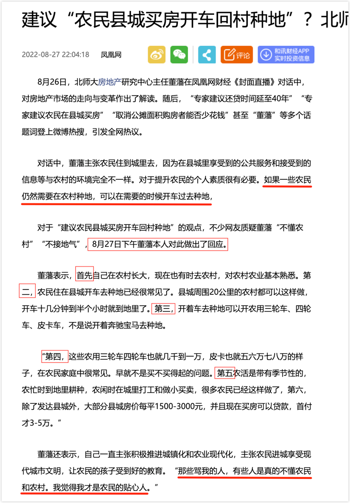
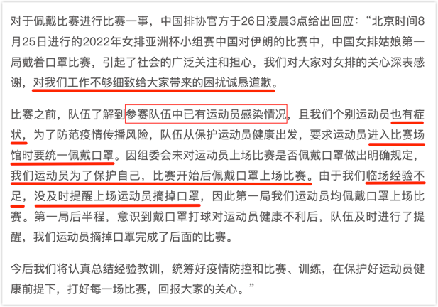

日前，北师大房地产研究中心主任**董藩**因为建议“农民县城买房开车回村种地”招来骂声一片。骂他“砖家”都是轻的，有的直接骂“脑残”。

还有一种骂声，说董砖家是“何不食肉糜”？意思是董砖家天天朱门酒肉臭，这时有人说谁谁谁没有吃的，都快路有冻死骨了，董砖家便问，他们怎么不吃肉呢？

董主任很委屈，对此做了回应，从“首先”一直说到了“第五”，他觉得自己“才是农民的贴心人”：

董主任真的是脑残，真不懂民间疾苦吗？恐怕未必。但他为何就说出了让大众哗然的言论？

你理解了女排教练，就理解了董主任。（有可能让女排戴口罩上场的是领队或排协的某个官员，这里统一用女排教练指代）

有些社会性事件看起来彼此毫不相干，但其底层逻辑是一样的。我们若能不为其表象所迷惑，便看清了事物的本质。

女排教练不知道运动不能戴口罩吗？他们太知道了。连小孩子都知道，这都是以生命为代价换来的常识。

> 2020年4月30日，中国湖南长沙市一名14岁初三学生同样在上体育课时猝死。新华社引述的网传聊天截图称，后者是在体考一千米测试过程中戴N95口罩跑步，呼吸不畅引发猝死。早些时候，中国媒体报道称，2020年4月24日中国河南省周口市一名初三学生返校复课后，在体育课上戴口罩跑步时发生猝死 。

那为什么女排姑娘们还要戴口罩比赛？

因为骂声一片，中国排协就出来道歉，也专门做了回应。大家对这回应自然是不满意的。

“我们运动员为了保护自己，比赛开始后佩戴口罩上场比赛”，这意思是运动员的自发行为，而且是全员自发。

一个小学生都懂的常识，久经沙场的运动员居然不知道？那口罩可是堵在女排姑娘的嘴上，她们太能明白高强度运动时呼吸不畅的滋味了，但嘴被堵上，她们只能将这锅背了。

为什么会有人做出让运动员戴口罩上场的决定？

当框架死死限定后，几乎没有可选项。

既然已知“参赛队伍中已有运动员感染情况”（很可能就是伊朗队），那你就得做出防疫姿态，否则，教练组就要被扣上“防疫麻痹大意”之类的帽子。

“个别运动员也有症状”，这句只是为渲染气氛的，表示事态有点严重。即使是真有，那也不是感染者，否则就不会用“有症状”的措辞。更为关键的是，既然是“个别运动员”，那将她单独隔离不让上场不就可以了吗，为何全体都戴口罩？所以这句就为了表示事态有点严重，也是为了将决策合理化。

“参赛队伍中已有运动员感染情况”，如果真是对手伊朗队，那不与对方接触也是一种解决之道。因为之前三连胜，已经是小组提前出线了，完全可以弃赛啊。但这条路不可行，负面影响太大了。你用什么理由向大赛组委会申请弃赛呢？因为对方有人感染了新冠？但其他国家队伍和大赛组委会完全不当回事，这理由说不出口啊。你完全可以这么想象一下，某中学两个班级之间打篮球赛，一个班要弃赛，理由是对方有球员感冒了 —— 用篮球赛类比还不是很恰当，因为打篮球双方球员会有身体接触，而排球赛却是各自一方。

如果你是女排教练组，**既要比赛，又要表现出防疫的姿态** —— 总不能穿着防护服上场吧？剩下的就只能是戴着口罩了。

你可能要说，后来不是脱掉口罩了吗？既然可以脱掉，那开始就不必戴。

这是因为在“既要……又要……”之后，还有一个“还要……”。

**既要比赛，又要表现出防疫的姿态，还要赢下比赛**。

如果这场比赛可以输掉，那就有必要一直戴着口罩，将防疫进行到底，表示强烈的防疫决心。但问题是，这场比赛是真的可以输掉，因为已经小组提前出线了……（我不想把另一种可能性挑明，读者不妨自己想想看，这也是推理好玩的地方）

我想说的是，一旦框架限定，决策者的出路是很少的。

当他们面临“既要……也要……又要……还要……”的局面时，只能是拼命地找交集。限制条件越多，越像是找夹缝求生存，一旦找不到，便只能使尽吃奶的气力东挪西凑，然后再自圆其说。

北师大的董主任也是面临这样的问题：既要农民去城里买房，还要农民继续在农村种地 —— 如果你是董主任，你能有什么办法呢？

买房自然是为了住的（让农民去城里买房投资，那就更脑残了），既然住在城里，那怎么回村种地呢？开车便是自然而然的解决方案。

董主任所回应的那“董五条”，都是为了将自己的建议合理化，相当于排协的那句“个别运动员也有症状”，没有说服力，但有烘托气氛的功效。

我们总是提要创新，但在思想被限定死了之后，是难以有创新的。尤其是在“既要……也要……又要……还要……”的目标相互冲突的时候，那只会搞得人精神错乱，昏招频出。

创新往往是打破既有框架的。

人们经常批评中国人**缺乏创新能力**，是不是批错了对象？是否那个**限定国人的精神框架才是罪魁祸首？**

