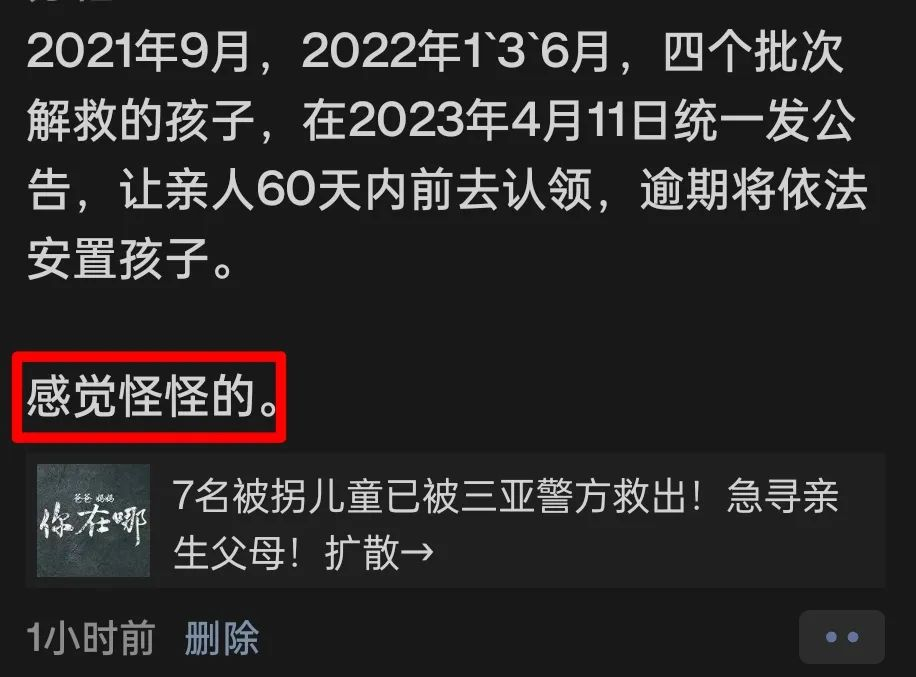
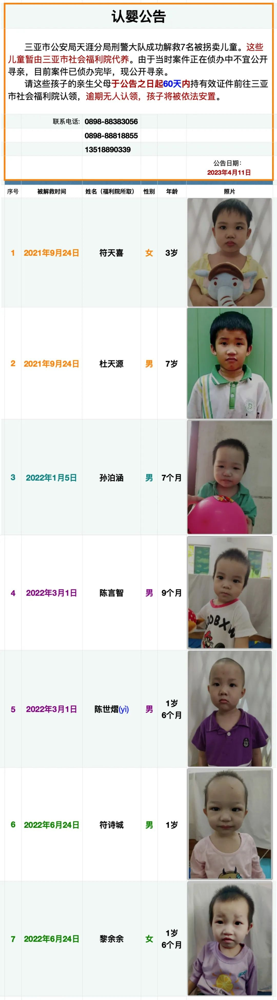

中午，朋友圈有很多人转发如题寻亲的文章（👉🏻[7名被拐儿童已被三亚警方救出！急寻亲生父母！扩散→](https://mp.weixin.qq.com/s/z3pFUXXFKi-zRnnuRbZPCQ)）。我看了下，随后也转发了，但总觉得怪怪的。

哪里怪？

正如上图中的摘录，这时间似乎有点长。乍见消息的标题，我还以为是最近解救的，但看了文章中的告示，发现最早一批孩子的解救时间居然是在**2021年9月**，距离现在有**19个月**左右的时间了。

再一琢磨，就有了更多的疑问。

**一，不是有全国儿童失踪系统吗，里面没有对应的信息吗？还是说这个系统没有起作用？**

如果说是系统里面没有相应的信息，那么第二个问题来了：

**二，难道这些失踪儿童的家属，没有报过案吗？**

这似乎难以想象 —— 如果他们都有家属的话。

然而，新闻的标题明确说了，这些孩子并不是被遗弃的，而是被拐儿童，是被警方解救出来的。所以，没有家属的可能性很小，7名相貌各异的孩童都没有亲属几乎不可能 —— 他们的家人难道不报案登记信息吗？

如果登记了，失踪儿童系统里面为什么找不到？

**三，在2023年的今天，为什么还需要靠这种“扩散➡️”的朋友圈寻人方式来替孩子们寻亲？**

大数据、摄像头、健康码、行程码等等技术都成老黄历了，而我们似乎还生活在农耕时代 —— 就像找人不是打电话问他在哪里，而是满大街小巷地喊名字。

**四，破案这么久了，难道连孩子从哪里拐来的都不知道吗？**

凡事不能只朝好的方面假设，也要考虑到极端的情况，就比如以上种种“科技寻亲”的途径都无效了，但如果知道孩子是从哪里拐来的，在相应的地点求“扩散➡️”是不是命中率也要高一些？

而现在呢，我们成了南海捞针一样，满世界、满互联网、无目的地求扩散！

—— 不知那些转发公告的朋友们可曾想过这个问题？

**五，警方除了成功解救儿童以外，还能提供什么样的帮助？**

如果说我们接受公告的说法，这四批孩童是因为案件侦破的需要而延迟公开寻亲（“由于当时案件正在侦办中不宜公开寻亲，目前案件已侦办完毕，现公开寻亲”），那这么长的时间内，警方不可能一无所获。

即便是最后一批孩童的解救时间也是**2022年6月24日**，距离现在也有**9个月**左右的时间。倘若这9个月没有取得实质性的进展，那未免有些可惜，否则，公开寻亲不就可以提前八九个月？

所以，我认为警方一定可以提供更多的信息：比如，**7名孩童都是在哪里拐来的**。

**六，福利院，特别是官媒，难道不应该表现得更专业一点吗？**

求扩散的文章里面“认婴公告”是福利院出具的，7个公告都是用一个模板，只是改了孩子的姓名（福利院所取）、性别、年龄与被解救时间。

对于公告里**没有涉及孩童被拐地点**等信息，如果我们认为不应该苛责福利院，认为他们不会写公告是正常的，但媒体是专业的，他们应该想到这些，很有必要去问问警方，然后再发文。

然而，在文章里面我们看到了什么呢？不说别的，连7名孩童的告示图片都是无序的！

1. 2022年3月1日解救，男，9个月（陈言智）
2. 2021年9月24日解救，女，3岁（符天喜）
3. 2021年9月24日解救，男，7岁（杜天源）
4. 2022年6月24日解救，女，1岁6个月（黎余余）
5. 2022年6月24日解救，男，1岁（符诗城）
6. 2022年1月5日解救，男，7个月（孙泊涵）
7. 2022年3月1日解救，男，1岁6个月（陈世熠）

读者朋友，你能看出以上顺序是以哪个**关键字**排序的吗？

被解救时间？性别？岁数？都不是，连姓名的首字母排序都不是！他们是杂乱无序的。

看着这些离开父母、无家可归的孩子，我是有所触动的。这大概是“幼吾幼以及人之幼”的共情，也是出于一名父亲的良知，我将这些孩子的信息认真地整理了一遍：

愿以上的**六大问题**都有解。

更祝愿这些宝贝们早日回到父母的怀抱。

