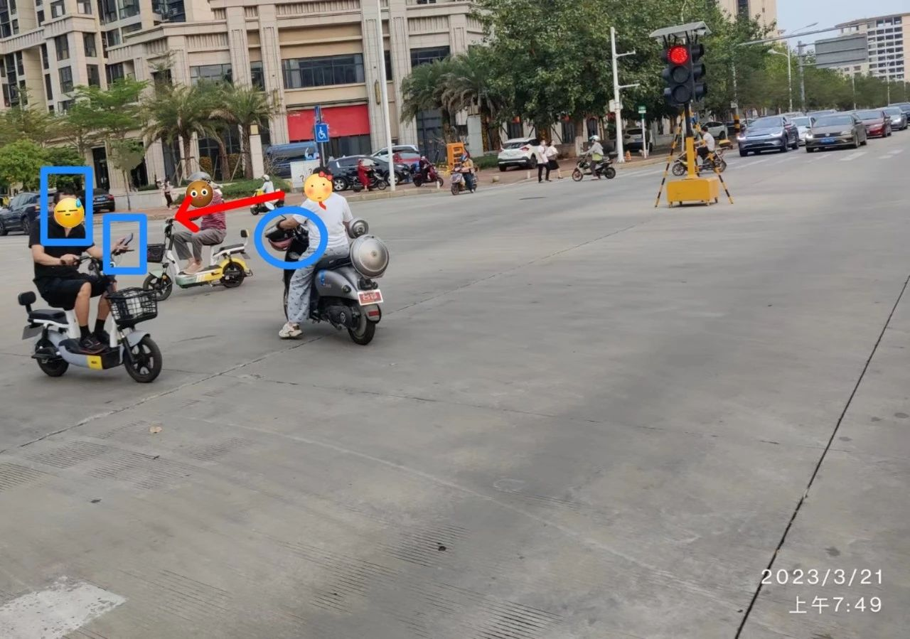
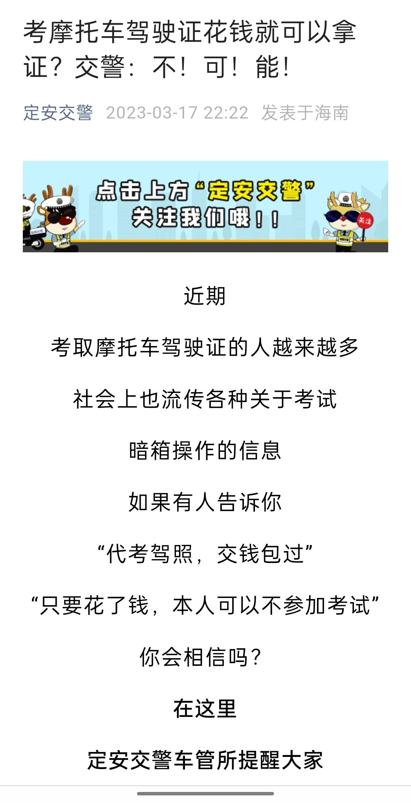

昨天早上，我目睹了惊险的一幕，好在有惊无险。

我送娃上学，步行。那条路是行人与非机动车混行的，一条绿化带将之与机动车道隔开。早高峰期间有很多送娃的，不少人骑着电瓶车。在快到学校的路口时，有迎面而来的骑电瓶车的人“好心”提醒：警察在那里查头盔。

于是，那些没戴头盔的家长便将车停靠在路旁，步行送娃去学校；有极个别是随身带了头盔的，闻言便将它拿出戴上，底气十足地继续前行。

果然，在学校路口的红绿灯处，有四名交警分两组在执勤，他们在学校的那一侧，有胖有瘦，有警察有辅警。他们一面查头盔，一面维持路口的秩序，制止那些不按红绿灯通行的行人。

在我们过马路的当口儿，就看见他们叫停了对面右转弯没戴头盔的骑车的人。那交警先是教育，然后掏出了个小本本。

我通常是将孩子送过马路，在孩子进入学校专门设置的接送区再击掌告别，这需要过马路后多走几步，所以，当我回头行至路口的时候，已经是红灯了。就在我等红灯的时候，一个没戴头盔骑着电瓶车的青年懵懵地行来。他应该是路过的，不是送娃上学的家长。他可能还没睡醒，像一只早起的飞蛾，对于近在咫尺的蛛网茫然不知，在我的眼皮底下自投了去。

当胖交警引导他靠边停车的时候，他依然还是懵懵的样子，似乎满脸都是问号：你们拦我干嘛？

胖交警将这青年截停后，便将注意力放在了对面，大声制止那些正在撞红灯的行人。他身后的瘦交警接手了。

瘦交警先是问了句“你头盔呢？”这个问号算是对青年满脸问号的回应吧，但“以毒攻毒”似乎效果不好。估计瘦警察也感觉到了，随即又补充了一句：“骑车必须戴头盔的”。接下来应该进入查证件、掏本本的环节了 …… 就在这时，那青年启动了电瓶车！瘦警察伸手去抓他！！没抓住！ —— 好在没抓住。

这一切都在电光火石之间。那青年懵懵的神情还是具有迷惑性的，作为一直冷眼旁观的吃瓜群众，我都没有反应过来，何况那正准备掏本本的瘦警察。

胖警察也感受到了身后的动静，便转过身来，但为时已晚，那青年即从巴峡穿巫峡，轻车已过四重山，扬长而去了。瘦警察在同事目光的注视下，连连摇头，无奈。

那情形好像是天上掉下来一饼，下家准备顺嘴吃了，哪知被人这么一碰，那牌就胡不成了 —— 当然，这只是我个人的观感，不能代表警察叔叔的真实感受。

我不知瘦警察的无奈之中有没有庆幸的成分。我是蛮为他庆幸的，好在他没有奋力拉扯，否则，极可能有人会不幸的。我曾见过一些交警拦电瓶车/摩托车的视频，有的警察奋不顾身地拦截，结果被撞翻，而更多的则是驾驶人被扑翻在地（电瓶车速度不快），但由于没戴头盔的缘故，悲剧发生。所以，我说“好在没抓住”不仅仅为警察庆幸，更是为那男青年。

男青年大抵是会为自己庆幸的，但可能只是因为逃脱，说不定还会得意免于处罚，为自己的机智与勇猛而自豪……

这事发生得快，结束得也快，就像在水流中投入了一粒石子，溅起了一朵水花，又迅速归于往常。人流车流继续涌动，警察们将注意力放在了别处。绿灯适时亮起，我便过了马路往回走。和去时不同的是，我成了确知那里有警察在查头盔的人。面对那些三三两两没有戴头盔的骑行者，我仿佛来自他们的未来，在他们的时光中逆行。当然，我不会泄露天机。

但与我同向的依然会有人给出“善意”的提醒。对于这事我挺糊涂的，我不知道这些提醒者是否算严格意义上的好人。是的，这种善意可以**让被提醒者免于眼前的麻烦，但极可能为他们酿造一个更大的**，因为是你让他逃脱了小麻烦，继续保持侥幸心理，而他的下一次，说不定就不会再那么幸运。一个是确知的小麻烦，一个是可能的大麻烦 —— 虽然只是可能。

譬如，不是面对陌生人，而是面对亲友，倘若你告诉对方一件事，能立即避免他损失50元，但一旦告诉他了，却可能导致他未来损失50000元 —— 没有折衷方案 —— 你告诉他吗？

人们的决策是不一样的。而做决策时会涉及一些具体的情境，比如，他全部的家当就只剩50块钱了，我相信绝大部分人都会选择告诉他，以避免让他马上陷入穷光蛋的境地。但我想讨论的是更一般的情形，对方是50、500个头盔都买得起的人，你要不要告诉他？

我很难理解那些不戴头盔的骑行者，因为那**首先关乎的是自身安危**。**为什么要别人来管理自身的安危呢？** 我更难以理解的是，他们居然会因为预知或逃脱查处而庆幸，而不是因为没戴头盔但没出意外而庆幸。

戴头盔和系安全带是一样的，**都是为了防意外的**，是为了即便意外发生，也能尽量保护自己一把。而骑行者的头盔就像汽车驾驶员的安全带一样重要。事实与数据也证明，绝大部分造成严重伤害甚至死亡的骑行者，都是头部遭受了重创，而那些戴了头盔的，则情形要好很多。

曾经，某微信群内有人经常提醒群友某路段查酒驾（可能是职务之便），得到不少点赞。也有人反对他这种行为，认为这属于助纣为虐，但反对者遭到那些拥趸的围攻，也就没什么人再表示反对了 —— 除了用退群的方式。

不戴头盔、不系安全带与酒驾有一个明显的区别，那就是前者只关乎自身的安危，而后者则涉及他人，因为酒驾所造成的误判或车辆失控会极可能给他人造成伤害。从这一点上来说，**在法律上更有迫切性针对酒驾的行为**，因为它会伤害到他人，因此，必须他律。而不戴头盔、不系安全带的行为则是对自身造成伤害，更需要的是自律。

所以，当一个人将头盔挂在车把上，只是为了方便逃避检查的时候，我很困惑；当一个司机专门买个安全带的金属插扣插在汽车座椅的扣插里，以骗过汽车，不让其发出安全带提示音时，我更是为这种聪明哑然失笑。我就是生活在这么一个世界，一个让人如此难以理解的世界。

当我问起那些人为何有头盔不戴，而系安全带也不费事时，得到的回答却是异口同声的：那不舒服。我知道，他们说的是真的，确实会不舒服，至少一开始是如此；我也知道，在另一个群体中，他们会觉得不戴与不系更“不舒服”，而他们早就习惯了 —— 即便坐在汽车后座，也会想着系上安全带。

我有位同学因为坐在出租车的后座没系安全带而受伤。那是某培训班的同学，我们共同参加为期一月的培训。某天中午他出校办事，打车回来上课时在学校门口发生了交通意外。其时，他乘坐的出租车已经靠边停车了，但被后车追尾，由于他毫无防备，又没系安全带，他的头部撞击在前座的靠背上。培训的后半程他一直住在医院，没能再去上课。我们几位同学去医院看他时，他特别告诫我们一句话，我相信你一定能猜到他说的是什么。

我也曾亲身体会过头盔的重要性，不过，它有着别样的称谓：**安全帽**。我觉得这个名字才是它本质的体现，应该在交通领域推广，而不仅仅叫头盔，一定要加上“安全”两个字。那时我在工地，是在修建地铁。我们需要下井搞测量放线，将钉子打在地上以标识测量好的点位，并以钉为中心用红油漆画一个圈，以便施工的工人好找。井下施工有很多脚手架（钢管架），有时打钉子需要钻到脚手架下面去，而井下光线不好，有时施工的杂物比较多，就需要折腾一番，才能将钉子打好。有次我蹲下来搞久了，就忘记身处脚手架下的事了，就直接起身，只听“咣”的一声响，我帽子撞在钢管上，反弹力将我按回地面，耳朵里嗡嗡作响 —— 当时心里只起了一个念头：幸亏戴安全帽了！

我们毋须一定要亲身经历惨痛才能得到教训或启示。别人的“亲身经历”因为幸运而成了经历，但换了一个人，可能就是**轻生**，而**不再有经历**。

一件事做了便有明显的好处，但需要忍受一点不舒服，人们便不愿意去做，又或者，一件事的收益很小，但做了会有明显的大风险却又执意而为，我**只能**从自由的角度来解释：人们有这种**自由意志**，他们为了这点舒服和小收益而甘愿冒大险。如若从其他方面来解释，那就会显得当事人有点蠢：因为心存侥幸，又或者是因为眼前的舒服，而看不见风险。应该不至如此。

这就好像人人皆知抽烟不好，但烟民依然趋之若鹜，抽之若乌，乌云共长天一色。**人们得有选择做错事的自由**，这可能才是“自由意志”的“终极”体现，因为选择做对的理所当然。当只有明明知道不好，却依然要做，这才是意志力的体现吧。

而我们知道，**自由是以不能侵犯他人之自由作为基本前提的**。以此来看，不戴头盔与不系安全带并没有妨碍他人，风险都是自身承担，是符合自由之要义的。所以，对于不戴头盔的骑行者以及不系安全带的司机进行处罚，权力有越界之嫌。至少，它们不会有像查酒驾那样被社会所迫切需要。

当然，从社会层面出发，为减少交通事故的伤亡率（特别是死亡率），以法律为导向，对不戴头盔与不系安全带的行为进行处罚，规范人们的社会行为，这对社会整体的文明程度的提升是有帮助的。但我的问题是，对于那些将头盔挂在车把上的人，这种法规能有多大用？

更普遍的情形是，对于没有安全意识的人，你查他便戴，不查便不戴 —— 除非这种查处日常化，但显然，这种执法成本太大了。

下面是今天早上在同一个路口的抓拍，本是想拍那将头盔挂在车把手上的女士，没想到另有两位男士入了镜。他们各具特色：

与我同向的女士将头盔挂在车把上；迎面而来的男士不但没有头盔，还在用手机；三人中唯一戴了头盔的人却又是撞红灯过来的。

—— 各位看官，你觉得我们离文明社会究竟有多远？

我不由得想起日前看见的一条消息，是**定安县交警**的辟谣声明（点击可阅读详情 👉[考摩托车驾驶证花钱就可以拿证？交警：不！可！能！](https://mp.weixin.qq.com/s/Q3DRIgCs32ijQ8R3uf1CQg)）：

我不了解详情，也不知道其他的市县是否也有这种谣言，因而没法就事情本身进行评论，而是愿意相信警方的辟谣，也但愿那只是谣言，但这“谣言”的**盛行**却折射出其背后的逻辑。（“盛行”是个人的理解，警方文章的表达是：『*社会上也流传各种关于考试暗箱操作的信息*』、『*对于网络社交平台上发布的各类“免考、代考、包过”等信息*』）

**为什么有人会想用钱搞定驾考？**

—— 难道你开车上路不应该掌握足够的交通法规知识吗？

—— 难道你不担心因驾驶技术不过关会给他人带来麻烦和造成伤害吗？

更何况，当交通事故发生时，难道总是别人受伤害？！

“戴不戴头盔”、“系不系安全带”，只是与当事人的安全有关，而这种“谣言”的底层逻辑，却是**对公共安全的无视**，更是**对钱权交易的盲信**。试问，谁的危害更大？

当这种底层逻辑所代表的观念在社会蔓延，我们与文明社会的距离也将越来越远，届时，你就是天天查头盔也于事无补的。而现在的我们，到底能做些什么来不让它发生？

我虽来自未来，但我依然不能泄露天机。

