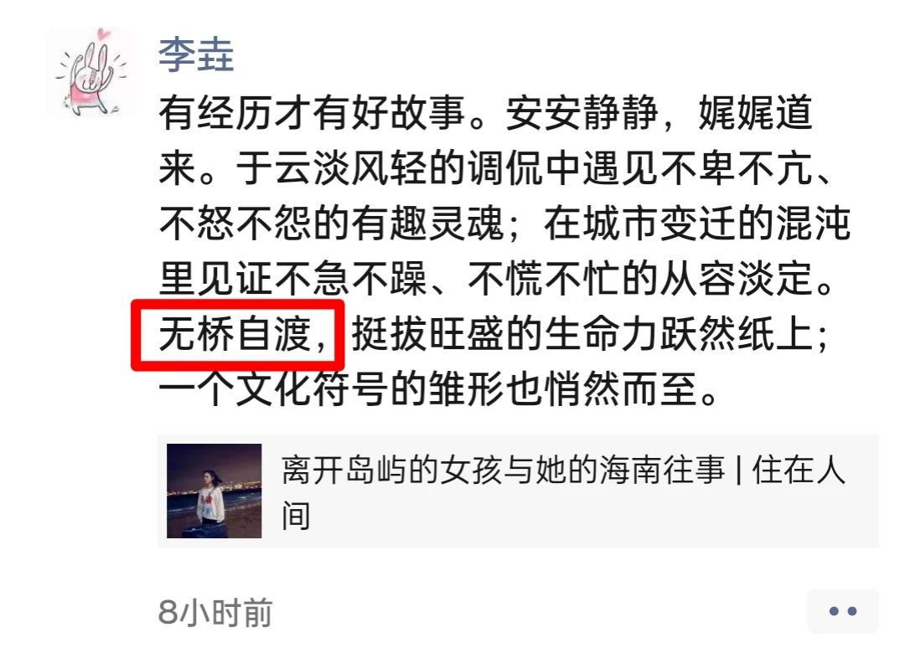

本文是一篇读后感，建议您先看原文（点击可读）：👉[离开岛屿的女孩与她的海南往事 | 住在人间](https://mp.weixin.qq.com/s/bO_goe0Tgl4ntC8MMvENdQ)（以下简称《岛事》）

昨天，我看了这篇文章，虽是碎片化地读完的，但很是喜欢，还没读完便转发到了朋友圈。

有老师这样留言：『又读了一遍，很喜欢，转了』。

她转发朋友圈的时候，还特地写了点评：

我觉得**李垚**老师的点评到位，精彩。尤其是『无桥自渡』四个字，是我眼中的点睛之笔。

也正是这四个字催生了这篇文章。所以，本文既可以说是《岛事》的读后感，也可以说是对这四个字的读后感，遂将之作为文章的标题。

宏观上，我们可以跟随作者的回望，在她那不急不慢的叙述中，目睹一个不一样的海南。那是作者眼中的真实景象，它和我们在报纸和电视上中所见的大相径庭，但无疑也是现实中国的一部分，我们不必否认，毋须否认，也没法否认。但这不是本文的重点。

有朋友这样评价《岛事》：“难得的是作者这么年轻。”

同感。对于一个刚入大学的女生而言，着实了得。

这种“了得”不仅仅体现在文字的功力上，还体现在她已然具备的另一种能力上。那是一种将自身抽离于世事的能力，将当事人（甚至是受害者）变成局外人的能力。而要具备这些，没有从容的心态与超然的心性，是难以做到的。所以，当这些都出现在一个刚刚迈入大学的女生身上时，更是让人赞叹。

我也不得不感叹：这世上的某些人是有慧根的 —— 他们“轻而易举”就能达成之境界，很多人终其一生都可能难窥门径。

比起很多人的不幸，这女生的境遇不是最悲惨的，可以将她这不到二十年的过往总结为两点：

1. 有个动荡且破而不碎的家庭；
2. 有过颠沛流离的童年。

我们不一定有类似的经历，但我相信还是有很多人能从她的经历找到共鸣的。比如，有类似的生活周边环境，再比如，父母吵架，家庭不睦，等等。

在我第一遍读《岛事》时，留下深刻印象的是作者说她小时候怕黑，那时她寄居在定安县的三舅家，夜里一关灯就哇哇叫，三舅母不得不通宵达旦地点着灯以便她入睡。这应该是孩子缺乏安全感的表现，对于一个在风雨飘摇中长大的孩子而言，这是“正常”的。作者说她后来习惯了关灯睡觉：

> 三舅母无奈，为我彻夜燃了一段时间的灯，我才渐渐习惯关灯睡觉。

我不知道这“一段时间”持续了多久，但作者的“渐渐习惯”定然是一个治愈的过程。也许有来自舅舅、舅母给她的温暖，但我觉得一个5岁的孩子远离了父母，被丢在一个陌生的环境中，尤其是学校环境的陌生，只会给她带来更大的不安全感。所以，她的“渐渐”治愈，更多的是自愈。这得益于她不同于一般人的心性。

> 三舅母和三舅只负责我的生活，其他一概不过问。他们虽有一个比我大的孩子，可说的同样是本地话。那段时间于小小的我而言，看似喧嚣，实际充满了沉寂，在定安的一切犹如沉入水底，平静、孤立、固执。

不知诸君可曾有这般感觉：你身处喧嚣的酒局，却无可言说之人，正象一句歌词所唱的那样，『在人多时候最沉默，笑容也寂寞』。作者却是如此描述那段时光：『那段时间于小小的我而言，看似喧嚣，实际充满了沉寂』，她幼小的心灵是沉寂的，周遭的喧嚣与她无关 —— 那一切『犹如沉入水底，平静、孤立、固执』 —— 要知道，她那时才5岁！

读到这一句，我是非常震撼的，尤其是被顿号所分开的三个词，以及它们出现的顺序，让我感受到一种来自平和的力量。

“**平静**”：她找到了平静。这个词首当其冲，是她首先要说的。即便“平静”是她在多年后对那段时光的总结，但也只有她在当年有过这样的心境，才能催生出这个词汇。

“**孤立**”：这是她作为局外人对那段经历的评价。这是所有身处异乡的陌生环境中的人最容易感受到的，这本是人们的第一个感，但她将之放在了第二位。

“**固执**”：我从这个词里面看见了坚强，坚强到了固执的程度 —— 不论你们如何喧嚣，如果看待我这个“外来人”，我依然平静、固执地生长。

所以，当一个人这么回忆5岁的童年，我是非常震撼的。只有内心找到了平静的人，才可以如此回忆过往，而作者却是一个刚入大学的年轻人！

作者在抽离、平淡的叙述中，偶尔调侃与俏皮，让人不禁莞尔：

> 后来出海甸岛求学，我也曾吃到过许多地方的肠粉，唯有他们的肠粉，才能搅动我的灵魂。

> 说完，她会照例夸我一番，我妈则回以习惯性的得意微笑。其实两人殊途同归，都有着同一种信仰——人生的答案都聚集在书本里，学习就是读书，好学校就是神，**神的手指一点，我们从此升入天堂**。

> 不知怎的，我觉得她很孤独——像汤粉店老板娘女儿——在这个网络发达的时代，她守着近乎衰朽的纸质杂志，守着小屋的《读者》《意林》《儿童文学》，**各种报纸和热狗，一直守到现在**。

作者也不乏温情的描写，尤其是写她那痴迷于炒股的父亲的几个段落，在那里面，我似乎看见了**我对孩子**的态度：

> 爸爸现在干着一份仓管的活，和妈妈相反，他很积极地研究手机，有不懂的地方还会主动上网搜索。他经常看大陆的新闻，同我比较大陆的发达、海南的落后，希望我有朝一日能够走出去：“**你长大了就自己飞吧，你的人生，你自己选择。**”“**我不需要你养我，你过好自己。**”
>
> 他是一个类似于无政府主义的存在，咒骂社会，宣泄自己的不幸，认为保险都是骗局，人生来就是靠命运、靠爹妈过活，哪怕读书也不能改变命运，钱则是这个世界上最珍贵的东西——当然，除我以外。**他这一生的大量时间就在厌恶小岛、厌恶世间上过去了，他觉得这个世界是一片废墟，我则是有希望战胜废墟的那个人**。

也正是这种平静，才可以让作者在支离破碎的家庭中感受到温暖，而不是像一些人，在对原生家庭的怨恨中渡过余生。

要如何才能达成这种内心的平静，却是一个横亘在很多人面前的难题。更悲摧的是，一些人不知道人生有这么一道题存在，他们从未见过试卷。

除非你在生命中能遇到一些贵人，他们可以将你提点，拨开云雾见日月……但贵人就像伯乐，不是那么好遇见的。多数时候，我们得自我学习，自我摸索。

是的，深渊无桥，我们需要自渡，很多人都只能靠自己。

我特地推荐这篇文章，写下这篇读后感，是想有更多的人能够从他人的经历与文字中寻找到力量。

愿我们都能早日找到内心的平静，就像那年轻的作者一样：

> 如今离开了岛屿的我，终于鼓起勇气，朝着这深渊游了过去。

请鼓起勇气面对我们眼前的深渊，离开困住我们的岛屿，迈入崭新的境地。

也许那远方的大陆上不一定如意，但是，你已经离开了那座岛。

岛之所以被称之为岛，是因为有大陆的存在，对于一个你立足之地的因由所在，你有何理由不去探索？

—— 你可曾想过，我们立足的地球，正是宇宙中的一个小岛？而人类的历史，正是这姑娘所写的《岛事》。

