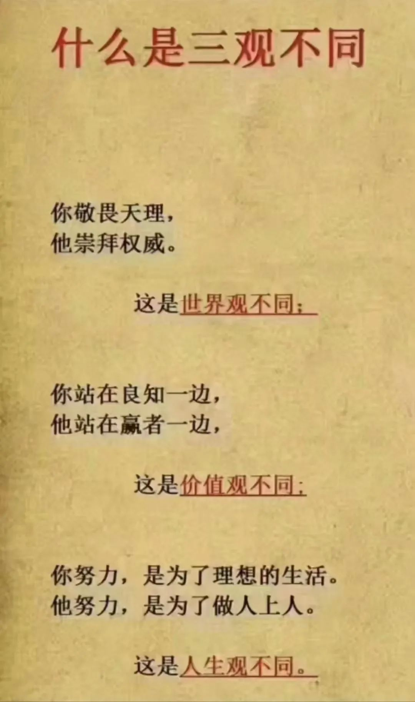
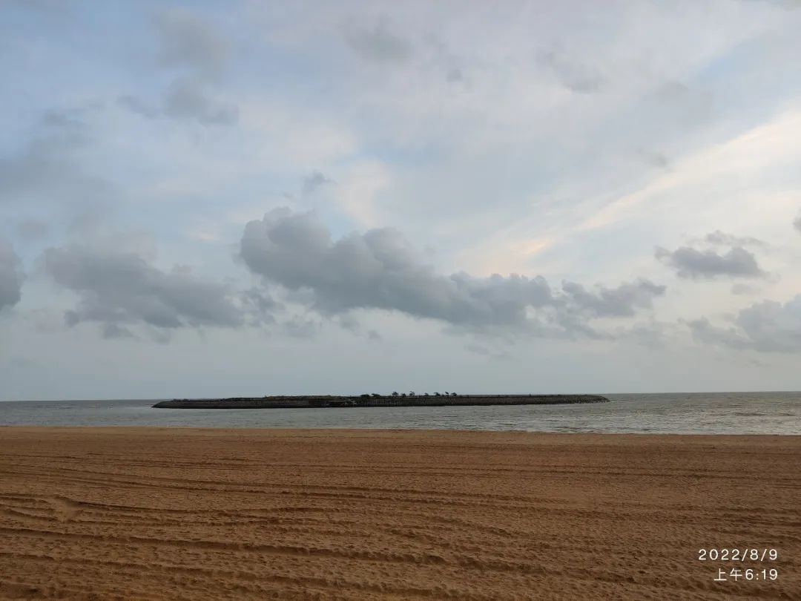

通常，我会将一些日常的小思考发在朋友圈，但一想到微信可能会被封，那就全丢失了，因此，以后会将有点价值的稍作整理，发在这里。

## 法治

前几日，暴力事件频发。譬如，江西男子幼儿园行凶3死6伤，某地俩狱警被砍，等等。每每此时，总是会有人叹息，继而讨论，为何社会戾气如此之重。

我曾写过一篇文章（若您是老师，这里诚恳地推荐一读）：👉 [放下砍向幼童的屠刀：仇恨教育可以休矣！](https://mp.weixin.qq.com/s/M2xKKMZNSajYvtl7BcQ7RQ)，是对这种戾气的产生追根溯源。现在想想，仇恨教育是在孩子的心底埋下种子，至于是否发芽壮大，还在于社会的土壤。仇恨教育属于推波助澜，会加重社会的戾气，但并不是问题的根源。换句话说，即使杜绝了仇恨教育，也不能杜绝社会的戾气。

不少人分析了这戾气产生的原因，比如，疫情管控、经济低迷，一些矛盾被激化；有些人满腔怨气无处发泄，便挑弱者下手；还有些人心理扭曲……都很有道理。我也参与了一下：

> 套用一句话：幸福大体相同，而不幸则是各有各的不幸。
>
> 到底是什么导致个体选择行凶施暴，主要原因估计也是不同的。
>
> 以人的社会属性而言，我们会与其他人建立连接。与他人的关系如何，需要放在社会层面来思考。
>
> 法治不张，公平公正必然丧失，被欺压者得不到司法救济，这其中必然有人会诉诸暴力进行反击。由于法治不张，有权势的人施暴也更加肆无忌惮。这是其一。
>
> 其二，法治不张是文明的退化。由于规则被破坏，就成了谁更有权钱谁说了算。社会退化成丛林。用拳头武力使他人屈服的事情便会频繁发生。
>
> 其三，丛林法则必然导致道德混乱。一个崇拜权势金钱的社会，那自然是笑贫不笑娼。而我们之所以为人是渴望被尊重的，但若社会只尊重金钱权势，那弱者的尊严何处安放？社会自然是戾气横生。

## 自由

其时，我因法治谈到了自由。有朋友对这一段的评价甚高：

>  你要自由，我也要自由。所以，任何人的自由都是以不能侵犯他人的自由为前提。（这才是真正的自由）
>
> 于是，自由催生出边界。
>
> 任何人都必须守住这一边界。即，在行使自由之时不能侵犯他人的自由。
>
> 这需要明确边界，需要制定规则，法律便应须而生。法治是守护自由的一种需要。当一个人越界便需要遭到惩处。（这体现的是公平正义）
>
> 这便是我说“法治的底层逻辑是自由”的原因。

## 三观

这一段是因在朋友圈看见一张图片 —— 不知您怎么看？



我评论了一番，重新梳理了下对“三观”的认识：

> 其实，所谓三观，可以反过来理解：观世界，观人生，观价值。即，你如何看待世界、人生和价值。
>
> 所以，这图上的第一条就不妥，因为“崇拜权威”更像价值观。以观世界而言，世界在你眼中是什么样子，只有真实与否。所以，世界观是求真相关的。日常听到的“科学的世界观”便是因此而来，科学便是求真的。
>
> 观人生，便是怎么样的人生值得过。这似乎没有统一的标准。但必须“观”过，借用苏格拉底的意思，这个“观”便是“审视”——「未经审视的人生不值得过」。你想过什么样的人生，最终会表现为成为什么样的人。（图中的“做人上人”确实是一种人生观）
>
> 观价值。什么样的东西更有价值？我认为，价值观与人生观紧密相连，甚至可以等同。在审视过什么样的人生，想成为什么样的人的时候，我们必定要进行价值判断。所以，这两观可以合而为一。
>
> 因此，不是三观，而是两观。
>
> 世界观对应“真假”，人生观对应“对错”（或“值得与不值得”）。

上面是我当时的想法，后来再想，还是觉得保留“三观”合适（将上一段最后一句进行拆解）：

1. 世界观：真假
2. 价值观：对错
3. 人生观：值得

我们首先要看清这个世界，不停地求真，努力逼近这个世界的真相；与此同时，用价值观去鉴别相关的人和事，我们还可能会随着年龄的增长，不停地修正价值观；人生观的确立，是思考什么样的人生值得过而得到的结论，越早明确越好。

## 两首小诗

第一首是和友人的。她的诗极好，我很喜欢。

```
立秋气清和，碧空白云过。
芳草青绰约，绿树影婆娑。
飞筝因风远，骏马无缰乐。
母女乌蒙游，一路笑当歌。
```

她们姐妹带着母亲自驾游，由于她父亲坐不了长途车，不能同游。她的一些友人作诗相和，写得很好。我也凑了个趣，用的是她另外两位朋友所作的韵脚。

```
三亲跃马乌蒙行，
一翁坐望欢笑程。
飞筝走骏随云远，
放线由缰共此情。
```

选择缺位的老爷子为视角，也是因为近期的一些感慨。

我觉得美好的亲情应该是这样的：虽不能同至，但看着亲人开心，那也是很满足的事。而不是像有的老人那样，为了自己的目的，想方设法地将儿（孙）弄回老家，完全不顾及孩子的感受。

前些天，我冲儿子发了一通脾气，随后和儿子郑重地承诺（因此记在这里）：如果他以后在外闯荡，想回便回，但我不会专门叫他回来，甚至逼着他回来，我决计不会这样做。儿子不知咋地哭了，把我也搞得流下泪来。

爱你的孩子，就给他自由 —— 我希望我能做到这一点。

第二首小诗是今天晨跑所作。我很久没去海边了，看着浑浊的海水，不是滋味，好在那凉爽的海风如故。



```
《观海》
浊涛困孤岛，
乌云凌空罩。
海风拂我面，
日出快分晓。
```

这种心境，估计很多人都懂。


