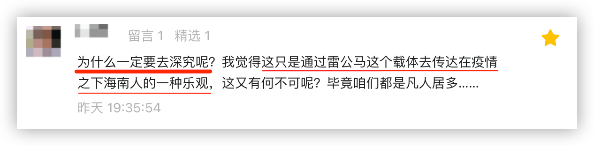
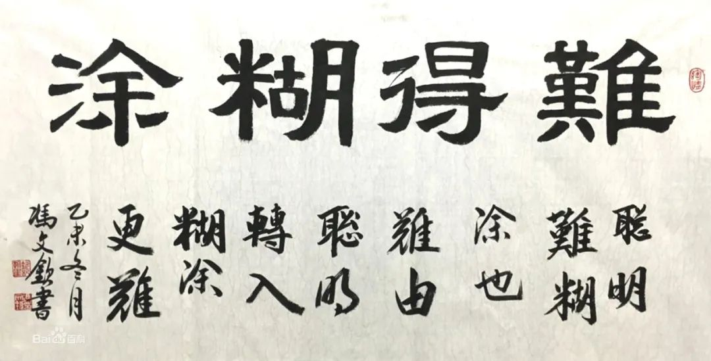

昨天的文章，有读者留言：

借此，我想讨论下这个话题：我们是要清醒的痛苦，还是糊涂的欢乐？

这是个抽象的问题，二选一，你会选哪个？请先凭直觉选择一个，接下来我还会问一个具体的问题。

在婚恋中，不论男女都有出轨的可能，而出轨的一方大都会隐瞒，不让另一方知晓。显然，作为被隐瞒的一方，知道了肯定会痛苦，不知道则是蒙在鼓里，会继续过着幸福的日子。如果你是当事人，是要清醒的痛苦，还是糊涂的欢乐？

你的答案还与之前回答一致么？

我猜，应该会有不一致的人。抽象的问题好回答，而一旦具体，那痛苦便会落在了实处。

选择哪个更好？这个难有定论，不同人的选择不同，他们甚至都有一套理论来支撑，有的还能上升到人生哲学的层面。值得一提的是，这两种选择颇为对立，两边都有人认为对方的选择挺傻的。

曾有这样一位老母亲，她管教不了儿子，便去劝儿媳：你干嘛要去管他呢，你装不知道不就可以了吗？你看看【XX长】在外面都养小三，他夫人都能忍，像个没事人一样，怎么你就不能忍？

我所探讨的问题，与这母亲所说的还有点不同：既然大家认为那夫人是在忍，那她肯定是知道的，只是装作不知。她似乎将两种人生哲学合而为一，她是清醒地糊涂，表现着欢乐，至于其内心是否痛苦，我们只能是猜猜了。

如果你是那夫人的朋友，会不会跟她说你看见了某长和小三搂搂抱抱？

如果是明知对方早就知道了，你还要去捅那窗户纸，你是不捅你不舒服斯基，那我建议你还是让人多捅你几个核酸好了。

但若是对方真的不知道，你要不要告诉她？

这时，不同人的选择又不一样了。要不要说破，有个明显的考量：**亲疏有别**。

如果那某长夫人是你很亲近的人，譬如闺蜜、家人，那大都会告诉她真相吧，肯定不想她蒙在鼓里，但如果是一般的朋友关系，估计大都会选择不说。

以上这讨论的是旁观者，而文章主题说的作为当事人如何选择，还是有区别的。但我们不妨换位来审视，更为主要的是，这与那读者的“抱怨”是一致的：

> 为什么一定要去深究呢？我觉得这只是通过雷公马这个载体去传达在疫情之下海南人的一种乐观，这又有何不可呢？毕竟咱们都是凡人居多……

—— 你为什么要去深究，去戳穿它呢？让它成为大家的欢乐不好么？

我们素昧平生，于我而言，你是疏得不能再疏的陌生人，我为什么要去捅这牛皮纸，让你从此不快？

**因为这是公共事件**。它发生在公共领域，不是私事。

这本是苦难，不是欢乐。我反对将苦难涂脂抹粉，这样便没有人对苦难深究，更没有人问责。而没有追责与反思的苦难，很快就会重来。

至此，我应该将为什么要戳牛皮纸的事说清楚了。

最后，还是回到本文的主题：**作为当事人**，你是要清醒的痛苦，还是要糊涂的欢乐？

在中国，有很多人将“难得糊涂”奉为处世哲学，这句话是被郑板桥发扬光大，但那“始作俑者”还不是他，郑板桥只是那个敲锤人。

这一思想至少可以追溯到《汉书》，卷六十五「东方朔传」第三十五：

> 水至清则无鱼，人至察则无徒。

“难得糊涂”错了吗？

肯定不是。这还得看事情。

倘若事事都要搞得一清二楚，明明白白，那可真就“人至察则无徒”了。斤斤计较，不但会将别人搞得苦不堪言，作为当事人也很累的。

我觉得要看事情的大小，在大事上不能糊涂，在小事上可以马虎，过得去就行。这就带来一个问题：如何区分“大小”？不同人的尺度不一样。

还是拿出轨来说，在一些人眼中，这就宛如天塌下来了一样，而在另一些人眼中，这压根儿算不了什么，他们可以轻松应对。

我觉得这大小可以简单区分，**凡是涉及公共领域的，都是大事**，而私人领域的，你再自行区分。也就是说，我们**先将不能糊涂的事情**给拎出来，将这条线清晰地画出来，而在这一点上，我们也很容易达成共识。

—— 影响千万上亿人的事，难道不是大事么？

不论是大事还是小事，个体作为承受者，终会面对两个可能的结果：痛苦或者欢乐 —— 是要清醒的痛苦，还是糊涂的欢乐？

作为一个喜欢立足于**事实和真相**的思考者，我肯定会选择清醒的痛苦，这也是我的宿命。是的，它会让我痛苦，但我想勇敢一点，也只有直面这种痛苦，趟过那片苦海，我的人生才能得以超脱。**我的幸福就在这清醒的苦海的彼岸**。

我不会要求你与我一样，因为我们本就不同。**但也请你不要要求我与你一样欢乐，尤其是面对公共的大事时**。

我终将会趟过那片苦海，但是，我也想在这人世间所遭受的苦难少一点，再少一点。因为有些苦我本不必承受，那是别人强加之苦，是奴役之苦 —— 它，一点也不欢乐。

