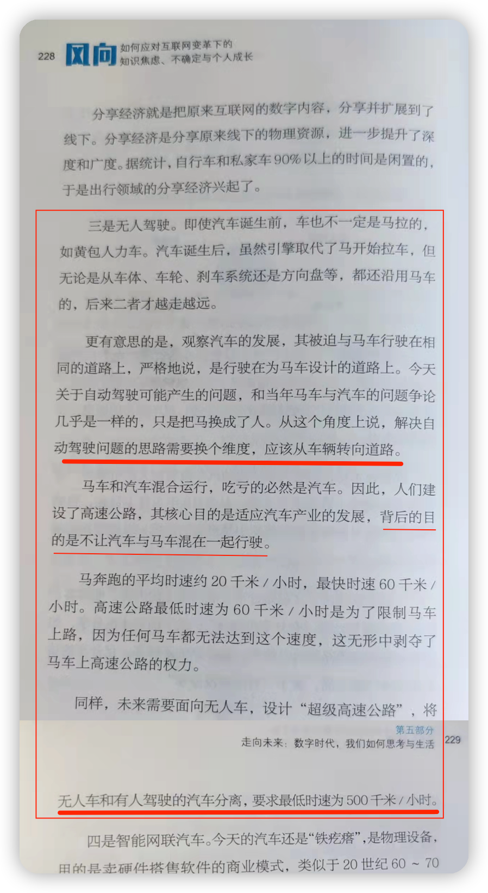

本文探讨两个问题，重点在第二个。

第一个问题：**无人驾驶汽车将会在哪个国家率先推出？**

我猜有相当一部分人会将美国作为答案。

从技术上而言，美国确实具备这样的实力，我甚至相信Google的无人驾驶汽车已经具备了上路的能力。但是，他们很可能有一层牛皮纸难以捅破。

率先推出无人驾驶汽车的大概率会是一个**独裁国家**，美英日法等国都与之不符。

为什么会是这样？

问题不是出在技术上，而是在伦理与法律上。这也是独裁国家的“好处”，它们连法律都可以直接无视，更别说什么伦理了。

哲学上有个“电车难题”，我之前的文章有提到过（关于武汉疫情之初封城的讨论），这道难题往往是作为“思想实验”来探讨的，然而，在无人驾驶汽车的落地运行上，却成了实际的问题，成了必须要面对和解决的问题。然而，我们知道，这道题是“无解”的，它没有**标准**答案。

简单说一下电车难题：你是一辆电车的司机，所驾驶的车辆在轨道上快速行进。你突然发现前方轨道上有5个孩子在玩耍，他们对于迫在眉睫的危险无知无觉，而你的刹车失灵了（或者由于速度快、距离短，刹也刹不住），这时你发现前方有一个岔道，你可以转向进入另一铁轨，但是，那里也有1个孩子在铁轨上玩耍，你会不会转向？（孩子可以换成铁道工，或者，就是抽象的人）

很多人在初见这个问题时都会选择转向，他们会简单根据人数来判断，这是功利的算计使然。然而，如果那一个人是你的孩子，或者是你的家人，更甚者就是你 —— 你还会转向么？哪怕是出于功利算计，倘若那五个是普通工人，而那一个却是顶尖的科学家，你还会选择转向么？为了让人们深思，电车难题还有其他的变体，这里就不展开了。

无人驾驶汽车是要先设定算法的，当前方出现状况时，它该怎么做，这都需要提前设计好。于是，电车难题就成了程序员绕不去的坎 —— 总不能随机撞一个吧？那也太不负责任了，真这样做了肯定会遭遇强烈的质疑。而一旦算法涉及对**某一条件**来进行判断，从而决定是否转向，**条件本身**就是面临电车难题。程序员自然是背不动这么大的锅，但公司要对此负责，这最终便会体现在伦理与法律上 —— 如何判断前方道路上“障碍物”的价值。

这一价值判断本身就是陷阱，一旦判断，便会陷入困境。

有个关于驾考的笑话，考官问考生：“车辆行驶中，前方道路上有一个人和一条狗，你选择撞谁？” 考生当然选择撞狗，考官就骂：“踩刹车啊，蠢货！”面对这种陷阱，考生当哪敢还嘴质疑问题 —— 刹不住怎么办？

如果算法的设定就是撞狗，那些爱狗人士还能放过这算法的制定者？他们会说狗是人类最忠诚的朋友，比很多人都忠诚……于是，将这家无人驾驶汽车的公司告上法庭。这样的事情在那些民主国家是显而易见的。

而在独裁国家，他们压根儿就不会谈及算法设定问题，你还想申请公开这一算法逻辑？门都没有，一句“机密”就把你给打发了！

第二个问题是我昨天看书时的思考。

那是一本图书馆借来的书。借书时由于赶时间，就只看了下书名与目录，又是最后拿的一本，有点凑数的感觉。

书中谈到无人驾驶汽车的未来。作者的视角还是不错的，他从汽车的出现以及发展史来分析问题，从而预测走势。

作为批判性思维训练，咱们的规矩照旧，这里有免费的5分钟送给你，请先想一想，问题出在哪里？

作者似乎搞混了无人驾驶汽车研发的目的，好像无人驾驶是为了高速。

他的逻辑是：马车汽车混行，马车妨碍了汽车（提速），汽车很吃亏，于是汽车利用速度优势来甩开马车，从而“特立独行”。他说，建设高速公路“背后的目的是不让汽车与马车混在一起行驶” —— 这就有点搞笑了，你看见还有几辆马车在路上行驶？哪怕是在普通道路上，马车也几乎绝迹了。

所以，他这里的“马车”只能取广义或比喻义来理解（即便作者没有这意思），是指“低速的行驶车辆”，即“不让汽车与低速交通工具混在一起行驶”，但是，难道这就是建设高速公路的目的？

很容易就能找到反例：摩托车不也能开到120km/h么，为何却不允许它们上高速？

作者显而易见地忽略了一个关键问题：行车安全。

驱使人们研发无人驾驶汽车的主要动力决计**不是**为了追求高速，**确保行车安全**是非常重要的目标。其实，“无人驾驶汽车”的限定语“无人”就已经指出了关键所在。

“无人”意味着什么？

第一，**将人从司机的位置解放出来**。这会带来便利性，也能提升空间的利用率。

有了无人驾驶技术，人们无需再去学习驾驶技能，也就不会有“没有司机不能出门”的情况发生。在当前，五人座的车辆司机要占掉一个位置，一旦无人驾驶后，至少可以多坐一人（设想一下，若前排没有司机的操作装置，是否可以变成“前3+后3”？）。

第二，**无人驾驶意味着安全**。

绝大多数的车祸都是驾驶人操作不当引起的，这是人性的缺陷。有生理原因，比如，人不可能保持长久的注意力；有心理原因，比如，有的司机麻痹大意，或喜欢超车等。

所以，把这份既累人又有安全隐患的差事交给机器，交给算法，可以大大提高行车安全。

第三，**才是意味着效率的提升**。

请注意，我这里说的不是“速度的提升”，虽然在很多时候高速等同于高效率，但是，低速行驶的车辆也可以高效运行。

无人驾驶倘若真的落地实行，第一个失业的肯定是司机，第二个估计就轮到红绿灯了。无人驾驶车辆会提前知道前方路口的状况而决定采取什么样的行车策略。比如，若有行人在通过前方路口，车辆算法系统会根据二者的速度来预判是否有交汇，从而选择是加速通过，还是减速停车让行；当两辆车交叉通过同一路口时，交通系统算法会接管车辆的调度工作，决定每辆车以什么车速行驶而不会发生碰撞，甚至可以做到一辆车刚刚通过路口，而另一辆与它“擦屁而过” —— 两辆车的车身间距才几厘米！

更不会出现交叉方向车道上一辆车都没有的，而另一辆车却在傻傻地等红灯变绿！届时，红绿灯再是安全的象征，而成了效率的障碍。你说，还要那劳什子干嘛？

作者说：

> 未来需要面向无人车，设计“超级高速公路”，将无人车和有人驾驶的汽车分离，要求最低时速为500千米/小时。

我很想问问，这种“超级高速公路”在哪里修建？

若是城市道路，要达到这样的**最低时速**，车辆启动需要多久，特别是，制动需要多久？要知道，这是8.3公里/分钟的速度，还是“要求的最低时速”，规模稍小的城市恐怕都没有资格拥有这种路，还有，去稍近的地方更没有资格上这种“超速路”，因为刚一上去就得下来了！

显然，这种“超级路”只能建在城市之间了，那市内的怎么办？人们对无人驾驶汽车的追求可不是为了去另一个城市上班的。

所以，无人驾驶汽车的问题决计不是“换个维度，将目光从车辆转向道路”便有了解决之道。

这段文章也不是一无是处。从历史的视角来看待问题、分析问题，不时地换个维度与视角，还是非常可取的。

有些问题确实是路的问题。比如，当你不停地摸石头过河，却总是搬起石头砸脚，那就应该想想是不是该换条路，不妨走走桥、乘乘船，而不能总冲着石头较劲。

无人驾驶汽车终会以什么方式走入现实的生活，我们翘首以待。不论怎样，人类对于未来的美好向往是难以停止的，在众多的憧憬当中，估计很多人都不曾想到的一点是：无人驾驶汽车的车头与车尾的区别会很模糊，即便依然有车头，也更多的是象征意义。

因为，在无人驾驶模式下，倒车可以和前进一样快。

