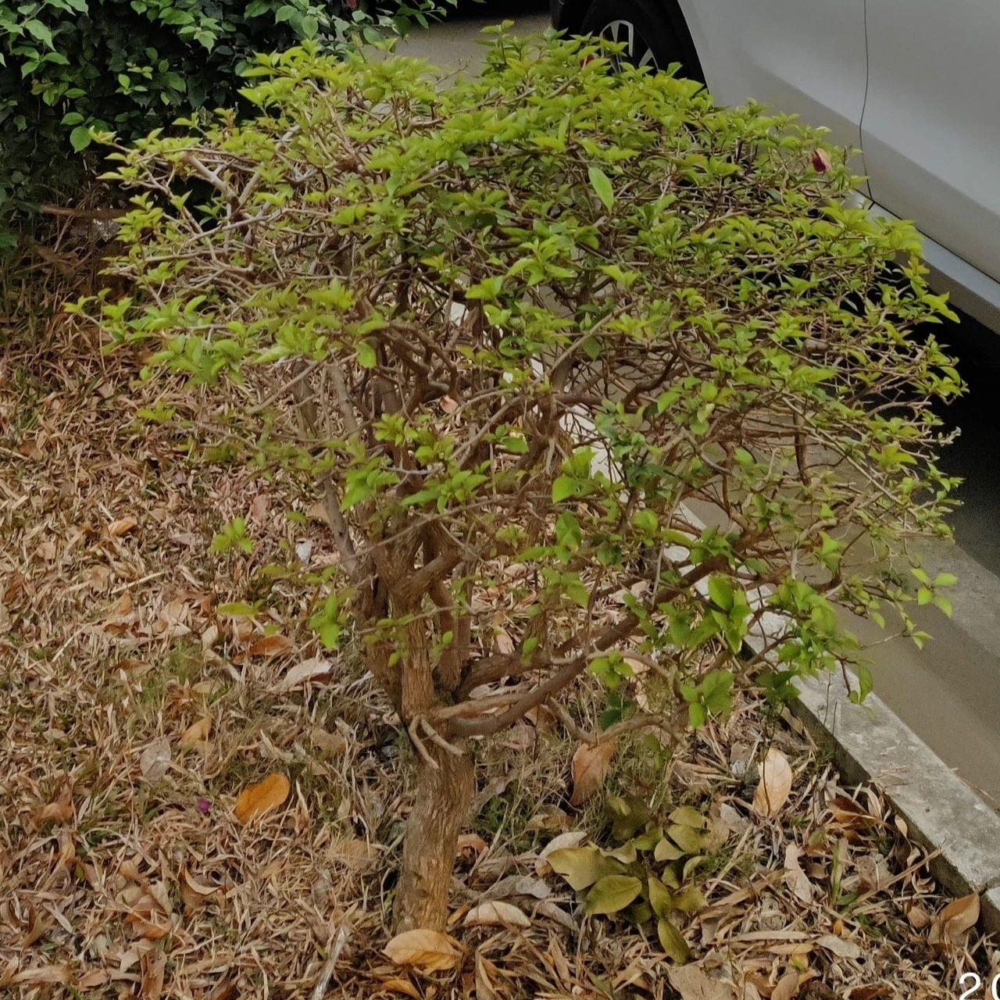
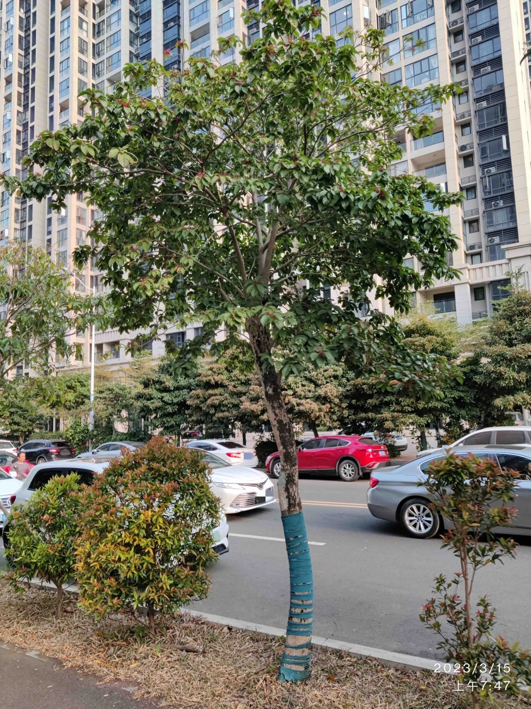
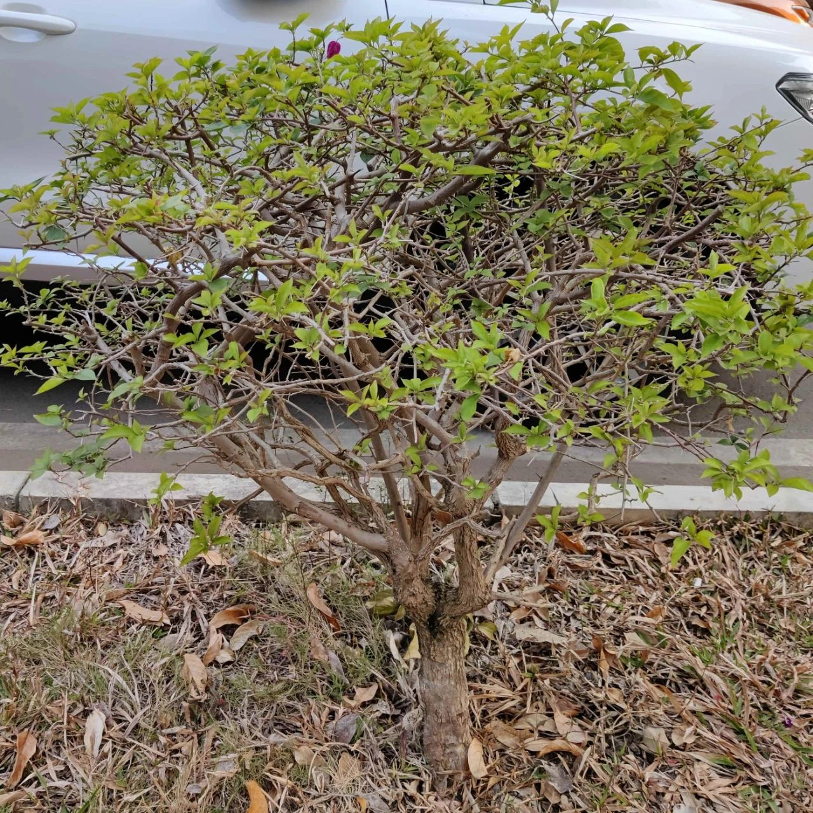
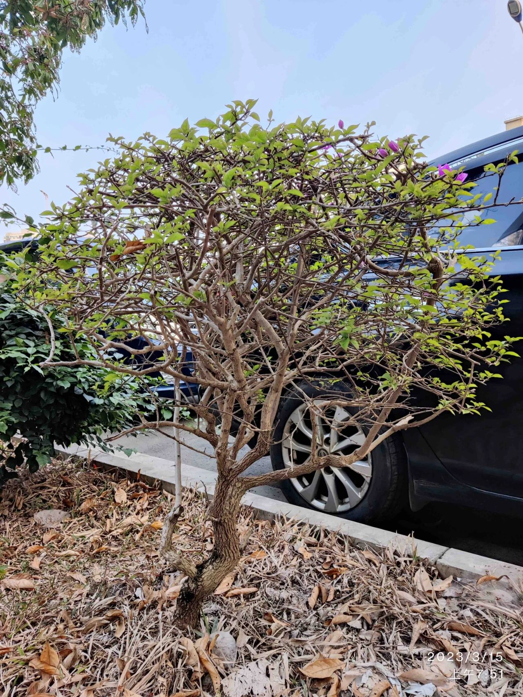

昨天早上，我送娃上学，在小区门口遇见了他的小伙伴，我便问他要不要和伙伴一起去，这样我就可以不送了。但儿子还是想我送，于是两人便边走边聊。

我指着路边的一株“树”（叫灌木应该更合适）问儿子：

【我】：你觉得这样的树好看吗？

〔儿子〕：有些好看吧。

估计儿子有点不明所以，便用一种防守的姿态来回答。

【我】：估计很多人会觉得好看。你看它，那么一簇枝叶，像一把小伞。

【我】：看见这些树，我总是有些感慨。它们被反复修剪，终于长成了人们期望的样子。

〔儿子〕：……

【我】：但我觉得它们没有生命力。你再看看那些大树，它们都是枝繁叶茂的。那才是有生命力的样子。

〔儿子〕：是因为这些小树小，容易修剪，所以才这样的吗？

【我】：小的确实容易修剪，但我觉得这不是关键，因为这些大树也曾经是小树，在它们小的时候人们要修剪它也是很容易的。

儿子像陷入了思考。

【我】：你看看这些大树，它们才是有生命力的，想怎么长就怎么长。它们长成的是自己想要的样子，而不是别人期望的样子。

【我】：当然，长成大树也就不容易被人修剪了，但树一大，也就容易遭受台风。去年你见过那边的几棵树被台风吹断的样子。

儿子点点头。去年台风期间，这路边有几棵树和一杆路灯都被吹倒了，其中的两棵是拦腰而断。那时路过，我也是触景生情，和他讲起了尼采的一句话：“那些杀不死你的，终将使你更强大”。他还有印象。

【我】：但我觉得树还是要长成自己想要的样子，即使会遭受台风 —— 只要挺过了台风，不就更粗壮了吗？而不是被人反复修剪，成了别人期望的样子。

〔儿子〕：那这小树要怎样避免修剪呢？

【我】：你问了一个好问题！但我觉得你应该自己找找答案。你可以观察一下它们的区别。尤其要多观察一下这些被修剪的小树。

快到学校的路口了，儿子也没有想出个所以然了。我便让他到学校再慢慢想。

【我】：你知道我为什么要说这树吗？虽然我说的是树，但我真正想说的却不是树。嗯，这有点像绕口令 —— 你觉得我想说的是什么呢？

儿子无从应对。这不像被问及一个东西好不好看时他可以给出模棱两可的回答。

【我】：其实，我想说的是人。

【我】：你们每天都会被修剪，长成一些人期望你们长成的样子。但我不想你这样，我期望你能长成你自己想要的样子，像那些大树一样，枝繁叶茂……

〔儿子〕：哦！你是说我应该独立思考？

【我】：是的。你应该主动起来，主动地思考。哪怕思考的结果与其他人相同，你也得知道那是为什么，你为什么那么想。而不是别人告诉你是什么就是什么。比如你上学，你得知道你为什么要上学，学习的目的是什么，而且，学习也要主动起来，而不是等着老师来安排。

与儿子分别之时，我才想起应该讲一讲“十年树木，百年树人”，但只能留待以后了。

每每想到对孩子的教育，不免患得患失，特别是对于我曾经犯过的那些错误，更是心存愧疚，是实实在在的“**树人不周**”。

（比如，一开始问他那树好不好看，他给出有弹性的防守型回答便是担心“答错”，而不是畅所欲言，这八成是我造成的）

