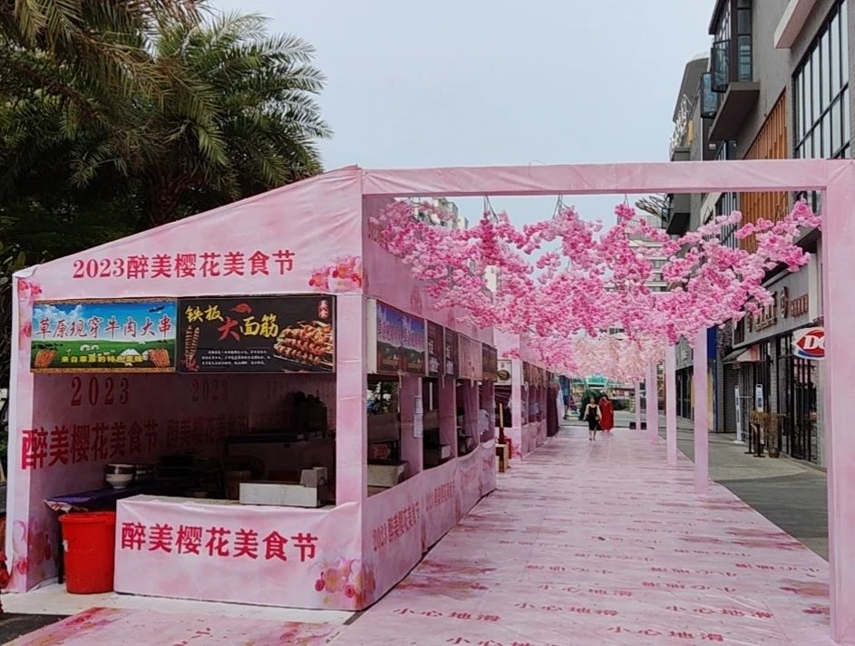

看见一商圈在搞活动，就随手拍了张图，发给了几个朋友：

伴随着图片一起发送的，还有我寥寥数字的简介；伴随着文字简介的，还有一个“笑哭了”的表情；而为了解释这个表情，我还特地用一对双引号将“樱花”二字环绕了起来。

——是的，我觉得这事很搞笑。

当然，这可能只是因为我的笑点特低，很多路人对此是没什么感觉的；又或者，很多人反而觉得这很美，至少，看上去很美。

这漫漫的塑料樱花，让我不由自主地想起了前些年的一个流行词：“塑料姐妹花”。

> 塑料姐妹花，网络流行词，出自段子“好姐妹的感情就像塑料花，特别假，但是却永不凋谢”，**常常用来形容一些女生之间勾心斗角，虚与委蛇的面子社交，特别虚假不走心**。

这样的樱花也特别虚假，一点都不走心。

据说海南也有樱花，但这商圈的附近是真没有见过一株，也不曾有什么地标与樱花有半毛钱关系。至于樱花又如何与美食挂起勾来，我更是一头雾水。总之，对于这凭空突然出现的、莫名其妙的、纯人工的“樱花美食节”，我哑然失笑。笑哭。

—— 一个明明与樱花无缘的地界，居然靠挂起一片塑料花，就过起了樱花美食节？还是“醉美”？**醉**你**妹**呀​！

这种荒诞让我狂笑不已。面对这种不要脸的景象堂而皇之地光天化日，而在日下的我，一时间不知道说什么才好，那样子仿佛路人陶醉于美景，傻乐。

可能是那些朋友日常见过的不要脸的、更不要脸的太多了，他们没什么反应。只有一个朋友回应了下，说他们那里搞了很多次了，就是“地摊小吃经济”。

可不是么？不就是一溜烟的地摊小吃吗？怎么就强行与“樱花”发生关系了呢？

那朋友跟在“地摊小吃”后面的“经济”二字却给了我另一种启发。要知道，这“地摊小吃”可是被城管收拾的对象，但一加上“经济”二字，就瞬间高大上了，连城管都只能远观而不可亵玩矣。

我突然停止了傻乐。对于这所谓的“醉美樱花美食节”，我有了一点感悟：这塑料樱花暗藏着大词的隐喻。

一些大词高上，看上去很美，但所包裹的东西其实都极其普通，就像这地摊小吃与樱花强行联姻。那纯人工粉饰的嫣红，只不过是虚妄；它们所构织的，是迷惑人们的假象。

对于荒诞，如果我们都习以为常，甚至是沉浸其中而毫无违和感，那么，即便你在海南，“雪花节”也将指日可待。

