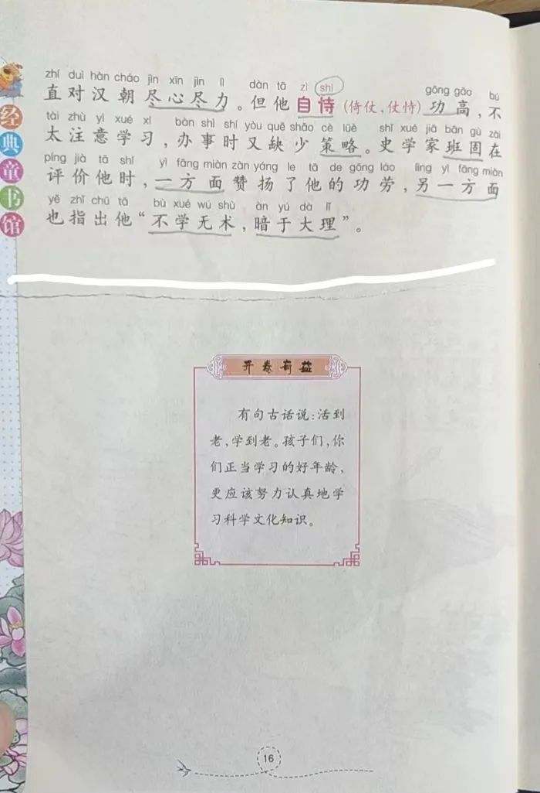

书到用时方恨少。

这说的是知识积累。积累不够，会影响使用，甚至于在面对难题时束手无策。我们在考场时经常萌生这种感概。在那一刻，我们就像一条狗，面对难啃的骨头，不知从何下嘴。

但本文无关乎知识的积累，而就是“用书” —— 如何使用书籍。

几天前就想写这篇文章。那天，儿子有些忐忑地和我说：“爸爸，我不小心把你的书弄坏了。”

他自然是知道我对书籍的重视程度，因而担心我不高兴。我还以为书被他弄得破烂不堪了，就让他去把那本书拿来，哪知根本就没啥。

那本书我在翻看时被事情打断，随手扔在床上，所以是摊开的，而他跑到床上玩耍闹腾，一脚踩上去，就成了这样。

我先是表扬了他的诚实，好高兴他主动和我讲这事。

“我知道你肯定不是故意的，这是个意外。不过，你在床上玩肯定能看见它，所以，还是应该先帮爸爸收拾一下。再说了，这本书的封皮很硬，我倒是担心它会戳到你的脚。”

我将书翻到了封底，指着价钱和他说：“这本书是我在打折时买的，50多块钱，但与你那次坐变形的电子书相比，根本算不上什么，那个的价钱是这本书的100倍。”

我有一个电子墨水屏的阅读器，13寸，屏幕大，看PDF方便些，但大多被儿子拿去看漫画。他也是放在床上，后来玩耍时沉浸在自己的世界中，便忘记了电子书的存在，一屁股坐在上面，面板都变形了。当时还能用，但一段时间以后就出问题了，估计是变形导致某些地方接触不良，他多少是有点责任的。但我并没有因此而责怪他，反而安慰他只是意外。现在说起这事，也是想通过对比说明那书弄坏了没啥。

**人才是目的**。

其他的都是工具。不论是书，还是昂贵的电子产品，都是工具，都是为人服务的。

我在农村长大，经历过物质贫乏的年代，家里也有过困难时期，大人自然就爱惜东西。我小时候淘气，时常弄坏东西，也因此频繁挨揍，那时候就想，要是以后自己有孩子了，决不会因为他弄坏东西而打他。儿时的想法是朴素的，近些年才算有了清晰的认识：**人才是最可宝贵的**。

我曾将儿子的书撕了，惹得他嚎啕大哭。那一时间，我不知所措，还和他解释了半天。

其时，他还在读幼儿园。一天，我们逛超市，超市里有个区域是卖学生用品的，也有一些书籍。他自己挑了一本成语故事，回家后让我给他讲读。由于有个故事的文字段落分开在一页纸的正反两面，我嫌来回翻麻烦，就把那页纸撕成了两段。

这样撕开以后，我就不用来回翻页，只需要将视线从右下移动到左上即可。

我第一次这么干是在大学的高数课堂，也是碰见这种情况，老师所讲的内容在一页纸的正反面，由于内容较难，我们需要来回翻页阅读，以消化内容。我突发奇想，“滋”的一声，将那页纸撕成两截。旁边的女同学先是有点愕然，继而夸我聪明。

当我在儿子面前故技重施，这一切都是自然而然的。所以，儿子那一声嚎啕大哭让我粹不及防，我才意识到不该在未知会他的前提下便将他的书撕了。我连忙道歉，又是一通解释，并且承诺一定会将他的书粘好，才算止住了他的眼泪。

所以，当他和我说起不小心把我的书弄坏了，我便说起了我故意弄坏他的书的往事，并且强调书只是工具，它的价值便是让我从中获取知识，而书籍只是载体，即使用破了它，也是非常正常的。他还记得这事，便为我找来了这本成语故事，于是就有了上面的照片。

接着，我和儿子说起了吴军。

吴军老师曾经说过他如何“看书”。他通常是看完一本书后，就将里面有价值的某几页撕剪下来，粘贴在专门的文件夹中，剩下的“那本书”便扔垃圾桶了。

确实如此。很多书籍有价值的东西不多，就在那么几页，甚至就那么一两句话 —— 当你看书越多，这种感觉便越强烈。

与吴军老师的读书“破”万卷相比，我这种为了阅读便利而撕书的属小巫见大巫了。

我第一次撕书的动机也许是想在女同学面前抖个机灵，但作为从小被教育并认识到书籍重要性的人，我的反应依然是朴素的，是下意识地将书籍当作工具。直到后来才意识到，人才是目的，**书籍是为人服务的，其价值不是为其定价所标，而是看读者如何利用它的内容而定**。

因此，同一本书在不同人手上，用法不同，其价值自然有异。

我比较庆幸的是，我较早地意识到，在“用书”这事上不能**买椟还珠** —— 有些人买书是为了书籍配上书架，用以装点自己作为“文化人”的门面，而将其内容原封不动地还给了作者。

由于儿子喜欢玩手机、电脑游戏，我曾和他讲了下荀子：

ppqq **君子役物，小人役于物**。
ppqq
ppqq 《荀子·修身》

人应该是驾驭物件的，而不应该被物件所驱使，不能成为手机和电脑中游戏、视频的奴隶。我们需要克制自己的欲望，不能被欲望所控制。

说到“用书”，也是如此。我们不能成为书籍的奴隶，而这一点，孟子早已说过：

ppqq **尽信书，不如无书。**
ppqq
ppqq 《孟子·尽心下》

这就说到**独立思考**的重要性。但就书籍而言，我需要切记的一点便是：是我在用书，而不能被书籍所“用”，不能被它控制。

这便是我对书籍的态度。

