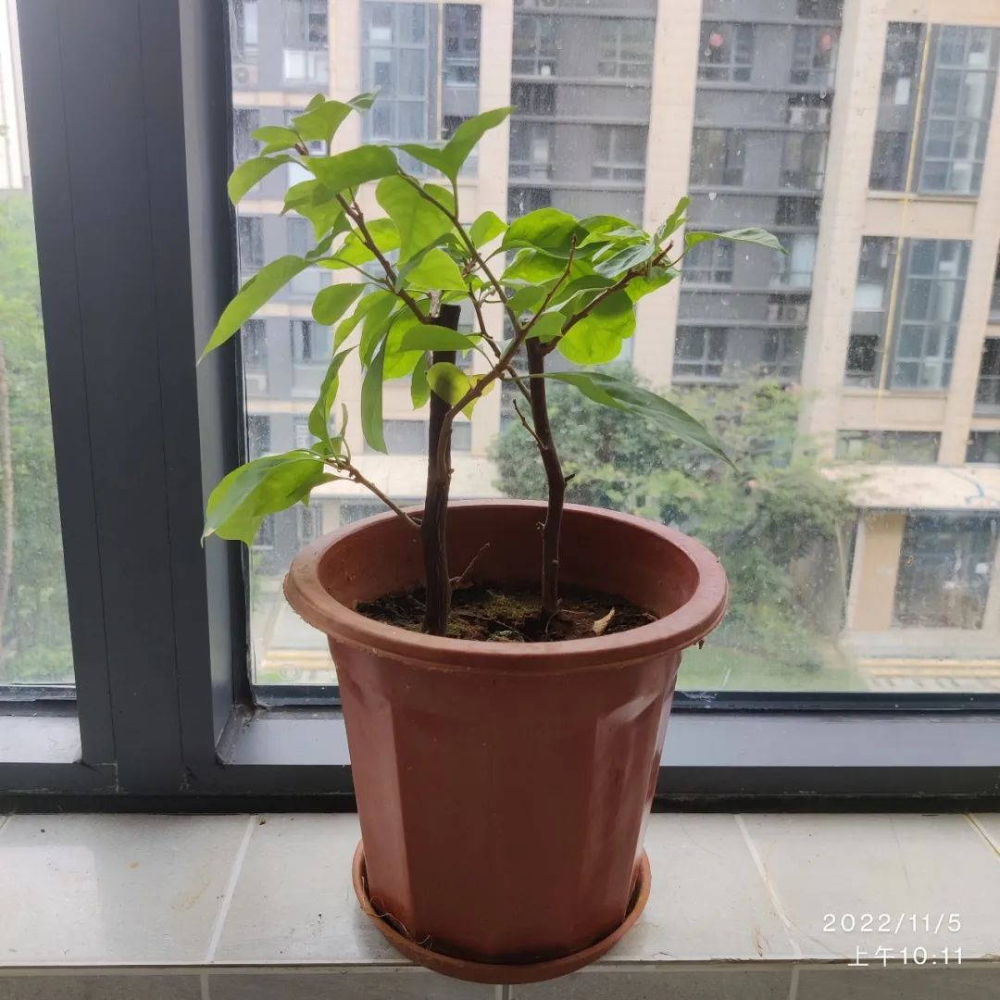
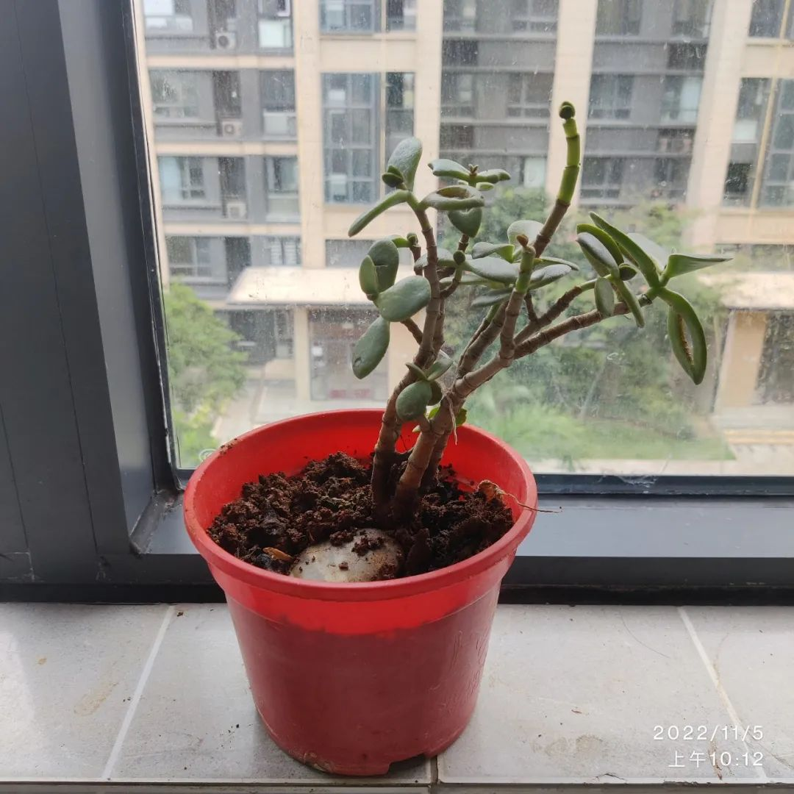
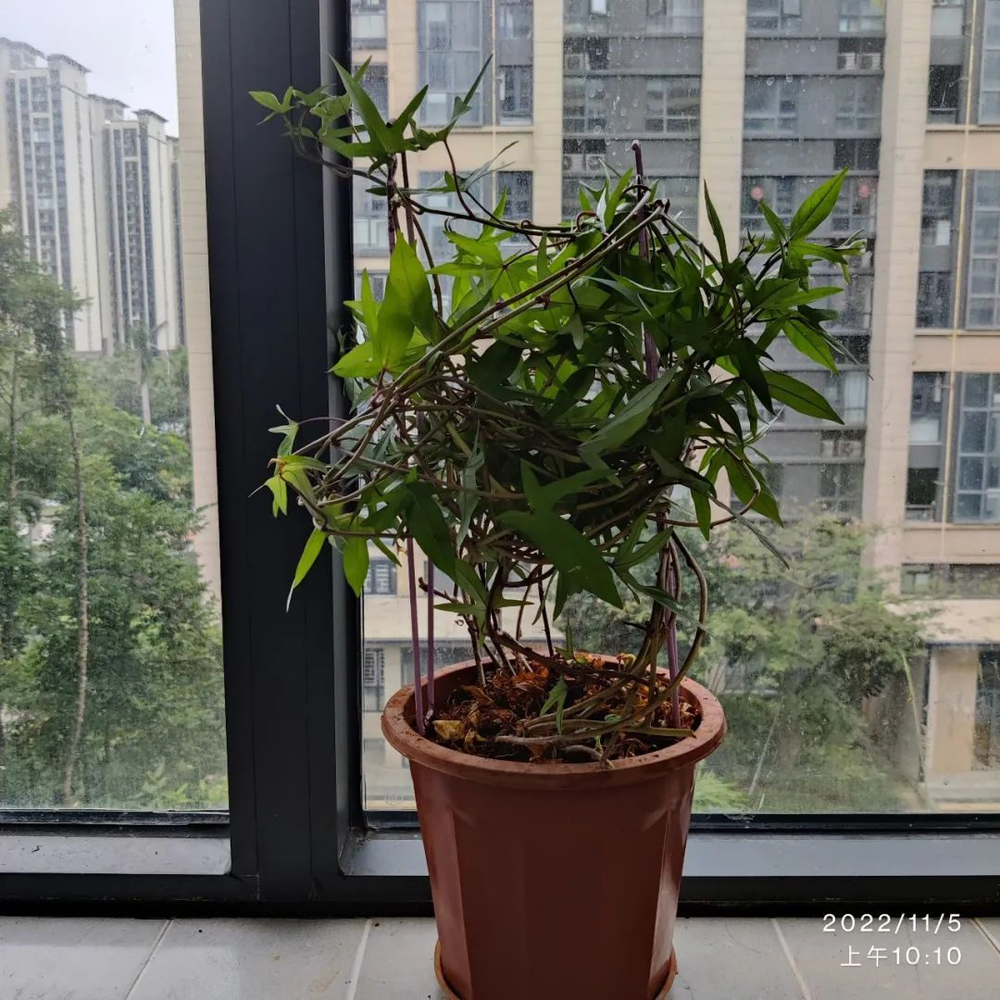
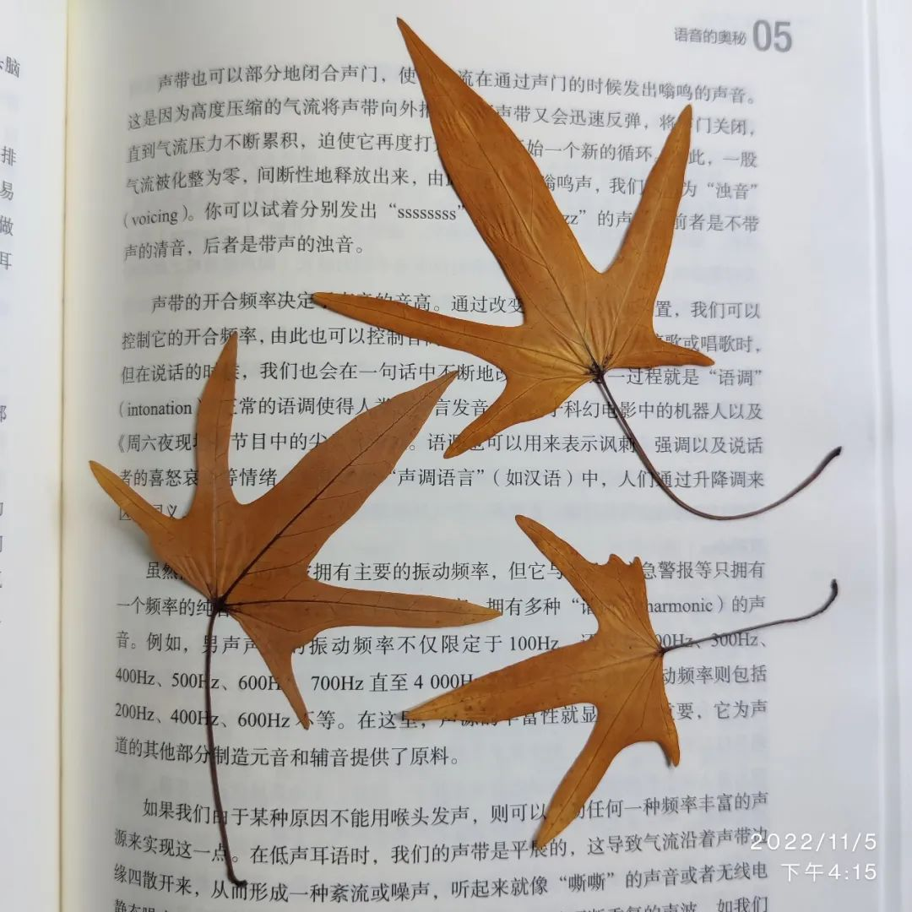

早上，将阳台上的几盆植物拾掇了一下。

那本是老父亲栽培的，但他回老家了，那些植物就没有专人打理。我们有一搭没一搭地浇水，谁想起来了就谁浇 —— 有时几天没人浇，有时一天浇几次，时旱时涝。

## 三角梅

最具生命力的是一株三角梅，非常顽强。因而记录在首位。

她第一次枯死，是因为家里有段时间没人住，没有浇水。当我们回来时，那株三角梅干枯得没了一点生气，不见一片叶子，只剩下短桩，花盆中的土也干得裂开了。若将视线限定于盆中的那片土地，那短桩仿佛是沙漠上的枯木。本要扔掉的，但想着其他的花草长大后可以移栽到这个盆中，就姑且留着。在给其他花草浇水的时候，也顺便往这三角梅里倒了一些，大概是略尽人事心态，本没有抱希望的。哪知这三角梅竟然活过来了！

初见她长出绿芽的那一刻，我不由得很是惊喜与感叹。那是对她重生的惊喜，更是对她不屈的生命力量的感叹。

从此，我就对这株三角梅上心了。她也不负所望，披在身上的绿意渐浓。

再后来，也是因为要长时间离家，如何给这些草木浇水便成了一个亟需解决的问题。我将任务交给了儿子，让他去网上查找“滴灌”的视频学习，找到解决之道。那是儿子第一次利用互联网解决实际问题，他欣然接受，也不辱使命：将矿泉水瓶的瓶盖钻个小孔，然后将瓶子装满水，盖上盖拧紧，再倒转过来插在土中，水便慢慢地渗滴在盆中。我们找来矿泉水瓶试验了一晚，验证可行（按一晚的渗滴进度估计能维持个三四天）。于是，我们离家前将不耐旱的几个花盆里都安上了的“滴灌装置”，有两个用的是1.25升的可乐瓶。哪知，数天后归家，发现三角梅又枯死了，一瓶水才漏了十分之一的样子，那个孔洞便被泥沙堵死了。

如果三角梅有知，那应该是一种折磨：明明一瓶水就插在花盆，那水瓶还依傍着她的枝干，但她只能眼睁睁地看着，任凭时间抽干自己。就像囚犯伸手触碰狱窗外的轻风，而不得呼吸那里的空气；又像病重的患者看着医院的急诊室，却没有48小时内的核酸进不了门。

有了前一次的经验，我自然知道这三角梅并没有真死。于是，她又在我天天浇水的日子里发芽、长叶，成了这个样子：

这让我想起了中国人，想起了余华的《活着》——“要像牲口一样地活着！”从此，我脑海中关于顽强活着的意象，除了牲口，还有了三角梅：要像三角梅一样地活着！它们一个是动物，一个是植物，用不同的方式追求着同样的目的。

—— 如果我终将活得如此艰难，我宁可像那株三角梅，也不想活得像牲口。

## 不是多肉

我不知这一盆植物叫什么，原来随口叫她“宝石花”。后来发现人们管类似的一种植物叫“多肉”，但细看之下，她与多肉还是有区别的，她有明确的茎，但多肉似乎没有。老母亲很肯定地说，这不是“多肉”。

之所以将她放在第二位，是因为她很有来历。她来自于多年前我在上海租住的住处。

入住时，那房东让我照看他的植物，说得特别轻松：只要不扔掉就行，水都不用浇的。事实也是如此。

房东家的阳台是开放的，从房间到阳台的门口前，有一个圆台。上下楼都是这么设计，当阳光垂直照下的时候，那圆台上是阴凉的。房东有两三小盆都是这样的植物，就放在那圆台上。当下雨时，雨随风进，就算是浇水了。她很抗旱，就这么默默地生长，不但汲取着斜风雨露阳光，还有灰尘。我偶尔来了兴致瞧上几眼，总觉得她们与几个月前没什么两样。可等到我几年后搬家，才发现她们各自派生了几株，小盆中显得拥挤不堪。

我父亲很喜欢伺弄花草，他一见这植物便很感兴趣。临搬家前，他掰走了两株：一株带到了我的新住处，另一株他后来带回了老家。现如今海口阳台的这株，却又是他从老家那里掰过来的——老家的那株在他伺弄下，早已多发。

这株植物牵扯着我的过往。

正是在那个房子里，我和一段历史告别；也是在那个房子里，个人的奋斗有了起色。那几盆酷似多肉的植物，被我叫做了“宝石花” —— 我觉得她们的叶子就像宝石，而叶子簇拥在一起的样子，就像盛开的鲜花，一如我宝贵年华的绽放。

且不论她的本名如何，她都不是多肉；那时，我的肉也不算多的。

## 留香

最后出场的是一盆 —— 留香。

留香，不但是用来题名的，还是用来压轴的。

我估计很多人都猜不到它是什么植物，因为极少有人在阳台栽种红薯。

今天起意拾掇阳台的花草，便是因为这盆红薯而起。她的藤蔓和其他植物纠缠在一起，而有些红薯的藤蔓枯死，需要清除。

虽然我曾为物资紧缺而担心过，但在阳台栽种红薯并不是刻意的。

那是外家托人带来的福才地瓜，在海南是有名的品种，多淀粉，味美。由于给我们挺多，吃了几天就有些腻了，等再想起来的时候，发现有两个已经长出了长长的嫩苗，便不舍得吃它们，动了栽种的念头。正好之前有植物因旱死而空下来的花盆，便将这两个地瓜埋了进去。看着她们的藤蔓恣意疯长，我每天都浇水伺弄，一心想看她最终会长成什么样子。那两个地瓜，各自长了三四根苗，分别朝着阳台的东西侧生长。就长势而言，**向西侧生长的胜了，那藤蔓最先抵达了阳台的尽头，再向上生长，终吃不住重力的牵引，又掉下了高贵的头颅，往东回顾；而一开始向东的这几根，长得甚是敷衍，遇到三角梅后便纠缠在一起，不思进取。**

一开始，那藤蔓很细，它只顾向前，应该是想找到土地扎根，以便汲取养分，这阳台自是不能遂其心愿的。接着，由于扩张太快，她的补给难以供应，毕竟我天天只是浇水，而花盆就那么大，土壤的养分极其有限，里面的两个红薯母体自是扛不住这种消耗，就开始陆续脱叶，这也是一种自我保护吧。

我儿子喝牛奶总是喝不太干净，我母亲便将他喝过的牛奶盒剪开，用水涮上一涮，浇在上面当肥料。不久前，她又将橘子皮和水封在罐子里腐烂，以作为肥料。那红薯的藤蔓日渐粗壮，不再像往日那般弱不经风。

数天前，看着她时而的落叶，我便动了心思收拾一番，还专门捡了几片长得工整的黄叶做书签。那时想，要弄几根木棍搭个架子，以便她们扶摇直上。鉴于城市里棍子不大好找，终没有去找，就将两个衣架扭了两下，立在了花盆的两边，再将她们的藤蔓拾掇了一番，盘绕上去。

儿子周末起床晚。当我快收拾完时，他起床了，便过来围观，成了看（地）瓜群众。

我随口说：“你给她取个名字呗。”

看着这些藤蔓盘旋而上的模样，我以为儿子会取个“龙卷风”之类霸气的名字，哪知他略一思索，说：“就叫‘留香’吧。”

这突如其来的诗意让我有些愕然。便问：“为什么叫留香？‘橙留香’？”

他小时候看过一个叫《果宝特攻》的动画片，昨晚看的续集，里面的一些动画角色是水果，他们的姓名化用于一些武侠小说的知名人物。比如，陆小果（陆小凤），菠萝吹雪（西门吹雪），橙留香（楚留香），等等。

“是呀。我觉得‘橙留香’挺好听的，但我不能直接用，要改一下，于是就将‘橙’字去掉，叫‘留香’好了。”儿子回答说。

自此，这盆红薯便有了一个诗意的名字。而一旦一个人给其他东西命名，不论是人还是物，他都与之建立了关联，特别是，因为命名，便对其倾注了情感。

从今往后，这盆红薯便是这世上独一无二的红薯，因为她有个独特的名字。

留香于此，回味无穷。是记之。

