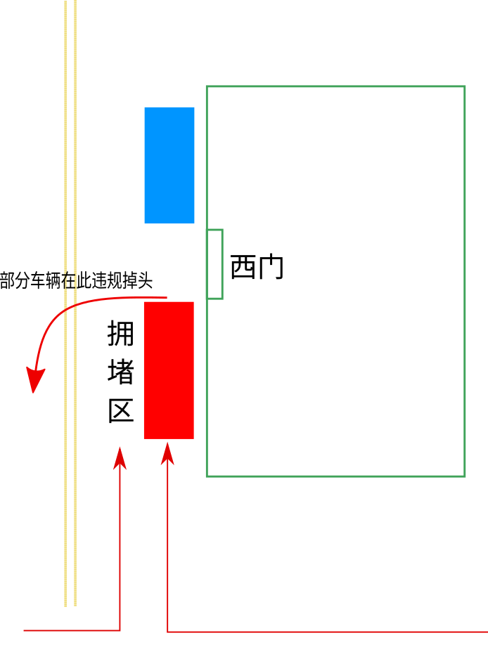

通常，我会在早高峰时送娃上学，他们学校门口的那一段路总是堵得一塌胡涂。这应该是很多学校在早晚高峰时段的常态。

我注意到了一个现象。

学校有个西门，那条道不是主干道，有相当一部分家长会将娃送到这个门口，这部分车流大都是从南面进入的。在西门的南侧会形成一个拥堵区，然而，在它北侧停靠的车辆却是很少。这是一个奇怪的现象。

以学生从西门入校的距离而言，不论车辆是停靠在南侧还是北侧，都是差不多的，而车辆多开几步的耗费完全可以忽略不计。那么，为何南侧的车辆如此拥堵（红色区域），而北侧如此稀疏呢（蓝色区域）？

一个显而易见的解释是，一开始进入这条道路的人就会选择在南侧靠边停车，即便北侧没有车辆，他也不会多开几步。正是他选择了“就近停车”，这就使得跟在后面的车辆不得不缓行，他们要么紧跟着停车，要么变道超车才能到前方，而高峰期这种变道的代价是很大的，多数人只得紧跟着靠边缓行。所以，只要前面的几辆车选择在南侧停靠，这个区域一下子就拥堵起来了。而一旦有人将孩子放下后违规调头，这两个车道将进入锁死状态，水泄不通。

为什么就是不愿意多开几步呢？为什么天天如是呢？

当我发现这种现象后，我总是试图在一开始就选择靠中线的快车道走，以便能超车到前方，停靠在北侧（蓝色区域）。然而，这并不顺利，我总是被裹在拥堵区，慢慢地朝前蠕动。

我不知道有多少人如我这般心思。实情就是，我们被他们裹挟了 —— 被那些短视与无序的人群所裹挟。

还不仅仅如此，很多时候我们都被裹挟着。比如，这次疫情之中的种种现象，都能让我们产生类似的感慨。

