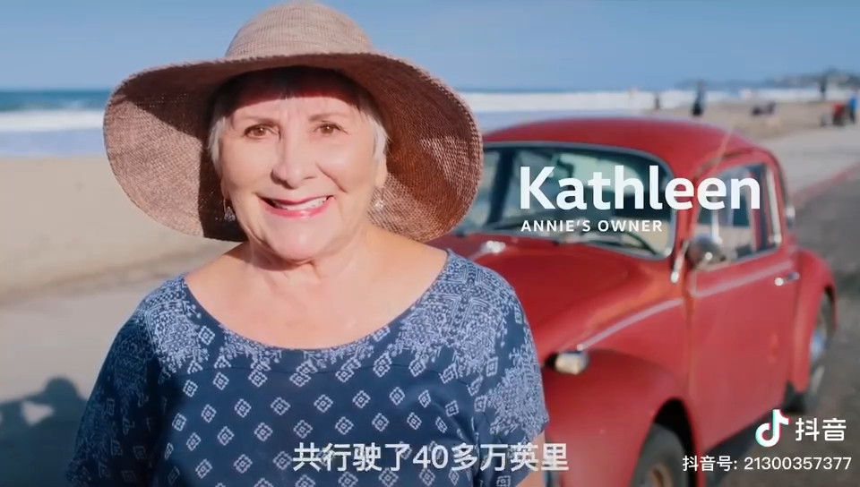
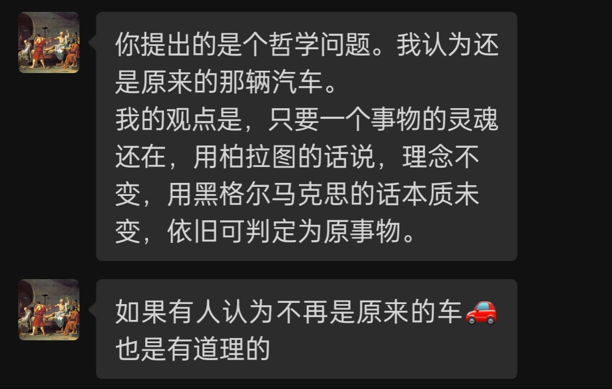

李老师分享了一则视频，讲的是一位 78 岁的老司机凯萨琳，一直不舍她在 1966 年买的一辆甲壳虫汽车。美国大众公司得知这事后，决定无偿将她的车翻新至 56 年前的样子。

这是一个令人感动的故事。故事里有不离不弃的老司机，有极富人文关怀的企业，还有一辆独一无二的甲壳虫。但也让我困惑：为什么那么老旧的车，美帝就不报废呢？美帝真不拿人命当回事？当然，这样的问题是不能细想的，特别是不能穷究，寻思多了就容易寻衅滋事。

我只能想想哲学问题，哲学会安全一些。

我问李老师怎么看这个问题：

> 当一辆车被换了多少配件以后，它不再是原来的那辆车了？
>
> 比如这辆甲壳虫，她换了40%的配件，特别是连发动机都换了。

李老师认为还是原来的那辆车。我很喜欢他的观点，因为“事物的灵魂还在”。

像汽车这样的物件，在很多人看来和石头类似，它是死的，没有生命的，怎么可能会有“灵魂”呢？但我理解这句话里面有深层次的内涵。

这关系到三观。首先，这体现的是世界观，然后便是价值观，最后会折射到人生观。

“世界观”有包含我们“如何看待这个世界”的意思，那么，“如何看待这世界上的物件”也就属于世界观的范畴。禅宗佛学有这样的名句：“一花一世界，一叶一如来”，我不想据此弄个“一虫一天地，一车一方圆”来强解。但毋庸置疑的是，当年有成千上万的甲壳虫被造出、被售卖，但又有多少辆被留下来了呢？视频中也有提及，凯萨琳家境是富裕的，不是她换不起车，而是不想换。

凯萨琳说：“她是我的家人，我的朋友，她只是老了，但没有老到不能动。况且，她从来没有把我扔在路边过。”

在 1967 年凯这辆甲壳虫上牌上路时，凯萨琳就给这车取了个名字叫“安妮”。所以，打一开始这别人眼中的交通工具就不是“它”，而是“她”，是伴她出门的朋友。也正是凯萨琳看待事物的方式不同，才让今天的我们看到了这令人暖心的故事。

为什么凯萨琳会有这样的世界观呢？

这就要说到价值观了。因为她给事物赋予了不一样的东西 —— 那堆组织有序的钢铁、橡胶与玻璃不是冰冷的交通工具，它还有附加的价值，她是有“灵魂”的。如果让凯萨琳来回答我的问题，她肯定会给出与李老师一样的答案。那辆被大众公司维修得焕然一新的甲壳虫，依然是她旧相识。

我们来到这个世界，如何看待周边的一切，人们总是会有区别的。看待的方式不同，所做出的价值判断不一样，自然会造就不一样的人生观。

回到问题的本身，这在哲学上是有原型的，被称之为“**忒修斯之船**”，是一个著名的哲学悖论。

> 忒修斯之船（英语：Ship of Theseus），亦称忒修斯悖论，是形上学领域内关于同一性的一种悖论。1世纪时的希腊作家普鲁塔克提出了这个问题：如果忒修斯的船上的木头逐渐被替换，直到所有的木头都不是原来的木头，那这艘船还是原来的那艘船吗？这类问题现在被称做“忒修斯之船”。
>
> 有些哲学家认为是同一物体，有些哲学家认为不是。在普鲁塔克之前，赫拉克利特、苏格拉底、柏拉图都曾经讨论过相似的问题。近代霍布斯和约翰·洛克也讨论过该问题。这个问题有许多不同版本，如“祖父的斧头”，佛教文本《大智度论》中一个旅行者替换身体的故事。（引用自“维基百科”）

“祖父的旧斧头”是一句英文的口语，指“某物每次都残留了本来的一部分，但更换了另一部分，逐渐所有的部分都换过”的意思。所以，当一个老外说起“Grandfather's Axe”，他很可能不是说他祖父真有一把板斧，就像我们说起程咬金的三板斧一样。

比较有意思的是佛教的版本：

> 忒休斯之船有一个佛教版本，以一个鬼故事的形式保存在4世纪的佛教文本《大智度论》当中。 故事讲的是一个旅行者晚上睡在一个空屋子里，半夜忽然两个鬼闯进来，为了抢夺一具尸体争吵不休。旅行者被要求裁定尸体的归属权，当他诚实地把尸体判给扛来尸体的第一个鬼之后，第二个鬼大发雷霆，撕扯下了他身体的各个部分，第一个鬼则不断用尸体的相应部分为他补全残缺的身体。最后当这个人的全身都被尸体替换之后，两个鬼一同吃掉散落地上的原本属于旅行者的肢体，扬长而去。我们的主人公则已经弄不清他现在到底是谁。

《聊斋》中应该也有类似的故事，我看过汪曾祺改写的版本。大意是一个人的老婆不好看，脾气也不好，那人经常嘴上抱怨（但其实习惯了）。后来，庙里的判官为了还他的人情，将他老婆的头换成了一个刚咽气的富家小姐的头，样子变好看了，脾气也变好了，但他却再也爱不起来了。我猜《聊斋》中原本的故事应该是有一个皆大欢喜、让人羡慕的结局，毕竟，能与判官攀上关系已经很了不起了，更何况得到了那么大的“实惠”。只不过汪曾祺偏偏“不解风情”，说换了头的老婆就不是原来的老婆，以此提醒世人，拍个黄瓜、敷张面膜都无伤大雅，那只是说明娘子爱美，但一旦动起了刀子割肉整容，又或者换某个部位，那就要小心掂量了。

这里顺便提一个问题：如果某女整容是将屁股上的一块肉割下来补在脸上，这时她的爱人亲她那里 —— 请问，他亲的是屁股，还是脸？

估计绝大多数的人都会说，扯什么屁蛋话，当然是亲脸蛋了。

好消息是，亚里斯多德也是这样想的。亚里士多德是这样解决“忒修斯悖论”的：

> 亚里斯多德认为可以用描述物体的“四因论”解决这个问题。构成材料是质料因，物质的设计和形式是形式因，形式因决定了物体是什么。基于形式因，忒修斯之船还是原来的船，因为虽然材料变了，但船的设计——形式因——没有变。从这个角度看**赫拉克利特的河流问题**，则两次踏入的是同一条河流，因为河流的形式因没有变。事物的目的决定了其目的因。忒修斯之船的目的在神话中是装载和运输，在现实中的目的是证明和纪念忒修斯，虽然材料变了，但目的没有变。（引用自“维基百科”）

屁股上的肉割下来补在脸上，其维持的依然是脸的面容。“形式因”没变。也就是说，即便某人因被完全毁容而将屁股上的肉割了补在脸上，那依然是脸面，而不是股面。

这里所说的“赫拉克利特之河”是指“人们虽然同样渡过相同的河，但流经身旁的水却是不同的”，但亚里斯多德面对“一个人能否两次踏进同一条河流”的问题，他的回答应该是掷地有声的：“能”！

我之所以认同那辆甲壳虫依旧如故，还是因为我们自身。

在我们的身体里面，每时每刻都有很多细胞在死去，又有很多新的细胞生出。若将我们的身体比作忒修斯之船，细胞则像船的木板，那这条船早就被换得很彻底了。事实上，我们也能够感受到这种变化，年龄的跨度越大，我们“形式因”的差别就越明显。但我们依然认为自己是同一个人 —— 即便我们的思想有了变化，“灵魂”也升华了，但我们依然是我，只不过是“新的”我。

对于一台计算机是否具备了人类的智能，我们该如何判断？图灵曾给出了经典的回答，被称之为“图灵测试”。

> 图灵测试（The Turing Test）由艾伦·麦席森·图灵提出，指测试者与被测试者（一个人和一台机器）隔开的情况下，通过一些装置（如键盘）向被测试者随意提问。
进行多次测试后，如果机器让平均每个参与者做出超过30%的误判，那么这台机器就通过了测试，并被认为具有人类智能。（引用自“百度百科”）

简而言之，我们在幕布前提问，幕后有人和机器给出回答，如果幕布前的我们无法区分哪些回答是机器给出的，哪些是人给出的，那么，我们就可以认为那台机器具备了“人类的智能”。图灵测试的底层逻辑是，既然“无法区分”，那就可以认为他们具备一样的能力。

当凯萨琳面对那辆翻新的甲壳虫时，她不是不能区分新旧，而是自己附加在车辆上的意象与情感不曾有变（或根本就不会想要去区分，就连“这是不是我原来的那辆”的念头都不会起）—— 李老师称之为“灵魂还在”。

这就像一位损友拿着我们幼时的照片，说那不可能是你，因为小时候的照片多可爱呀，而现在这么歪瓜裂枣，根本就不是同一人。图灵测试当面失败。但是，你一点都不急，就看着他笑笑，一脸的蛋腚，都懒得反驳，而是心中无比笃定，因为那就是你，灵魂一直在呢。即便图灵来亲测也无效。

翻新的甲壳虫依然是那辆老车，而我们每天都是崭新的自己。

