今年4月份中旬，儿子的学校搞“共读一本书”的活动。印象中，他们每学期（或是学年？）都搞这种活动。对孩子而言，多多阅读总是不错的事。而且，是那么多孩子“共读”一本书 —— 同样的文本，不同的孩子看见的东西不一样 —— 倘若活动搞得好，孩子们能彼此交流，思想碰撞，能体验到不同的角度与视野，效果会更好。

这次，语文老师选取的读本是：

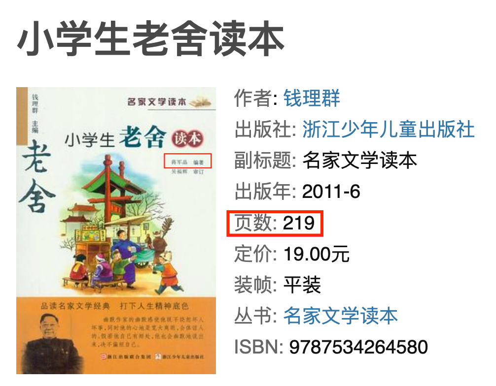

这是“名家文学读本”丛书中的一本。该丛书的主编是**钱理群**，这本书是由**蒋军晶**编著的。对于少儿改编书，我向来是保持警惕的，但想到钱理群老师的鼎鼎大名（我曾看过钱老师的很有思想深度的视频），不由得对这本书产生了兴趣。

当我看见豆瓣上一位读者的评论，我的兴趣更浓了：

—— 到底删改了哪些东西？

所幸，我找到了这本书的电子版。

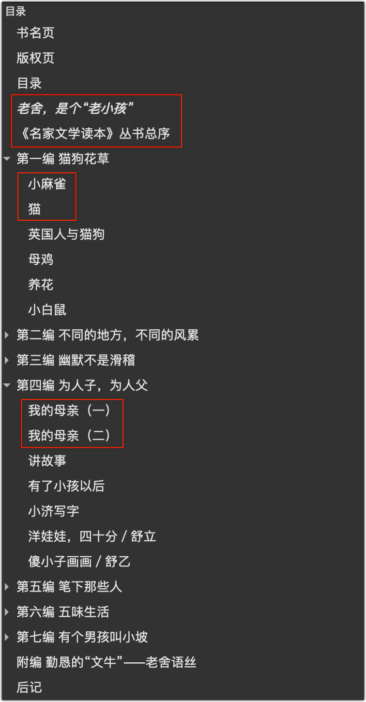

〈老舍，是个“老小孩”〉是蒋军晶老师写给孩子们的一封信，信中这样说：

> 你一定想读老舍的文章了吧？但你又担心，大作家的文章会不会生僻字很多，句子很深奥啊？不用担心，老舍经常把自己的书，签上名，送给小读者。他很自信他的书，小学生能读得懂，因为他往往用最少的字，最通俗的话描写复杂的心态、事物、风景。如果有人告诉你，写文章一定要多写一些“好词好句”，多引用一些“名人名言”，那么，老舍的文章告诉你，未必是那么回事。

我特别认同蒋老师这段话的最后几句：『如果有人告诉你，写文章一定要多写一些“好词好句”，多引用一些“名人名言”，那么，老舍的文章告诉你，未必是那么回事』。然而，前面的几句就很好玩了：『不用担心，老舍经常把自己的书，签上名，送给小读者。**他很自信他的书，小学生能读得懂**，因为他往往用最少的字，最通俗的话描写复杂的心态、事物、风景』—— 既然如此，蒋老师你直接选取老舍的原篇不就得了吗？为何还要删节？

因此，我原来的疑问更强烈了：删改了哪些？为什么要改？

〈小麻雀〉作为整本书的开篇之作，自然是首当其冲我要查验的。我找来了对比工具，将改写版和原著进行了对比（点击可看高清大图）：

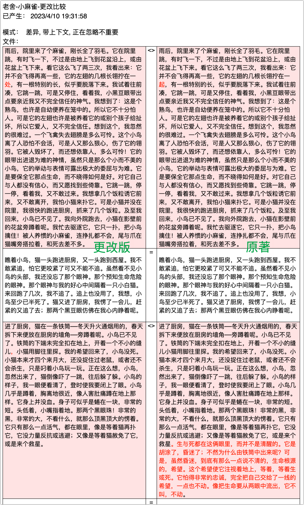

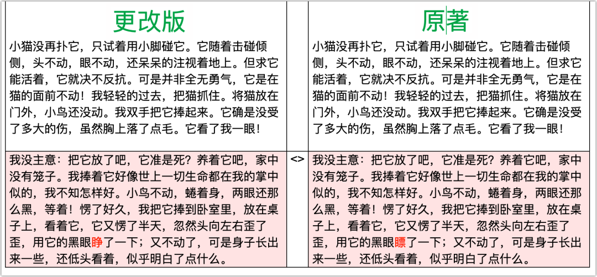

从红色高亮的字体我们可以看出，一共有三处不同：

1. 【少儿更改版：“它的左翅的几根长翎拧在一**处**”】 VS 【原著：“它的左翅的几根长翎拧在一**起**” 】
2. 【少儿更改版： “用它的黑眼**睁**了一下”】 VS 【原著：“用它的黑眼**瞟**了一下”】
3. 【少儿更改版】删掉了一段：

> 生与死都在这俩眼里，而并不是清醒的。它是胡涂了，昏迷了；不然为什么由铁筒中出来呢？可是，虽然昏迷，到底有那么一点说不清的，生命根源的，希望。这个希望使它注视着地上，等着，等着生或死。它怕得非常的忠诚，完全把自己交给了一线的希望，一点也不动。像把生命要从两眼中流出，它不叫，不动。

钱理群老师在这套《名家文学读本》丛书总序中有这么一段话，其中明确地提到了“确定了“只删不改”的原则”：

> 如何恰当地掌握学习的高度与难度的分寸，如何从孩子的接受实际出发，帮助孩子逐渐接近大师名家，这都需要教学的智慧与艺术。这也是我们的这次编写实验最为用心、费力之处，在这方面，我们也作了一些尝试，在范文的选择及其处理、编排（例如我们**确定了“只删不改”的原则**），“导读提示”和“读与思”的设计上，都下了功夫，力图在大师名家和孩子之间搭建一座桥梁。

以此来看，那段删掉的文字是本在预期之中的，但另两处只改了一字又是怎么回事呢？这让我很是困惑。

在一开始，我觉得这两字的更改是没有必要的，特别是将“用它的黑眼**瞟**了一下”改成了“用它的黑眼**睁**了一下”，是不合适的，因为我觉得“黑眼睁了一下”这样的表达怪怪的。既然编者明确了他们“只删不改”，那就不应该出现这种改两个字的情形，于是，我就考虑其他可能性，得出了这样的结论（发到了孩子的班级讨论群里）：

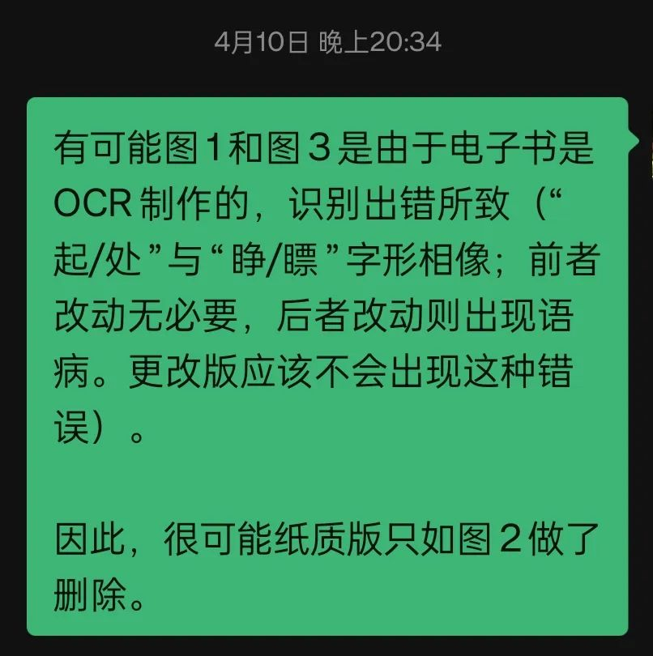

当时，我判断这是电子书在制作过程中出错所致，电子书很可能是先扫描，然后再做图文识别（OCR）的，这两对字因为字形相像而识别出错，因而导致了两处不同。少儿改编版很可能如其总序所言，只是删除了一段文字。

随后，我又找到老舍全集的其他版本的电子书，却发现有的居然也是“用它的黑眼**睁**了一下”。这就带来了一种可能：原著本就是用的“睁”，并不是少儿更改版识别错了，而是我用以对比的原著出现了OCR错误 —— 又或者，都没有识别错误，而是不同出版社的版本有差异？

另外，我在原著〈小麻雀〉的其他地方找到了这种表达：“猫又进了厨房，我愣了一会儿，赶紧的又追了去；那两个黑豆眼仿佛在我心内**睁**着呢。”也许，老舍有这么用词的习惯？

所以，这事就成了我心中的困扰。我想去图书馆查上一查，特别是想带着儿子一起去，让他知道我因何而去。在我看来，这两个字的较真，正是**科学精神**的体现。

4月16日，我带儿子去了海南省图书馆。在主馆，我找到了老舍的原著：

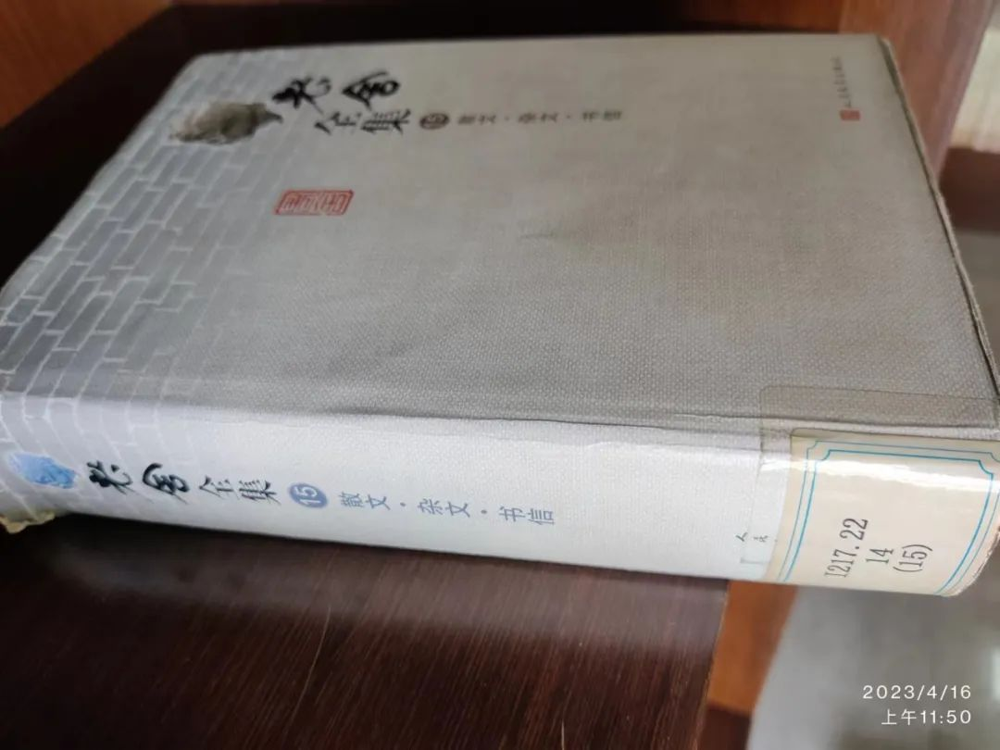

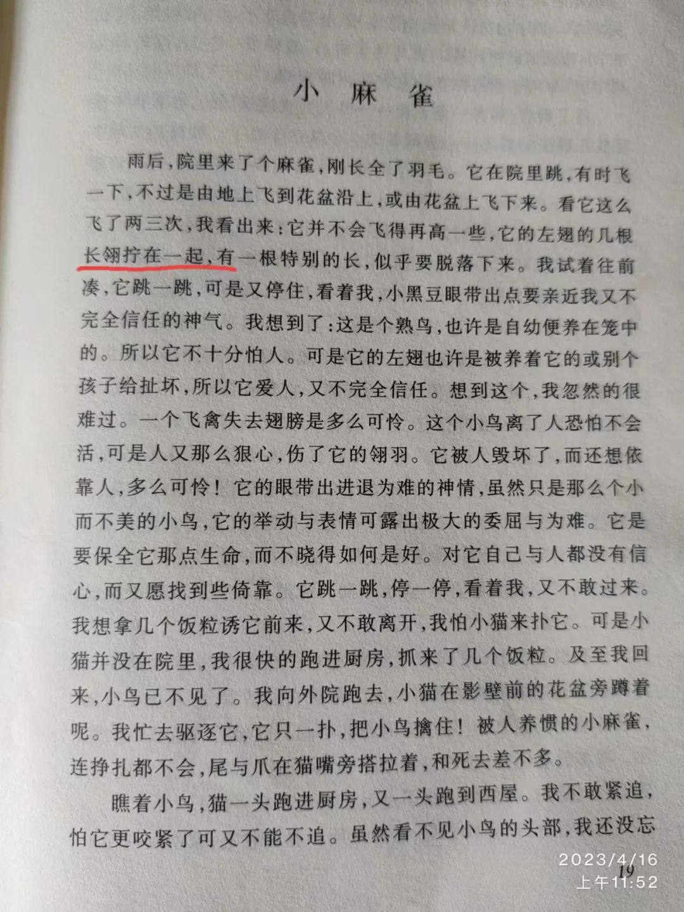

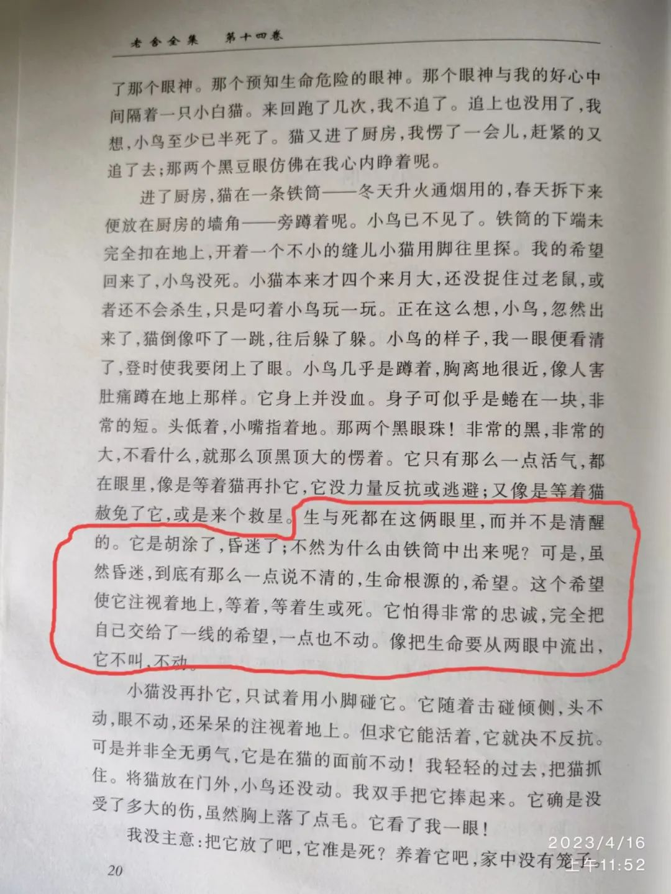

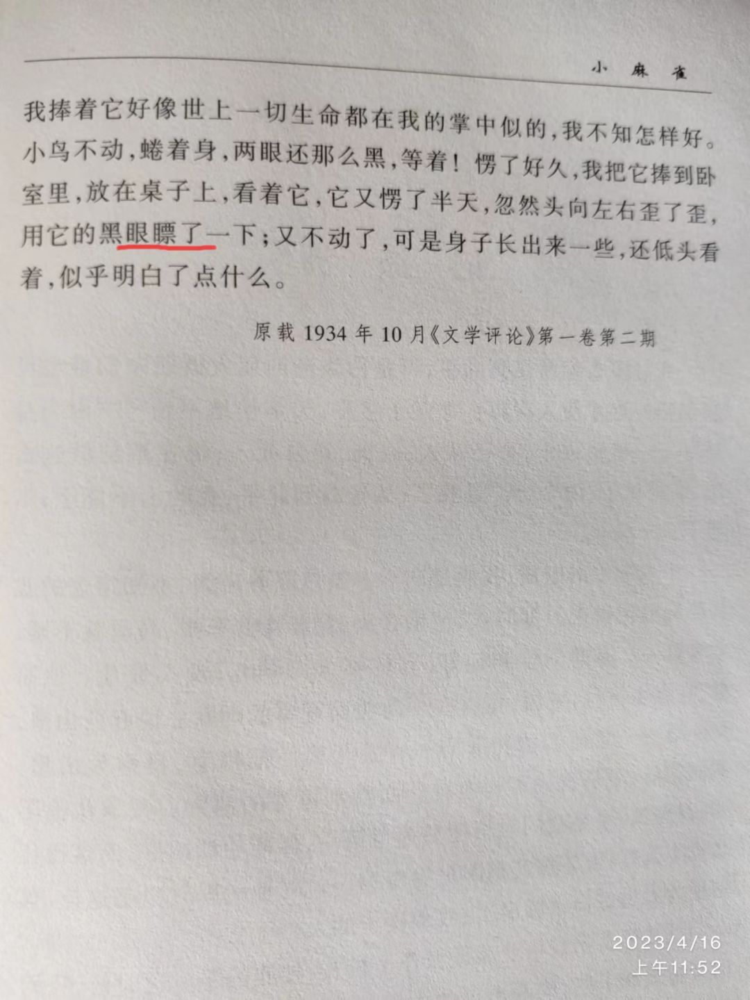

但很不幸运，那本《下学生老舍读本》不在馆（我都怀疑是被他们同学先下手了）：

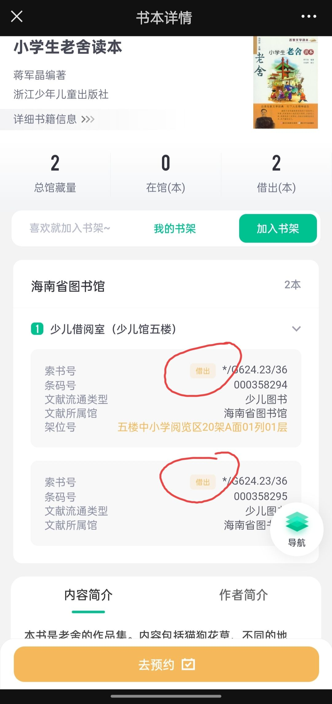

本可以问问语文老师或其他购买了这本书的家长，确认一下少儿更改版里面的那俩字到底是什么，毕竟，老师是布置阅读任务的，会有书籍；而家长们大都会响应老师的，也会买书。但那天我将对比结果以及个人的困惑发到孩子班级的交流群内，没有人参与讨论，似乎大家不感兴趣。我也就没有产生求助于他们的念头，反正也不是什么急事。

上个周末，6月3日，我和儿子再次去了趟图书馆，这事才算有了些眉目：

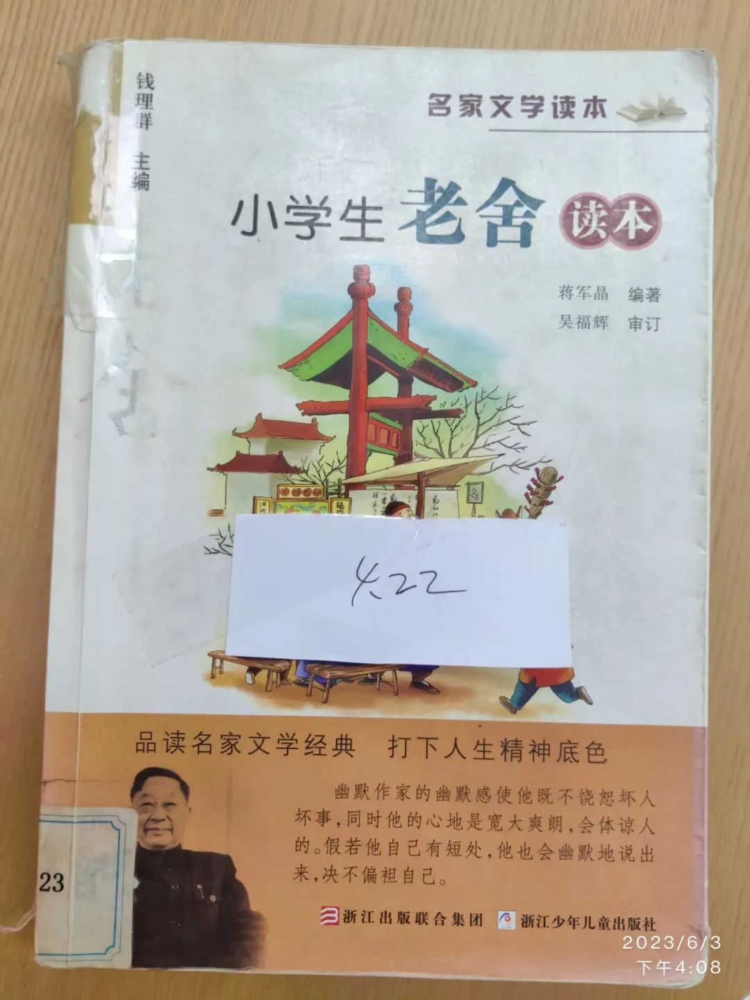

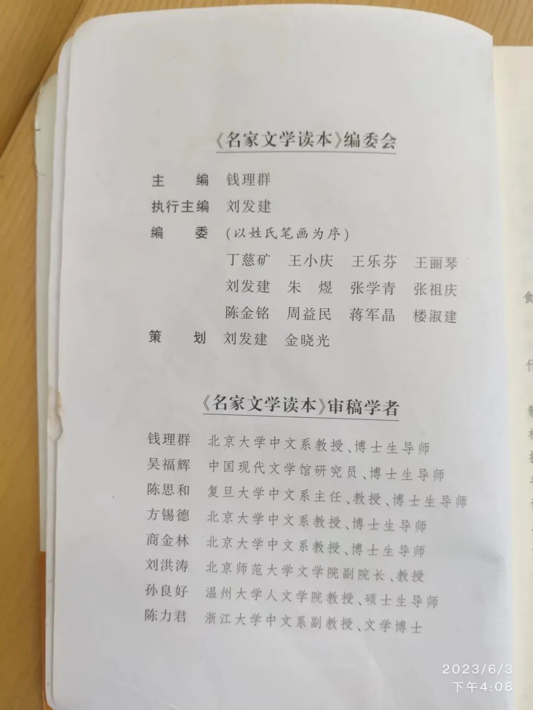

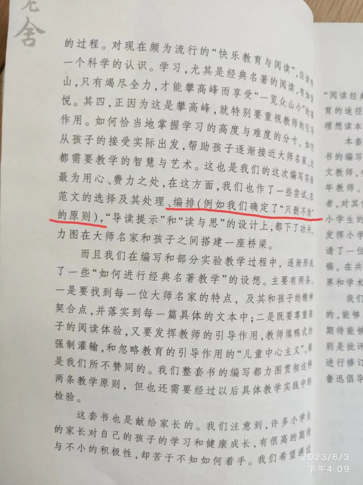

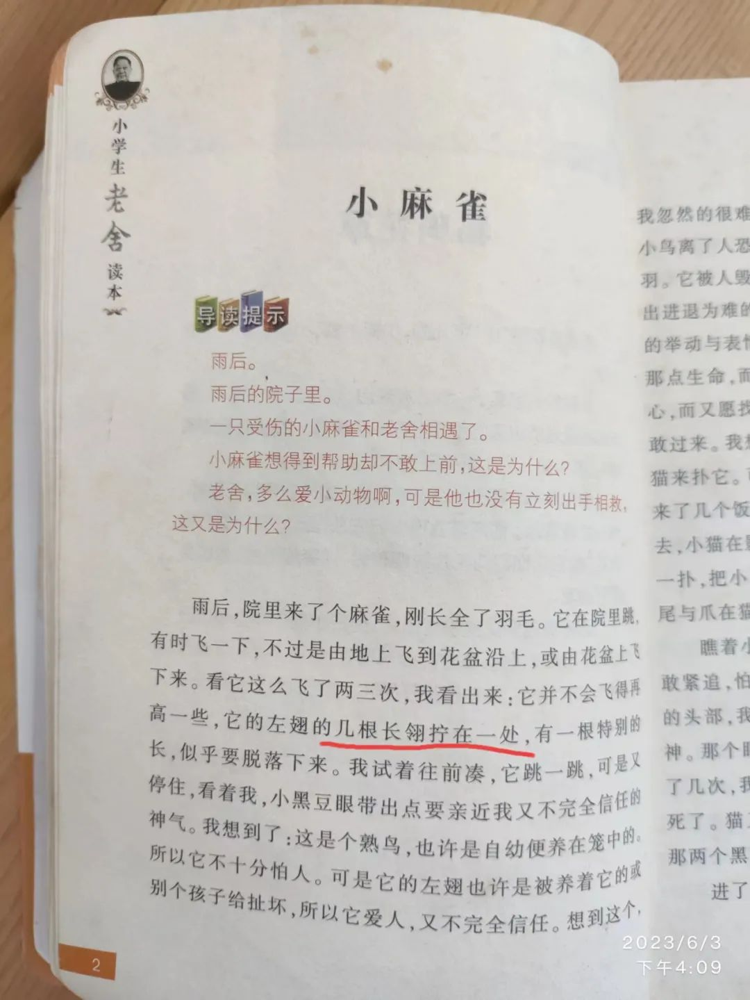

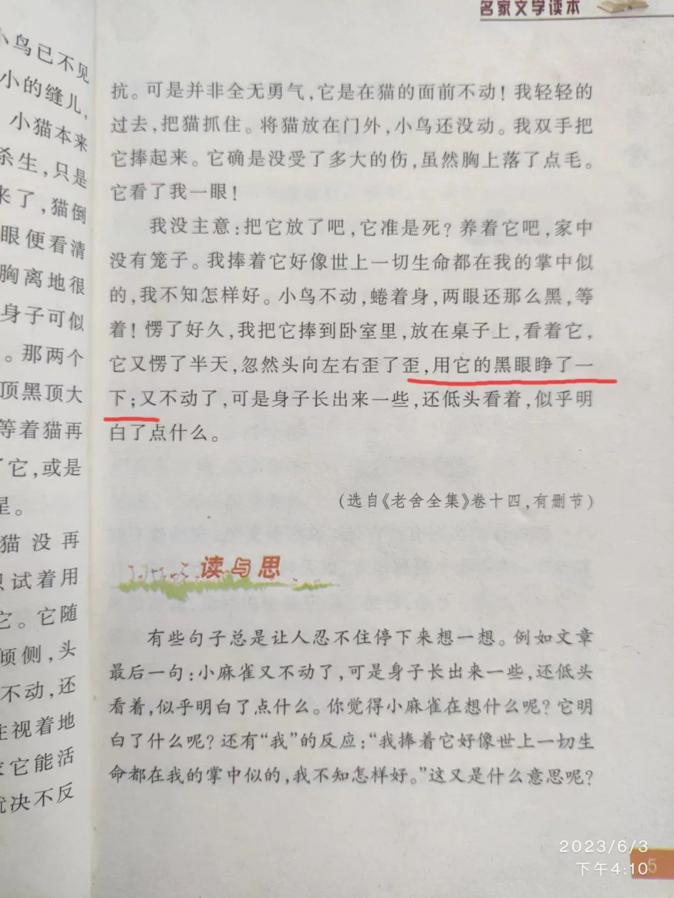

从这两本纸质书来看，我当初用来对比的那两本电子书并没有错误，本文一开始的对比图片中的差别是真实存在的：

1. 【少儿更改版：“它的左翅的几根长翎拧在一**处**”】 VS 【原著：“它的左翅的几根长翎拧在一**起**” 】
2. 【少儿更改版： “用它的黑眼**睁**了一下”】 VS 【原著：“用它的黑眼**瞟**了一下”】

所以，如果钱老师、蒋老师他们所宣称的“只删不改”是真的，那他们所采用的《老舍全集》原著就不是这个版本。但由于海南省图书馆只藏了一个版本，我就没能做进一步的查证。

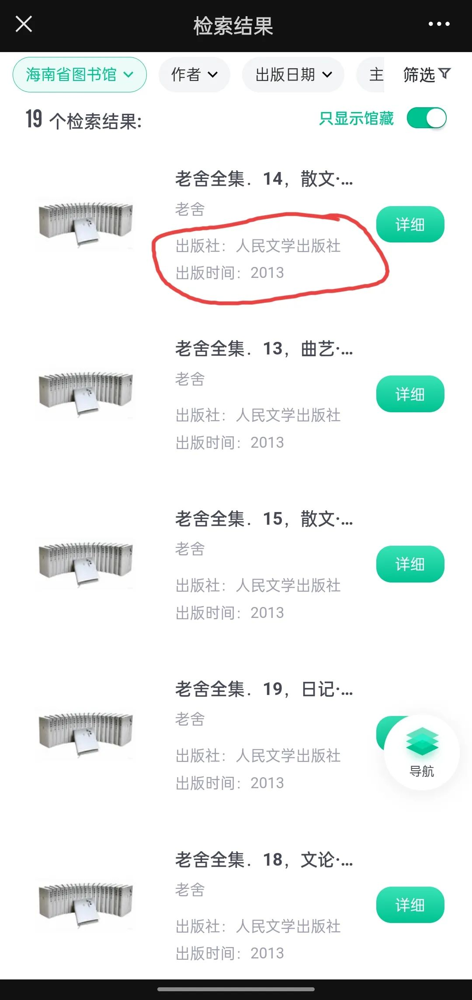

以这两本书的出版日期来判断，《小学生老舍读本》出版于2011年，而这套《老舍全集》出版于2013年。2011年的书不可能参照2013年的，因此，也存在可能，这两个字是在2013年人民出版社的版本中修改掉的 —— 只是，改这两个字干什么呢？有必要吗？

所以，折腾了两趟图书馆，我的疑问并没有完全消除，好在科学精神还是体现了一把。

再来说说【少儿更改版】的事 —— 我在标题中使用了“阉割版”的表达，这是因为我觉得钱理群在总序中所言的“只删不改”就是掩耳盗铃，似乎在他们看来，修改会破坏原意，但删除不会，或者说损失很小，但真这样吗？

先说〈小麻雀〉中的被删掉的这一段。以我个人的理解，被删掉的恰恰是此文的精彩之处：

> 生与死都在这俩眼里，而并不是清醒的。它是胡涂了，昏迷了；不然为什么由铁筒中出来呢？可是，虽然昏迷，到底有那么一点说不清的，生命根源的，希望。这个希望使它注视着地上，等着，等着生或死。它怕得非常的忠诚，完全把自己交给了一线的希望，一点也不动。像把生命要从两眼中流出，它不叫，不动。

一只刚长全羽毛的小麻雀翎羽有伤，被一只小猫捕杀叼走，差不多半死。小麻雀侥幸逃脱，钻进了一个大铁筒，而小猫是无法钻进铁筒的，这又给了小麻雀一线生机。哪知就在这时，那小麻雀又从铁筒中出来了，这突然的举动把小猫吓了个后退，于是，小猫就用爪子试探小麻雀……被删掉的这段文字，正是描写此刻小麻雀的生命状态以及作者对它的揣测，关于希望的。

总之，相比起那两个字的改动，我更难以理解为何要删掉这段与【生命和希望】相关的文字。当然，正如那些互联网删帖的人一样，“之所以删掉”，他们总是能搞出个“是因为……”。我估计**蒋军晶**老师，抑或**钱理群**老师，也会有个理直气壮的理由。但搞笑的是，蒋老师一边说老舍是语言大师，还特别提及老舍“他很自信他的书，小学生能读得懂，因为他往往用最少的字，最通俗的话描写复杂的心态、事物、风景”，但一边又拿起屠刀，在语言大师的作品上手起刀落 —— 是觉得语言大师的作品不够好，还是嫌语言大师的作品小朋友看不懂，好像都解释不通。

如果说这种“只删不改”只是影响了作品思想的表达深度，那对〈母亲〉一文的处理就真是难以恭维了。来看这段：

> 母亲活到老，穷到老，辛苦到老。她最会吃亏。给亲友邻居帮忙，她总跑在前面：她会给婴儿洗三——穷朋友们可以因此少花一笔“请姥姥”钱——她会刮痧 ，她会给孩子们剃头，她会给少妇们绞脸……凡是她能作的，都有求必应。但是吵嘴打架，永远没有她。她宁吃亏，不逗气。**当姑母死去的时候，母亲似乎把一世的委屈都哭了出来，一直哭到坟地**。不知道哪里来的一位侄子，声称有承继权，母亲便一声不响，教他搬走那些破桌子烂板凳，而且把姑母养的一只肥母鸡也送给他。

在读到“当姑母死去的时候，母亲似乎把一世的委屈都哭了出来，一直哭到坟地”，有几个人会认为老舍母亲的很多委屈来自其姑母呢？然而，在原著中，老舍却是明确表达了姑母对母亲很不好的：

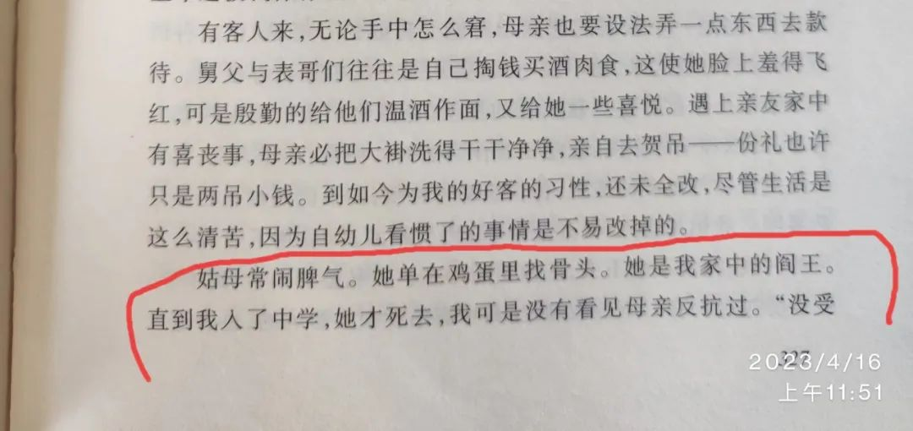

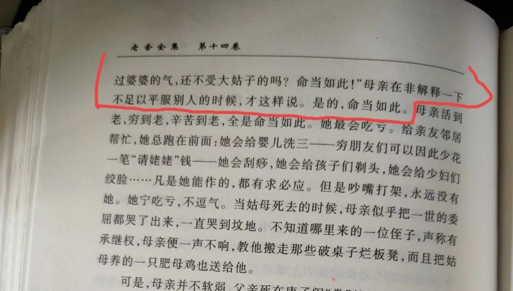

但少儿版这么一删，他母亲所受的委屈也就不为人知了。而这一删，其背后的逻辑又特别像那些删帖 —— 这种“家丑”怎么能说呢？删了！

据说，老舍生前曾如此放言：“改我一字者，男盗女娼！”以老舍的身份和修养，理应不会出此言论，但若真是因为对盗版的不满，倒也可以理解，毕竟，苦心孤诣的作品被他人胡乱篡改，着实令人憎恶。

钱老师和蒋老师们显然不在此列。他们也说过，他们只是“删”，而不是“改”，而且，他们似乎都是很讲原则的人（按《名家文学读本》丛书总序：「例如我们确定了“只删不改”的原则」）。

但我总觉得，这种阉割版的“著作”，真不值得浪费时间。老舍都有小学生读懂他文章的自信，怎么你们就这么看不起人？

倘若我儿子以后看见了我的这篇文章，记起他的老父曾带着他二访海南省图书馆……除了是希望他具有这种求真的科学精神以外，还希望他远离这种被阉割或者篡改的图书。倒不是说“语言大师”的作品就一字都不能改，不管是什么大师或者伟人，他们的作品不至于连一字都不能改，而是想说，像钱蒋这些老师们这么胡来，那书籍就不能顶着“老舍”的名字了 —— 即便我不喜欢老舍的作品。

不信？你再去看看那篇〈猫〉—— 都被他们阉得不能叫春了。

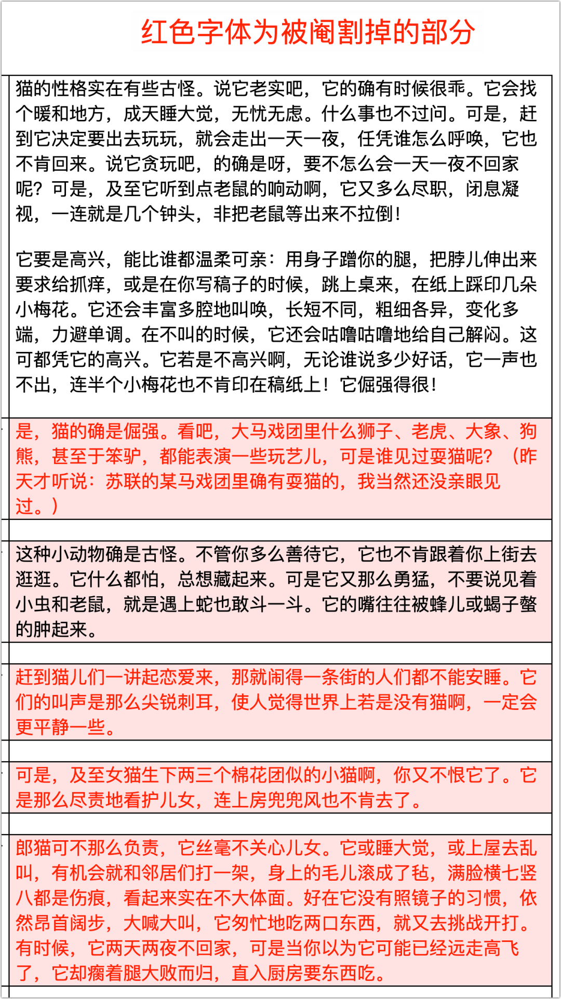

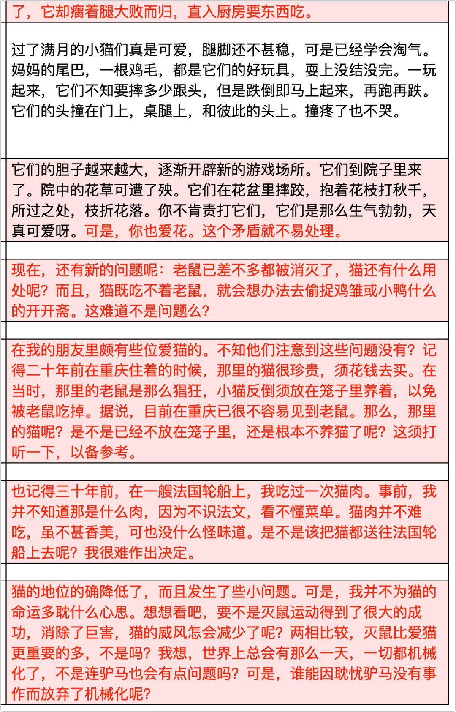

