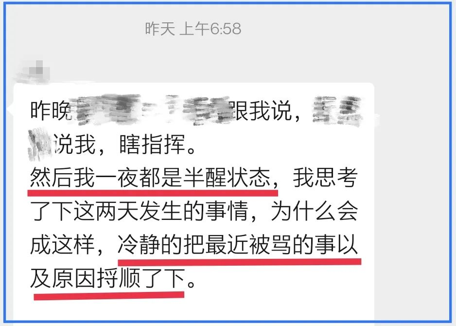
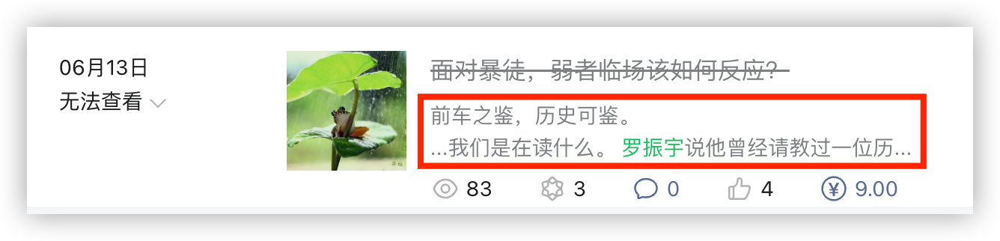
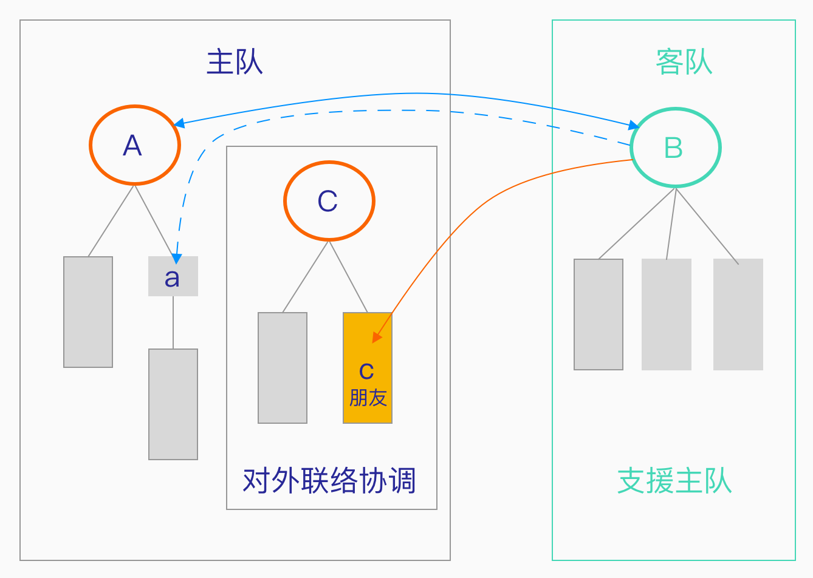
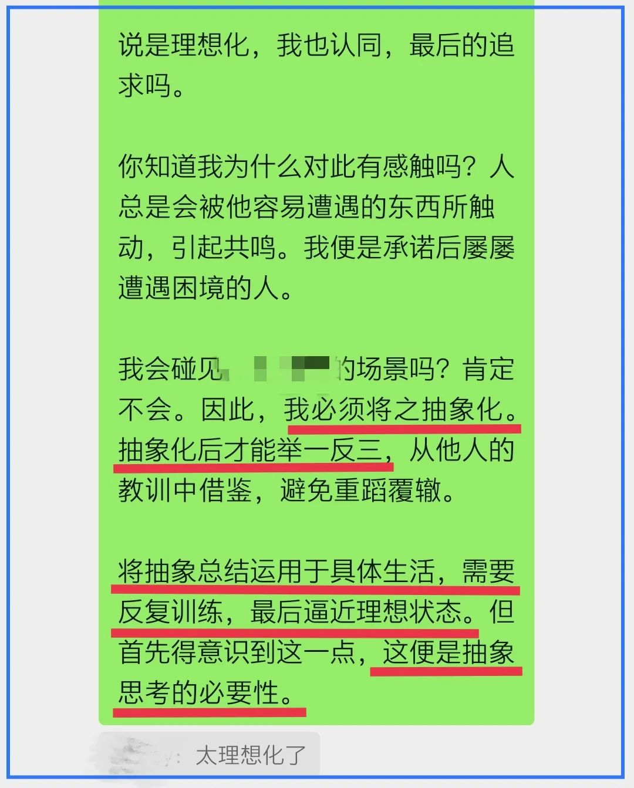

有个朋友是基层公务员。他为人正直，嫉恶如仇，又很热心。如果你在社会上摸爬滚打了一段时间，肯定能想象他的日常处境与心境。

我们有个小群，大家时而在里面吐槽，发发牢骚，彼此相互安慰，有点抱团取暖的意思。既是吐槽发泄，那肯定不会拐着弯说，都是直肠子。这天长日久的，自然免不了相互调侃，有时会有人这样找乐子：来，说点你们不开心的事情，让我开心一下。

然而，这大半年来很少有人说话了。大概是觉得吐槽已经失去意义了。我们都很沉默。大家默默地过着自己的日子，即便有谁偶尔转发一点图文，回应寥寥。

前天晚上，那朋友特郁闷，晚上 8 点多还在加班，而那工作本来和他没什么关系。他将几张工作照片发到了群里，没人回应。过了一会儿，他又说话了，特沮丧。一下子把我们勾出来了，都想安慰他一下。

等他再次出现，已经晚上 9 点多了。

那个群又“热闹”起来，一直闹到近11点半。聊到后来，那几副直肠子拐弯了，要给还单身的群主介绍女朋友……充分体现着“群众”对领导的深切关怀。在这每天喇叭叫着要核酸的深夜里，这个沉默了许久的小群内，弥漫着我们在线的欢乐。

**我以为这次热闹就像穷人过年，爆竹放完就消停了，哪知还年年有余了，大年初一又吃了一顿。** 这缘于一段文字。

那沮丧的朋友一夜没睡好，他起了个大早，写了很长的一段。这是那开头：

大年初一我睡了个懒觉，看见这段时他们已经聊过了，随着我的加入，又闹腾起来 —— 谁说穷人过年就不能多热闹下呢？

我狠狠地夸了那朋友，说这是很好的**复盘**。讨论复盘的意义便是本文的重点。

复盘是力图以旁观者的视角，将整个事件尽量客观地写出来，然后审视，看看有哪些地方可以改进。

简单的事情可以在脑子里回想一遍，稍复杂的我建议还是写出来。书写的过程是厘清的过程。在叙述事实的过程中，尽量不要参杂个人的情感，也不宜立即对人与事进行评判。评论应该放在最后，要将事实回顾与个人评论区分开来。请注意我的表达，是放在最后来做，不是说评论一定要放在文字的最后一段。你完全可以就事论事地将评论（嵌入）之前的叙述中，用“（）”区分开来，但最好是将事实完整叙述之后再来评论。

评论什么？

可以是多方面的，取决于你关注什么。比如，当事人的职责划分，是否越界；谁对谁错；经验与教训，等等。

不论你在乎的是什么，一定要谨记一点：**复盘是为了提升自己的**。这才是你回顾那不堪过往、独品苦涩的**终极目的**。

在复盘的过程中，你会分析谁对谁错，有些事情可能真是别人的错，搞清楚这一点即可，复盘时指责他人是无意义的。复盘是自查自省的过程，是为了提高自己，但复盘与自省稍微有点不同，复盘力图将自己抽离于原来的事情，以旁观者的视角来审视。

这过程像什么呢？像**看戏**。

你所写下的复盘过程，就是当时所有参演人员的剧本，只不过是他们表演在先，你记录在后。以看戏的心态面对过往，可以让你很好地抽离，以局外人的身份来评论是非对错。不妨将剧本中的自己换个名字来叙述，比如令狐冲、王熙凤、猪八戒等，会有很好的效果。

你还可以像**看历史**那样来复盘。

罗振宇曾在他所写的一本书里面谈及了历史，那是他与某历史学者的对话，对此，我持批判的态度。我曾在一篇文章中写过，可惜被和谐了。摘录那段文字如下：

> 读历史时我们在读什么？
>
> 罗振宇说他曾经请教过一位历史学者，读历史读到什么程度就算入门了。那学者说，“**当你不再认为谁是坏人、谁是蠢货的时候，当你能读出所有事件当事人的‘不得已’的时候，当你看到事实的复杂性的时候，就算是跨过了入门的门槛**”。
>
> 作为“如何入门”的讨论，我基本持同意的态度。这是一种跨越时空的共情能力，读史人努力置身于历史人物的情境中，用当事人的视角，切身体会与思考。袁腾飞也说过这么一句：“读历史即是读人心”，更宏观一些。
>
> 入门之后呢？罗振宇并没有讲，是他们的话题到此而止，还是他没有进一步说，我不得而知。
>
> 但我难以认同：“读出所有事件当事人的‘不得已’”。**如果我们事事都认为当事人“不得已”，那历史读来又有何用？**我认为，“以史为鉴”，那才是读历史的意义所在。
>
>  **他们就真的不得已吗？就没有其他选择？**
>
> ……
>
> 而我们现在，便活在未来的历史当中。

如果你的复盘结果只是“我那时不得已”，那这毫无意义。复盘便是为了找到新出路，寻求更优解。

复盘是以旁观者的心态，重新审视一段历史，以免重蹈覆辙。

所以，复盘时一定要牢牢记住一点：**这是为了提升自己。**

下面以那朋友的亲身经历为示例，具体谈谈如何复盘。

先简单介绍下他们的临时组织架构。因为疫情，有外地的团队来支援他们。主队代表当地的，客队代表前来支援的。小 c 是我那朋友，大 C 代表他的临时上司，C 部门是负责对外联络协调的，比如，将客队的需求反馈给相关部门，有时也直接为客队提供服务。姑且认为 A、B、C 三个领导是同级的。我下面的叙述【不一定】与实际相符，你可以认为我是故意的。

那天，朋友小 c 接到了客队领导 B 的电话，B 先是问了他的职责是做什么的，确定 c 是对外联络协调的以后，客队领导 B 便和 c 说：主队【A 方】找他要人手，他答应了一个数目，但由于有些队员生病等情况发生，不能如约定提供，这个缺口还有点大（两位数）。客队领导 B 让那朋友代为转告 A 方，而且，B 不确定 A 是谁。

朋友 c 对此事一无所知。

按说，这种事情肯定是 A 与 B 商议而确定的，客队领导 B 要亲自和主队领导 A 反馈才是。但由于客队初来乍到，主队有不少领导给他致电慰问，客队领导B一下子接到 20 多个电话，其中就有问及能提供多少人手的，由于这通话夹在慰问的电话当中，客队领导 B 搞混了，不记得那联系人是谁。

那朋友 c 也不知道谁在负责此事。客队领导 B 为何会致电与他？事后确认才得知，因为他与 A 的下属 a 同姓，B 错把他当 a，而在确认朋友的职责时，得知他是负责对外联络协调的，便觉得传个话肯定没问题。

—— 如果你是我那朋友 c，你会怎么回复客队领导 B？

如之前所说，我那朋友是个热心人。如果他以对此不知情而拒绝，让客队领导去找别人，他担心会给客队坏印象，有踢皮球之嫌，毕竟人家是来支援他们的，而他们又是负责对外联络协调的。特别是，他认为主队是一个团队，那句“这不归我管，你应该去找别人”，他是万万说不出口的。所以，他应承了下来，向他认为相关的负责人逐一上报。

结果，当他上报给领导 A的时候， 被A劈头盖脸地一顿骂（请注意，c 并不是 A 的下属）。

领导 A 一来是生气客队变卦，本来说得好好的，现在缺口那么大，他一下子去哪里找那么多人？如果说这是迁怒于那朋友，那接下来是直接针对他：他质问 c，为什么是他转达信息，客队领导 B 为何不直接向业务组反馈，骂他多事。

这就像一幅扑克扣子桌上，魔术师要找出红桃 A，但他忘记给那张牌做记号了。可魔术师还得往下表演呀，他便在场下找了个观众。可那观众能有什么好办法呢？他不好拒绝魔术师，只好硬着头皮上了台，挨张儿地翻牌看，终于翻到了红桃 A。哪知红桃 A 一见这翻牌的人连双白手套都没戴，立马就翻脸了 —— 谁让你来翻我的？换魔术师来！

如果你是那朋友，会不会很委屈？

如果是你来复盘，将自己代入 c 位，你关注什么？

毫无疑问，这领导不咋地 —— 有领导能力的会这么做：

1. 谢谢c转达信息，并询问B为何没有直接与他们沟通（询问原因可以知道问题所在，以便使得沟通更通畅）；
2. 立即与B沟通，再次明确沟通渠道，并与之确认c转达的信息；
3. 马上想办法补人手的缺口。

如果将复盘聚焦于领导 A，那意义就不大了（除非你想当领导，还是看你关注什么）。A 是第三人，还是另一个部门的领导，不可能为你而改变。所以，我们应该审视的自己，思索有没有更好的应对方式，不能归结于“当事人不得已”。

由于那朋友特委屈，所以，我复盘的目标便是“如何避免挨骂”，换言之，在保证有所作为的前提下，还能置身事外。

“有所作为”是指在客队找上门的时候，不让对方误以为你在踢皮球，以免破坏团队整体的形象，得真诚地提供帮助；“置身事外”是守住界限，不传达具体的信息，而是为双方建立连接。我能想到的是：

1. **回复B**：好的，我会帮您找到负责人，让他尽快和您联系。
2. **告诉A**：B说他们人数有缺口，但不知道和谁联系，电话打到了我这里，让我找到负责人。请尽快和B联系。

在这个示例中，领导 A 是怪他“多事”，而在另一个示例中，那领导则是怪他“不多事”。第二个复盘示例是那朋友在大年初一所碰见的。

那领导称之为 D ，他也不是那朋友的直系领导。D 在电话中问 c 一件事，c 确实不知，由于之前的教训，他就试着推辞，说这事他不清楚，要问他的领导 C。哪知这领导 D 也冲他来劲了：

> **你们都是怎么做事的**，我问你了，你不会向你领导 C 问清楚吗？？

显然，领导 C 不在c身边，否则，不就是顺手递个电话的事吗？那朋友很想回怼一句：你不会自己问 C 啊？他终是没敢那样说。

要是我碰见这种情况，那肯定是一万匹草泥马在内心奔腾，直接就回敬了。以我的经验，这种人是欺软怕硬，就得硬刚，不能让他们蹬鼻子上脸……但以复盘来看，要如何回应才能把话说到位，不卑不亢呢？

可以这么回应：我不是统揽全局的人，统揽全局的是领导 C，您直接问他会最快，最节省时间。

D 作为领导，直接与领导 C 打交道才合理，但他却偏偏选择了 C 的下属 c 来问，当没有达到预期时，就冲着 c 来劲。这种人一点界限感都没有。（看到这里，估计你也能体会到基层公务员的难处了吧）

如果你实在不想得罪这种人，关键的那句一定要说：**我不是统揽全局的人**。这意味着，你作为下属不可能参与所有的事情，不知道一些事是正常的。

你会发现，上面这两个复盘示例都与具体的情境紧密结合，这在体制内非常常见，体制外就未必了。那是否意味着复盘没什么用呢？答案自然是否定的。

首先，每次复盘都是一次思维训练。

就拿我来举例，如果处于朋友的位置，需要在分秒之间给出临场反应，未必能像以上所示的那样回应，但思考过一次之后，就成了个人的经验，如若未来遇到类似的事，就有用上的可能了。**思维是越训练越敏捷的**。

其次，试图在复盘时进行抽象总结。

这里再谈一个示例，是针对客队领导 B 的复盘。我认为他最初所给出的人数，是一个未经确认的承诺。在很多时候，实际情况并非我们以为的那样，这时，若是根据“我以为”而给出承诺，那后面便要吃苦头。这是“应然”与“实然”的落差，我们一定要根据实然来承诺。所以，我的复盘总结是：

在承诺之前，不妨多追问一句：我真的能够兑现么？

多问这么一句，就会迫使你再重新审视一下。比如，对于领导 B，是否可以先给出一个大概人数，然后表示还需再确认一下，方能给出答复？

有朋友说我这太理想化了。确实如此，临场时真不一定记得要自我追问。这便是训练的意义。只有多多练习，这声追问才可能成为一个锚⚓️ —— 一旦你要做出承诺，这个锚便像条件反射一般被激活，将你死死地拉住，不让你贸然驶向深海。你只有再次确认以后，才能解开那个锚，向前航行。

在这一示例中，**力图进行抽象总结**是复盘的另一个关键所在：

至此，三个复盘的示例就讲完了，都是些工作上的琐事，体制内的人可能更有体会，也希望对其他人能有所帮助。

前不久，我还用到了一个示例来复盘，那可是涉及到生命安全的，是血的教训，哪知却被人讥讽👉 [ 那些被山洪卷走的人](https://5shangzhi.github.io/blog/wusz-2022-08-14)：

他还真说对了 —— 复盘就是“马后炮”，就是事后诸葛。

所谓“复盘”，这个“盘”便是棋盘。我们很容易将棋子在棋盘上重摆一遍，可以不停地悔棋，以避免被将军而将死，还可以尝试如何走可以将到别人，找出最优的走法。但人生却是不可以的，每一步都无法回头，有的错误一旦犯下就难以挽回了。

我们唯有尽量多地复盘过往，回顾历史，从他人的经验与教训中总结，这样才能快速地提高自己。我们没有必要将他人的错误也犯一遍才来总结。

自身的糟糕过往，更是值得回味。因为那是亲尝过的，有切肤之痛，若能将那苦涩反复酝酿，只待那时间一到，岁月将之升华成美酒，一饮开怀。

**这便是复盘的意义**。

