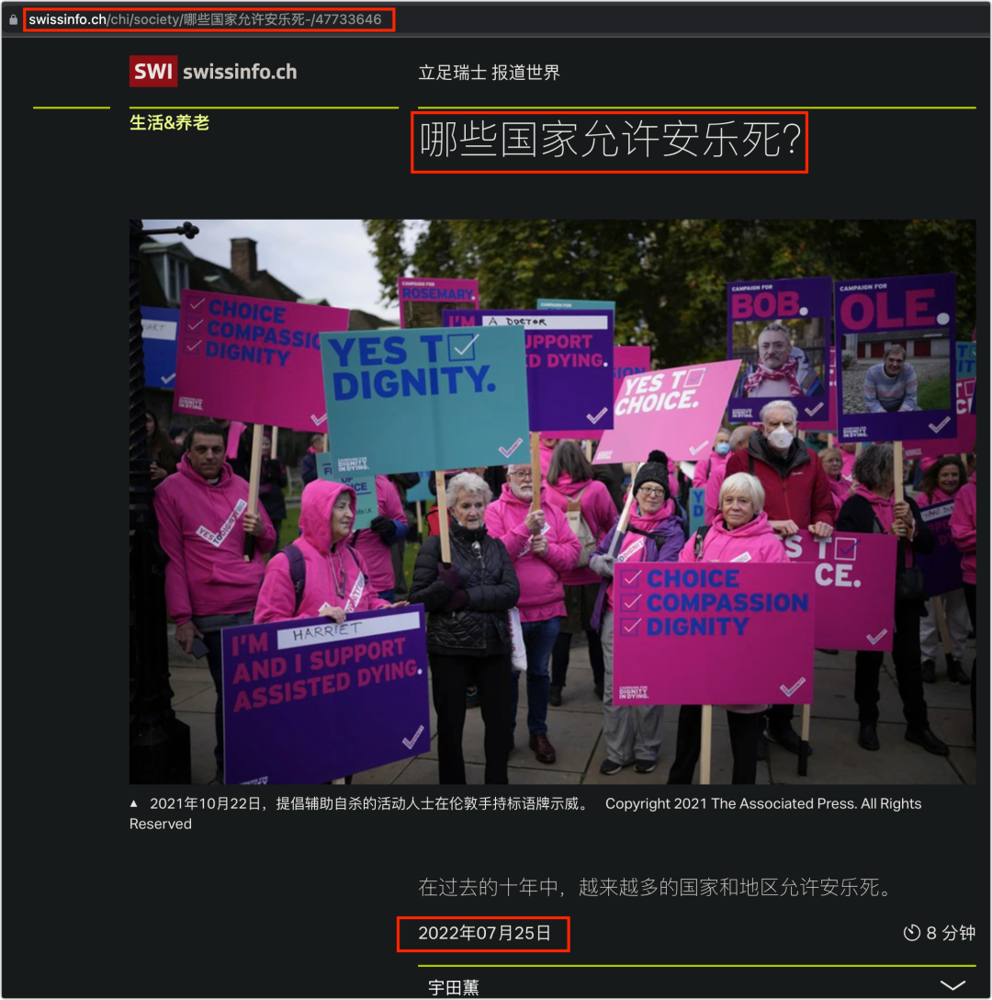
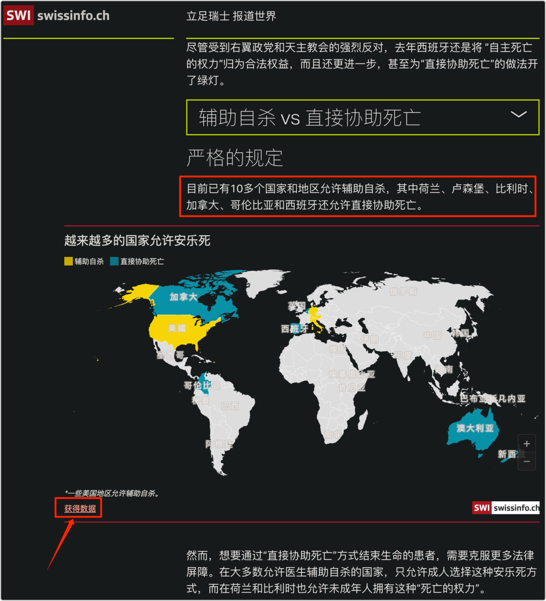
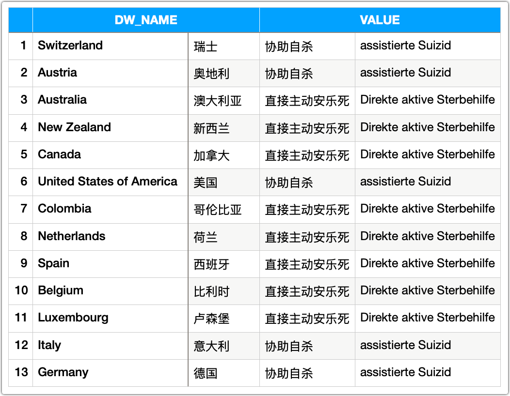
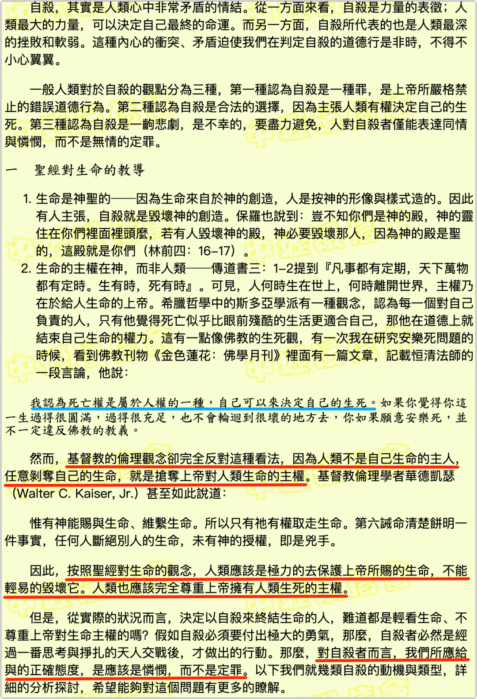

最近天门山自杀的事，不乏有人探讨。有些人认为讨论这事的文章是吃人血馒头，但我不这么想。

事情已经发生了，而且影响面很广，那么它就值得讨论，不论是从生命的角度，还是仅仅从新闻的角度。毕竟，4个平日没有什么交集的人集体自杀，很是罕见。而自杀这种事，很容易产生模仿效应，倘若人们不讨论，有价值的观点得不到传播，那些知道了这起事件的人就难以摆脱负面影响。

倘若有人表达他“一直在考虑怎样离开这肮脏的世界”，我们的回应须得小心，不宜抛出“求死得死”的论调，哪怕是“不自由，毋宁死”这样的回应都应该慎重。像我这种追求自由，多少明白点自由价值的人，必定是认同“不自由，毋宁死”的价值与意义。但是，在这事件的大背景下，这样的回应就显得不合适，它可能会促使想死的人往前迈一步。

诚然，这样的回应谈不上是诱导他人自杀，毕竟，一个有行为能力的人应该是生命的第一责任人，不能因为有人说了一句“你去死”，说话者便要对他的生死负责。说到底，一个行为人真要自杀，是很难防的。似乎每一个人都“享有”着自杀的自由。

在探讨这种自由之前，我们不妨先问一个问题：世界上有多少国家与地区支持安乐死？

我找到了一篇**2022年7月25日**的文章：

这篇文章中给出了一张示意图：

我将从网站获取的数据翻译了一下：

其中，像美国等联邦制国家只有部分州支持，比如澳大利亚。我未作细考，大概就是这13个国家吧。

给出这些数据是想说明，人类文明发展至今，在法律上支持自杀或辅助自杀的国家很少 —— 即便当事人疾病缠身，遭受痛苦的折磨。

肯定有人要说，难道人连自杀的自由都没有了吗？自杀还要法律的允许？法律管得找吗！死都死了，你能拿死者怎么样？

一个人真要自杀的话，法律确实管不着，但就是不允许。当然，这有着其他方面的考量。比如，A将B杀死，然后声称是B要求的，而B已经死无对证了。法律上需要避免这种漏洞（支持安乐死的国家也有着非常严格的程序）。但从另一面来看，即便B真的要求A帮助他去死，A的协助也是违法的。

我认为这种“不允许”更是人们**对于生命的态度**的体现，并且有广泛共识：**生命宝贵且只有一次**。这句话人人皆知，但恐怕不是人人都懂其中的意义，这就像人人都知道“知识就是力量”，但并不都喜欢学习一样。

自杀者往往是生无可恋，抑或是遇到了难以过去的坎，于是选择了轻生。但是，当事人若撑过去了最艰难的那一刻，迈过了那道坎，谁又能保证以后就不能遇到可恋的呢？但一旦轻生，之后所有的可能性便都没了。因此，“生命只有一次”更是一种警示，一旦主动放弃了所有的可能性，就无法反悔了。

我相信很多人都萌生过轻生的念头，只是没有付诸行动而已。当我们回头看时，就会觉得曾经的想法很是好笑，而当时的困难也显得云淡风轻。这也让我明白了一个道理：只要我们能从**更大的时间或空间尺度**去看待一时的困难，那些当初难以迈过的坎并不算什么。像这种回望觉得好笑便是从更大的时间跨度去看待困境。

这里也说个空间的例子。

前两年，曾有某幼儿园的老师组织全班同学霸凌一个小女孩的视频流传，我也写文章强烈地抨击过，而在那之前，还有某小学生因为老师的批评羞辱而跳楼身亡的事件发生。我相信绝大部分的家长看到这种视频或报道都会不由自主地担心，我也一样，赶忙给孩子做心理建设。这种心理建设如同消防演练一样，很有必要。我给儿子看了那个幼儿园的视频，让他体会那个被霸凌的孩子的心情，问他会怎么应对。那小女孩被霸凌的时候，她被限制在教室里，那是一个暂时封闭的场所，周边都是满满的恶意，但只要她能跳脱于当时的空间，想想不远的家，那里还有父母家人在等着她，爱她，那她就能撑过去。所以，我和儿子强调的便是这一点，**一定要从更大的空间来看待当前的困境** —— 倘若困在学校，就想想学校之外；倘若困于某个公司，就想想换一个公司会如何。总之，只要你不是被拘禁，逃脱当前的环境是很快就可以做到的，重要的是你需要撑过那个痛苦的时刻。我和儿子说，即便是碰见了糟糕的老师或者同学，而我们又没有能力让他换学校，那他就需要将目光放长远，向未来展望，三五年之后便可以离开那个地方。这便是从更长的时间与更大的空间看待眼下的困境。

很多轻生者在遭遇困境的那一刻觉得无从选择。比如，在遭受欺凌时认为无处可逃，在遭受职场PUA时，觉得自己找不到第二个工作……这些都是因为他们将自己**局限于很小的时空**，从而走上了绝路，而实际并非如此：我们总是可以选择，总会有其他的选择。重要的是，我们不可以将所有的可能性全然否决。

由于宗教对生命有着特别的解释，这也让我好奇。比如，基督教如何看待生命？特别是，如何看待自杀？

我找到了这样的论述：

所以，以基督教的观念，人并没有自杀的权利和自由。我认为其底层逻辑是自恰的：因为生命是神创造的，主权在神，自杀便是“抢夺了上帝对人类生命的主权”。越权本是有罪，但基督教对于那些自杀的人，选择怜悯，而不是定罪。

我没有宗教信仰，但从自由的角度来审视生命，我认为自杀的自由是最低级的自由。

很多人 —— 特别是国人 —— 对自由存在误解，他们认为自由是想怎么样便怎么样，“那还得了！想杀人放火都行的话，那世界还不乱套了？”于是，他们得出结论：自由是个坏东西。殊不知，一个人的自由是以不侵犯他人的自由为前提，也就是说，自由会催生边界。

自由不是你想干什么就干什么，而是你在明了不能干什么的前提下，方才是想干什么就干什么。因此，自由首先要做到的是守住边界，不可以越界侵犯他人之自由。

简而言之，“为所欲为”是肤浅的自由，而控制欲望，能对欲望说“不”才可达真正的自由，不妨称之为高级的自由。

自杀者结束自己的生命，并不会妨碍他人，他们守住了边界，这的确是他们的自由，但从欲望的角度来看，想死便死了，只是遵从了欲望，而自杀是任何一个有行为能力的人都可以做到的，这便成了低级的自由。只有当你明明可以一死了之，但却对死说“不”，对你一时的欲望说不，那才是真正的自由，更高级的自由。

人们常说，“未经他人苦，莫劝他人善”。我不知道那些轻生者到底经历过什么，他们的苦是否比我的曾经还苦。即便是同样的苦，不同人的感受也会不同，阀值也不一样，因此，似乎难以说我一定就是“未经人苦”，那我不妨在此劝上一劝：**如果你崇尚自由，那么，你应该追求更高级的自由，要体验一下对死说不的自由**。

另外，如果将“不自由，毋宁死”理解成了宁可自杀也不能失去自由，那真是肤浅至极。

对于失去自由的人来说，如果是在反抗中死去，那才算是重新获得了自由，因为他在说“不”。

—— 这，才是“不自由，毋宁死”的真谛。

