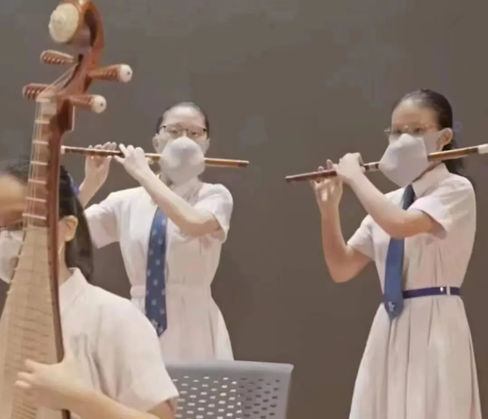
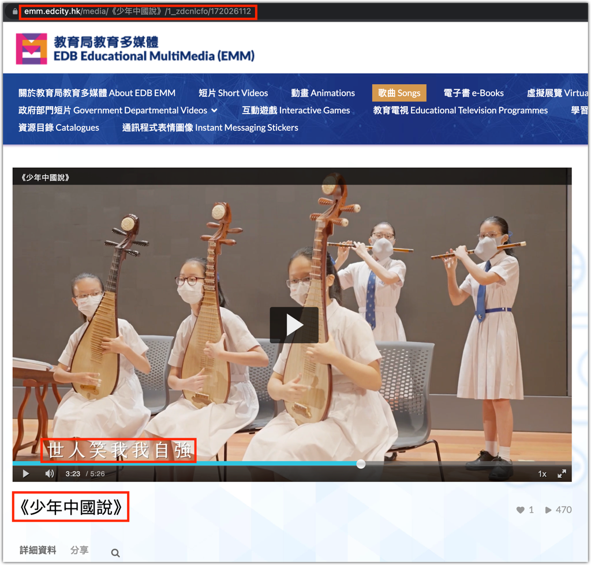
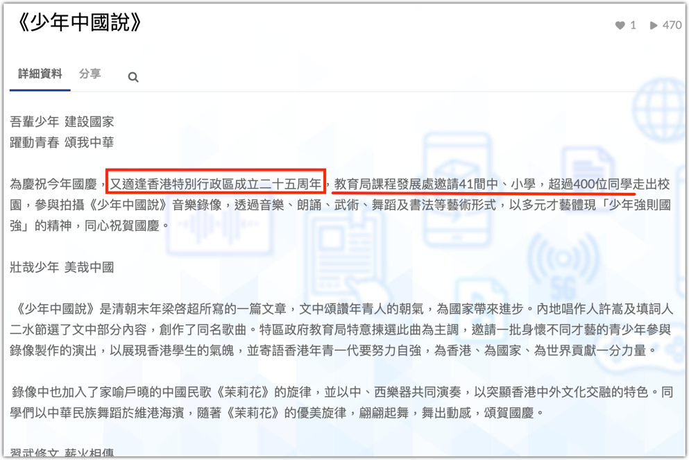
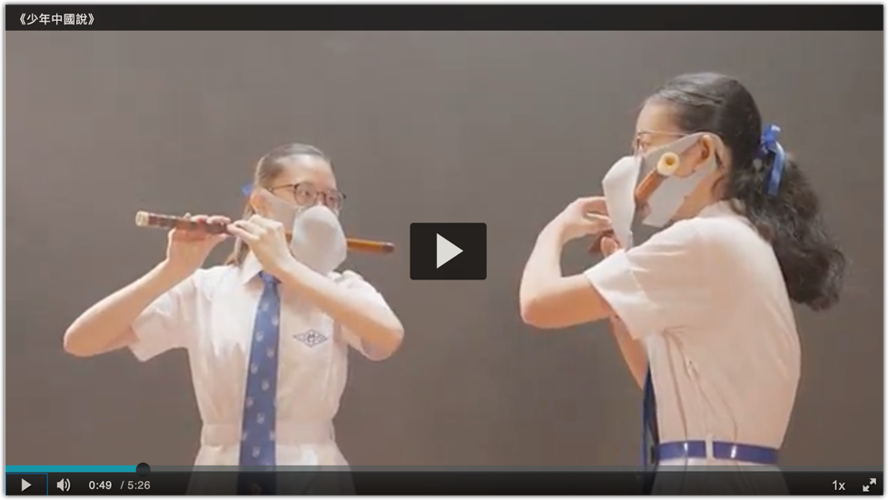

在微信群看见一张图：

先是好笑，觉得她们不搞个口罩的“外观设计专利”有点可惜了。

接着，荒诞感油然而生，之后转入悲凉。

—— 你说，她们这是干嘛呢？

除了**防疫**，我实在想不出还有其他的理由。但真的能防么？

她们所吹奏的、被称之为“笛子”的乐器，可是通过吹出气流而发声的！以防疫的要求，那须得将每个孔洞都得弄上一个具备口罩功能的过滤膜才行呢（按这思路下来，一个关于笛子的“外观设计专利”又呼之欲出），否则，你戴这口罩是啥意思？

而现在的这番操作，就是个不伦不类的半吊子 —— 难道通过笛子的孔洞所吹出来的气溶胶就不传染了？

所以，但凡拥有一点正常思维的大脑，哪怕只有一丁点儿的正常，都能对这种**所谓的防疫措施**有一个明确的判断：这个演奏团队**不过是在表明态度**，他们是相当重视防疫的。

能不能起到防疫作用不重要，重要的是态度。

这就像人们表忠心，不论表忠心的方式如何蠢，都没有关系，因为方式不重要，重要的是要对方知道表达者的忠心。甚至于，这种表忠心的方式越是荒诞不经，越是能表明态度 —— 表忠者连如此荒诞的事情都能在众目睽睽下上演，敢冒天下之大不韪，那还不恰恰表示他是绝对的忠心吗？！

我很想知道这场演出的发生地。在好奇心的驱使下我考证了一番，查找到图片的来源。万万没想到的是，这**居然发生在香港**！

在另外的资料中显示，这个专门制作的节目*首播于*2022年9月21日，也就是昨天。

若只有吹笛者的正面镜头，我们会以为笛子是被包裹在口罩中，其实不然。再来个侧面的特写，你就会看清那设计者的**良苦用心**：

由于口罩在嘴的部位开了个孔 —— 若戴着这样的口罩上节目，那就太荒唐、太滑稽了，于是，设计者就在前面吊了一块布。这是一块苦心孤诣的遮羞布。

一时间，我竟然不知如何为这篇小文来收尾，突然想起在这节目中看到了一句“世人笑我我自强”，正好拿来一用：

愿这些香港少年，不畏世人笑，越来越强，于是这般，方才与大陆一体，也就不枉是中国之少年了！

