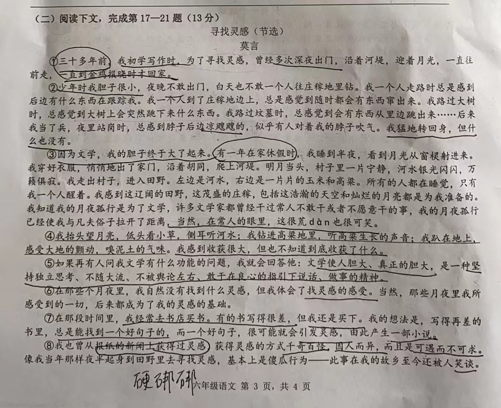
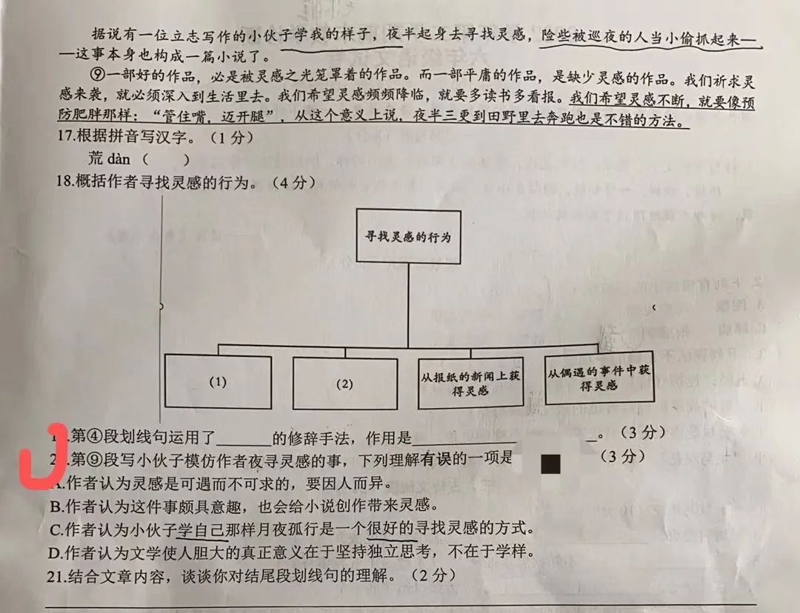
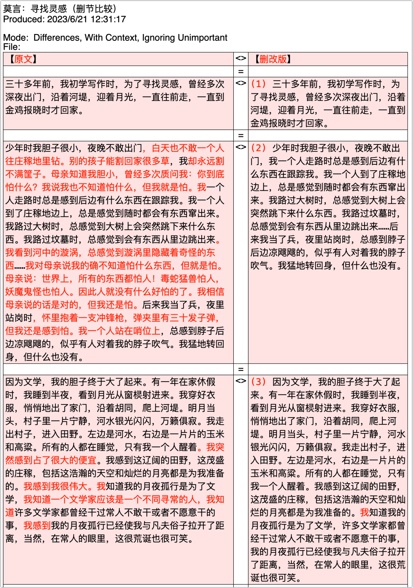
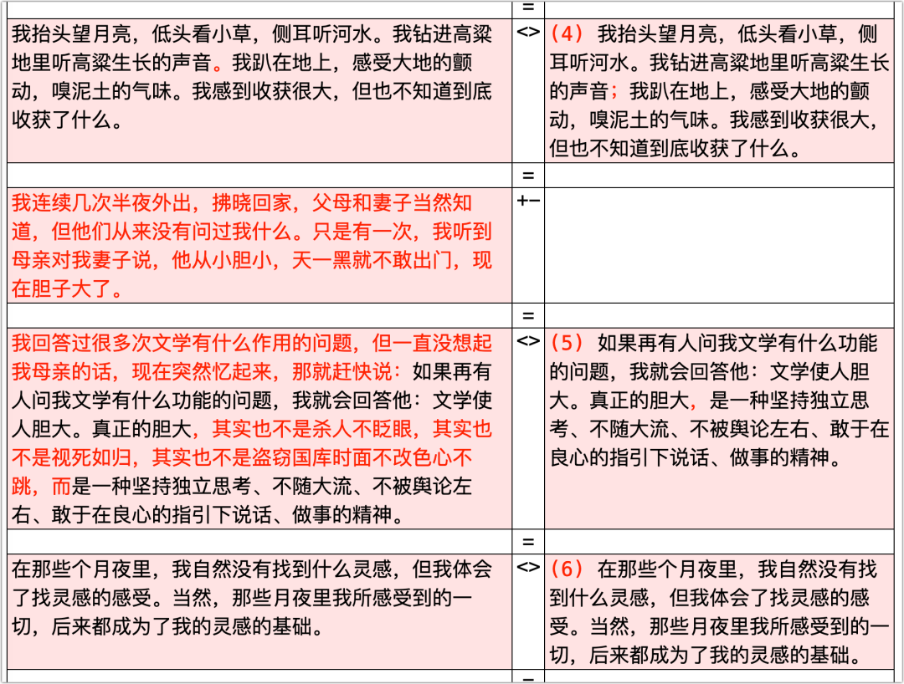
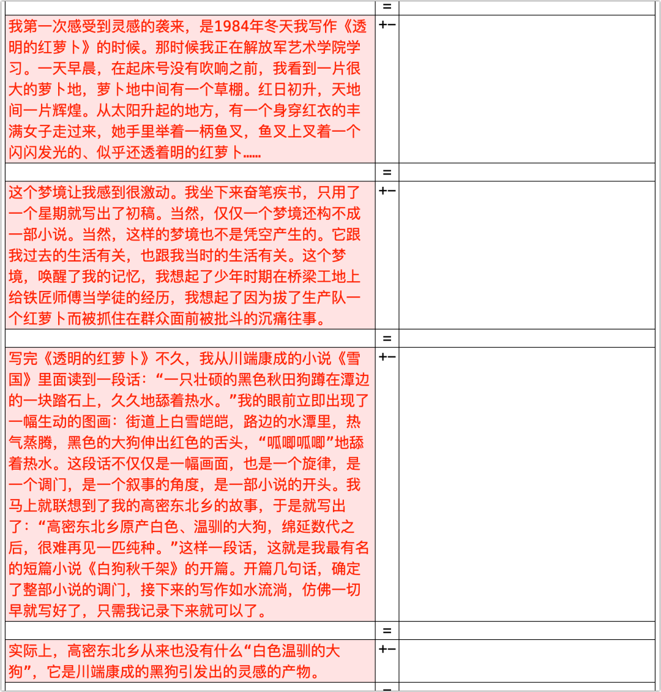
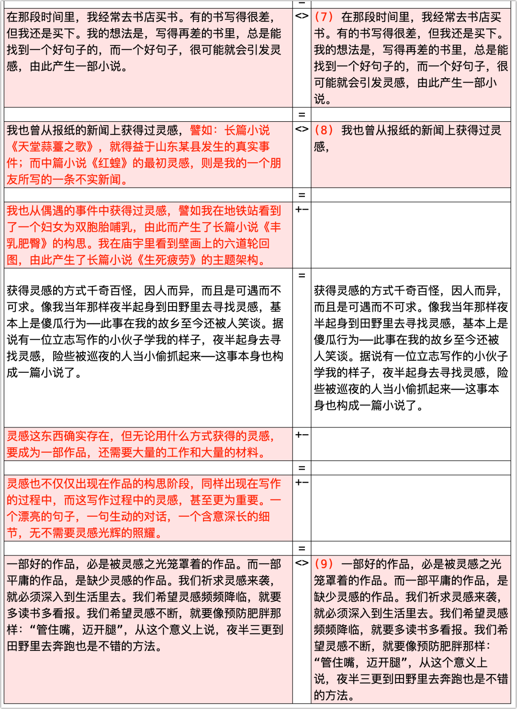

昨天，外甥女做语文试卷，阅读理解题的材料节选自莫言的一篇文章，妹妹不确定一道题的答案，就问我的看法。

看完那题，我也懵了，连猜带蒙地给了个回复，并作了解释。

我提醒妹妹，这种题犯不着较真，要告诉孩子，不要将老师给的“标准答案”当真。只要自己的理解**不**【牵强附会】，能够做到【**逻辑自洽**】那就是对了。这二者的区别在于是否**有理有据**。对于自己的理解，要能说出个**所以然**来，也只有这样，你的逻辑自洽才能站得住脚，而不会成为别人眼中的牵强附会。

对于这种阅读理解的答案，做完就算了，**不必过心**，反正答案他们说了算。蒙对了，没什么好骄傲的，因为不少“对”的答案本是胡扯，经不住推敲；蒙错了，也没有什么好遗憾的，往好方面想，做错了反而能证明自己是个正常人。重要的是，**自己的分析与理解要能站得住脚**。

真实的世界很少会给你提供选项，甚至连那问题都要等你去发现，也就更没有标准答案在前方等着你。若是以做语文阅读理解的方式去阅读现实世界，比如，理解客户的反馈，那不翻船的可能性微乎其微 —— 一个人若是具备了鸡蛋里挑骨头、屎里寻香的理解能力，那是很难有合作伙伴的。

之所以特别提到做这种题“不必过心”，要“做完就算了”，是要警惕这种阅读理解，它会扭曲人的心智。长此以往，它会让人【习惯性听话】，并最终会体现在对现实的麻木上。

“习惯性听话”是我的杜撰，是根据心理学上的“习得性无助”而来。

> 百度百科：
>
> 习得性无助（Learned helplessness） 是指个体经历某种学习后，在面临不可控情境时形成无论怎样努力也无法改变事情结果的不可控认知，继而导致放弃努力的一种心理状态。
>
> “习得性无助”是美国心理学家塞利格曼1967年在研究动物时提出的，他用狗作了一项经典实验，起初把狗关在笼子里，只要蜂音器一响，就给以难受的电击，狗关在笼子里逃避不了电击，多次实验后，蜂音器一响，在给电击前，先把笼门打开，此时狗不但不逃而是不等电击出现就先倒在地开始呻吟和颤抖，本来可以主动地逃避却绝望地等待痛苦的来临，这就是习得性无助。

“习惯性听话”有与之类似的地方。

出题人弄了个标准答案，即便它经不住推敲，但你又不得不接受。长此以往，你就习得了一项“本领”，不论那个答案多么站不住脚，你都习惯性地接受了，不对其质疑。在长达十几年的训练当中，这种应对模式也就日益固化，成为了对外界的条件反射式的被动反应。

理解了这一点，你就很容易理解，为什么现实中很多人对于荒谬的政策措施无动于衷。上面传达什么就转发什么，反正那是正确的标准答案，我们对此无能为力，只能是被动地接受，转达。

举个填写扶贫资料的例子：不论填写人觉得这资料多么没用，他们依然很听话地照做；特别是，即便没有人规定应该填写什么，他们都知道应该往什么趋势上填写，因为他们猜中了标准答案。

所以，如果你不希望孩子长大后也这么习惯性听话，不想他麻木不“人”，就要防止他被语文的阅读理解所毒害。

对于阅读材料，要训练孩子**有理有据**地分析文本的能力，能做到逻辑自洽。对于所谓的“标准答案”，老师能讲出个所以然的就听，否则，就让它们见鬼去吧 —— 千万别入了心。

下文我以那篇阅读材料所做的分析示例，仅供参考。不喜欢这部分的读者请止步。

阅读材料是节选自莫言的《寻找灵感》：

我在中国作家网上找到了原文（点击可读）👉：[名家谈写作 | 莫言：寻找灵感](https://mp.weixin.qq.com/s/a2LHXxecxIkifCekOAa-zg) 。上图所对应的原文是：

> **获得灵感的方式千奇百怪，因人而异，而且是可遇而不可求**。像我当年那样夜半起身到田野里去寻找灵感，基本上是傻瓜行为——此事在我的故乡至今还被人笑谈。据说有一位立志写作的小伙子学我的样子，夜半起身去寻找灵感，险些被巡夜的人当小偷抓起来——这事本身也构成一篇小说了。
>
> 灵感这东西确实存在，但无论用什么方式获得的灵感，要成为一部作品，还需要大量的工作和大量的材料。
>
> 灵感也不仅仅出现在作品的构思阶段，同样出现在写作的过程中，而这写作过程中的灵感，甚至更为重要。一个漂亮的句子，一句生动的对话，一个含意深长的细节，无不需要灵感光辉的照耀。
>
> (9)一部好的作品，必是被灵感之光笼罩着的作品。而一部平庸的作品，是缺少灵感的作品。我们祈求灵感来袭，就必须深入到生活里去。我们希望灵感频频降临，就要多读书多看报。我们希望灵感不断，就要像预防肥胖那样：“管住嘴，迈开腿”，从这个意义上说，夜半三更到田野里去奔跑也是不错的方法。

【题2】的问题**很明确地**针对第（9）段，问：写小伙子模仿作者夜寻灵感的事，那四个选项哪个理解**有误**。

我看完题也是一阵发懵的 —— 不是我看不起莫言，我觉得他面对这些选项未必能选对。

首先，我觉得这题出得就不好，至少，不准确。

“写小伙子模仿作者夜寻灵感的事”明明就不是“第（9）段”，又或者，阅读材料标识段落的位置不对，那个“（9）”的序号应该上移一个段落。

图片所示的第（9）段中，与小伙子夜寻灵感有关的只有这句：“从这个意义上说，夜半三更到田野里去奔跑也是不错的方法”。然而，严格来讲，这是对于小伙子夜寻灵感**这事的评论**，而不是“写……的事”。

所以，这【题2】首先是出得不严谨。

接下来看选项。

- A. 作者认为灵感是可遇而不可求的，要因人而异。

我估计很多人会觉得A是正确的理解。的确，不论是泛泛而谈，还是前文有明确地提到过，这都是不错的，但是，你得注意问题，问的是“第（9）段”，作者用小伙子夜寻灵感做例子是为了表达A项的理解吗？我个人认为这不是重点，只能算有关联。但以答题而言，选出【理解错误】的选项，那A项也不能算。可以排除。

- B. 作者认为这件事颇具意趣，也会给小说创作带来灵感。

这是我唯一赞同的、理解正确的一项。因为这事很有趣，特别是，它是生活的一部分。而作者也明确地说了，灵感来源于生活的偶得。

- C. 作者认为小伙子学自己那样月夜孤行是一个很好的寻找灵感的方式。

我估计标准答案是这一项，即，认为C项的理解是错误的。

然而，对于小伙子的效仿行为，作者给出了正反两方面的评价。在第（9）段之前，是反面评价，作者认为灵感的来源因人而异的，是可遇而不可求的，因而效仿是没有用的；但在第（9）段，作者的评价是正面的，是从**体验生活**的角度而言，是指从“迈开腿”的践行中寻找或遇到灵感。

所以，这取决于你如何理解C项，将“小伙子学自己那样月夜孤行”理解为机械地学样，并说这是很好的方式，那肯定是理解错了的，然而，将之理解为相仿莫言去体验生活，那这理解就没有问题。当然，C项的表达**在程度上**与原文略有差别：原文“也是**不错的**方式”，C项“是一个**很好的**寻找灵感的方式”，但这种程度上的差别不足以导致理解对错的翻转，因为作者明确地提倡践行。因此，是否选C项作为答案，还取决于你如何理解C项。

- D. 作者认为文学使人胆大的真正意义在于坚持独立思考，不在于学样。

泛泛而言，D项所表达的意思是对的。

但是，第（9）段**推不出“坚持独立思考”**，特别是，这一段**根本就没有提及“文学使人胆大的真正意义”**！作者指出了灵感的重要，**重点在于**【如何寻找灵感】（点题），指出寻找灵感“必须深入到生活里去”，“要多读书多看报”，还要“迈开腿”多多践行。这一段，以及提到小伙子的事，与“文学使人胆大的真正意义”没有半毛钱关系。所以，D项的理解是错误的。所以，以此而论，D项应该是这道题的答案。

另外，这里的“学样”与C项的“小伙子学自己那样月夜孤行”的表达是有区别的，“学样”是带有贬义的，指纯粹的效仿（这种表达上的区别也说明，C项具有解读的空间）。

最终，我猜了个C。外甥女也选的这个 —— 我在发文前专门问过妹妹，老师给的答案也是C。

比起这阅读理解，莫言的原文更值得阅读 —— 特别是，被删掉的部分值得读。

以个人浅见，**若能理解这些为何被删，才算真正理解了这篇文章**。

（红色字体部分是删改部分，点击可看高清大图）

