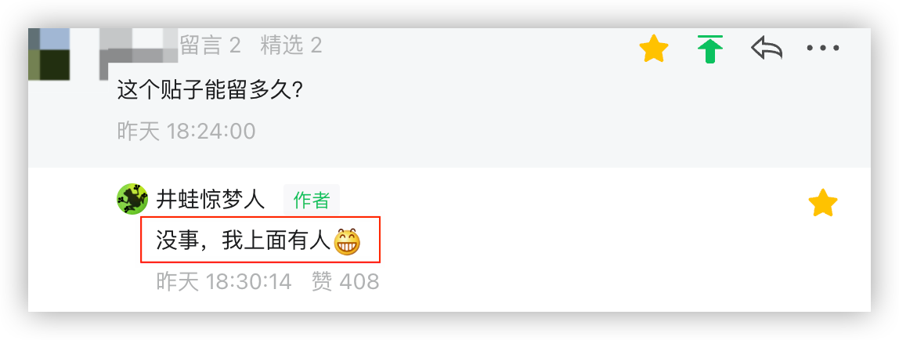
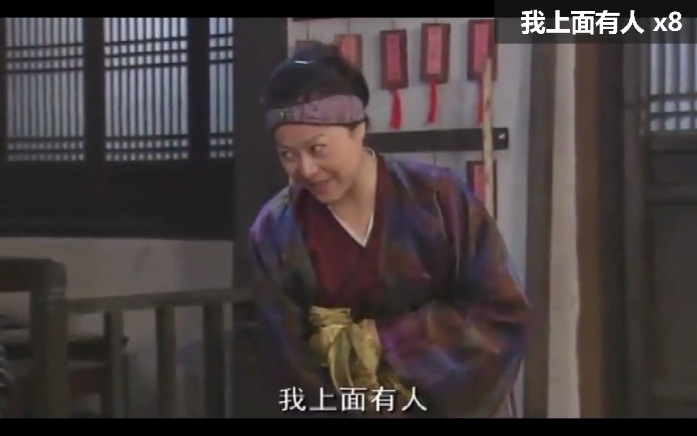
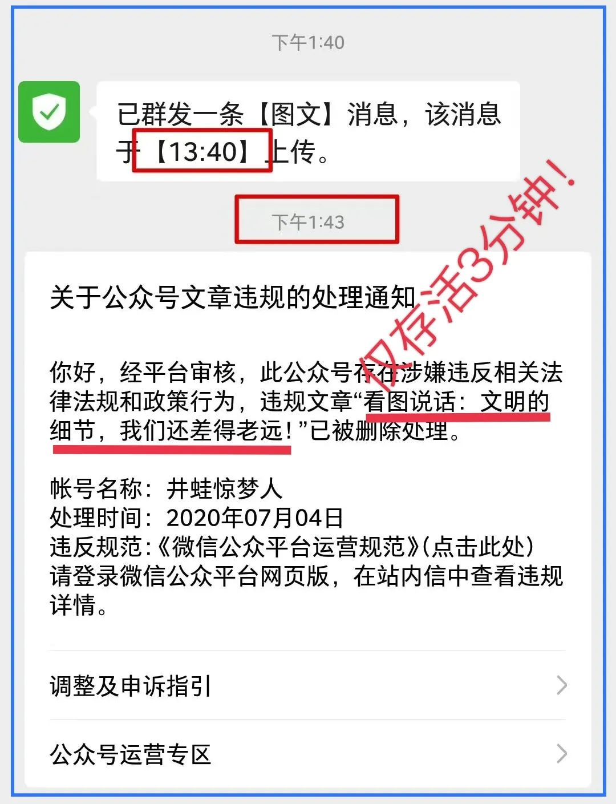
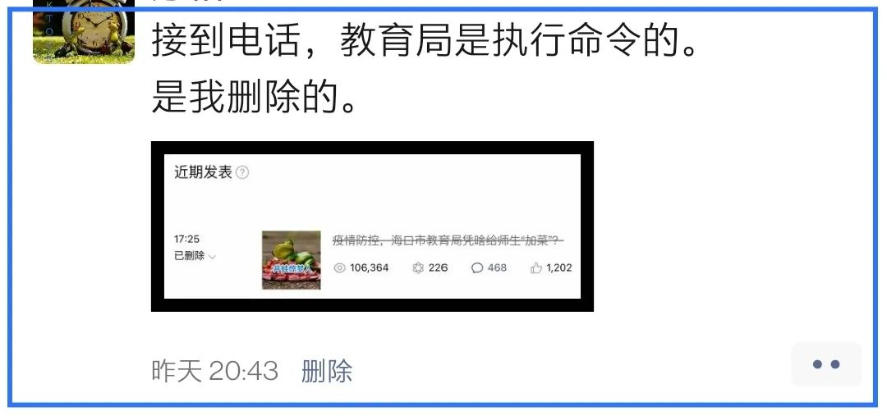

是的，7月14日的文章《疫情防控，海口市教育局凭啥给师生“加菜”？》被我删掉了，是我自己干的。（下文简称《加菜文》）

这缘于接到一个电话……本文就此澄清一下。

## 澄清的必要
《加菜文》发出后约时许，就有人留言，他担心文章留不住，其时我放出大话，说“没事，我上面有人”。后来自扇耳光，虽是难堪，但总不能从此掩面吧，因而有解释几句的必要 —— 哪怕是腆着脸。这是其一。

其二，**有些因缘际会只是误会，恰如你我的这次相会**。

本公众号从2016年开号至今，也有些年头了。自从2018年6月13日发了一篇《👉[强烈呼吁叫停：海南省人才就医绿色通道服务实施方案(试行)](https://mp.weixin.qq.com/s/ZoGPx1tPSHq6BCRs43HgMw)》以后 —— 这也是本公众号的第一篇10w+ —— 基本处于半死不活的状态，能有上千阅读量的文章很少，上万者更是屈指可数，有的文章发不出（👉[百思不得姐](https://mp.weixin.qq.com/s/SAnz3XY_BSH1nQGa3ZMm9Q)），有的发出也很快被和谐。所以，我学会了自我审查，会刻意避开一些话题，这可能会让一些人失望。

前天涌进了一批关注者，人数将近之前总人数的三分之一。这其中必定有误会，即，我不是一些朋友所期望的写作者：是就此相望，还是从此分道扬镳，相忘于江湖？这篇澄清之文将有助于你来甄别。

第三，一些朋友是因为文章被删而关注我的，纷纷问起了文章被删的事，有的还关心我个人的安全。我一切如常，这里一并感谢诸位的关心：您的关心让我倍觉暖心，谢谢您！

文章是双方充分沟通后，我自愿删除的，对方并没有对我施加压力，我下面会专门说到。

## 对疫情防控的基本认识

《加菜文》之所以激起了广泛共鸣，是因为我们都对这一防疫措施不满：都放假了还将师生弄回学校做核酸。然而，这只是“其然”，虽然我们的表象一致，但“其所以然”却未必相同。对于有些朋友，我们的因缘际会很可能只是“殊途同归” —— 这也侧面说明了这项防疫措施是多么不得人心。

我是较早关注新冠疫情的，并且持续关注至今。

在新冠疫情之初，我**很可能**是海南最早**公开示警**的人（之一）。我不但在小区微信群提醒邻居注意防护，还给海南省政府建言，并且公开发文呼吁以引起大众重视（见旧文：👉[海南啊海南：面对〔新・型・肺・炎〕，你们还不做点什么吗？](https://mp.weixin.qq.com/s/KGQLtDMNlZ1KfBZckpBrsg)）。

在那时，我们（也包括专业人士）对新冠病毒的了解还处于初级阶段，还是在摸索，谨慎是合理的 —— 哪怕是存在过激的防控措施，也能得到相当一部分人的理解。出于对未知事物的恐惧，我们不由自主的选择谨慎，是非常正常的。

然而，两年半都过去了，现如今，病毒都变异好几代了（当前为：奥密克戎亚型毒株BA.5），它早已不再那么可怕，几乎其他所有国家都将之当作流感看待。

认识到病毒演变的规律很重要，这直接关系到防控策略：

1. **毒性越来越弱**：真有必要大张旗鼓？
2. **传染性越来越强**：能否真的防得住？

如果我们还采取和疫情之初类似的防控措施，没有做出**根本性**的转变，那是否在**刻舟求剑**？

那条船往前开很久了，而我们还凭着当初的印记入水，试图捞起那把剑？

为什么要说这些？

因为，这涉及到我们对病毒的**基本认知**，它主导着我们的行为模式，如何应对外部世界，以及对抗疫方式怀有什么样的预期。下文的部分讨论也是建立在此认知基础上。

有一个“唐僧穿的是黑袈裟”的网络段子，或许能将我的意思表达得更充分：

> 上小学时，我们同学都爱看电视剧《西游记》，大家都说唐僧的袈裟是黑色的。有个同学非常犟，非要说唐僧的袈裟是红色的。气得班里的人打了他一顿，后来他哭得把我们全班人都带到他家去看，结果全班人哭成一片！ 原来这个世界上还真的有彩色电视机 ！

当然，我们很可能**都认为**各自眼中的唐僧正穿着红袈裟的，而认为异见者眼中只能看见黑袈裟。

## 我接到的电话

来电自然是想删文。

与那些无声无息地删文、只留下一轮“红太阳”的相比，这种亲切来电商量删文章的，已是非常难得。

对方是14日晚20:11来电的，整个通话时长24分46秒。我们沟通的氛围还是不错的。我是真诚的，也能感受到对方的真诚。内容就不细表，这里仅将我在临场沟通中有意义的部分写出，包含我发挥不好、甚至失败的地方，供您参考。

### 防疫者很辛苦

对方提到了参加防疫的辛苦。

这也是说服过程中常用套路：“动之以情”。然而，这对我们这种喜欢讲理的人作用甚微。以逻辑谬误而言，这叫“诉诸情感”。在我们日常工作生活中甚是常见。

比如，某人将事办砸了：本来是让他去买袋芝麻，他“哼哧哼哧”地扛袋西瓜回来。面对你的莫名肝火，他还替自己辩解：“我没有功劳也有苦劳啊”，还说得一把鼻涕一把泪的，委屈极了。殊不知，这种人在追求效率的私企中根本活不到第二集。这“苦劳”一点用都没有，反而耽误事，要是换别人来办的话 —— 芝麻都开花节节高了。

这大热天的，在外防疫的辛苦劲儿不说我也知道，但在另一个的人口中表达出来，那辛苦仿佛离我更近。对方也特别提到了老师的辛苦。我表示了同情，但并没有表达感谢。

在这个沟通环节，我的表现是不及格的，我没有点出这些措施的**不必要性**。这是我疏忽而遗憾的地方，在此补上以下这段：

> 言而由衷地说，我特别感谢疫情之初参与防控的医护人员，以及在其他抗疫岗位上真正为民的付出者。
>
> 对于现今防疫者的某些辛苦，**以当前措施为例**，我只能说：
>
> 你们本可不必如此辛苦，这不是我造成的，而且，我并不对此感谢，你们这种“不辞劳苦”反而给我（们）带来了困扰。**这不是我的错**。我也不想你们如此辛苦，更不想因此承你们的情，因为很多措施并不必要，取消它们反而很必要。
>
> 简而言之，**你们吃力不讨好**。人，应该努力避免干这种事。
>
> 我知道有些人不爱听这些，但我想说点真话。

再说一遍，这里所做的补充是基于前文专门提到的**对病毒的基本认知**，它并**不仅仅**针对当前的措施，应该具备更广泛的意义。

如果它让您很是不适，不妨想想唐僧的那件袈裟吧。

当然，肯定会有人坚持认为她所见的袈裟就是红色，那也不足为怪，比如这位：

我看见这人的留言便立即“精选”了，以作为另一种声音出现在留言区。相信也有人为之点赞，但我没有回复她。在此搭个车，为我们“这种喜欢指指点点”的人说几句，也算对这一人群的回复。

我们的努力一来你们看不见，二来你们看见了也不认可，比如《加菜文》，认为那只是“喜欢指指点点”。**你们这是认知问题**。似乎别人只有如你们一般，那才叫贡献。否则，那都是博流量。

罗永浩说过这么一段话，话有点糙，但很能说明问题：

> 在妓女的眼中，这个世界上没有女人是不卖的，她们对于听到一个女人不卖的传闻，能理解的上限就是，是不是价格谈不拢？**这是他们对“不卖”能理解的上限**。

大家知道，罗永浩并不是不尊重人，只是为了将道理说清楚。

为了避免一些人感受到不尊重以致于误解，我把他的话改一下：

> 在那些只能看见黑袈裟的人眼中，当有人说唐僧穿的是红袈裟，他们会据理力争，将对方揍一顿是他们理解能力的上限。

就拿当志愿者来说，他只是众多服务社会方式中的一种。我更喜欢从科学、理性方面出发与出力。比如，如何让志愿者更省力，让那些付出者多得到一些回报，等等。

举个有说服力的例子吧。在疫情之初，那是艰难的时段。物业公司与居民的紧密程度不言自明，他们的付出也有目共睹。然而，国家税费的减免却未能惠及他们，而同为服务行业的快递公司是有减免的。由于我不是搞税务的，不懂其中的区别。就咨询了一位税务专家，他非常热心地帮我，在我搞清了原委后，便写了篇社情民意《关于在NCP疫情防控期间国家税收减免政策应惠及物业公司》，通过相关渠道上送，详情在这里（👉[小区物业公司：寒心！我们直面居民，但疫期税收减免与我们无关](https://mp.weixin.qq.com/s/dtW5VlTp-0uYmlIY1miP8A)）。

那篇社情民意被海南省领导批示了，然后……就没有然后了。但**这不是我的错**，我已经尽力了。

我发现了问题，并且落实了自己的爱好：“喜欢指指点点”。虽结果未能如意，但这不是我的问题。

同样，对于你们**那本不该有的**辛劳苦楚，我亦是如此 —— 那不是我的错。我自然也不会因此而承情，更不会违心地表达虚假的感谢，哪怕那可能会让你好受一点，我都是极其吝啬的。

### 抹黑海南自贸港

对方提到了我的文章有抹黑自贸港之嫌，至少，我理解是这样。还说到我那篇文章的“力量大”，使得公众对海南的整体面貌产生了不好的印象。

这帽子扣得是不是有点大？每人头的大小不一，所以也很难有共识。因此，我只是从文章的力量大、影响力大方面来进行了回应。

我否定了对方的说法，不是我文章的力量大、影响力大，我就是想写出这样有影响力的爆文，也是很难的。那不过是适逢其会，甚至是奇迹。

我的文章不过是载体，它引起了广泛共鸣，从而使得众多市民在那里汇集，情绪集中爆发。

我提醒对方，这是一件好事情，以便让当局**及时**发现不恰当的防疫措施之下，群众所蕴藏着的**强烈不满情绪**。对方也表示他们非常重视。

这里补充一句：如果真有人在抹黑海南自贸港，那也决计不是一篇展现市民真实困境与不满的文章。

### 为什么不写点好的

对于我这种经常与“五毛”打交道的人，回应这个问题那是非常轻松：**因为这不好的事困扰着我，不写他写什么呢？**

不写这事，我的孩子就要大热天去排队遭罪，关键还没有必要。我总不能无视权力对自身的侵害而一言不发，反去为那些不相干的“好事”歌功颂德吧。

再说了，那些“好事”有专门的、正规的媒体机构来写，已是绰绰有余。而对于这种困扰小市民的糟心事，我们这种自媒体只好勉为其难了。

### 常识与错误

显然，上面所提及的这些因由并不能说服我，让我删掉文章。

真正让我卡壳的是“常识”之争。其时，我未能找到一个确切的理由回应对方的质疑，于是，我只能暂时修正观点，认为对方说得在理，于是爽快地答应删文，并结束通话。

大体交流过程如下：

> **对方：你文章为什么不针对学校，不说是学校加菜，而要说教育局加菜呢？按说，是学校通知你们去做核酸的呀。**
>
> 我：学校怎么可能有这么大的权力做这样的决定呢？他们肯定是接到教育局的通知才执行的，这是常识。
>
> **对方：那教育局也没有这样的权力。做核酸检测可不是弄些老师在那里做志愿者，捅捅棉签就了事。还要调动一系列的资源，比如，样品送检，医疗垃圾如何处理，等等，教育局是不具备这样的权力的 —— 这不也是常识么？**
>
> 我：……

就这样，我被问住了。

在那一刻，我不得不承认教育局和学校一样，都只是执行者。如果学校不能作为质疑的对象，那么教育局也不应该是。于是，我同意删文了。

删文后，我在朋友圈告知了一下：

其时，有朋友留言问起原因。我只是简单说了下，没有细聊。直到昨天上午，和一位朋友再详细说起了这事。他对相关的法律法规知之甚详。他说，不论是文章标题还是内容，教育局**一点都不冤**：

> 行政复议和行政诉讼，直接可以以教育局为复议对象或被告。

所以，即使都是执行单位，其权责的意义也是不同（相关的逻辑谬误是“偷换概念”）。由此我看见了我与那朋友的差距，这是**懂法与不懂法**的区别。倘若我早点懂得这些，那么，这一“常识”之争将像之前的那些质疑一样，我能应对自如，自然也就不能成为我删文的理由。

事后来看，**删文是一个错误**。因为法律知识的缺乏所致。

我只能这么安慰自己，这篇文章已经完成了使命。对于一个苟延残喘的小号，于短短3小时左右的时间，一篇小文能有10w+的阅读量，在社会得到了广泛共鸣，引起了相关部门的注意 —— 我应该是满意的。

由于缓存的原因，在我删文后，一些人还是能够阅读片刻的（甚至依然可留言），最终的数据是这样的：

## 你我的感谢

有不少读者留言表示感谢，感谢我为他们发声。

其实，我没有那么伟大。**我只是为了我自己**，或许，这客观的事实结果也对你们有好处，但那只是我在自我救赎过程中所产生的“副作用”。当然，这副作用能对诸位有益，我是很荣幸的。

说到感谢，我反而应该感谢你们。正是因为诸位的关注与转发，使得这个问题成为焦点、热点，使得这困扰我的问题被当局所注意到。

我的文章就像一艘船，全凭诸位奋力将它推离沙滩，入水而活。是你们为它张起了风帆，是你们为之努力划桨，是你们让它在那片苦海乘风破浪。

它终于被我亲手毁了。

于我而言，那艘船已经到达彼岸；于你而言，我也希望如此。

愿我们都能渡过那片苦海。

相关阅读：

1. 👉[强烈呼吁叫停：海南省人才就医绿色通道服务实施方案(试行)](https://mp.weixin.qq.com/s/ZoGPx1tPSHq6BCRs43HgMw)
2. 👉[百思不得姐](https://mp.weixin.qq.com/s/SAnz3XY_BSH1nQGa3ZMm9Q)
3. 👉[海南啊海南：面对〔新・型・肺・炎〕，你们还不做点什么吗？](https://mp.weixin.qq.com/s/KGQLtDMNlZ1KfBZckpBrsg)
4. 👉[小区物业公司：寒心！我们直面居民，但疫期税收减免与我们无关](https://mp.weixin.qq.com/s/dtW5VlTp-0uYmlIY1miP8A)

