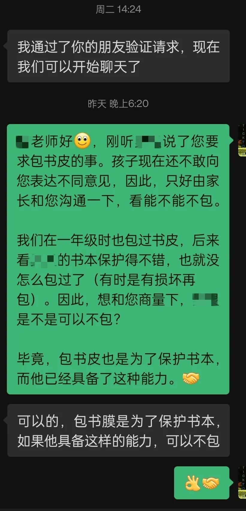

昨天的文章 13:13 发出，文中提到，我家娃的老师没有要求包书皮，哪知，被光速打脸。孩子下午放学后，便和我说起了这事：老师逐一检查了全班包书皮的情况，然后让没包书皮的同学都站起来，并记下了名字，并要求他们周末包好，下周一要检查。

我听得一怔。这学期，孩子有两位老师换了，班主任是新老师。作为一个相当反感强制包书皮的家长，自然是接收到不好的信号。

我马上打了个哈哈：“哈哈，我刚写了一篇关于包书皮的文章，正想给你看看呢，没想到这么巧 —— 那你有没有问老师‘为什么一定要包书皮’吗？”

儿子说：“我哪敢呀，当时我们都站着呢……”

我“嗯”了一声，点头表示理解，随即问：“那你觉得老师是为了什么呢，一定要你们包书皮？”

儿子说：“保护书本吧。”

“可是，你的书本不是保护得挺好吗？”

儿子正眼看了看我，带着一丝吃惊。接着，他似乎有些手足无措，不知道该怎么办，陷入了困境 —— 他的老师要求他包书皮，而他的父亲不以为然，将他夹在中间。

“是的，你的书本保护得挺好的，一学期下来都没有什么破损，比爸爸小时候可强多了。爸爸那时的课本才叫一个糟糕呢，一学期下来书角卷得厉害，蓬蓬松松的，而你的维持得好太多了。我觉得你不需要包书皮 —— 你觉得呢？”

儿子自然是不想包的，但他很是犯难：“可是，老师要求包呀，我该怎么说呢？我也不敢说呀。”

我知道，“不敢说”是最大的问题，也是中国很多孩子面对老师的通病，但这事急不得，他得先解决“怎么说”的问题。

如果儿子面对的是我，“怎么说”的问题根本就不存在，他只用说一句“我的书本保护得挺好的呀，不用包的”，但他和老师沟通就不见得有效。比如，老师说：“全班同学都要包书皮的，怎么就你例外？”我猜，儿子面对这种问题肯定要哑火的。与其将儿子放在火上烤，还不如给他建立一点信心：**老师是可以沟通的**。

因此，我觉得还是家长与老师沟通的好。就和儿子说：“这事就交给爸爸处理吧。但是，我希望你以后碰见这种事情，能自己和老师谈谈，至少，你可以问问老师‘为什么一定要包书皮’。倘若老师说是为了保护书本，你不就马上可以再问，‘老师，我能保护好书本，能不能不包书皮？’然后看老师怎么说，说不定她立即就同意了呢。”

随后，我便在微信上与班主任私聊，没有用语音，而是文字加表情，老师的回复也很快。当我告诉儿子老师同意了，他不用包书皮了，儿子很兴奋，问我：“爸爸，你是怎么说服老师的？她居然同意了！”

儿子的兴奋感染了我。我不由得暗自庆幸，还好，我这家长发挥了角色的作用，为他解决一点心事。然而，我也捕捉到了他用到的字眼，老师是“居然”同意了，我有些难过。儿子也是刚接触新老师，定然谈不上有多了解她，但显然，这四年义务教育下来，在儿子的心目中，“老师”这个词大概已经固化成了“说一不二”的代名词 —— 一如我心目中曾经的老师，是权威，不，是“威权”。

我没有直接告诉儿子答案，因为现在正是乘热割包皮的时候，我转向了一件我当时就想说，但一直没找到合适机会说的事。

我找到了一张截图，指着一段话对儿子说，你先来看看，然后告诉我读后感是什么。儿子在兴头上，又期待我揭晓答案，自是欣然应允，阅读起来。

在儿子看完后，我们聊了会儿。

【我】：这段文字可以算一个通知吧，你读完以后，总体的感觉是什么样的，好还是不好？

〔儿子〕：写得好的。

【我】：你觉得写得好？（可能我的语气中夹杂着吃惊）

〔儿子〕：哦，写得不好。

【我】：……（我转为语重心长的样子）小宝啊，我希望你能有自己的、独立的见解，而不是我觉得好或者不好，你就跟着这么认为，那不叫独立思考。不论是你觉得好，还是不好，你都要能说出理由来。你觉得好，好在哪里？

〔儿子〕：我觉得用了很多好词好句。

【我】：确实啊，真的有不少好词好句呢。那你觉得不好，又不好在哪里呢？

〔儿子〕：……

【我】：你觉得这段话所讲的主要内容是什么？

〔儿子〕：是讲新学期换老师了，班主任和数学老师换了。

【我】：我也是这么理解的。不过，你是看到哪里知道这一信息的？哪一段？

〔儿子〕：第一段啊。

【我】：第一段？（我有些吃惊，又看了一遍）嗯嗯，第一段确实隐含了点这种意思。

〔儿子〕：是啊，如果不是要换老师，那“周老师”也不会无缘无故地说这种话呀。

【我】：我要肯定你的敏锐。不过，这多少带有猜测的成分，再者，你只有看到后面才能肯定你的猜测，因为同样的铺垫，也可以写出其他内容，比如，新学期开始，老师给学生打气，希望学生再接再厉。老师完全可以基于第一段这样铺垫对新学期做一些展望与勉励。

【我】：真正明确提到【换老师】是在第三段：“在这里，很遗憾地通知大家，本学期我不再担任本班班主任和数学老师，由周老师接任班主任工作，杨老师接任数学老师”，也就是说，读者要看到第三段才知道这老师要说什么。我觉得这是第一个不好的地方，也是非常不好的地方。因为这是在挑战读者的耐心，说了半天到底要说啥？

【我】：第二个不好的地方，是没有给出老师确切的姓名。这是很糟糕的。而且，这里碰巧有两个周老师，写这通知的人是周老师，而新班主任也姓周，这就让事情更加糟糕。我一开始还以为是笔误，写错了：

> 各位家长，各位可爱的孩子们，不知不觉周老师已经陪大家走过三年时光。
> ……
> 在这里，很遗憾地通知大家，本学期我不再担任本班班主任和数学老师，由**周老师**接任班主任工作，杨老师接任数学老师

【我】：直到后面再提及新老师时，说的还是“周老师” —— “周老师和杨老师是对学生真诚热情” —— 应该不会两次都笔误，那时我才确定，原来新老师也姓周。

〔儿子〕：是哦。如果一开始就说“由周某某老师接替班主任，杨某某老师接任数学老师”，那就没有这种问题了。

【我】：你说得很好。再来说第三个问题 —— 如果前面两个你都没有知觉，这第三个就更难察觉了。

【我】：通知中提到“本学期我不再担任本班班主任和数学老师，由周老师接任班主任工作，杨老师接任数学老师”，由此，我们可以得知，写通知的周老师原来担任班主任，还兼任数学老师，现在她的工作一分为二，由两位老师接替。新周老师难道专门担任班主任，不带课吗？我不知道是否有学校会这么操作，安排某个老师专门当班主任，不当科任老师，但按通常的操作，班主任都是由某科老师兼任。如果新周老师也担任某科老师，那是不是还有老师被替换？但那样的话，为什么这通知中却只字不提呢？

儿子被我问得无言以对。

【我】：还有，写通知的周老师只字未提她的去处，她是仍然在学校，还是离开了另谋高就？她没有提及的。由于她写得很动情，这通知也就兼具告别感言的功能，那么，作为与大家共处三年的老师，顺便一提自己的去向也是可以的。当然，**不说也不是什么问题，这是她个人的隐私**。主要的问题还是前面说的三条。

【我】：所以啊，倘若我们**基本的表达能力**不行，你用再多的好词好句也没法弥补的。这也是我希望你作文时应该注意的，**你得先将话说清楚，这是根本**，好词好句只能算锦上添花的东西，是为文章增色的，是次要的。我们**不能舍本逐末** —— 如果是你来写这通知，要怎么写？

〔儿子〕：一开始就要明确换老师的事，并且在介绍老师的时候，明确他们的姓名，还有，他们教哪门课也要讲清楚。

【我】：很好。既然是通知，那就开门见山，直奔主题，比如这样：

> 致五 n 班全体同学及家长：
>
> 很遗憾地通知大家，原数学老师周 AA、英语老师刘 CC 不再担任本班老师。本学期，由周 EE 老师担任英语教师，并兼任班主任；杨 YY 老师担任数学教师。

【我】：然后才是个人的感言。先可以回顾过去，接着展望未来，并在展望未来时转而介绍新老师，因为新老师与未来密切相关。这样也合乎行文的逻辑。

【我】：你不是问我怎么说服你们老师的吗？我就是按这种模式来的。先向老师问好，再简单说下原委，然后就直奔主题 —— 一开始就要让老师明了你和她沟通的目的，因为老师也挺忙的，没时间看你啰唆。

【我】：像这种事情，你不能只提要求，因为你的要求与老师的要求不同甚至相悖，要想她接受你的观点，你必须说为什么，因此，接下来要论证你的观点。我是从你以往的表现，也就是通过【事实】来论证你已经具备了这种能力。而老师认为包书皮的目的与我们认为的一致，因此，她接受了。

然后，我给儿子看了我和老师的沟通记录，并简单说了几句，就不赘述了。

昨天的文章，收到读者朋友的留言：

我觉得这位家长有一点做得特别好，他先问孩子，有些事情要先征得孩子同意，才好与老师沟通，因为孩子是当事人，在一些时候不应该越过当事人而与老师沟通，至少，你得知会这件事。

这里，由于他家孩子表达了担心，所以家长没有采取动作。但是，我鼓励这位家长朋友要试试看，**因为孩子的担心可能有点过了**，家长和老师沟通一下，也不是什么大事，更何况也有理有据的，怎么就能导致老师骂他呢？

一方面，孩子的恐惧来自于老师的威权，我们可以批判这种现象，特别是有些老师应该反省（这可能是奢望，不现实）；另一方面，**这种恐惧感也可能导致孩子错判** —— 只要你有理有据地和老师商量，也许结果并非如孩子所料呢？

如前文所言，当孩子说老师要求包书皮，我也接收到了不好的信号，而我又对新老师一无所知，所以，沟通会有什么样的结果，我也不知道。**但我必须试试**，大不了见招拆招，但**在未沟通之前，我们不能假定对方无法沟通**，除非你对那老师有所了解。至少，我得让孩子知道，我在和他一起面对他的困扰。

我认为，当孩子无法解决他的问题时，家长与他一起面对，这种亲子活动远比一起包几本书的书皮有意义得多。

我还认为，家长应该帮助孩子克服恐惧，增加他们的勇气。尤其是，当老师提出不合理要求，若能带着孩子通过沟通来解决，这种经历更为珍贵。因为这有示范作用，它让孩子明白，**原来老师也是可以沟通，可以讲道理的呀**，这也能帮助孩子消除对老师的恐惧。

我相信终有一天，我的孩子能平视他的老师，与老师交流时不带有恐惧。当然，他会尊重老师，但与尊重其他人没有什么不同。

