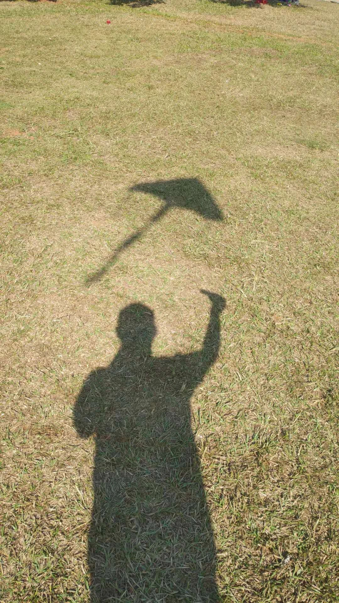

看见了一首诗，**不知道作者是谁**（便署以“佚名”）：

> **的 欢**
> *佚名*
>
> 所有的小草，应该还有几条小虫
> 别忘了冬日的语境和词性
> 一夜之间，有随时坠落的可能
>
> 越过一棵桃树
> 我姓名的笔画从风上滑落
> 村庄内外，到处都是苍苔和石头
>
> 小哥哥，给你一匹马
> 一模一样的尘土，肯定是经历过的
> 小部分操着不同口音，开始沉醉
>
> 当风吹动衣服，聆听的时候
> 我把坐姿缩了缩
> 秋千空了，花朵依山而生

本想一读而过的，但看见有朋友非常用心地解读，也就掺合了一下。记录在此。

> **的 欢**

首先，这首诗的名字是不全的，很明显：**藏头去尾**。诗评者应该将之补齐。然而，补齐诗名也意味着“盖棺定论”，是对其进行总体概括，不妨在最后再说。

> 所有的小草，应该还有几条小虫
> 别忘了冬日的语境和词性
> 一夜之间，有随时坠落的可能

若往铁拳上解读，仅看这段是完全自洽的：小草=韭菜，小虫=喽啰帮凶；冬天的到来是一夜之间，连虫子也逃不过，等等。这些意象都是符合的。然而，结合后几节，便不能前后自洽了 —— 我理解这是一首**情诗**。

总体来看，第一段是构造“岌岌可危”的情境与“朝夕难保”的心境。在他们分手前，男人已经感受到了坠落的结局。

> 越过一棵桃树
> 我姓名的笔画从风上滑落
> 村庄内外，到处都是苍苔和石头

那棵桃树上，原本有我们的姓名，那是我们一起刻上的 —— 还记得我们曾经约好，要相伴三生三世么？而如今，我的名字已经被擦去，消失在风中。那村庄内外，我们经常携手而行的路，石头上都长满了青苔。我们已经很久没有一起走过了。

> 小哥哥，给你一匹马
> 一模一样的尘土，肯定是经历过的
> 小部分操着不同口音，开始沉醉

分手时，你依然叫我小哥哥，还给了我一匹马。远离你的马，去异乡的马。这已经不是我第一次失恋了，蹄声响起，一样的尘土飞扬，一切都那么熟悉。骑着它，我还没来得及逃出家乡，便在路边的酒馆买醉。在那里，我遇到一些的外乡人，他们操着不同的口音，将我劝慰：天涯何处无芳草……

> 当风吹动衣服，聆听的时候
> 我把坐姿缩了缩
> 秋千空了，花朵依山而生

凛冽的寒风将酒吹醒了，我觉得有些冷，不由得将衣服裹了裹，将身体缩了又缩。谢谢你们的宽慰，让我感受了冬日的温暖。

是的，我们曾一起荡过秋千已经空了，这已经成为过去了。墙里秋千墙外道，远方佳人依山笑。我的花朵需得去那里寻找。

至于诗名，就叫《**一时的欢愉**》吧。

