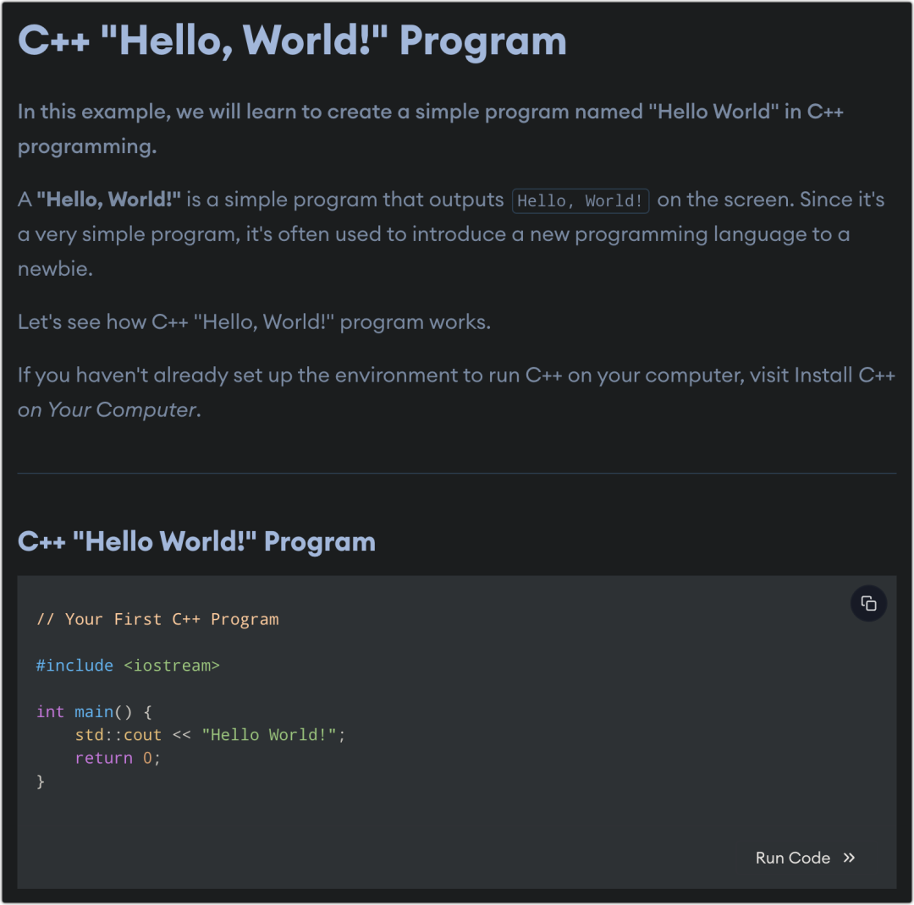

> 2023年4月4日13时30分许，4名年轻人（3男1女）在张家界天门山跳崖，女子被及时拦下，但因跳崖前服毒，紧急送医抢救无效，也已死亡。已经查明的信息显示，这4名年轻人，均在外务工，最小的23岁，最大的也不过34岁。4人为相约自杀，在跳崖前均已服毒，并写好了遗书。
>
> 年龄最小的那名女生，在跳崖前十几分钟发了一条朋友圈，是一瓶毒药的照片配上一句话：“**你好世界 再见**”。

这是一件让人悲叹的哀事。特别是那行字，对于程序员来说尤为扎心刺眼 —— 不知其他程序员是否和我一样。

在程序员的世界里，不论是学习什么编程语言，在学习之初，我们总是会见到一小段演示程序，用以给学习者一个初步印象。这段演示程序，往往都是输出一句话：“Hello, World”。

比如Python：

而“Hello World”对应的中文翻译便是“你好，世界”。

据可考的信息，最初出现如此表达的时间是在**1972年**。

> 从目前的文献来看，第一次出现“Hello, World!”是在1972年，一名叫布莱恩·柯林汉的青年计算机科学家正在撰写一本手册，解释如何使用编程语言B进行编程。他要展示B语言所能完成的最简单的任务——输出一条信息。柯林汉告诉我，他看过一个动画，有一只小鸡从蛋壳中露出头来，说了一句“Hello, World!”，他特别喜欢这个有趣又离奇的动画设计。于是，他决定把输出这句话作为B语言的简单任务范例。程序员们很快就喜欢上了柯林汉风趣诙谐的设计，此后，几乎所有的编程语言（超过250种）都引入了这句“咒语”作为使用指南的开始。“Hello, World!”——生动简洁地呈现出编程的神奇时刻，即程序运行成功，被赋予生命的那一刻。

然而，在我20来年的编程生涯中，我从未见过一个程序员这么写过：“Hello World! **Bye!**”  —— 也从未在任何程序文档、手册或书籍中见过，即便是往前追溯至1972年。

事实上，像C++这种演示程序的运行，它会在终端输出“Hello World!”后立即退出。如此来看，似乎加上一句“Bye!”也是可以的，但我从未见人这么做过。对于一个刚开始学习某种编程语言的人而言，一切才刚刚开始，怎么可以说“再见”？！

所以，作为程序员的我，看见“你好世界 再见”这样的表达，我无比别扭。

那就像一个刚刚来到这世界的人，和大家礼貌地打了一声招呼，然后就死去了。那你说，这世界在她眼中到底是什么样子？

这人间世道，就是如此的不值得？既然如此不堪，她又何必多说一句“你好世界”，直接说“再见”不就行了？

因此，这人间，她还是有所留恋的，生命曾经给过她美好的体验，只是为世道所迫，她不得不离开了。

“你好世界”表达了她对生命的留恋，这声招呼是她留给人间最后的温柔；而一句“再见”则表达了她对于这世道的决绝，也是她礼貌地告别。

—— 这世界，她还会再来么？

